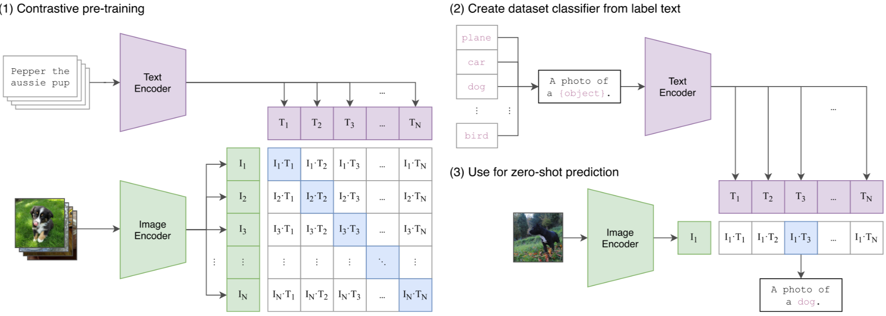
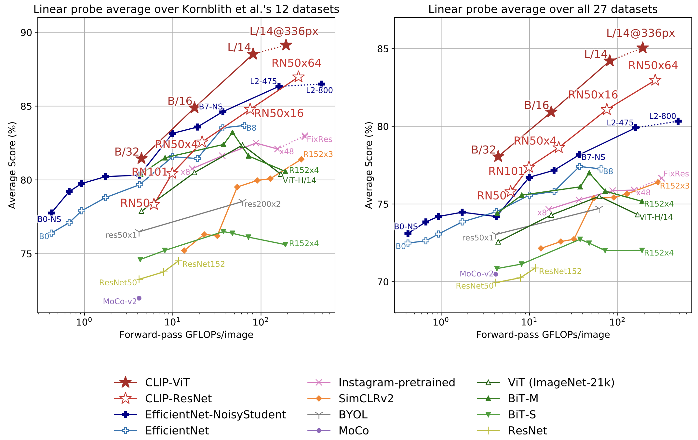

<aside>

paper link: [Learning Transferable Visual Models From Natural Language Supervision](https://arxiv.org/abs/2103.00020)

</aside>

## Problem

Before **CLIP**, the tranditional vision model are usually trained like this: We must decide **a closed list of classes** in advance, for example, the 1000 ImageNet labels: cat, car, banana… 

Then we collect a lost of images where each image is manually labeled with one of those classes. And the model is trained to pick one label from that fixed menu.

That works well, but it has a big limitation. We can’t use this model to predict non-existing content because the model only learns things we predefined and labeled, it’s **not naturally general**. 

To make it handle that new input, we often need **new labeled training data** and usually **retraining or fine-tuning**. That’s too hassle and ineffective.

So we learn from the NLP breakthroughs, which showed that **scaling task-agnostic pre-training** such as:

- **predict the next word** (GPT-style), or
- **fill in missing words** (BERT-style)

**on raw web text** produces models that **transfer to many tasks in a zero-shot way**, reducing the need for task-specific labeled datasets and custom output heads.

<aside>

Before:

- Build a “sentiment model”: an RNN backbone with a classifier head, train on a labeled sentiment dataset.
- Build a “translation model”: a RNN architecture, train on a parallel translation corpus.

After (**NLP breakthrough**):

- Train one big model on raw text (next-word prediction)
    - For sentiment: prompt → “Is this review positive or negative? …”
    - For translation: prompt → “Translate to German: …”
    
    No new model architecture, often no labeled training needed.
    
</aside>

Prior work suggests that **language supervision** from image–text pairs can convey much richer information than **fixed class labels** (label supervision). However, early language-supervised approaches still lagged far behind fully supervised models on standard benchmarks.

The authors argue that a crucial missing ingredient for **language-supervised vision** was **scale**: earlier language-supervision approaches were trained on relatively small datasets for short compute budgets, unlike weakly supervised label-based approaches trained on billions of images. 

## Approach

CLIP is proposed to close this gap by **scaling contrastive pre-training** on **400 million image–text pairs**. It jointly trains an **image encoder** and a **text encoder** to map images and texts into a shared embedding space, where **true pairs have high similarity** and **mismatched pairs have low similarity**. After pre-training, CLIP can perform **strong zero-shot transfer** across many vision tasks by scoring images against task prompts, without any task-specific training.

### Building a Large-Scale Dataset

Existing image–text datasets (MS-COCO, Visual Genome, YFCC100M) are either **too small** or have **noisy metadata** once filtered for usable natural language. 

To properly test the promise of language supervision at scale, the authors construct **WIT (WebImageText)**: a new dataset of **400M (image, text) pairs** gathered from public internet sources.

### Pipeline

Scaling to hundreds of millions of pairs demands high training efficiency. The authors first tried **caption generation** to predict the exact caption, but found it computationally inefficient and slow to transfer to benchmarks. 

Predicting bag-of-words captions was faster, but the biggest gain came from switching to a **contrastive objective**: 

<aside>

Instead of predicting the exact words, learn to identify **which text matches which image** within a batch.

</aside>

This leads to large efficiency improvements and stronger zero-shot transfer.

Concretely, given a batch of **N image–text pairs**, CLIP learns an image encoder and a text encoder that map inputs into a shared embedding space. 

Training maximizes similarity for the **N correct pairs** and minimizes similarity for the **N²−N incorrect pairings**, optimized with a symmetric cross-entropy loss. 

The training recipe is intentionally simplified, like training from scratch, linear projections, minimal augmentations, learnable temperature.

CLIP doesn’t output a caption. It outputs **embeddings**. After contrasive pre-training, we can apply these two encoders (text encoder, image encoder) to the subtask, for example, Image-to-text retrieval.

Given a dog image, we encode the image and a set of candidate text prompts (one per class), then compute the similarity between the image embedding and each text embedding. The class whose prompt has the highest similarity score is the predicted result.

### Training Setup

CLIP explores two families of image encoders: 

- **ResNet variants** (ResNet-D style tweaks, anti-aliased pooling, and **attention pooling** replacing global average pooling)
- **Vision Transformers (ViT)**.

The text encoder is a **12-layer Transformer** (base ~63M params, width 512, 8 heads) that takes **lowercased [BPE tokens](https://huggingface.co/learn/llm-course/chapter6/5)** (vocab 49,152) with a **max sequence length of 76**; the final hidden state at the **[EOS]** token is used as the text encoded feature, then layer-normalized and linearly projected into the shared embedding space.

For stable large-scale contrastive training, CLIP is trained **from scratch** for **32 epochs** using **Adam** with **decoupled weight decay**, a **cosine learning-rate schedule**, and a **very large batch size (32,768)**. 

The contrastive logits use a **learnable temperature τ**, initialized to the equivalent of **0.07** and clipped to avoid instability. 

Data augmentation is kept minimal—**resize + random square crop** only. Both image/text representations are mapped to the joint embedding space with **linear projections** (no extra non-linear projection head). 

The best reported model is **ViT-L/14@336px**, which is additionally trained at **336px resolution** for one extra epoch to boost performance.

## References

[1] A. Radford, J. W. Kim, C. Hallacy, A. Ramesh, G. Goh, S. Agarwal, G. Sastry, A. Askell, P. Mishkin, J. Clark, G. Krueger, and I. Sutskever, “Learning Transferable Visual Models From Natural Language Supervision,” *arXiv preprint* arXiv:2103.00020, 2021.

[2] Hugging Face, “Byte-Pair Encoding tokenization,” *LLM Course*. [Online]. Available: [https://huggingface.co/learn/llm-course/chapter6/5](https://huggingface.co/learn/llm-course/chapter6/5). [Accessed: Jan. 1, 2026].