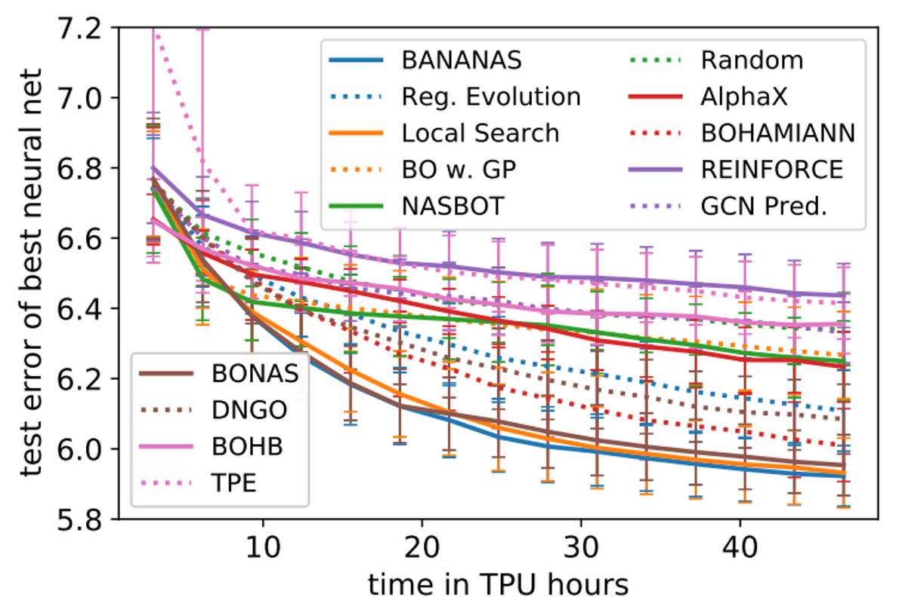
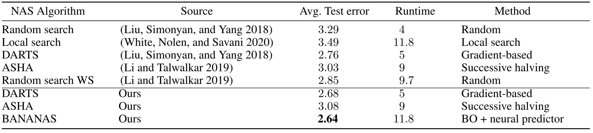

This paper introduces **BANANAS** (Bayesian Optimization with Neural Architectures for Neural Architecture Search), a framework designed to automate the design of neural network architectures. 

The researchers identified five core components of the "Bayesian Optimization (BO) + neural predictor" framework and conducted an extensive ablation study to determine the most effective configurations.

You could find the ins and outs of the paper in the presentation slides:
[BANANAS.pptx](BANANAS.pptx)

## Core Framework Components

The authors broke down the BO + neural predictor framework into five distinct modules, testing various methods for each to find the optimal combination:

| **Component** | **Definition** | **Top-Performing Choice(s)** |
| --- | --- | --- |
| **Architecture Encoding** | How a graph-based architecture is represented as a vector for the model. | **Path Encoding** (Novel contribution). |
| **Neural Predictor** | The model that predicts the accuracy of unseen architectures. | **Feedforward (MLP)** or **GCN**. |
| **Uncertainty Calibration** | How the model estimates its own "confidence" in a prediction. | **Ensemble** of neural predictors (size 5). |
| **Acquisition Function** | The strategy used to balance exploring new designs vs. exploiting known good ones. | **Independent Thompson Sampling (ITS)**. |
| **Acquisition Function Optimization** | The method used to find the next best architecture to test. | **Mutation** (randomly changing one edge/node). |

## The BANANAS Algorithm

By combining the best components from their analysis, the authors created the **BANANAS** algorithm. It operates three steps: 

1. **Initial Sampling:** Start by training a small set of random architectures. 
2. **Iterative Search** includes: 
    1. Train an **ensemble of MLPs** using **path encoding** on all evaluated architectures. 
    2. Generate candidate architectures by **mutating** the best-performing ones found so far. 
    3. Use **Independent Thompson Sampling** to select the most promising candidates.
3. **Parallelization:** The algorithm can output $k$ architectures at once to be trained in parallel, reducing total search time.

## Experimental

BANANAS demonstrated state-of-the-art (SOTA) performance across several major NAS benchmarks, NASBench-101, NASBench-102 and DARTS.

**NASBench-101:** Achieved SOTA performance, outperforming methods like Regularized Evolution and various GP-based BO approaches.

**DARTS Search Space:** Achieved a mean test error of **2.64%** on CIFAR-10, making it competitive with gradient-based methods like DARTS (2.68%) but within a more flexible BO framework.

