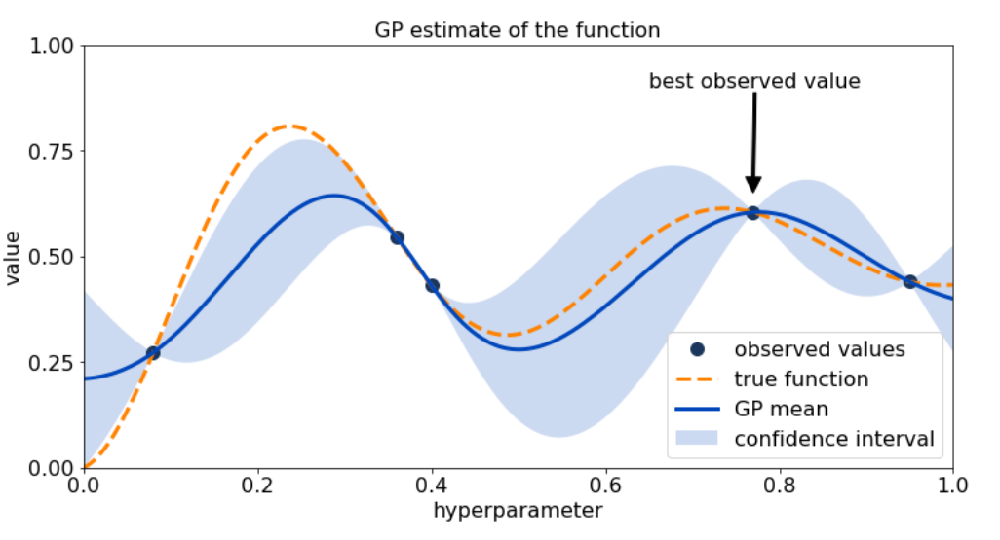
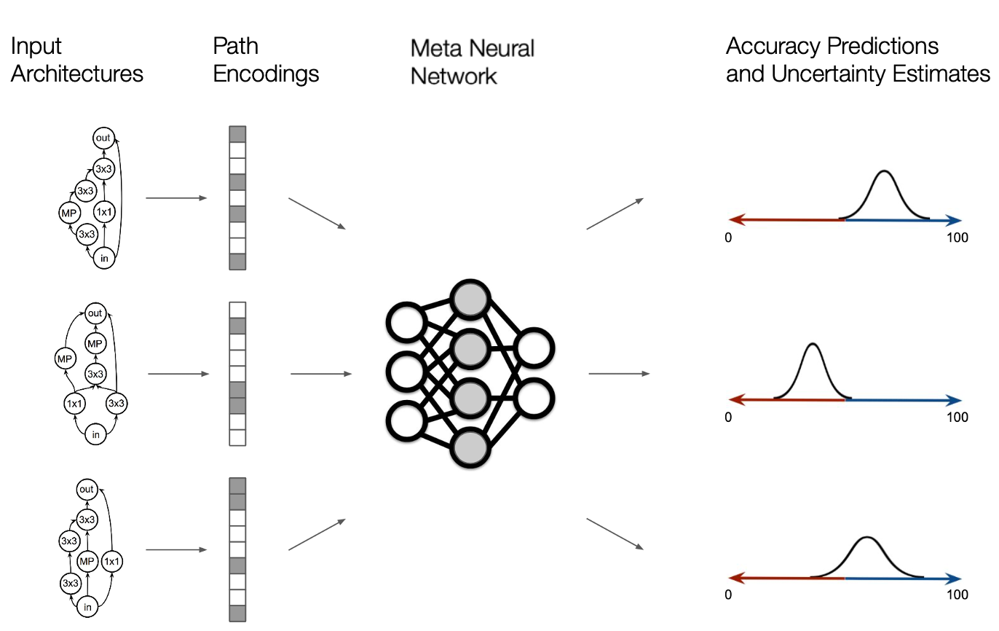
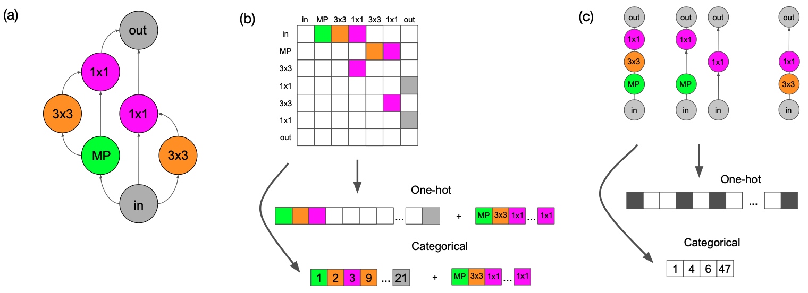
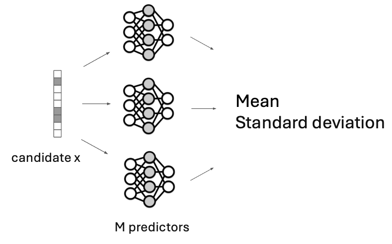
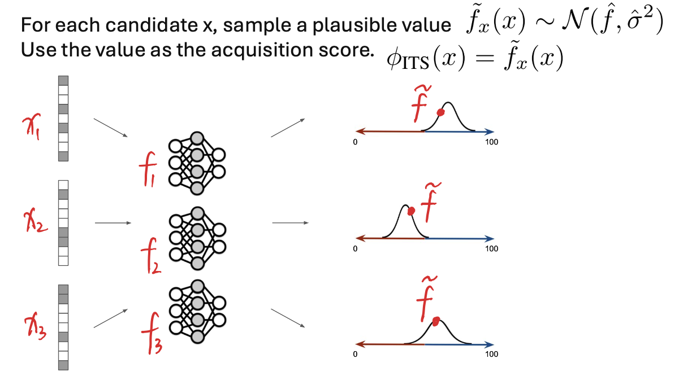

## Abstract

This report summarizes the seminar “Optimization in Machine Learning” through a single narrative: modern ML optimization is dominated by expensive, noisy, and structured objectives, so progress depends on (i) principled decision-making under uncertainty and (ii) pragmatic scalability tricks that respect compute budgets. 

We first review Bayesian Optimization (BO) as a general framework for expensive black-box optimization. We then connect the seminar papers as a progression from basic hyperparameter search baselines, to BO “engines” used in practice, to multi-fidelity and bandit-style resource allocation for deep learning workloads, and finally to realistic complications (mixed/discrete variables, constraints and safety, information-theoretic exploration). The last part details BANANAS, a BO-for-NAS method that synthesizes these themes into a system-level recipe for sample-efficient search in discrete, structured architecture spaces.

## Introduction

The seminar consists of student-led presentations of research papers related to optimization for machine learning, with emphasis on reading, explaining, and connecting modern methods. A central thread across the course is that many ML objectives are expensive black boxes (training a model, running an experiment, evaluating a pipeline), so optimization must carefully trade off exploration and exploitation under limited budgets.

### Bayesian Optimization Overview

Bayesian Optimization (BO) is designed for problems of the form:

$$
\max_{x \in \mathcal{A}} f(x)
$$

where $f$ is expensive to evaluate and gradients are unavailable or unreliable. The key idea is to *model* uncertainty about $f$ using a probabilistic surrogate and use that uncertainty to decide where to evaluate next. 

A tutorial view of BO emphasizes that it is a decision-making loop rather than a single algorithmic trick.

**The BO loop (surrogate + acquisition).**

Given observations $\mathcal{D}_n=\{(x_i,y_i)\}\_{i=1}^n$ with $y_i=f(x_i)+\epsilon_i$, BO:

1. fits a surrogate (often a Gaussian Process) to obtain a posterior mean $\mu_n(x)$ and uncertainty $\sigma_n(x)$;
2. defines an acquisition function $\alpha_n(x)$ that quantifies the value of evaluating $x$ (improvement, confidence bounds, information gain);
3. optimizes $\alpha_n(x)$ (cheap) to propose the next evaluation;
4. evaluates $f$ at the chosen point and updates the posterior.

**Why this matters for ML.**

In hyperparameter optimization (HPO), architecture search (NAS), and AutoML, the evaluation cost dominates, so the *sample efficiency* of the search strategy matters more than asymptotic guarantees. BO is attractive because it turns “try-and-see” experimentation into a structured policy that reasons about uncertainty.

## Presented Papers

This seminar can be understood as answering one practical question:

> *If training runs are expensive and the search space is messy, what optimization principles and systems actually work?*
> 

The papers collectively build a pipeline: begin with the limits of naive search, move to probabilistic BO reasoning, then confront the reality of deep learning budgets (multi-fidelity), mixed variable types, and constraints. Finally, the course culminates in AutoML/NAS as a “stress test” where all difficulties appear at once.

### From naive hyperparameter search to model-based decisions

The most direct way to tune hyperparameters is grid search, but it scales poorly in high dimensions. A key empirical insight is that *random search* is often a surprisingly strong baseline because it explores more effectively when only a few dimensions matter. However, random search is still blind: it does not learn from outcomes.

This motivates the core BO idea: the optimizer should become smarter as evidence accumulates. In practical ML tuning, model-based search has been repeatedly shown to outperform random search, especially when budgets are limited and evaluations are expensive. The seminar reinforced the principle that *adaptivity* (learning a surrogate and using uncertainty) is a decisive advantage when each run is costly.

### Practical BO engines: moving beyond “GP + EI”

A recurring theme is that classical GP-based BO is elegant but can be brittle in large, structured, or mixed search spaces. This is why many widely used HPO systems adopt alternative modeling choices.

Tree-structured Parzen Estimator (TPE) is a representative example: instead of directly modeling $p(y\mid x)$, it models densities over configurations conditioned on performance, enabling flexible handling of conditional and tree-structured spaces. The same modeling philosophy extends naturally to multi-objective settings, where optimization targets trade-offs (e.g., accuracy vs. latency) and selection is driven by Pareto reasoning rather than a single scalar objective.

The seminar also emphasized that in deep learning, the dominant cost is not proposing a configuration but *training it*, so scalable systems must integrate optimization with resource allocation. BOHB represents this “systems view”: it combines BO-style modeling with bandit-driven evaluation schedules so that promising configurations receive more resources while weak ones are pruned early. In other words, the optimizer does not only pick *what* to try; it also decides *how much* to spend.

### Scaling to deep learning: multi-fidelity, bandits, and learning curves

Once we accept that full evaluations are expensive, a natural strategy is to learn from cheaper approximations: fewer epochs, smaller datasets, lower resolution, or partial training. Hyperband formalizes this principle through bandit-style successive halving: allocate small budgets broadly, then concentrate compute on the survivors. The theoretical connection to best-arm identification clarifies what is happening: we are trying to identify the best configuration using limited samples and uncertainty-aware elimination.

Another lever is to exploit the structure of training dynamics. Learning-curve extrapolation shows that partial learning curves can predict final performance sufficiently well to stop poor runs early. Bayesian neural approaches extend this by providing uncertainty-aware predictions of learning curves, which supports safer early stopping decisions and tighter integration with optimization logic. Taken together, these works motivate an operational rule:

> *To optimize deep models efficiently, you must optimize under budgets, not under full evaluations.*
> 

### Real search spaces: discrete choices, integers, and structure

Even with good budget allocation, an optimizer can fail if it cannot represent the search space correctly. Many ML choices are categorical (optimizer type, activation), integer-valued (layers, batch size), or conditional (a hyperparameter only exists if a module is enabled). Classical BO assumptions based on continuous Euclidean geometry can break under naive encodings of discrete variables, which distorts similarity and misleads uncertainty. Handling categorical and integer variables properly is crucial for reliable performance in real tuning tasks.

This also sets up the NAS story: architectures are not points in $\mathbb{R}^d$ but graphs with symmetries and invariances. Without representations that respect this structure, even sophisticated acquisition rules can collapse into noisy heuristics.

### Exploration as a first-class object: information and improved acquisitions

A deeper conceptual shift in the course is that “exploration” is not just a tuning knob; it is part of the objective of the optimizer. Greedy behavior can be beneficial when uncertainty is well calibrated, but can be harmful under misspecification—highlighting that acquisition choice is inseparable from uncertainty quality.

Information-theoretic acquisitions push this further: rather than maximizing immediate improvement, they select points that reduce uncertainty about the optimum. Joint entropy style objectives explicitly target information gain about the optimizer itself. Meanwhile, work re-examining classical Expected Improvement shows that even “standard” acquisitions can be improved in non-obvious ways, suggesting that BO performance often depends on subtle interactions between modeling, noise, and optimization of the acquisition function.

### Constraints and safety

In many domains, not all evaluations are acceptable: unsafe parameters can damage hardware, violate constraints, or produce invalid designs. Safe and constrained BO augments the surrogate with constraint models and restricts the search to points that are likely feasible (or provably safe under assumptions). In molecular/chemical design, constraints may represent validity, synthesizability, or property thresholds; constrained BO combined with generative models shows how optimization can be layered on top of representation learning while still respecting feasibility.

This theme matters for ML too: real pipelines often have implicit constraints (memory, latency, training stability). Thus, an optimizer that ignores constraints may appear strong on paper but fail in deployment.

### AutoML and NAS as the synthesis point

The seminar naturally culminates in AutoML and NAS because they combine all previous challenges: expensive evaluations, structured spaces, mixed/discrete decisions, multi-objective trade-offs, and constraints.

AutoML-Zero frames the problem as searching over entire learning algorithms, emphasizing that optimization can operate at the level of *learning systems* rather than just numeric hyperparameters. NAS takes a similar idea into the architecture space. Structured BO methods that exploit tree-structured dependencies demonstrate how conditional structure can be used during optimization. Other NAS-focused BO approaches incorporate domain-specific similarity measures, including ideas based on optimal transport to compare architectures.

Within this landscape, BANANAS is best viewed not as a single trick but as a system-level recipe for BO in NAS: it asks which representation, predictor, and acquisition design choices actually matter most when budgets are tight and architectures are discrete.

## BANANAS: Bayesian Optimization with Neural Architectures for Neural Architecture Search

### Problem setting: NAS under limited evaluation budget

Neural Architecture Search (NAS) aims to discover high-performing neural networks automatically, but each evaluation (training/validating an architecture) is expensive. This makes NAS a canonical expensive black-box optimization problem, and it is a natural application area for BO ideas.

A NAS pipeline can be described by three elements:

1. a search space $\mathcal{A}$ of candidate architectures;
2. a search strategy that selects which architecture to evaluate next;
3. an evaluation protocol (training budget, validation metric).

BANANAS focuses on improving the *search strategy* by bringing BO-style reasoning into the discrete architecture domain.

### BANANAS as BO-for-NAS with five interacting components

BANANAS organizes the BO-for-NAS system into five components and empirically studies their combinations:

1. **Architecture encoding** (graph → vector features),
2. **Predictor model** (predict performance from encoding),
3. **Uncertainty estimation** (calibrate epistemic uncertainty),
4. **Acquisition rule** (balance exploration/exploitation),
5. **Acquisition optimization** (search candidates in a discrete space).

The key message is consistent with the course narrative: BO success is a product of *end-to-end alignment*. A strong acquisition is useless with a poor uncertainty estimate; a good predictor can fail if the encoding breaks invariances; and everything collapses if acquisition optimization is not adapted to the discrete domain.

### Encoding

Architectures in common NAS benchmarks are DAG-like cell graphs. A naive representation is the adjacency matrix plus operation labels, but it is sensitive to node indexing: permuting node IDs changes the encoding without changing the architecture. This injects spurious variation and makes regression harder.

BANANAS proposes **path encoding**: features correspond to complete computational paths from input to output. This reduces sensitivity to arbitrary node order and better matches functional composition. Intuitively, it provides the predictor with semantically meaningful units (paths) rather than local edges, improving sample efficiency in the low-data regime.

### Predictor and uncertainty: ensembles as a practical Bayesian approximation

BANANAS uses an MLP predictor to regress architecture performance from the encoding. Since a single predictor is often miscalibrated, BANANAS estimates uncertainty via an ensemble: train multiple predictors with different random initializations, and use mean and standard deviation across predictions as a proxy for epistemic uncertainty. This aligns with the seminar's broader theme: in practical BO systems, approximate uncertainty methods (ensembles, bootstrapping) are frequently more robust than strictly Bayesian but computationally fragile alternatives.

### Independent Thompson Sampling

Given mean and uncertainty estimates, BANANAS compares acquisition rules such as UCB and Thompson sampling. A strong empirical choice is **Independent Thompson Sampling (ITS)**: for each candidate, sample a plausible value from a distribution parameterized by the ensemble mean and variance, then select the candidate with the best sampled score. Conceptually, ITS implements exploration by stochastic optimism, and it is simple to implement in discrete candidate pools.

### Optimizing the acquisition in discrete spaces: candidate pools + mutation

Unlike continuous BO, we cannot directly optimize the acquisition by gradient methods over $\mathbb{R}^d$. BANANAS instead constructs a candidate pool, scores it, and evaluates the best candidate. The pool is generated using random sampling and **mutation** of high-performing architectures, which concentrates search near promising regions while preserving diversity. This echoes the course theme that scalable optimization is often achieved by mixing principled scoring with practical heuristics for candidate generation.

### Takeaway

Across NAS benchmarks, BANANAS identifies an effective configuration:

$$
	\text{path encoding} + \text{MLP predictor} + \text{ensemble uncertainty} + \text{ITS} + \text{mutation-based pool}
$$

and shows that this combination is competitive under strict evaluation budgets.

From the seminar perspective, BANANAS serves as a concrete demonstration that “mastering optimization in ML” means mastering *interfaces*: 

representation ↔ surrogate ↔ uncertainty ↔ acquisition ↔ compute allocation. 

The paper is valuable because it turns this philosophy into an experimentally validated recipe rather than an abstract recommendation.

## Conclusion

The seminar papers collectively show that modern ML optimization is not a single algorithm but a layered toolbox. We begin with strong baselines such as random search, then move to BO as a principled policy for expensive black-box optimization. For deep learning, the bottleneck becomes compute, so multi-fidelity and bandit-style methods (Hyperband, BOHB) and learning-curve prediction become essential. Real-world search requires respecting discreteness and structure, while safe and constrained optimization expands applicability to domains where failures are costly. Finally, AutoML/NAS integrates all of these concerns into a single problem setting, and BANANAS illustrates how an effective solution emerges from aligning representation, uncertainty, acquisition, and discrete candidate generation.

## References

1. Peter I. Frazier. *A Tutorial on Bayesian Optimization*. arXiv:1807.02811, 2018.
2. James Bergstra and Yoshua Bengio. *Random Search for Hyper-Parameter Optimization*. JMLR, 13:281–305, 2012.
3. Bobak Shahriari, Kevin Swersky, Ziyu Wang, Ryan P. Adams, and Nando de Freitas. *Taking the Human Out of the Loop: A Review of Bayesian Optimization*. Proceedings of the IEEE, 104(1):148–175, 2016.
4. James Bergstra, Rémi Bardenet, Yoshua Bengio, and Balázs Kégl. *Algorithms for Hyper-Parameter Optimization*. NeurIPS, 2011.
5. Yoshihiko Ozaki et al. *Multiobjective Tree-Structured Parzen Estimator*. arXiv preprint, 2022.
6. Stefan Falkner, Aaron Klein, and Frank Hutter. *BOHB: Robust and Efficient Hyperparameter Optimization at Scale*. ICML, 2018.
7. Lisha Li, Kevin Jamieson, Giulia DeSalvo, Afshin Rostamizadeh, and Ameet Talwalkar. *Hyperband: A Novel Bandit-Based Approach to Hyperparameter Optimization*. ICLR, 2017.
8. Kevin Jamieson and Ameet Talwalkar. *Non-stochastic Best Arm Identification and Hyperparameter Optimization*. AISTATS, 2016.
9. Tobias Domhan, Jost Tobias Springenberg, and Frank Hutter. *Speeding up Automatic Hyperparameter Optimization of Deep Neural Networks by Extrapolation of Learning Curves*. IJCAI, 2015.
10. Aaron Klein, Stefan Falkner, Simon Bartels, Philipp Hennig, and Frank Hutter. *Learning Curve Prediction with Bayesian Neural Networks*. ICLR, 2017.
11. Eduardo C. Garrido-Merchán and Daniel Hernández-Lobato. *Dealing with categorical and integer-valued variables in Bayesian Optimization with Gaussian processes*. Neurocomputing, 2020.
12. Vladimir Ivanov et al. *Greed is Good: Exploration and Exploitation Trade-offs in Bayesian Optimisation*. arXiv preprint, 2021.
13. Ke Wang et al. *Joint Entropy Search for Maximally-Informed Bayesian Optimization*. arXiv preprint, 2022.
14. Sebastian Ament et al. *Unexpected Improvements to Expected Improvement for Bayesian Optimization*. arXiv preprint, 2023.
15. Yunpeng Sui et al. *Bayesian Optimization with Safety Constraints: Safe and Automatic Parameter Tuning in Robotics*. arXiv preprint, 2020.
16. Ryan-Rhys Griffiths and José Miguel Hernández-Lobato. *Constrained Bayesian Optimization for Automatic Chemical Design using Variational Autoencoders*. NeurIPS Workshop / arXiv version, 2019.
17. Rodolphe Jenatton et al. *Bayesian Optimization with Tree-structured Dependencies*. ICML, 2017.
18. Kirthevasan Kandasamy et al. *Neural Architecture Search with Bayesian Optimisation and Optimal Transport*. NeurIPS, 2018.
19. Colin White, Willie Neiswanger, and Yash Savani. *BANANAS: Bayesian Optimization with Neural Architectures for Neural Architecture Search*. AAAI / arXiv version, 2021.
20. Esteban Real et al. *AutoML-Zero: Evolving Machine Learning Algorithms From Scratch*. ICML, 2020.