This post is primarily based on the survey [“Retrieval-Augmented Generation for AI-Generated Content: A Survey”](https://link.springer.com/article/10.1007/s41019-025-00335-5). I presents retrieval-augmented generation (RAG) in six parts: **background**, **method**, **enhancement**, **applications**, **outlook**, and **takeaways**.

# Background

In recent years, we’ve seen a rapid surge in Artificial Intelligence Generated Content (AIGC), driven by large generative models that can produce text, code, images and even videos ([Zhao et al. 2026](https://link.springer.com/article/10.1007/s41019-025-00335-5)). For text and code, widely used examples including GPT-style models and Anthropic’s Claude family ([Achiam et al. 2023](https://arxiv.org/abs/2303.08774), [Anthropic 2024](https://www-cdn.anthropic.com/de8ba9b01c9ab7cbabf5c33b80b7bbc618857627/Model_Card_Claude_3.pdf)). For images, modern systems are often powered by diffusion-based text-image generation, including latent diffusion models ([Ramesh et al. 2021](https://arxiv.org/abs/2102.12092), [Rombach et al. 2022](https://arxiv.org/abs/2112.10752)). For video, OpenAI’s Sora is a prominent example of large-scale text-to-video generation ([OpenAI 2024](https://openai.com/index/video-generation-models-as-world-simulators/)). 

These models often look impressive when requirements are loose, but they can fail in very common scenario: we ask a pure LLM to help review for a final exam, yet the exam topics come strictly from the course materials of several PDFs, and the model was not trained on that private material, so it’ll produce a generic answer that misses the specific definitions, theorems, or phrasing our professor expects. So what we can do? We can use **Retrieval Augmented Generation (RAG)** to address this. We treat the course materials as an external knowledge source, so at each question time, the system first **retrieves** the most relevant passages from an indexed document store and then feeds those passages as context into the LLM to **generate** an answer grounded in the course text ([Lewis et al. 2020](https://arxiv.org/abs/2005.11401), [Karpukhin et al. 2020](https://arxiv.org/abs/2004.04906)). 

We can see, now the whole process becomes **non-parametric** and not a huge workload. It’s very useful because we can update or swap documents by just refreshing the index, rather than retraining the entire model whenever the materials change. In practice, RAG can also **reduce hallucinations** by letting the model to rely on retrieved evidence, but the gains depend heavily on retrieval quality and how well the generator uses the retrieved passages ([Asai et al. 2023](https://arxiv.org/abs/2310.11511)).

# Method

Basically, the entire RAG system consists of two core modules: the **retriever** and the **generator**, where the **retriever** searches for relevant information from the data store and **generator** that conditions on the query plus retrieved evidence to produce the final content ([Zhao et al. 2026](https://link.springer.com/article/10.1007/s41019-025-00335-5)). 

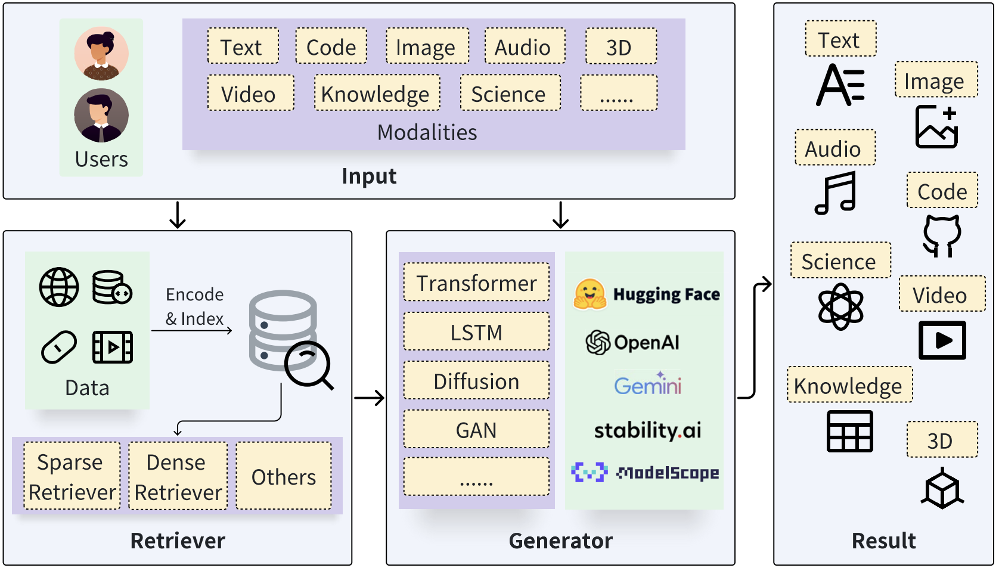

During inference, the retriever initially receives the input query and searches for relevant information; Then, the original query and the retrieval results are fed into the generator through **a specific augmentation methodology** (we’ll discuss later); Finally, the generator produces the desired outcomes.

But from my side, I agree that RAG has three steps: **indexing**, **retrieval** and **generation** ([Gao et al. 2024](https://arxiv.org/pdf/2312.10997)). Start with the clearning and extraction of raw data in diverse formats like PDF, HTML, Word, and Markdown..., which is then converted into a uniform plain text format. **To adapt the context limitations of language models**, text is segmented into smaller, digestible **chunks**. Chunks are then **encoded** into **vector representations** using an embedding model and stored in **vector database**. This step is crucial for enabling efficient similarity searches in the subsequent retrieval inference phase.

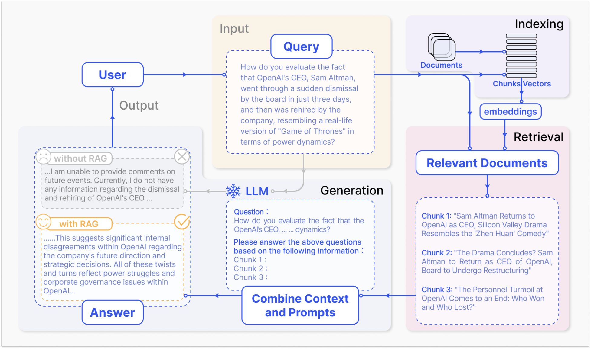

To be more specific, upon receipt of a user query, the RAG system employs the **same encoding model** utilized during the indexing phase to transform the query into a **vector representation**. It then computes the **similarity scores** between the query vector and the vector of chunks within the indexed corpus. The system prioritizes and retrieves the **top K** chunks that demonstrate the greatest similarity to the query. The posed query and selected chunks are synthesized into a coherent prompt, and a large language model (or any different types of models) takes it to formulate a response. In cases of ongoing dialogues, any existing conversational history can be integrated into the prompt, enabling the model to engage in multi-turn dialogue interactions effectively.

Next, I’ll introduce the basics about three steps of RAG: **Indexing**, **Retrieval** and **Generation** then explain different RAG variants, and finally discuss the corresponding enhancements.

## Indexing

The **indexing** stage is the offline preparation stage for the online steps of RAG, but it largely determines downstream quality because **index quality directly determines retrieval quality, which in turn strongly influences generation quality**. In practice, indexing starts by transforming raw, unstructured data like PDFs, HTML, or Markdown into a clean, normalized text, then splitting that text into **chunks** and store them in a RAG database.

The RAG database functions as a specialized **key-value store**. The **"Value"** is the raw text chunk along with its metadata (like source links or page numbers). The **"Key"** is a mathematical representation of that text that allows the system to find it during a search. When a user asks a question, the system identifies the most relevant "Keys", then instantly looks up the associated "Values" to provide the necessary context to prompt for the Large Language Model.

While all indexing follows this key-value logic, the way "Keys" are created and organized depends on the type of **retrieval** being used:

- **Dense Indexing (The Semantic Map):** In this approach, each chunk is encoded into a **dense vector** that represents its meaning. These vectors are organized into an **Approximate Nearest-Neighbor (ANN)** index. Rather than scanning every single chunk, the ANN index acts like a spatial map, allowing the system to jump to the neighborhood of relevant concepts quickly. This is ideal for finding information based on intent and synonyms, even if the exact words don't match.
- **Sparse Indexing (The Keyword Catalog):** This approach creates an **Inverted Index**, which is a data structure designed for fast, efficient search ([Jang 2025](https://huggingface.co/blog/yjoonjang/the-past-and-present-of-sparse-retrieval)). Instead of asking “which words appear in this document?”, it lets us ask “which documents contain this word?” quickly. Concretely, a **forward index** uses `doc_id` as the key and stores `{term: TF}` as the value. An **inverted index** flips that: it uses the **term** as the key and stores `{doc_id: TF}` as the value.

For example, given the following toy corpus:

| **Doc ID** | **Content** |
| --- | --- |
| doc1 | "apple banana cherry" |
| doc2 | "banana cherry date" |
| doc3 | "cherry date apple" |
1. **Forward Index** (per document, store term counts)
    - doc1: {"apple": 1, "banana": 1, "cherry": 1}
    - doc2: {"banana": 1, "cherry": 1, "date": 1}
    - doc3: {"cherry": 1, "date": 1, "apple": 1}
2. **Inverted Index** (per term, store postings of documents and counts)
    - apple: {"doc1": 1, "doc3": 1}
    - banana: {"doc1": 1, "doc2": 1}
    - cherry: {"doc1": 1, "doc2": 1, "doc3": 1}
    - date: {"doc2": 1, "doc3": 1}

With this inverted index, a search for the term `"banana"` immediately tells us which documents contain it and how many times. After the inverted index is built, at **query time** the query is tokenized. For each query token, we use the postings in the inverted index to compute the score between the query and each candidate document, and then return the top-scoring documents. This is the process of retrieval.

---

While simple retrieval strategies work initially, they become weaker and inefficient as data volumes grow. Attempting to solve this by simply increasing chunk sizes introduces a significant trade-off: larger chunks often contain multiple terms, which creates noise. This verbosity can lead to **false positives** due to chunk verbosity or **false negatives** because the variety of topics dilutes the specific information the model is looking for. So, how do we traverse larger chunks without introducing noise to data? One attempt at that is using a **hierarchical retrieval strategy**. A strategy that **hierarchically narrows down data** to relevant chunks. ([Mindek 2024](https://pixion.co/blog/rag-strategies-hierarchical-index-retrieval))

As shown in the figure, the retrieval process is executed in a hierarchical order rather than scanning all raw data at once:

- **Document-Level Filtering:** The process begins at the highest level of abstraction. The query is tested against an **index of document summaries**, which highlight only key points. This allows the system to focus only on relevant documents and ignore massive volumes of unrelated data.
- **Chapter-Level Narrowing:** Once a document is considered relevant, the search moves to the **index of chapter summaries**. Each level down the hierarchy becomes more discrete and detailed. This step ensures the system identifies the specific section of a document that contains the answer.
- **Chunk-Level Extraction:** Only after navigating these summary levels does the system access the **index of chunks**. These are the smallest units of data that provide the actual evidence for the generator.

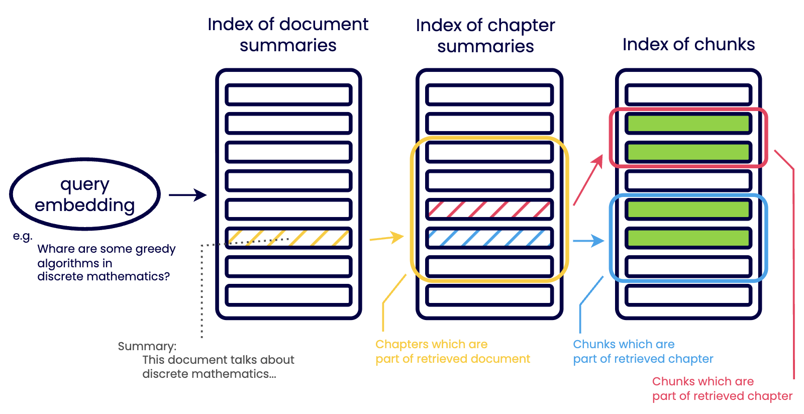

In the face of growing data volumes, hierarchical index retrieval stands as a robust strategy to **improve data accuracy and scalability**. This strategy, which organizes data into a hierarchy and progressively narrows down to the most relevant data, is versatile and adaptable to sparse and dense retrievals.

Key to implementing this strategy is the use of **summaries** and **metadata** to filter and navigate large chunks of data, and the use of AI models for automated summarization. However, we should be wary of keeping the **balance of hierarchy levels** to avoid complexity and inefficiency.

## Retriever

Retrieval is to identify and obtain relevant information given an information need. Specifically, consider information resources are stored in the database as multiple **key-value pairs**, where each key corresponds to a value. Given a query, the objective is to search for the **top-k most similar keys** using a similarity function (we call it **KNN retriever**), and obtain the paired values. Based on **different similarity functions**, existing retrieval methods can be categorized into **sparse retrieval**, **dense retrieval**, and **others**. 

<aside>

- **Sparse (lexical) retrieval** = term-based, keyword-based
    
    (Representatives: BM25, TF-IDF, query likelihood)
    
- **Dense (semantic / embedding-based) retrieval** = vector-based
    
    (Representatives: embedding search + ANN, DPR-style retrievers)
    
</aside>

### Sparse Retriever

Sparse retrieval methods are widely used in document retrieval. We have built the inverted index before, so at query time for each query token, we use the postings in the inverted index to **compute the score between the query and each candidate document**, and then return the top-scoring documents.

These methods rely on lexical term-matching **scoring models** such as **TF-IDF** ([Salton & Buckley 1988](https://courses.cs.umbc.edu/graduate/676/umbconly/SaltonBuckleyIPM88.PDF)), **query likelihood** language modeling ([Lafferty & Zhai 2001](https://sigir.org/wp-content/uploads/2017/06/p251.pdf)), and **BM25** ([Robertson & Zaragoza 2009](https://www.staff.city.ac.uk/~sbrp622/papers/foundations_bm25_review.pdf)). They exploit corpus-level word statistics and are typically implemented with an **inverted index**, enabling efficient lookup of candidate documents for each query term, followed by ranking with the corresponding scoring function.

**TF-IDF** scores a document by combining **term frequency** in the document with **inverse document frequency** across documents, it’s like down-weighting common words and up-weighting rare, informative words. **Query likelihood** treats each document as a **language model** and ranks documents by the probability of generating the query. 

**BM25 is the enhancement of TF-IDF**, which add features like **TF saturation** and **Document length normalization**. To score a document with **BM25**, we add up a per-term contribution for each query term. Each contribution combines two complementary signals: **IDF** and **TF**. **IDF** is a *corpus-level* weight that measures how rare and discriminative a term is across all documents, rare terms receive higher weight, while common terms contribute little. **TF**, in contrast, is a *document-level* signal that reflects how strongly this specific document discusses the term. BM25 improves on plain TF weighting by using **TF saturation**: the score rises quickly for the first few occurrences of a term but then decrease the increasing speed, so repeating the same word 20 times does not help 20×. In addition, BM25 applies **document-length normalization** to prevent long documents from being unfairly rewarded simply because they contain more tokens and thus more chances to match the query. In practice, these design choices make BM25 robust, and it remains a standard first baseline before adding neural rerankers or dense retrieval components.

This is the formula to compute the relevance score of **document d** for **query q:**

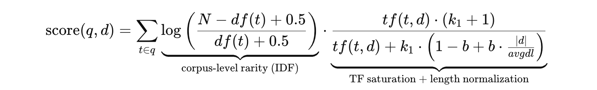

- $q$: query, $d$: document, $t$: a query term, $N$: number of documents in the corpus
- $df(t)$: number of documents containing **term** $t$
- $tf(t,d)$: **term** **frequency** of $t$ in **document** $d$
- $|d|$: document length (tokens/terms)
- $avgdl$: average document length in the corpus
- $k_1$: controls TF saturation strength
- $b$: controls length normalization strength

So we can summarize the online query process to be like: tokenize query → find document candidates based on the inverted index → compute scores using **scoring methods** → pick n best and proceed. You can check the illustration below to help understand:

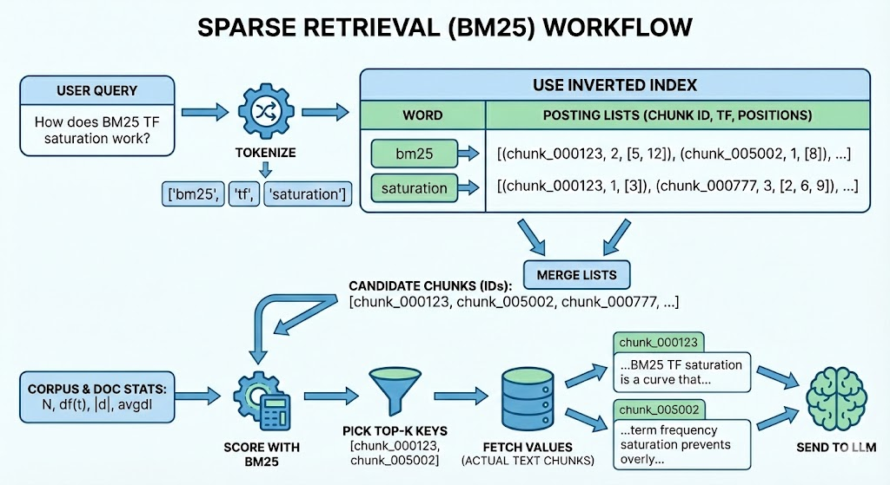

### Dense Retriever

Unlike sparse retrieval, **dense retrieval methods** represent queries and documents (or document chunks) as **dense embedding vectors**, and build an **Approximate Nearest Neighbor (ANN) index** over these document / chunk vectors to enable fast similarity search at scale. 

This workflow can be applied to all modalities. For text data, recent advancements in pre-trained models, such as **BERT** ([Devlin et al. 2019](https://arxiv.org/abs/1810.04805)), have been employed to encode queries and keys individually ([Karpukhin et al. 2020](https://arxiv.org/search/cs?searchtype=author&query=Karpukhin,+V)). This approach is often referred to as **Dense Passage Retrieval (DPR)**. Similar to text, models have been proposed to encode code data ([Feng et al. 2020](https://arxiv.org/abs/2002.08155)), image data ([Radford et al. 2021](https://arxiv.org/abs/2103.00020)), etc. The **similarity score** between dense representations is usually computed with metrics such as cosine, inner product, L2-distance.

The key things for dense retrieval are **encoder setting in training step** and **ANN methods in inference step**. What we want are **smart encoder** and the **fast search**.

During training, dense retriever **encoders** are typically learned with **contrastive learning**: for each query, the model is trained to assign a higher similarity score to a **positive** sample (the relevant chunk) than to **negative** samples (irrelevant chunks). Concretely, the encoder produces embeddings for the query and candidate chunks, and computes similarities between them, then applies a softmax objective function that **make the similarity score between the query embedding and the positive embedding close to 1**, and **move the similarity scores between the query embedding and the negative embeddings to 0**. 

Several hard negative techniques have been proposed to further enhance encoder model quality. For example, **ANCE** (Approximate Nearest Neighbor Negative Contrastive Estimation) ([Xiong et al. 2020](https://arxiv.org/abs/2007.00808)) mines **hard negatives globally** from the entire corpus / chunks instead of relying only on in-batch or random negatives: during training, it maintains an **ANN index** over the current **chunk** embeddings, and for each training query it **retrieves the top-ranked chunks** under the current dense retriever, then treats those highly similar-but-not-relevant chunks as **hard negatives**. 

To keep the negatives fresh as the model updates, ANCE uses an **asynchronous index refresh**: a separate inferencer periodically re-encodes the corpus chunks with a recent encoder and updates the ANN index, while the trainer continues optimizing the model using newly mined hard negatives. This way, the negatives better reflect what the model will confuse at test time, providing stronger learning signals than easy local negatives.

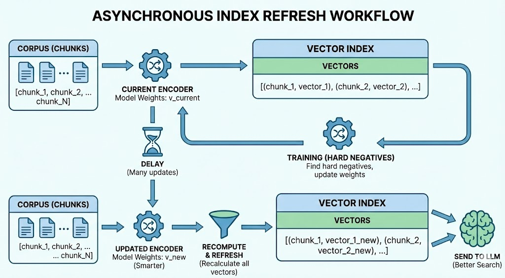

For efficient searching during inference, ANN methods are employed. Like I mentioned before, instead of comparing a query vector against every stored vector, the ANN index organizes the vector space in advance (we can view the following illustration to have a rough expression), so that at query time it can quickly return the **top-k** most similar vector IDs, which are then used to fetch the corresponding text chunks and metadata.

The following illustration shows basically what does **Approximate Nearest Neighbor (ANN)** looks like and the basic workflow:

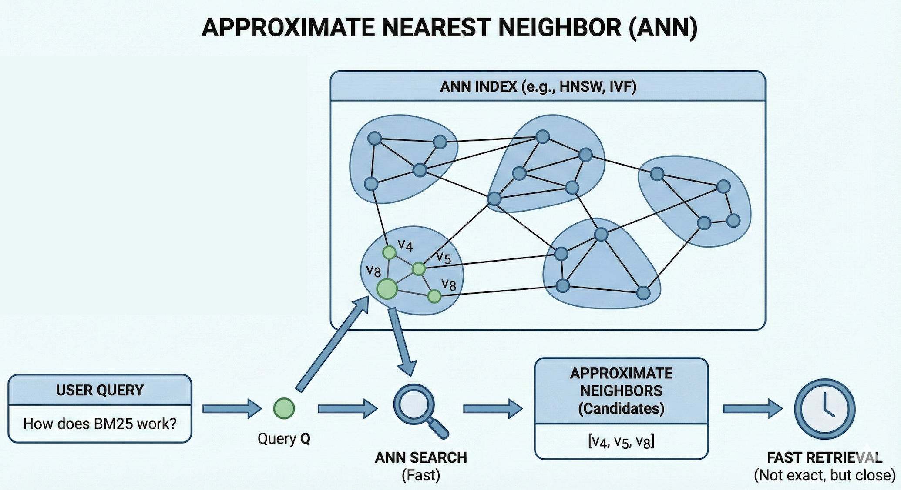

For example, suppose our corpus contains chunks about “BM25,” “TF-IDF,” and “diffusion models.” After embedding, the “BM25” and “TF-IDF” chunks end up close to each other in vector space, while the “diffusion models” chunk is far away. When a user asks “How does BM25 work?”, the system embeds this query into a vector and searches the ANN index. The index jumps into the neighborhood of BM25-related vectors, rather than scanning all chunks, then returns the IDs of the nearest chunks (e.g., the BM25 chunk and the TF-IDF chunk), and the system then loads those chunk texts as added prompt for the generator. You can find the illustration about the rough workflow for thie example.

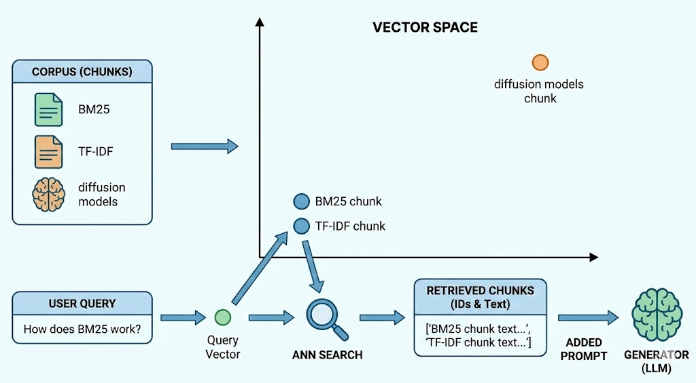

There are various indices developed to serve ANN search, including tree ([Li et al. 2023](https://dl.acm.org/doi/10.1145/3580305.3599406)), **neighbor graph indices** like HNSW ([Malkov et al. 2018](https://arxiv.org/abs/1603.09320)) and DiskANN ([Subramanya et al. 2019](https://papers.nips.cc/paper_files/paper/2019/hash/09853c7fb1d3f8ee67a61b6bf4a7f8e6-Abstract.html)), and combined graph and inverted indices like SPANN ([Chen et al. 2021](https://arxiv.org/abs/2111.08566)). We roughly go through HNSW next, **one of the most efficient and popular graph-based indices** used in modern vector databases.. By the way, ANN is an efficient search idea, and HNSW is just one of its implementation.

The brilliance of HNSW lies in its hierarchical structure. as shown in the following illustration, HNSW organizes data into multiple layers.

- **Layer 0 (Bottom):** This layer contains all the data points in the dataset. It is a dense graph where nodes are connected to their closest neighbors.
- **Upper Layers (Layer 1, 2...):** These layers contain a decreasing subset of the data points.

The **connections within each layer are built on similarity**: each point is linked to its nearest neighbors, forming a graph that allows the search to navigate through similar clusters of data. The Search Strategy flows from the upper layers to bottom layer. In the upper layers, the goal is speed, finding a good entry point for the next level, but in Layer 0, the goal is **precision.** Concretely, here’s how it goes:

- **Entry Point:** The search begins at the top most layer at a pre-defined entry point, we can find the red dot in the image.
- **Greedy Navigation:** In each layer, the algorithm performs a greedy search to find the node closest to the query vector.
- **Descending Layers:** Once a local minimum is found in an upper layer, the search drops down to the next layer (indicated by the dashed red lines) and repeats the greed search from that same point.
- **Final Result:** This process repeats until the search reaches **Layer 0**, where it performs a more granular search to find the actual nearest neighbors. We can’t move to the single best neighbor, so the algorithm maintains **a dynamic list of closest candidates**. It continues to explore neighbors and update this list until its search budget is exhausted, ensuring that we hasn't just found a good neighbor, but the **true nearest neighbors**.

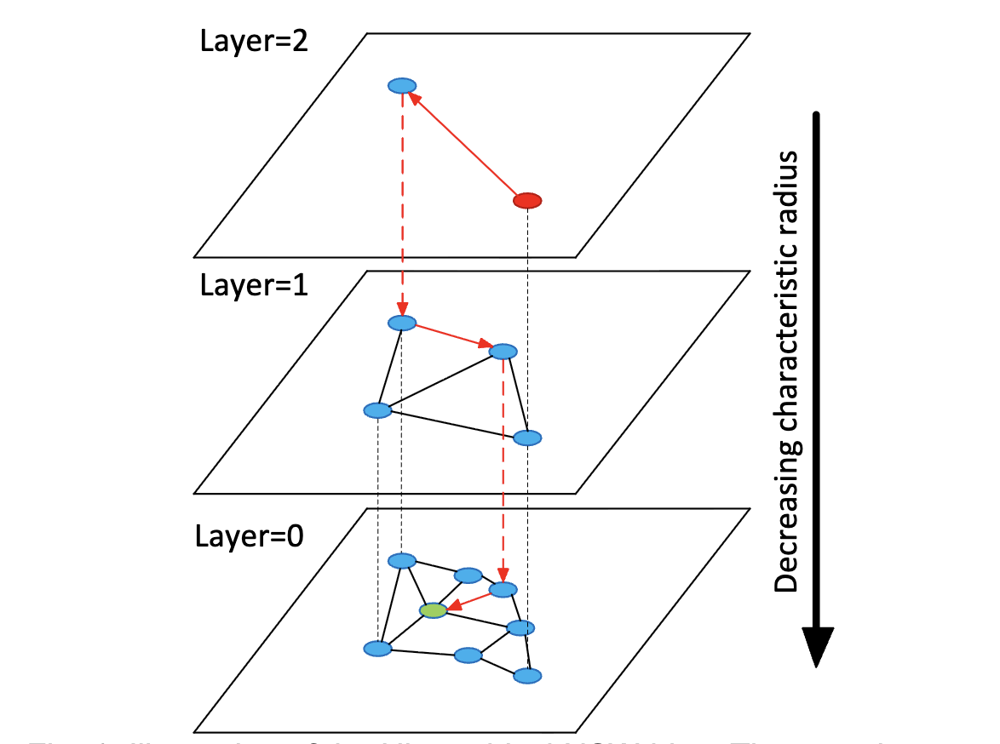

HNSW offers an excellent trade-off between **search speed** and **accuracy**, which can be tuned by adjusting **the number of neighbors per node** and **the** **search depth**.

### Others

Beyond **sparse** and **dense** retrieval, there are other ways to find relevant information. Some methods don’t build vector representations at all, instead, they compare the query and document chunks **directly**. For example, for natural-language text we can use **edit distance** ([Hayati et al. 2018](https://arxiv.org/abs/1808.10025)), which measures how many small changes (insert/delete/replace characters) are needed to turn one text into another.

Another alternative is to retrieve from a **knowledge graph** ([Hu et al. 2025](https://arxiv.org/abs/2405.16506)), where entities are already connected by relations. In that setting, we can start from an entity relevant to the query and retrieve related entities by doing a **k-hop neighbor search**, meaning we expand to nodes that are 1 step away, 2 steps away, and so on. Finally, we retrieve a **relevant subgraph** (entities + relations) and then feeds that structured evidence into the LLM.

## Generator

The **generation module** plays a crucial role in a RAG system: it takes the user query together with the retrieved context and produces the final output in the required modality. So there are actually two steps inside generator. The first is the integration of query and retrieved information, the second is the generative models.

We categorize the integration methods into 4 types, so based on how the retriever augments the generator, we say RAG foundations have 4 classes: **query-based RAG**, **latent representation-based RAG**, **logit-based RAG** and **speculative RAG**.

### Query-based RAG

Stemming from the idea of prompt augmentation, query-based RAG seamlessly **integrates the user’s query with retrieved information**, feeding it directly into the initial stage of the generator’s input to create a response. This method is prevalent in RAG applications and is widely employed across various modalities.

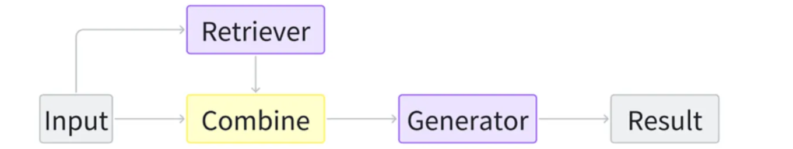

This integration methods often paired with LLM generators, offers modular flexibility, allowing swift integration of pre-trained components for quick deployment. Prompt design is crucial for utilizing retrieved data within this setup.

### Latent Representation-based RAG

In a latent representation-based RAG framework, retrieved objects are incorporated into generative models as latent representations. This enhances the model’s comprehension abilities and improves the quality of the generated content. The basic architecture is as follows:

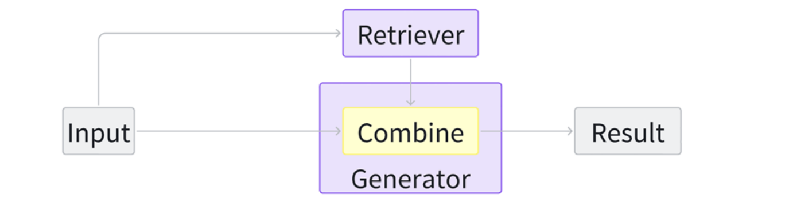

And the following figure is a **latent-representation-based RAG** design called **Retrieval-Enhanced Transformer (RETRO)** ([Borgeaud et al. 2022](https://arxiv.org/abs/2112.04426)). The model does not integrate retrieved text into the prompt directly. Instead, it converts the retrieved neighbors into **continuous hidden vectors** and injects them into the generator through **cross-attention**, so retrieval acts like an extra memory in latent space.

Concretely, a **frozen kNN retriever** uses a BERT-style encoder to embed each input **chunk** and fetch its top-k nearest **neighbor chunks** from a retrieval dataset. These retrieved neighbor texts are then passed through a **Transformer encoder** to produce **encoded representations** $E_1, E_2, \dots$. 

Inside the main language model, the input sequence is processed normally to produce hidden states $H$, but at specific layers it performs **Chunked Cross-Attention (CCA)**: for each input chunk $C_i$, the model uses the chunk’s hidden states as **queries** and attends over the corresponding neighbor encodings $E_i$ as **keys and values**, producing an updated hidden state $H_i^+$. This update is then fed forward through the rest of the Transformer blocks. So the retrieved objects are incorporated **as latent vectors via attention**, influencing generation through hidden-state updates rather than explicit text concatenation. 

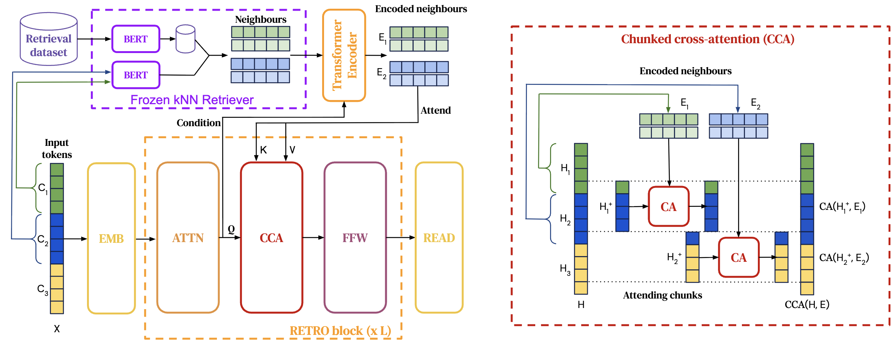

This is the concrete workflow example, there are five steps:

1. **Chunk the input**
    
    Given a query: “Explain kNN vs ANN and cross-attention.”  It is splited to chunks `C1` (kNN vs ANN) and `C2` (cross-attention).
    
2. **Retrieve neighbors (frozen kNN retriever)**
    
    A fixed BERT encoder embeds each chunk: `q1 = emb(C1)`, `q2 = emb(C2)`. Then search the vector index to get top-2 neighbor chunks:
    
    - `C1 → {D1: ANN/HNSW explanation, D2: kNN definition}`
    - `C2 → {D3: cross-attention explanation, D4: Transformer attention basics}`
3. **Encode retrieved chunks into latent memory**
    
    A Transformer encoder turns retrieved texts into hidden vectors: `E1 = encode(D1, D2)` and `E2 = encode(D3, D4)`.
    
4. **Integrate via Chunked Cross-Attention (CCA)**
    
    Inside the large model, hidden states for each input chunk attend to its neighbor retrieved vectors: `H1⁺ = CA(H1, E1, E1)` and `H2⁺ = CA(H2, E2, E2)`.
    
5. **Generate**
    
    The large model continues from `H⁺` and outputs an answer.
    

Latent representation-based RAG, adaptable across modalities and tasks, **blends retrievers' and generators' hidden states** but **requires additional training for aligning latent spaces**. It enables the development of sophisticated algorithms that seamlessly incorporate retrieved information.

### Logit-based RAG

In **logit-based RAG**, the retriever doesn’t mainly help by adding extra tokens to the prompt or by injecting hidden vectors into Transformer layers. Instead, it helps **at decoding time** by directly influencing the model’s **logits** for the next token. The logits refer to the pre-softmax scores over the vocabulary, which effect the probabilities for step-wise generation.

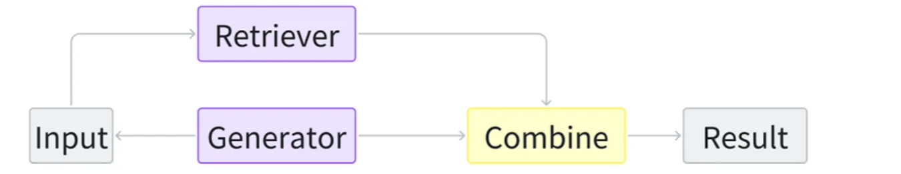

In the text domain, **kNN-LM** ([Khandelwal et al. 2020](https://arxiv.org/abs/1911.00172)) and its variant blend **language model probabilities** with those from retrieval distances of similar prefixes at each decoding step. This following figure shows **kNN-LM**: at each prediction step, the LM **looks up similar past contexts** in a datastore and mixes their suggested next tokens with the LM’s own next-token distribution. Let’s see more details:

- **Datastore (training contexts → targets):** it stores many pairs like “Obama was born in …” → **Hawaii**, “Obama was senator for …” → **Illinois**, etc.
- **Embed contexts:** a function $f(\cdot)$ maps each stored context $c_i$ to a vector key $k_i=f(c_i)$. The test context “Obama’s birthplace is …” is mapped to a query vector $q=f(x)$.
- **kNN search:** compute distances $d(q,k_i)$ and select the **nearest** $k$ stored contexts. Suppose most nearest neighbors have target **Hawaii** (and one neighbor has **Illinois**).
- **Convert neighbors to a distribution:** turn distances into weights via softmax $p(k_i)\propto \exp(-d_i)$, then **sum weights by token** to get $p_{\text{kNN}}(y)$ (e.g., Hawaii 0.8, Illinois 0.2).
- **Interpolate with the LM:** combine with the LM’s own prediction $p_{\text{LM}}(y)$ using
    
    $p(y)=\lambda p_{\text{kNN}}(y)+(1-\lambda)p_{\text{LM}}(y)$, which boosts **Hawaii** and makes it the final output.
    

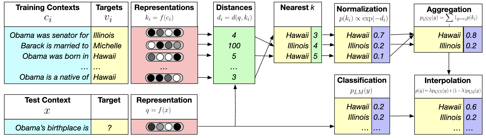

At each decoding step, after interpolation, we get a **final probability distribution over the vocabulary**, and the model outputs the **next token** based on that.

In summary, logit-based RAG utilizes historical data to deduce current states and merges information at the logit level, **ideal for sequence generation**. It focuses on generator training and allows for novel methods that capitalize on probability distributions for future tasks.

### Speculative RAG

Speculative RAG seeks opportunities to **use retrieval** instead of pure generation, aiming to save resources and accelerate response speed. 

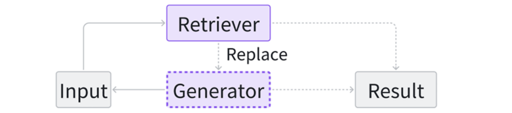

REST ([He et al. 2024](https://arxiv.org/abs/2311.08252)) replaces the small models in speculative decoding with retrieval, enabling the generation of drafts. I think most develop have used the autocomplete function of IDE, for example, VS Code. The REST is applicable to **VS Code-like autocomplete**, especially when we can build a good retrieval datastore (the repo history, similar projects, standard libraries).

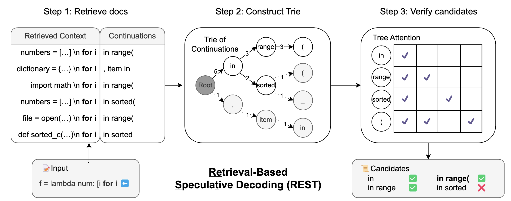

1. Step 1: Retrieve docs → get possible continuations
    
    **The Input prefix** (what the user has typed so far):`f = lambda num: [i for i`, REST queries a code corpus and retrieves several similar contexts. From each retrieved snippet, it extracts the **next few tokens** that followed that context in the corpus.
    
    In the left panel, the retrieved contexts are things like:
    
    - `numbers = [...] \n for i ...`
    - `dictionary = {...} \n for i ...`
    - `import math \n for i ...`
    
    and their **continuations** include patterns such as:
    
    - `in range(`
    - `, item in`
    - `in sorted(`
    
    So at this stage, REST has multiple candidate drafts for what might come next.
    
2. Step 2: Construct a Trie of continuations
    
    Instead of verifying each candidate separately, REST builds a **trie** (prefix tree) over the retrieved continuations.
    
    These continuations share prefixes like:
    
    - 5 of them start with `in`
    - 3 of them then go to `range`
    - 2 of them go to `sorted`
    - …
    
    The trie merges shared parts so verification can be done **once per shared token prefix**, not once per full candidate.
    
3. Verify candidates with the LLM
    
    Now the big LLM acts as verifier and checks which trie paths are consistent with what it would generate next. In the right panel “Tree Attention”, the checkmarks indicate tokens the LLM **accepts** as valid next steps under the model’s probability. All correct tokens from the start will be accepted, and the draft tokens after the first mistake will be rejected.
    
    Result: REST outputs a set of **accepted candidates**, e.g.:
    
    - ✅ `in`
    - ✅ `in range`
    - ❌ `in sorted` (rejected here)
    - ✅ `in range(`
    - …

So the system can safely append **multiple tokens at once** (like `in range(`) if that path is verified, which speeds up decoding.

The key problem of REST is still the high latency, GPTCache ([Bang, 2023](https://aclanthology.org/2023.nlposs-1.24/)) addresses the issue of high latency when using the LLM APIs by building a semantic **cache** for storing LLM responses. COG ([Lan et al. 2023](https://arxiv.org/abs/2307.06962)) decomposes the text generation process into a series of **copy-and-paste** operations, retrieving words or phrases from the documents instead of generating. [Cao et al.](https://arxiv.org/pdf/2402.17532) propose a new paradigm to eliminate the dependence of the final result on the quality of the first-stage retrieved content, replacing generation with directly retrieved phrase-level content

In conclusion, speculative RAG is currently primarily applicable to sequential data. It **decouples the generator and the retriever**, enabling the direct use of pre-trained models as components. Within this paradigm, we can explore a wider range of strategies to effectively utilize the retrieved content.

Apart from the integration methods, the generator is also importatnt. In practice, different generative backbones are used for different scenarios, such as **Transformer-based** models for text-to-text generation ([Vaswani et al. 2017](https://arxiv.org/abs/1706.03762)), **VisualGPT**-style vision–language models for image-to-text tasks ([Chen et al. 2022](https://arxiv.org/abs/2102.10407)), **Google Nano Banana Pro** for text-to-image generation ([Google 2025](https://blog.google/innovation-and-ai/products/nano-banana-pro/)), and **Codex**-style models for text-to-code generation ([Chen et al. 2021](https://arxiv.org/abs/2107.03374)). 

The **Transformer** is the most widely adopted architecture for sequence generation, while there are lots of variants for later work, the key things stay same. The encoder–decoder diagram in this overview provides a helpful visual reference ([Wolfe 2023](https://medium.com/data-science/t5-text-to-text-transformers-part-one-6b655f27c79a)). Conceptually, **the encoder models token-to-token relationships in the input via self-attention**, and **the decoder generates the output autoregressively** by attending to previously generated tokens and to the encoder’s representations, producing the final sequence token by token.

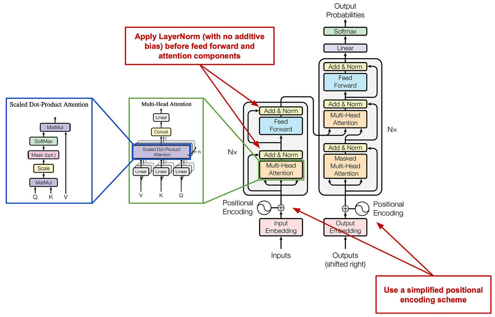

# Enhancement

The quality of **input**, the efficiency of the **retriever**, and the capabilities of the **generator** all define the success of a RAG system. We are now optimizing every part of this pipeline and the whole architecture to achieve higher accuracy and lower costs, including **input enhancement**, **retriever enhancement**, **generator enhancement**, **result enhancement** and **RAG pipeline enhancement**.

This is the overview of all the RAG enhancements mentioned in the [Retrieval-Augmented Generation for AI-Generated Content: A Survey](https://arxiv.org/abs/2402.19473](https://arxiv.org/abs/2402.19473)). Next I’ll use table to help us quickly go through them, if you are interested in which method, just click the link in the Link column.

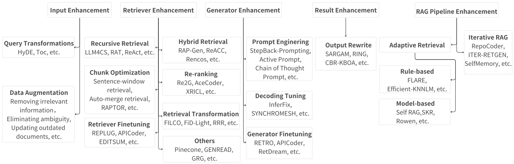

## Input Enhancement

The input fed into the retriever significantly impacts the final outcome of the retrieval stage.

### Query Transformations

**Query transformation** modifies the user's original **query** to better align with the data store, making it easier for the retriever to find relevant results.

| **Method** | **What did it do** | **Link** |
| --- | --- | --- |
| **Query2doc** | Uses the original query to generate a pseudo-document, which is then used as the query for retrieval. | [Paper](https://arxiv.org/abs/2303.07678) |
| **HyDE** | Generates a hypothetical "fake" document to serve as a richer retrieval query. | [Paper](https://arxiv.org/abs/2212.10496) |
| **TOC** | Decomposes ambiguous queries into multiple clear sub-queries for cleaner processing. | [Paper](https://arxiv.org/abs/2310.14628) |
| **RQ-RAG** | Refines complex queries by breaking them down for fine-grained retrieval and synthesizing responses for a coherent answer. | [Paper](https://arxiv.org/abs/2404.00610) |

### Data Augmentation

**Data augmentation** improves the quality or quantity of the **source data** **before** it is even indexed or retrieved. (retrieval model = the pair of encoders: **bi-encoder**)

| **Method** | **What did it do** | **Link** |
| --- | --- | --- |
| **Make-An-Audio** | Generates captions for language-free audio to mitigate data sparsity issues. | [Paper](https://arxiv.org/abs/2301.12661) |
| **ReACC** | Uses techniques like renaming and dead code insertion to pre-train retrieval models. | [Paper](https://arxiv.org/abs/2203.07722) |
| **Telco-RAG** | Applies a specialized vocabulary for 3GPP specifications to match technical user queries. | [Paper](https://arxiv.org/abs/2404.15939) |

## Retriever Enhancement

These methods ensure the retriever finds high-quality, relevant information, which reduces the risk of model hallucinations.

### Recursive Retrieval

Performs multiple search rounds to gather richer and higher-quality context.

| **Method** | **What did it do** | **Link** |
| --- | --- | --- |
| **ReACT** | Uses reasoning chains to break down queries and perform step-by-step retrieval. | [Paper](https://arxiv.org/abs/2210.03629) |
| **RATP** | Selects optimal retrieval content using Monte-Carlo Tree Search simulations. | [Paper](https://arxiv.org/abs/2402.07812) |

### Chunk Optimization

Adjusts how data is split into "chunks" to ensure the retriever finds the best context.

| **Method** | **What did it do** | **Link** |
| --- | --- | --- |
| **Sentence-window** | Fetches small text chunks but returns them with a "window" of surrounding sentences for context. | [Documentation](https://www.google.com/search?q=https://docs.llamaindex.ai/en/stable/examples/node_postprocessor/MetadataReplacementDemo/) |
| **Auto-merge** | Uses a tree structure to retrieve a large parent node if enough small child nodes are found. | [Documentation](https://docs.llamaindex.ai/en/stable/examples/retrievers/auto_merging_retriever/) |
| **RAPTOR** | Recursively clusters and summarizes text until a multi-level tree of knowledge is built. | [Paper](https://arxiv.org/abs/2401.18059) |
| **Prompt-RAG** | Uses a pre-generated table of contents to let the model autonomously pick relevant chapters. | [Paper](https://arxiv.org/abs/2401.11246) |

### Retriever Finetuning

Fine-tunes the retriever model specifically on domain-related data to boost performance.

| **Method** | **What did it do** | **Link** |
| --- | --- | --- |
| **REPLUG** | Updates the retriever model based on the feedback from the generator's final results. | [Paper](https://arxiv.org/abs/2301.12652) |
| **APICoder** | Finetunes on API names and descriptions to improve technical code retrieval. | [Paper](https://arxiv.org/abs/2206.07347) |
| **EDITSUM** | Minimizes distances between summaries during training to improve retrieval accuracy. | [Paper](https://arxiv.org/abs/2308.13775) |

### Hybrid Retrieval

Employs multiple retrieval methods (like keyword + vector search) or sources at once.

| **Method** | **What did it do** | **Link** |
| --- | --- | --- |
| **RAP-Gen** | Uses both dense and sparse retrievers to capture a wider range of relevant documents. | [Paper](https://arxiv.org/abs/2301.13404) |
| **Rencos** | Combines syntactic-level search (sparse) with semantic-level search (dense) for code snippets. | [Paper](https://arxiv.org/abs/1909.11218) |
| **CRAG** | Evaluates document relevance and chooses between local results, web search, or a hybrid of both. | [Paper](https://arxiv.org/abs/2401.15884) |

### Re-ranking

Reorders retrieved items to put the most useful information at the very top.

| **Method** | **What did it do** | **Link** |
| --- | --- | --- |
| **Re2G** | Re-ranks candidates to fix the information loss that happens when text is compressed into vectors. | [Paper](https://arxiv.org/abs/2207.06300) |
| **AceCoder** | Uses a selector to remove redundant code programs and ensure the results are diverse. | [Paper](https://arxiv.org/abs/2303.17780) |
| **XRICL** | Employs a distillation-based re-ranker to pick the best exemplars for in-context learning. | [Paper](https://arxiv.org/abs/2203.06450) |

### Retrieval Transformation

Rephrases or compresses retrieved content so it activates the generator more effectively.

| **Method** | **What did it do** | **Link** |
| --- | --- | --- |
| **FILCO** | Purges unnecessary material from retrieved text to isolate only the useful supporting facts. | [Paper](https://arxiv.org/abs/2311.08377) |
| **FiD-Light** | Compresses the retrieved content into a vector to reduce latency time. | [Paper](https://arxiv.org/abs/2305.13252) |
| **RRR** | Restructures queries and documents using a pre-trained LLM before passing them to the generator. | [Paper](https://arxiv.org/abs/2305.14283) |

### Others

| **Method** | **What did it do** | **Link** |
| --- | --- | --- |
| **Pinecone** | Provides managed vector storage and metadata filtering for efficient document processing. | [Website](https://www.pinecone.io/) |
| **GENREAD** | Replaces traditional retrieval by prompting an LLM to generate its own contextual documents. | [Paper](https://arxiv.org/abs/2209.10063) |
| **Multi-Head** | Uses multiple embedding models to look at a single text chunk from different angles. | [Paper](https://arxiv.org/abs/2406.05085) |

## Generator Enhancement

These methods refine the generator to ensure it produces the best possible final response from the retrieved information.

### Prompt Engineering

Optimizes the way instructions and data are presented to the model.

| **Method** | **What did it do** | **Link** |
| --- | --- | --- |
| **StepBack** | Encourages the model to take a step back and reason from an abstract level for better accuracy. | [Paper](https://arxiv.org/abs/2310.06117) |
| **Active Prompt** | Selects the most useful examples for the model to learn from during generation. | [Paper](https://arxiv.org/abs/2302.12246) |
| **CoT Prompt** | Guides the model to articulate its reasoning process step-by-step. | [Paper](https://arxiv.org/abs/2201.11903) |

### Decoding Tuning

Adjusts how the model picks its final words to ensure diversity and error-free results.

| **Method** | **What did it do** | **Link** |
| --- | --- | --- |
| **InferFix** | Balances the variety and quality of results by adjusting the decoder's temperature (knob). | [Paper](https://arxiv.org/abs/2303.07263) |
| **Synchromesh** | Constrains the model's vocabulary to ensure it only generates code that follows valid rules. | [Paper](https://arxiv.org/abs/2110.03814) |

### Generator Finetuning

Trains the generator to better align with the specific retriever or domain being used.

| **Method** | **What did it do** | **Link** |
| --- | --- | --- |
| **RETRO** | Uses a chunked cross-attention mechanism to blend query and retrieved content during generation. | [Paper](https://arxiv.org/abs/2112.04426) |
| **RetDream** | Finetunes specialized adapters (LoRA) using rendered 3D images to improve visual generation. | [Paper](https://arxiv.org/abs/2402.02972) |

## Result Enhancement

### Output Rewrite

Rewrites the model's final output to ensure it meets the specific needs of the task.

| **Method** | **What did it do** | **Link** |
| --- | --- | --- |
| **SARGAM** | Refines code outputs using a special Transformer to ensure they fit the real-world code context. | [Paper](https://arxiv.org/abs/2306.06490) |
| **RING** | Reranks candidate answers based on the probability scores produced by the generator. | [Paper](https://arxiv.org/abs/2208.11640) |
| **CBR-KBQA** | Aligns generated relations with actual facts stored in a local knowledge graph. | [Paper](https://arxiv.org/abs/2104.08762) |

## RAG Pipeline Enhancement

Optimizes the entire workflow for better performance and lower operational costs.

### Adaptive Retrieval

Determines if retrieval is even necessary for a query, saving resources when the model already knows the answer.

**Rule-based**

Uses fixed logic or probabilities to trigger a search.

| **Method** | **What did it do** | **Link** |
| --- | --- | --- |
| **FLARE** | Actively decides to search based on the probabilities generated during the writing process. | [Paper](https://arxiv.org/abs/2305.06983) |
| **Efficient-KNNLM** | Uses a specific hyperparameter to balance the weight of generation vs. retrieval. | [Paper](https://arxiv.org/abs/2109.04212) |

**Model-based**

Uses another AI model to judge if retrieval is needed.

| **Method** | **What did it do** | **Link** |
| --- | --- | --- |
| **Self RAG** | Uses a specialized token to reflect on whether it needs to fetch external info. | [Paper](https://arxiv.org/abs/2310.11511) |
| **SKR** | Asks the LLM to judge in advance if it can answer the question without extra help. | [Paper](https://arxiv.org/abs/2310.05002) |
| **Rowen** | Translates the question into multiple languages to check for answer consistency before retrieving. | [Paper](https://arxiv.org/abs/2402.10612) |

### Iterative RAG

Progressively refines results by cycling through retrieval and generation multiple times.

| **Method** | **What did it do** | **Link** |
| --- | --- | --- |
| **RepoCoder** | Refines queries using previously generated code to better find information across a project. | [Paper](https://arxiv.org/abs/2303.12570) |
| **ITER-RETGEN** | Uses the generator's output to find gaps in its knowledge and triggers new searches to fill them. | [Paper](https://arxiv.org/abs/2305.15294) |
| **SelfMemory** | Forms an expansive memory pool that the model uses to inform its next writing cycle. | [Paper](https://arxiv.org/abs/2305.02437) |

# Applications

The RAG paradigm has expanded far beyond text-to-text tasks, proving its versatility across diverse modalities and specialized scientific domains. While the core principles remain consistent, different tasks require specific adaptations in how retrievers and generators interact.

## RAG for Text

Text generation is the most established application of RAG, focusing on tasks where high-quality datasets and real-time knowledge are critical.

### Question Answering (QA)

QA systems use RAG to provide accurate answers by pulling from massive text collections or structured knowledge bases.

| **Method** | **What did it do** | **Link** |
| --- | --- | --- |
| **FiD** | Processes retrieved paragraphs and titles alongside the query through distinct encoders. | [Paper](https://arxiv.org/abs/2007.01282) |
| **RETRO** | Uses attention mechanisms to integrate relevant retrieved documents directly within the model's internal layers. | [Paper](https://arxiv.org/abs/2112.04426) |
| **TOG** | Introduces a knowledge graph-augmented LLM framework that fosters interaction between LLMs and the graph using beam search. | [Paper](https://arxiv.org/abs/2307.07697) |
| **RAG-end2end** | Conducts simultaneous training of the retriever (DPR) and the generator (BART) to optimize end-to-end QA performance. | [Paper](https://arxiv.org/abs/2210.02627) |

### Summarization & Reasoning

These tasks focus on distilling essential information from long texts or performing human-like inference using external knowledge.

| **Method** | **What did it do** | **Link** |
| --- | --- | --- |
| **Unlimiformer** | Addresses input length constraints by retrieving and utilizing the top-k most relevant hidden states to handle longer inputs. | [Paper](https://arxiv.org/abs/2305.01625) |
| **KG-BART** | Expands the conceptual landscape by incorporating interrelations among diverse concepts within a knowledge graph. | [Paper](https://arxiv.org/abs/2009.12677) |
| **RPRR** | Employs a Retrieve-Plan-Retrieve-Read approach to overcome context window constraints and generate high-quality Wikipedia documents. | [Paper](https://arxiv.org/abs/2402.18264) |

## RAG for Code

RAG enhances software engineering by providing context from local repositories, private libraries, or global documentation.

### Code Generation & Completion

These systems help developers write code by retrieving similar snippets, API details, or documentation.

| **Method** | **What did it do** | **Link** |
| --- | --- | --- |
| **RepoCoder** | Uses an iterative retrieval-generation approach to utilize dispersed information across an entire repository. | [Paper](https://arxiv.org/abs/2303.12570) |
| **ToolCoder** | Performs online searches or offline retrievals to fill in blanks with API calls when it encounters special tokens. | [Paper](https://arxiv.org/abs/2305.04032) |
| **SKCODER** | Retrieves relevant code snippets to produce a sketch template used for the final code generation. | [Paper](https://arxiv.org/abs/2302.06144) |
| **De-Hallucinator** | Retrieves API references using first-time generated contents, then conducts query-based RAG for improved completion. | [Paper](https://arxiv.org/abs/2401.01701) |

### Program Repair & Parsing

RAG helps fix buggy code and converts natural language into structured formats like SQL.

| **Method** | **What did it do** | **Link** |
| --- | --- | --- |
| **RTLFixer** | Leverages ReAct to implement an agent that iteratively retrieves errors and paired solutions to fix Verilog code. | [Paper](https://arxiv.org/abs/2311.16543) |
| **Synchromesh** | Retrieves similar NL and SQL to build prompts, then conducts constrained decoding to enforce syntactic and semantic constraints. | [Paper](https://arxiv.org/abs/2110.03814) |
| **Refsql** | Uses a structure-enhanced retriever with schema linking and Mahalanobis contrastive learning to improve text-to-SQL generation. | [Paper](https://arxiv.org/abs/2308.15363) |

## RAG for Image & Video

In visual tasks, RAG helps create content with rare subjects, provides global semantic guidance, and reduces computational costs.

| **Method** | **What did it do** | **Link** |
| --- | --- | --- |
| **Re-imagen** | Extends retrieval to image-text pairs for text-to-image generation, using interleaved guidance to balance prompts and retrieval. | [Paper](https://arxiv.org/abs/2209.14491) |
| **RetrieveGAN** | Boosts image relevance and precision by incorporating retrieved image patches and bounding boxes into the generator's input stage. | [Paper](https://arxiv.org/abs/2007.08513) |
| **CARE** | Combines frame, audio, and retrieved text to provide both global and local semantic guidance for video captioning. | [Paper](https://ieeexplore.ieee.org/document/10129208) |
| **RAG-Driver** | Grounds multi-modal large language models in retrieved expert demonstrations to produce driving action explanations. | [Paper](https://arxiv.org/abs/2402.10828) |

## RAG for Science & 3D

Interdisciplinary applications use RAG to navigate complex technical databases for medical, molecular, and mathematical tasks.

| **Method** | **What did it do** | **Link** |
| --- | --- | --- |
| **RetMol** | Integrates a lightweight retrieval mechanism and molecular strings to fuse exemplar molecules with the input. | [Paper](https://arxiv.org/abs/2208.11126) |
| **Chat-Orthopedist** | Enhances ChatGPT with a retrieval mechanism focused on scoliosis, using a knowledge base for precise responses. | [Paper](https://dl.acm.org/doi/10.1145/3584371.3612956) |
| **LeanDojo** | Boosts theorem proving by choosing relevant premises from extensive mathematical libraries. | [Paper](https://arxiv.org/abs/2306.15626) |
| **ReMoDiffuse** | Retrieves relevant motion entities and uses semantic-modulated attention to generate accurate 3D motions. | [Paper](https://arxiv.org/abs/2304.01116) |

# Discuss

## Limitations

Despite the widespread adoption of RAG, it suffers from several limitations by nature.

- **Noises in Retreval results**: Information loss during search can lead to irrelevant or misleading content. Interestingly, some research suggests minor noise might actually improve generation diversity.
- **Extra overhead**: Retrieval and interaction processes increase system latency, making RAG difficult to use in real-time services. Scaling data sources also increases storage and access complexity.
- **The Gap Between Retrievers and Generators**: The two modules retriever and generator often have different objectives and latent spaces, requiring meticulous design to bridge their interaction.
- **Increased System Complexity**: Implementing RAG adds numerous hyperparameters to tune (like top-k selection), which can improve attribution but harm output fluency.
- **Lengthy Context**: Query-based RAG significantly lengthens the input context, which can be problematic for models with limited context windows and slows down generation.

## Potential Future Directions

Research is moving toward making RAG systems more autonomous, flexible, and integrated with other advanced AI techniques.

- **Novel Augmentation Foundations**: Investigating more advanced interaction patterns between retrievers and generators to fully unlock RAG's potential.
- **Flexible Pipelines**: Moving away from static workflows toward recursive, adaptive, and iterative RAG subsystems that can tackle complex tasks.
- **Domain-Specific RAG**: Designing techniques tailored to the unique characteristics of specialized fields rather than applying RAG naively.
- **Knowledge Updating**: Shifting toward RAG systems that continuously expand and update their retrieval sources with real-time and long-tail knowledge.
- **Long-Context Synergy**: Rather than being replaced by long-context models like Gemini 1.5, RAG is expected to benefit from them by managing dynamic information more flexibly.
- **Agentic RAG**: Integrating AI agents with autonomous decision-making and planning capabilities to transform linear RAG into a dynamic **reasoning-planning-acting-iterating** loop.

# Takeaways

In this post, we walked through retrieval-augmented generation (RAG) from a system-level perspective, mainly following the survey [“Retrieval-Augmented Generation for AI-Generated Content: A Survey.”](https://arxiv.org/abs/2402.19473) 

We first framed the **core motivation** of RAG in the AIGC era, how retrieval helps generative models on external knowledge.

Then, we organized the fundamental RAG pipeline into three parts: **indexing**, **retrieval**, and **generation**. And we summarized different retrievers (**sparse**, **dense**, and **beyond**) and different generators (**query-based**, **latent representation-based**, **logit-based**, **speculative**). 

Next, we reviewed a broad set of **enhancements** that improve RAG effectiveness and efficiency. To make the understanding more concrete, we also surveyed representative applications across text, code, vision, and scientific domains by briefly introduction and listing the corresponding paper link. 

Then, we had a short discussion about the **main** **limitations** that still hold RAG back in practice and we outlined **future directions** that feel especially promising.

Finally, we can say, RAG is a good tool to improve the LLMs. Most importantly, RAG makes our workflow feel more honest: when the answer needs to match a specific PDF definition or a professor’s phrasing, we don’t want creativity, we want evidence, and we want the model to show its receipts.

# References

[1] Penghao Zhao, et al. ["Retrieval-Augmented Generation for AI-Generated Content: A Survey."](https://link.springer.com/article/10.1007/s41019-025-00335-5). Data Science and Engineering 2026.

[2] OpenAI Josh Achiam, et al. ["GPT-4 Technical Report."](https://arxiv.org/abs/2303.08774). arXiv preprint arXiv:2303.08774 (2023).

[3] A. Ramesh, et al. ["Zero-Shot Text-to-Image Generation."](https://arxiv.org/abs/2102.12092). International Conference on Machine Learning 2021.

[4] Vladimir Karpukhin, et al. ["Dense Passage Retrieval for Open-Domain Question Answering."](https://arxiv.org/abs/2004.04906). Conference on Empirical Methods in Natural Language Processing 2020.

[5] Akari Asai, et al. ["Self-RAG: Learning to Retrieve, Generate, and Critique through Self-Reflection."](https://arxiv.org/abs/2310.11511). International Conference on Learning Representations 2023.

[6] Yunfan Gao, et al. ["Retrieval-Augmented Generation for Large Language Models: A Survey."](https://arxiv.org/abs/2312.10997). arXiv preprint arXiv:2312.10997 (2023).

[7] Jacob Devlin, et al. ["BERT: Pre-training of Deep Bidirectional Transformers for Language Understanding."](https://arxiv.org/abs/1810.04805). North American Chapter of the Association for Computational Linguistics 2019.

[8] Zhangyin Feng, et al. ["CodeBERT: A Pre-Trained Model for Programming and Natural Languages."](https://arxiv.org/abs/2002.08155). Findings 2020.

[9] Alec Radford, et al. ["Learning Transferable Visual Models From Natural Language Supervision."](https://arxiv.org/abs/2103.00020). International Conference on Machine Learning 2021.

[10] Lee Xiong, et al. ["Approximate Nearest Neighbor Negative Contrastive Learning for Dense Text Retrieval."](https://arxiv.org/abs/2007.00808). International Conference on Learning Representations 2020.

[11] Wu Li, et al. ["Learning Balanced Tree Indexes for Large-Scale Vector Retrieval."](https://dl.acm.org/doi/10.1145/3580305.3599406). Knowledge Discovery and Data Mining 2023.

[12] Yury Malkov, et al. ["Efficient and Robust Approximate Nearest Neighbor Search Using Hierarchical Navigable Small World Graphs."](https://arxiv.org/abs/1603.09320). IEEE Transactions on Pattern Analysis and Machine Intelligence 2016.

[13] Suhas Jayaram Subramanya, et al. ["DiskANN : Fast Accurate Billion-point Nearest Neighbor Search on a Single Node."](https://papers.nips.cc/paper_files/paper/2019/hash/09853c7fb1d3f8ee67a61b6bf4a7f8e6-Abstract.html). preprint (2019).

[14] Qi Chen, et al. ["SPANN: Highly-efficient Billion-scale Approximate Nearest Neighbor Search."](https://arxiv.org/abs/2111.08566). arXiv preprint arXiv:2111.08566 (2021).

[15] Shirley Anugrah Hayati, et al. ["Retrieval-Based Neural Code Generation."](https://arxiv.org/abs/1808.10025). Conference on Empirical Methods in Natural Language Processing 2018.

[16] Sebastian Borgeaud, et al. ["Improving language models by retrieving from trillions of tokens."](https://arxiv.org/abs/2112.04426). International Conference on Machine Learning 2021.

[17] Urvashi Khandelwal, et al. ["Generalization through Memorization: Nearest Neighbor Language Models."](https://arxiv.org/abs/1911.00172). International Conference on Learning Representations 2019.

[18] Zhenyu He, et al. ["REST: Retrieval-Based Speculative Decoding."](https://arxiv.org/abs/2311.08252). North American Chapter of the Association for Computational Linguistics 2023.

[19] Fu Bang. ["GPTCache: An Open-Source Semantic Cache for LLM Applications Enabling Faster Answers and Cost Savings."](https://aclanthology.org/2023.nlposs-1.24/). NLPOSS (2023).

[20] Tian Lan, et al. ["Copy is All You Need."](https://arxiv.org/abs/2307.06962). International Conference on Learning Representations 2023.

[21] Bowen Cao, et al. ["Retrieval is Accurate Generation."](https://arxiv.org/abs/2402.17532). International Conference on Learning Representations 2024.

[22] Ashish Vaswani, et al. ["Attention is All you Need."](https://arxiv.org/abs/1706.03762). Neural Information Processing Systems 2017.

[23] Jun Chen, et al. ["VisualGPT: Data-efficient Adaptation of Pretrained Language Models for Image Captioning."](https://arxiv.org/abs/2102.10407). Computer Vision and Pattern Recognition 2021.

[24] Mark Chen, et al. ["Evaluating Large Language Models Trained on Code."](https://arxiv.org/abs/2107.03374). arXiv preprint arXiv:2107.03374 (2021).

[25] Penghao Zhao, et al. ["Retrieval-Augmented Generation for AI-Generated Content: A Survey."](https://arxiv.org/abs/2402.19473). Data Science and Engineering 2024.

[26] Liang Wang, et al. ["Query2doc: Query Expansion with Large Language Models."](https://arxiv.org/abs/2303.07678). Conference on Empirical Methods in Natural Language Processing 2023.

[27] Luyu Gao, et al. ["Precise Zero-Shot Dense Retrieval without Relevance Labels."](https://arxiv.org/abs/2212.10496). Annual Meeting of the Association for Computational Linguistics 2022.

[28] Tengxiao Liu, et al. ["Plan, Verify and Switch: Integrated Reasoning with Diverse X-of-Thoughts."](https://arxiv.org/abs/2310.14628). Conference on Empirical Methods in Natural Language Processing 2023.

[29] Chi-Min Chan, et al. ["RQ-RAG: Learning to Refine Queries for Retrieval Augmented Generation."](https://arxiv.org/abs/2404.00610). arXiv preprint arXiv:2404.00610 (2024).

[30] Rongjie Huang, et al. ["Make-An-Audio: Text-To-Audio Generation with Prompt-Enhanced Diffusion Models."](https://arxiv.org/abs/2301.12661). International Conference on Machine Learning 2023.

[31] Shuai Lu, et al. ["ReACC: A Retrieval-Augmented Code Completion Framework."](https://arxiv.org/abs/2203.07722). Annual Meeting of the Association for Computational Linguistics 2022.

[32] Andrei-Laurentiu Bornea, et al. ["Telco-RAG: Navigating the Challenges of Retrieval Augmented Language Models for Telecommunications."](https://arxiv.org/abs/2404.15939). Global Communications Conference 2024.

[33] Shunyu Yao, et al. ["ReAct: Synergizing Reasoning and Acting in Language Models."](https://arxiv.org/abs/2210.03629). International Conference on Learning Representations 2022.

[34] T. Pouplin, et al. ["Retrieval Augmented Thought Process for Private Data Handling in Healthcare.."](https://arxiv.org/abs/2402.07812). IEEE journal of biomedical and health informatics 2024.

[35] Parth Sarthi, et al. ["RAPTOR: Recursive Abstractive Processing for Tree-Organized Retrieval."](https://arxiv.org/abs/2401.18059). International Conference on Learning Representations 2024.

[36] Bongsu Kang, et al. ["Prompt-RAG: Pioneering Vector Embedding-Free Retrieval-Augmented Generation in Niche Domains, Exemplified by Korean Medicine."](https://arxiv.org/abs/2401.11246). arXiv preprint arXiv:2401.11246 (2024).

[37] Weijia Shi, et al. ["REPLUG: Retrieval-Augmented Black-Box Language Models."](https://arxiv.org/abs/2301.12652). North American Chapter of the Association for Computational Linguistics 2023.

[38] Kai Li, et al. ["On the Use of Deep Mask Estimation Module for Neural Source Separation Systems."](https://arxiv.org/abs/2206.07347). Interspeech 2022.

[39] L. Cosentino, et al. ["Gamma—Ray Counters to Monitor Radioactive Waste Packages in the MICADO Project."](https://arxiv.org/abs/2105.02641). arXiv preprint arXiv:2105.02641 (2021).

[40] A. Haupt, et al. ["Opaque Contracts."](https://arxiv.org/abs/2301.13404). arXiv preprint arXiv:2301.13404 (2023).

[41] Shikhar Vashishth, et al. ["Attention Interpretability Across NLP Tasks."](https://arxiv.org/abs/1909.11218). arXiv preprint arXiv:1909.11218 (2019).

[42] Shi-Qi Yan, et al. ["Corrective Retrieval Augmented Generation."](https://arxiv.org/abs/2401.15884). arXiv preprint arXiv:2401.15884 (2024).

[43] Michael R. Glass, et al. ["Re2G: Retrieve, Rerank, Generate."](https://arxiv.org/abs/2207.06300). North American Chapter of the Association for Computational Linguistics 2022.

[44] Jia Li, et al. ["AceCoder: Utilizing Existing Code to Enhance Code Generation."](https://arxiv.org/abs/2303.17780). arXiv preprint arXiv:2303.17780 (2023).

[45] Zhao-hui Li, et al. ["Low-Complexity Multicast Beamforming for Millimeter Wave Communications."](https://arxiv.org/abs/2203.06450). IEEE Transactions on Vehicular Technology 2020.

[46] Orion Weller, et al. ["“According to . . . ”: Prompting Language Models Improves Quoting from Pre-Training Data."](https://arxiv.org/abs/2305.13252). Conference of the European Chapter of the Association for Computational Linguistics 2023.

[47] Xinbei Ma, et al. ["Query Rewriting for Retrieval-Augmented Large Language Models."](https://arxiv.org/abs/2305.14283). arXiv preprint arXiv:2305.14283 (2023).

[48] W. Yu, et al. ["Generate rather than Retrieve: Large Language Models are Strong Context Generators."](https://arxiv.org/abs/2209.10063). International Conference on Learning Representations 2022.

[49] Maciej Besta, et al. ["Multi-Head RAG: Solving Multi-Aspect Problems with LLMs."](https://arxiv.org/abs/2406.05085). arXiv preprint arXiv:2406.05085 (2024).

[50] Huaixiu Steven Zheng, et al. ["Take a Step Back: Evoking Reasoning via Abstraction in Large Language Models."](https://arxiv.org/abs/2310.06117). International Conference on Learning Representations 2023.

[51] Shizhe Diao, et al. ["Active Prompting with Chain-of-Thought for Large Language Models."](https://arxiv.org/abs/2302.12246). Annual Meeting of the Association for Computational Linguistics 2023.

[52] Jason Wei, et al. ["Chain of Thought Prompting Elicits Reasoning in Large Language Models."](https://arxiv.org/abs/2201.11903). Neural Information Processing Systems 2022.

[53] Ma Jin, et al. ["InferFix: End-to-End Program Repair with LLMs."](https://arxiv.org/abs/2303.07263). arXiv preprint arXiv:2303.07263 (2023).

[54] Arthur Conmy, et al. ["Stylegan-Induced Data-Driven Regularization for Inverse Problems."](https://arxiv.org/abs/2110.03814). IEEE International Conference on Acoustics, Speech, and Signal Processing 2021.

[55] Junyoung Seo, et al. ["Retrieval-Augmented Score Distillation for Text-to-3D Generation."](https://arxiv.org/abs/2402.02972). International Conference on Machine Learning 2024.

[56] Changshuo Liu, et al. ["Automated Code Editing With Search-Generate-Modify."](https://arxiv.org/abs/2306.06490). IEEE Transactions on Software Engineering 2023.

[57] Harshit Joshi, et al. ["Repair Is Nearly Generation: Multilingual Program Repair with LLMs."](https://arxiv.org/abs/2208.11640). AAAI Conference on Artificial Intelligence 2022.

[58] Rajarshi Das, et al. ["Case-based Reasoning for Natural Language Queries over Knowledge Bases."](https://arxiv.org/abs/2104.08762). Conference on Empirical Methods in Natural Language Processing 2021.

[59] Zhengbao Jiang, et al. ["Active Retrieval Augmented Generation."](https://arxiv.org/abs/2305.06983). Conference on Empirical Methods in Natural Language Processing 2023.

[60] Junxian He, et al. ["Efficient Nearest Neighbor Language Models."](https://arxiv.org/abs/2109.04212). Conference on Empirical Methods in Natural Language Processing 2021.

[61] Hanxing Ding, et al. ["Rowen: Adaptive Retrieval-Augmented Generation for Hallucination Mitigation in LLMs."](https://arxiv.org/abs/2402.10612). SIGIR-AP 2024.

[62] Fengji Zhang, et al. ["RepoCoder: Repository-Level Code Completion Through Iterative Retrieval and Generation."](https://arxiv.org/abs/2303.12570). Conference on Empirical Methods in Natural Language Processing 2023.

[63] Zhihong Shao, et al. ["Enhancing Retrieval-Augmented Large Language Models with Iterative Retrieval-Generation Synergy."](https://arxiv.org/abs/2305.15294). Conference on Empirical Methods in Natural Language Processing 2023.

[64] Xin Cheng, et al. ["Lift Yourself Up: Retrieval-augmented Text Generation with Self Memory."](https://arxiv.org/abs/2305.02437). Neural Information Processing Systems 2023.

[65] Gautier Izacard, et al. ["Leveraging Passage Retrieval with Generative Models for Open Domain Question Answering."](https://arxiv.org/abs/2007.01282). Conference of the European Chapter of the Association for Computational Linguistics 2020.

[66] Jiashuo Sun, et al. ["Think-on-Graph: Deep and Responsible Reasoning of Large Language Model on Knowledge Graph."](https://arxiv.org/abs/2307.07697). International Conference on Learning Representations 2023.

[67] Shamane Siriwardhana, et al. ["Improving the Domain Adaptation of Retrieval Augmented Generation (RAG) Models for Open Domain Question Answering."](https://arxiv.org/abs/2210.02627). Transactions of the Association for Computational Linguistics 2022.

[68] Amanda Bertsch, et al. ["Unlimiformer: Long-Range Transformers with Unlimited Length Input."](https://arxiv.org/abs/2305.01625). Neural Information Processing Systems 2023.

[69] Ye Liu, et al. ["KG-BART: Knowledge Graph-Augmented BART for Generative Commonsense Reasoning."](https://arxiv.org/abs/2009.12677). AAAI Conference on Artificial Intelligence 2020.

[70] Jiebin Zhang, et al. ["WIKIGENBENCH: Exploring Full-length Wikipedia Generation under Real-World Scenario."](https://arxiv.org/abs/2402.18264). International Conference on Computational Linguistics 2024.

[71] Kechi Zhang, et al. ["ToolCoder: Teach Code Generation Models to use API search tools."](https://arxiv.org/abs/2305.04032). arXiv preprint arXiv:2305.04032 (2023).

[72] Jia Li, et al. ["SkCoder: A Sketch-based Approach for Automatic Code Generation."](https://arxiv.org/abs/2302.06144). International Conference on Software Engineering 2023.

[73] A. Eghbali, et al. ["De-Hallucinator: Mitigating LLM Hallucinations in Code Generation Tasks via Iterative Grounding."](https://arxiv.org/abs/2401.01701). arXiv preprint arXiv:2401.01701 (2024).

[74] Yun-Da Tsai, et al. ["RTLFixer: Automatically Fixing RTL Syntax Errors with Large Language Models."](https://arxiv.org/abs/2311.16543). Design Automation Conference 2023.

[75] Dawei Gao, et al. ["Text-to-SQL Empowered by Large Language Models: A Benchmark Evaluation."](https://arxiv.org/abs/2308.15363). Proceedings of the VLDB Endowment 2023.

[76] Wenhu Chen, et al. ["Re-Imagen: Retrieval-Augmented Text-to-Image Generator."](https://arxiv.org/abs/2209.14491). International Conference on Learning Representations 2022.

[77] Hung-Yu Tseng, et al. ["RetrieveGAN: Image Synthesis via Differentiable Patch Retrieval."](https://arxiv.org/abs/2007.08513). European Conference on Computer Vision 2020.

[78] Jianhao Yuan, et al. ["RAG-Driver: Generalisable Driving Explanations with Retrieval-Augmented In-Context Learning in Multi-Modal Large Language Model."](https://arxiv.org/abs/2402.10828). Robotics: Science and Systems 2024.

[79] Zichao Wang, et al. ["Retrieval-based Controllable Molecule Generation."](https://arxiv.org/abs/2208.11126). International Conference on Learning Representations 2022.

[80] Wenqi Shi, et al. ["Retrieval-Augmented Large Language Models for Adolescent Idiopathic Scoliosis Patients in Shared Decision-Making."](https://dl.acm.org/doi/10.1145/3584371.3612956). ACM International Conference on Bioinformatics, Computational Biology and Biomedicine 2023.

[81] Kaiyu Yang, et al. ["LeanDojo: Theorem Proving with Retrieval-Augmented Language Models."](https://arxiv.org/abs/2306.15626). Neural Information Processing Systems 2023.

[82] Mingyuan Zhang, et al. ["ReMoDiffuse: Retrieval-Augmented Motion Diffusion Model."](https://arxiv.org/abs/2304.01116). IEEE International Conference on Computer Vision 2023.

[83] Penghao Zhao, et al. ["Retrieval-Augmented Generation for AI-Generated Content: A Survey."](https://arxiv.org/abs/2402.19473). Data Science and Engineering 2024.