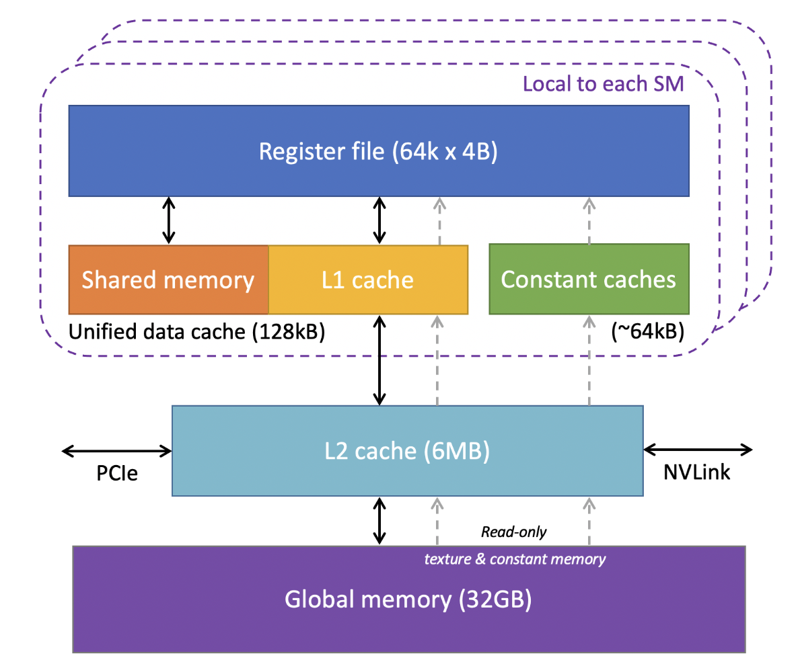
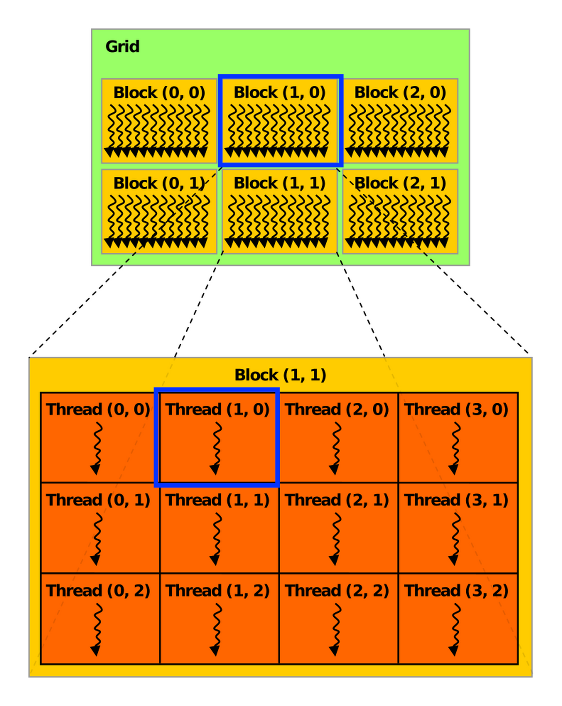
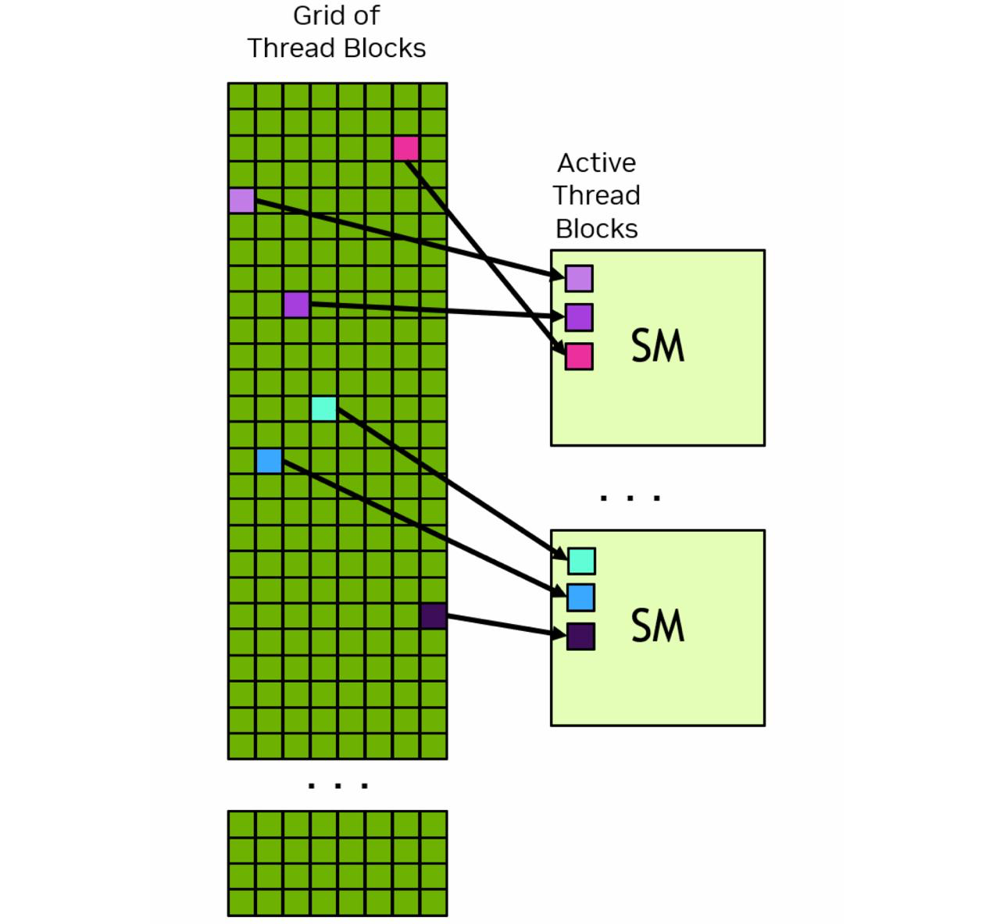
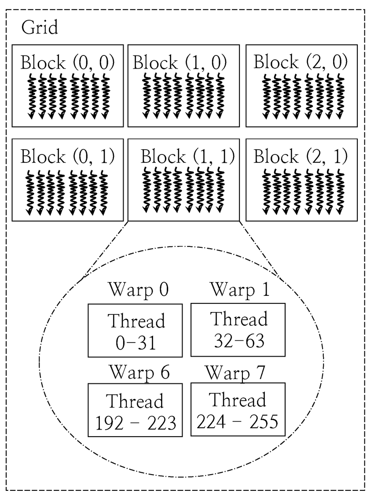

In this post, I’ll walk through GPUs and CUDA. Hope it helps with my final exam and AI learning… The full name of **GPU** is **Graphics Processing Unit**. 

Looking back at its history. GPU first appeared as fixed-function hardware to speed up parallel work in real-time 3D graphics. Over time, GPUs became more programmable. By 2003, parts of the graphics pipeline were fully programmable, running custom code in parallel for many elements of a 3D scene or an image.

In 2006, NVIDIA introduced **CUDA** (**Compute Unified Device Architecture**), which allow developers use GPUs for general computing, not just graphics. Since then, CUDA and GPU computing have accelerated many workloads. Recently, AI is the most common usage domain of GPU, and GPU is used to help drive major advances in AI, from image classification to generative models such as diffusion models and large language models.

We can’t avoid mentioning CPU when introducing GPU. I still remember how shock I was the first time I watched this video: [NVIDIA: Adam & Jamie draw a MONA LISA in 80 milliseconds!](https://www.youtube.com/watch?v=fKK933KK6Gg) The output of the GPU demo genuinely blew my mind. Compared to CPU, a GPU provides much higher **instruction throughtput** and **memory bandwidth** (if you don’t understand yet, that’s okk, we’ll explain it later). Other computing devices, like FPGAs, are also very energy efficient, but offer much less **programming flexibility** than GPUs. 

GPUs and CPUs are designed with different goals in mind. CPU is designed to excel at executing a serial sequence of operations as fast as possible, we call this execution **a thread**, and CPU can execute a few **tens of** these threads in parallel. In contrast, GPU is designed to excel at executing **thousands of** threads in parallel. Trading lower single-thread performance for much higher overall throughput.

<aside>

**What is a thread?**

A thread is a **single line of execution**, one ordered stream of instructions that a processor runs, step by step. For example, if we want to add two arrays `A` and `B` to produce `C`, one GPU thread responsible for index `i` might execute this instruction stream:

1. set `i = thread_id`
2. read `A[i]`
3. read `B[i]`
4. compute `c = A[i] + B[i]`
5. write `c` to `C[i]`

This is **serial** because, inside one thread, these steps happen in a fixed order.

</aside>

Arithmetic test is a good example to understand the difference between CPU and GPU. **A CPU** is like hiring a few tens of college students to take the test, each student is smart and can handle tricky instructions. They can switch between different question types quickly, but there aren’t many of them. **A GPU** is like asking thousands of primary school students to do it in parallel, which is exactly the right fit. Each of them can do simple operations, and if the test has lots of similar questions, they finish incredibly fast together. 

More concretely, GPUs are specialized for highly parallel computations and devote more chip space to data processing units so lots of simple workers doing math at the same time, while CPUs dedicate more chip space to **data caching** and **flow control**, so each worker individually fast. The following figure shows an example distribution of chip resources for a CPU versus a GPU.


# Programming Model

Now that we’ve basically seen what’s GPU and why GPUs achieve high throughput. The next step is understanding how we actually program this hardware. We can view **GPU** as a **piano**. It just has the capability to play complex music. And **CUDA is the Sheet Music**. If we have a piano but no sheet music, the piano just sits there. We can’t just yell "Play Mozart!" at a piano. We have to provide the specific notes in a language the piano understands. **CUDA is that language.**

Concretely, CUDA provides a programming model that maps directly onto the GPU’s execution structure: we write one sheet music (the kernel), then launch to play it across a grid of thread blocks so thousands of threads can work in parallel.

## Heterogeneous Systems

Refer to [NVIDIA Cuda Programming Guide](https://docs.nvidia.com/cuda/cuda-programming-guide/01-introduction/programming-model.html). There are lots of technical terms we need to master about CUDA. The CUDA programming model assumes a **heterogeneous computing system**, which means a system that includes both GPUs and CPUs. The CPU and the memory directly connected to it are called the **host** and **host memory**, respectively. A GPU and the memory directly connected to it are referred to as the **device** and **device memory**, respectively. 

CUDA applications execute some part of their code on the GPU, but applications always start execution on the CPU. The host code, which is the code that runs on the CPU, can use CUDA APIs to **copy data between the host memory and device memory**, start code executing on the GPU, and wait for data copies or GPU code to complete. 

The CPU and GPU can both be executing code simultaneously, and best performance is usually found by maximizing utilization of both CPUs and GPUs. The code an application executes on the GPU is referred to as **device code**, and a function that is invoked for execution on the GPU is called a **kernel**. The act of starting a kernel running is called **launching the kernel**. A kernel launch can be thought of as starting many threads executing the kernel code in parallel on the GPU. GPU threads operate similarly to threads on CPUs, though there are some differences.

<aside>

Technical terms: 

- **host** → CPU, **host memory** → CPU memory
- **device** → GPU, **device memory** → GPU memory
- **device code** → code executes on the GPU
- **kernel** → a function that is invoked on CPU for execution on the GPU
- **launch the kernel** →the act of starting a kernel running
</aside>

## GPU Hardware Model

Like any programming model, CUDA relies on a conceptual model of the underlying hardware. For the purposes of CUDA programming, the GPU can be considered to be a collection of **Streaming Multiprocessors (SMs)** which are organized into groups called **Graphics Processing Clusters (GPCs)**. Each SM contains a local **register file**, a unified data cache, and a number of functional units that perform computations. The unified data cache provides the physical resources for **shared memory** and **L1 cache**. The allocation of the unified data cache to L1 and shared memory can be configured at runtime. 

The sizes of different types of memory and the number of functional units within an SM can vary across GPU architectures. For example, the following figure is the GPU memory levels and sizes for the NVIDIA Tesla V100 from [Cornell Virtual Workshop](https://cvw.cac.cornell.edu/gpu-architecture/gpu-memory/memory_levels). 

At the bottom of this figure is **global memory for VRAM**, implemented as **HBM2 DRAM** on V100 with **32GB capacity** and about **900 GB/s bandwidth**, this is where large tensors (weights and activations) live if we use it in Machine Learning domain. Above VRAM is a GPU-wide **L2 cache** of 6MB, shared by all SMs and used to reduce expensive HBM accesses. Inside each **SM**, the fastest storage is the **register file**: V100 has **64K 4 Byte registers per SM** (i.e., 64k × 4B ≈ 256KB per SM) for per-thread variables and accumulators. Also per-SM is an on-chip SRAM pool where **shared memory and L1 cache share a combined 128KB unified data cache**. We can assign **96KB as shared memory** because it’s programmer controlled, so the left **32 KB** is **L1 cache**, and it’s hardware controlled. Finally, there are ~64KB **constant caches** for small read-only data accessed efficiently by many threads.



The actual hardware layout of a GPU may vary. These differences do not affect correctness of software written using the CUDA programming model. 

### Grid, Block, Thread

When an application launches a kernel, it does so with many threads, often millions of threads. These threads are organized into blocks. Thread blocks are organized into a **grid**. All the thread blocks in a grid have the same size and dimensions. The following figure from the definition of thread block from [HANDWIKI](https://handwiki.org/wiki/Thread_block) shows an illustration of a grid of thread blocks. Actually, thread blocks and grids may be 1, 2, or 3 dimensional.

In a 2D CUDA grid, the GPU organizes work like a massive spreadsheet of data. For **Block (1, 0)**, the `blockIdx.x = 1` and `blockIdx.y = 0` act as the coordinates for the entire grid, placing them in the second column of the first row of the global grid. Inside that group, **Thread (1, 0)** is identified by `threadIdx.x = 1` and `threadIdx.y = 0`, marking it as the second thread in the first row of that specific block.



When a kernel is launched, it is launched using a specific **execution configuration** which **specifies the grid and thread block dimensions**. The execution configuration may also include optional parameters such as cluster size, stream, and SM configuration settings, which will be introduced later. 

Using built-in variables like `threadIdx`, `blockDim`, and `blockIdx`, each thread executing the kernel can determine its location within its containing block and the location of its block within the containing grid. 

If the blocks and threads are 2-dimension, the thread coordinate `(x, y)` is easily computed based on the previous figure: 

```cpp
int x = blockIdx.x * blockDim.x + threadIdx.x;
int y = blockIdx.y * blockDim.y + threadIdx.y;
```

If they are 1-dimension, the thread id can be computed as:

```cpp
int i = blockIdx.x * blockDim.x + threadIdx.x;
```

This is the schematic illustration of the common indexing pattern for a 1-dimention array in CUDA kernels. 

.png)

This computed identity is frequently used to determine what data or operations a thread is responsible for. All threads of a block are executed in **a single SM**. This allows threads within a thread block to communicate and synchronize with each other through shared memory efficiently. Threads within a thread block all have access to the on-chip shared memory, which can be used for exchanging information between threads of a block.

A grid may consist of millions of thread blocks, while the GPU executing the grid may have only tens or hundreds of SMs. All threads of a block are executed by a single SM and, in most cases, run to completion on that SM.

The next figure shows an example of how thread blocks from a grid are assigned to an SM.
The CUDA programming model enables arbitrarily large grids to run on GPUs of any size, whether it has only one SM or thousands of SMs. To achieve this, the CUDA programming model, with some exceptions, requires that there be **no data dependencies** between threads in different thread blocks.
That is, **a thread should not depend on results from or synchronize with a thread in a different block of the same grid.** All the threads within a block run on the same SM at the same time. Different blocks within the grid are scheduled among the available SMs and may be executed in any order. In short, the CUDA programming model requires that it be possible to execute blocks in any order, in parallel or in series. Doesn’t matter.



Each SM has one or more active thread blocks. In this example, each SM has three thread blocks scheduled simultaneously. 

### Warps, SIMT

Within a thread block, threads are organized into groups of **32 threads** called **warps**. A warp executes the kernel code in a **Single-Instruction Multiple-Threads (SIMT)** paradigm. In SIMT, all threads in the warp are executing the same kernel code, but each thread may follow different branches through the code. That is, though all threads of the program execute the same code, threads do not need to follow the same execution path.

When threads are executed by a warp, they are assigned a **warp lane**. Warp lanes are numbered 0 to 31 and threads from a block are assigned to warps in a predictable way detailed in Hardware Multithreading.

```cpp
int warp_id = i / 32
int lane_id = i % 32
```



# A concrete example

Let’s see a **vector addition** example written by CUDA C++.

This exaple is used to show the vector addition on GPU. The goal is to compute `C[i] = A[i] + B[i]` for `i = 0..N-1`.

```cpp
#include <cuda_runtime.h>
#include <vector>
#include <iostream>

__global__ void vec_add(const float* A, const float* B, float* C, int N) {
    int i = blockIdx.x * blockDim.x + threadIdx.x;  // global index

    if (i < N) {
        float a = A[i];      // load from global memory -> register
        float b = B[i];      // load from global memory -> register
        C[i] = a + b;        // add in FP units, store result to global memory
    }
}

int main() {
    int N = 1 << 20;                       // ~1 million elements
    size_t bytes = N * sizeof(float);      // bytes per array (float = 4 bytes)

    // 1) CPU DRAM (host memory)
    std::vector<float> A_cpu(N, 1.0f), B_cpu(N, 2.0f), C_cpu(N); // 

    // 2) GPU VRAM (global memory)
    float *A_gpu, *B_gpu, *C_gpu;
    cudaMalloc(&A_gpu, bytes);
    cudaMalloc(&B_gpu, bytes);
    cudaMalloc(&C_gpu, bytes);

    // 3) Copy CPU -> GPU (typically via PCIe)
    cudaMemcpy(A_gpu, A_cpu.data(), bytes, cudaMemcpyHostToDevice);
    cudaMemcpy(B_gpu, B_cpu.data(), bytes, cudaMemcpyHostToDevice);

    // 4) Kernel launch config: grid of blocks, each block has 256 threads
    int threads_per_block = 256;
    int blocks = (N + threads_per_block - 1) / threads_per_block;

    // 5) Launch kernel on GPU
    vec_add<<<blocks, threads_per_block>>>(A_gpu, B_gpu, C_gpu, N);
    cudaDeviceSynchronize();

    // 6) Copy GPU -> CPU
    cudaMemcpy(C_cpu.data(), C_gpu, bytes, cudaMemcpyDeviceToHost);

    std::cout << "C[123] = " << C_cpu[123] << std::endl; // should print 3.0

    cudaFree(A_gpu); cudaFree(B_gpu); cudaFree(C_gpu);
}
```

The is step-by-step breakdown:

### (1) CPU prepares data in system memory (DRAM)

Our program runs on CPU and allocates:

- `A_cpu`, `B_cpu`, `C_cpu` in **CPU RAM** (system DRAM).
    
    This is normal C++ memory owned by the CPU process.
    

### (2) Copy to GPU global memory (VRAM)

`cudaMalloc` reserves space in GPU **global memory** (VRAM).

Then `cudaMemcpyHostToDevice` transfers bytes:

- **CPU DRAM → PCIe (or NVLink) → GPU VRAM**

After this:

- `A_gpu`, `B_gpu`, `C_gpu` point to memory addresses **on the GPU**.

### (3) CPU launches a kernel → creates a grid of blocks

This line:

```cpp
vec_add<<<blocks, threads_per_block>>>(A_gpu, B_gpu, C_gpu, N);
```

means:

- “GPU, run `vec_add`”
- “Create **blocks** blocks”
- “Each block has **threads_per_block** threads”
- “Give the kernel these pointers and N”

This launch is a **command** sent to the GPU (queued by the driver).

### (4) GPU assigns blocks to SMs

The GPU has many **SMs** (hardware “workshops”).

- The GPU can’t run all blocks at once.
- It assigns some blocks to SMs first.
- When an SM finishes a block, it fetches the next waiting block from the kernel’s internal work queue.

Key rule:

- **A block runs entirely on one SM** (so it can use that SM’s shared memory/register resources).

### (5) Inside an SM: threads become warps of 32

Within each block:

- Threads are grouped into **warps** (32 threads each).

Example:

- 256 threads/block ⇒ 8 warps/block

The SM’s **warp scheduler** picks a ready warp and issues its next instruction.

### 6) For each thread, what happens to `A[i] + B[i]`?

For a given thread:

**(a) Compute index `i` (register operations)**

- `i = blockIdx.x * blockDim.x + threadIdx.x`
- stored in registers.

**(b) Load `A[i]` and `B[i]` (memory path)**

- Thread issues load instructions.
- Hardware tries:
    - **L1 cache (SM-local)**
    - then **L2 cache (shared)**
    - then **VRAM** if needed
- Once fetched, `A[i]` and `B[i]` are placed into registers (`a`, `b`).

**Warp-level efficiency (coalescing):**

If the 32 threads in a warp access consecutive `i` (like i=0..31),

the memory system can often serve them with a small number of large transactions (efficient bandwidth use).

**(c) Add (FP32 arithmetic pipeline)**

- `c = a + b`
- executed by FP units (floating-point pipelines).
- result goes to a register.

**(d) Store `C[i]`**

- Thread issues a store.
- Data flows through cache/write buffers and eventually ends in VRAM at `C[i]`.

### (7) Copy result back to CPU

`cudaMemcpyDeviceToHost` moves:

- **GPU VRAM → PCIe/NVLink → CPU DRAM**
    
    so the CPU can print/check/use the result.