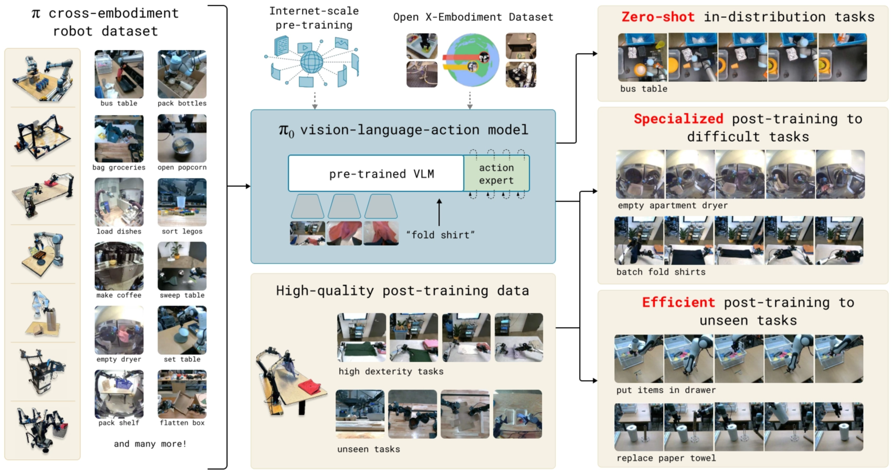
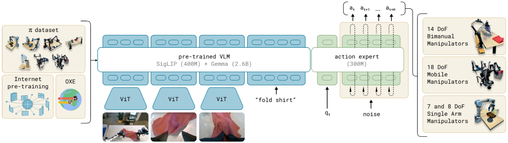
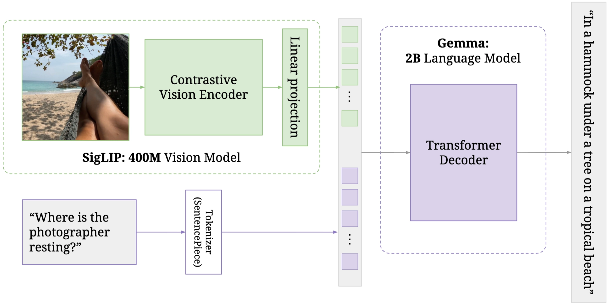
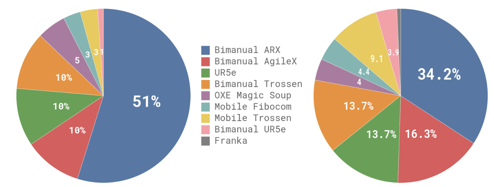
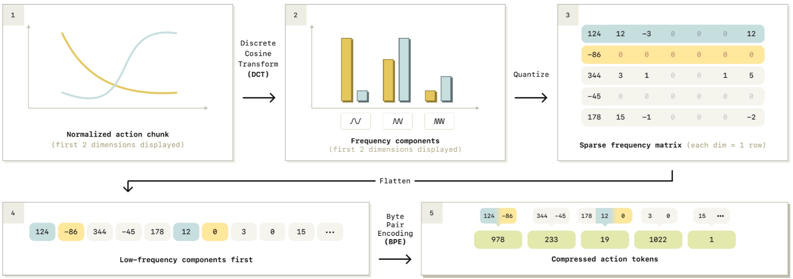
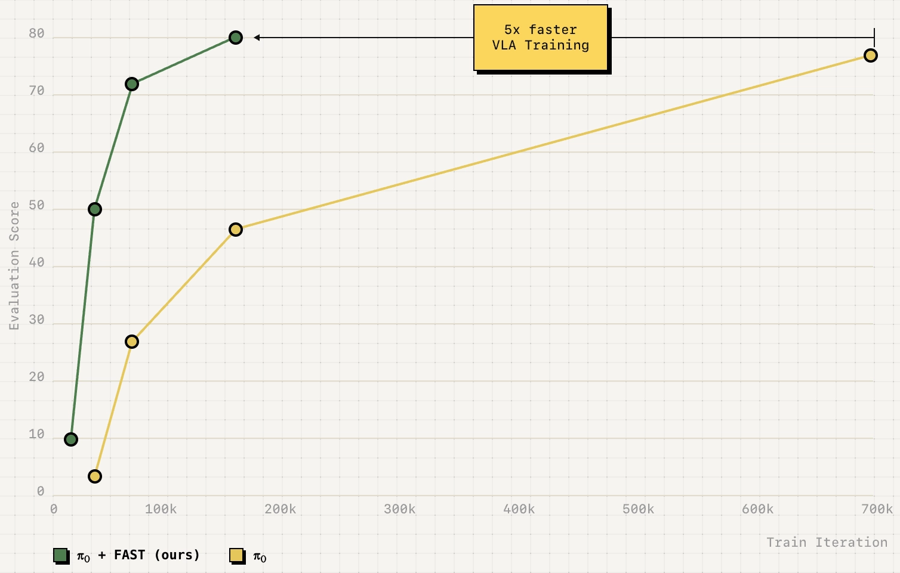
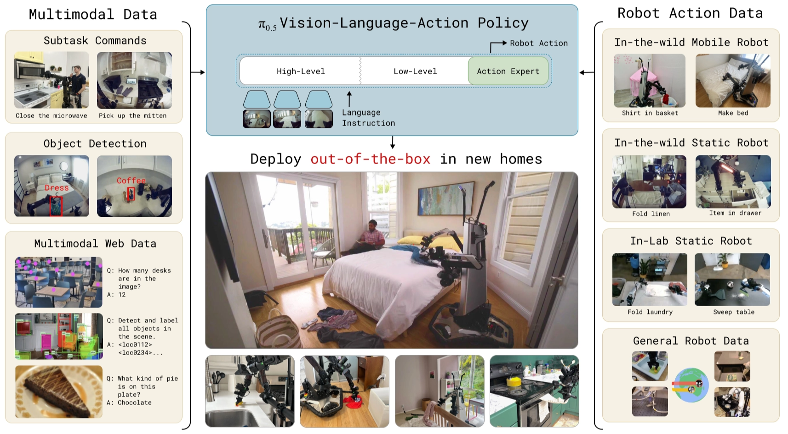
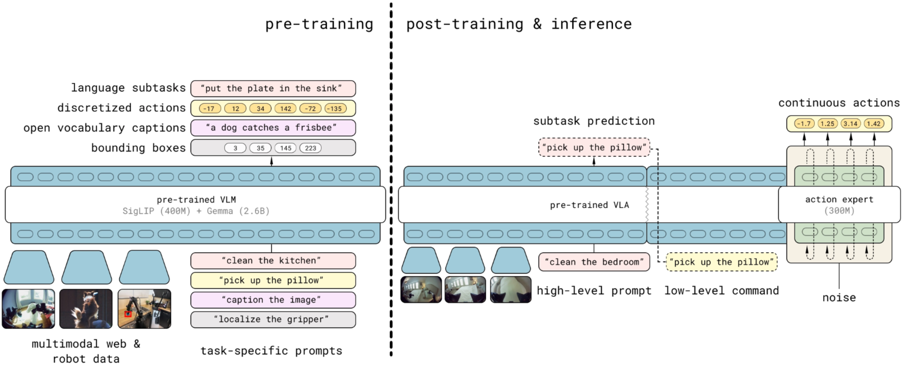
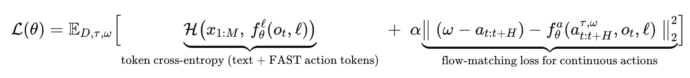

[Physical Intelligence](https://www.pi.website/) is a fast-rising company focused on bringing general-purpose AI into the physical world. In under two years since introducing their first VLA prototype model [π₀](https://www.pi.website/blog/pi0), thet’ve made a huge impact in the embodied intelligence community. In this post, I’ll walk through the three main VLA models they’ve released so far, based on my reading of their blogs and papers.

# π₀

π₀ is a **vision-language-action (VLA) model** built on top of a pre-trained **vision–language model (VLM)** backbone. It is then robot-pretrained on a large mixture of **open-source and in-house manipulation datasets** to learn broad, general skills, and can be further **post-trained** on smaller, task-specific data to specialize for downstream applications.

<aside>

blog link: [π₀: Our First Generalist Policy](https://www.pi.website/blog/pi0)

paper link: [π₀: A Vision-Language-Action Flow Model for General Robot Control](https://arxiv.org/abs/2410.24164)

</aside>

## Problem

[Robert A. Heinlein](https://www.goodreads.com/quotes/12051-a-human-being-should-be-able-to-change-a-diaper) suggested that a well-rounded person should be capable of handling a wide variety of tasks, both intellectual and physical. Compared with machine intelligence, we human intelligence is more versatility: we can solve diverse **tasks** situated in varied physical **environments**, while responding intelligently to **environmental constraints, language commands, and unexpected perturbations**. While LLMs and VLMs show promise, they lack interaction with the physical world. To bridge this gap, we need models trained on robotic data, then they can actaully action like human.

Generalist robot models aim to be adaptable by training on diverse data, they can generalize better and recover more reliably from mistakes. Rather than learning each task in isolation, we can pre-train on large, varied robotics datasets which improves data efficiency and overall performance, much like LLM pre-training. Then fine-tune or prompt for the desired task.

However, However, developing such generalist robot policies, or robot foundation models, persents three major challenges. 

1. Research like this needs to be conducted at **large scale** with **large datasets, sufficiently large models, and enough training compute** to fully leverage pre-training benefits.
2. **Designing model architectures** that can integrate diverse data sources while capturing complex physical interactions.
3. **Crafting an effective training recipe**. This is perhaps the most important ingredient, as much of the recent recent advances in NLP and vision has relied heavily on curating pre-training and post-training strategies.

They present a prototype model and learning framework, which called **π₀**, that illustrates how each of these three bottlenecks could be tackled. 

## Training pipeline

Overall, the training pipeline includes three steps. 

1. **Pre-training VLM initialization**, 
2. **Pre-training VLA** model with robot dataset, including their own collected cross-embodiment robot dataset and open X-Embodiment dataset, 
3. **Post-training VLA** model with smaller, high-quality data. 

The illustration of the model and system is as follows:

## Model

The π₀ model is a **single decoder-only transformer policy** processes a mixed token sequence which has two parts:

- **Prefix tokens:** encoded **images** (multi-view) plus the **language instruction**.
- **Suffix tokens:** the robot’s **proprioceptive state** and a set of **noisy actions.**

Instead of predicting actions **autoregressively** (one token at a time) with a cross-entropy loss, π₀ generates **continuous action chunks** using [conditional flow matching](https://arxiv.org/abs/2210.02747), The encoded **prefix tokens** act as conditioning context: at each refinement step, the model predicts a **denoising direction** and updates the noisy action chunk, gradually turning it from pure noise into the final action sequence.

The **transformer VLM backbone** is [**PaliGemma**](https://arxiv.org/abs/2407.07726), which includes a vision encoder **SigLIP** and a language model **Gemma**.

For this module, Images with different viewpoints in one timestep are embed into the same embedding space as language tokens, so the model can jointly process **vision + language**. 

On top of that, π₀ **adds robotics things** to the pre-trained VLM:

- Input: **proprioceptive state** (robot current joint angles, gripper state, etc.), noisy actions
- Output: **robot actions**.

Inspired by [Transfusion](https://arxiv.org/abs/2408.11039), π₀ trains discrete tokens (VLM context) with **cross-entropy** and continuous tokens (actions) with a **flow matching loss**.

A key architectural tweak is to give two types of parameters, **separate attention and MLP weights** (including the Q/K/V projections). This acts like a lightweight **two-expert MoE**: one expert specializes in perception and instruction understanding, and the other specializes in denoising actions conditioned on that context.

### Training: predict correction direction

At each timestep $t$, an ground truth **action chunk** of length $H=50$:

$$
A_t = [a_t, a_{t+1}, \dots, a_{t+H-1}]
$$

The observation is:

$$
o_t = [I_t^1,\dots,I_t^n,\ \ell_t,\ q_t]
$$

with several **camera views**, a language instruction, and joint-state vector. 

So we have the dataset prepared for the training. And for training, we sample noise $\epsilon \sim \mathcal{N}(0,I)$ and a noise level $\tau \in [0,1]$, then create noisy actions:

$$
A_t^\tau = \tau A_t + (1-\tau)\epsilon
$$

The **action expert** predicts a **correction direction** $v_\theta(A_t^\tau,o_t)$ and is trained to match the target direction $\frac{dA^\tau}{d\tau} = A-\epsilon$ (squared error).

$$
|v_\theta(A_t^\tau,o_t) - (A_t-\epsilon)|^2
$$

### Inference: start from noise, refine in 10 steps

At test time, start from noise $A_t^0 \sim \mathcal{N}(0,I)$ and iteratively refine:

$$
A_t^{\tau+\delta} = A_t^\tau + \delta v_\theta(A_t^\tau,o_t)
$$

We use **10 refinement steps** ($\delta=0.1$). For speed, the model can **cache** attention states for the observation tokens and only recompute the action-token part each step.

## Data Collection

π₀ uses a **two-stage dataset setup**, similar to LLMs: a large, diverse **pre-training mixture** plus a smaller, high-quality **post-training** set. 

The pre-training data is designed for **coverage**, while post-training focuses on effective strategies for the target task. The pre-training mixture combines a subset of OXE with their own **π dataset**. 

In total, **9.1%** of the mixture comes from open-source data, which helps broaden object and environment diversity. To support **dexterous, complex manipulation**, they add **903M timesteps** from their own data (106M single-arm + 797M dual-arm), spanning **68 broad tasks** where each task contains many object variations and multi-step behaviors. 

During post-training, they collect **task-specific datasets** to specialize the model. And depending on task complexity, this can range from **~5 hours** (simple tasks) to **100+ hours** (hard tasks).

## Training Recipe

Training is explicitly split into **pre-training** and **post-training**. 

**Pre-training** aims to build **general physical capability and robustness** by exposing the model to diverse tasks and behaviors, including imperfect trajectories that teach recovery from mistakes. 

**Post-training** then fine-tunes on **smaller, higher-quality data** to learn **fluent and reliable** execution strategies for downstream tasks. 

# **FAST: Efficient Robot Action Tokenization**

<aside>

blog link: [π₀.₅: a VLA with Open-World Generalization](https://www.pi.website/blog/pi05)

paper link: [π₀.₅: a Vision-Language-Action Model with Open-World Generalization](https://arxiv.org/abs/2504.16054)

</aside>

FAST is an **action tokenizer** that turns **a continuous action chunk** into **a sequence of discrete tokens**, allowing VLA policies to be trained with the same next-token, autoregressive training recipe used in language models. 

After compressed, a chunk might become **tens of tokens**, not one token per timestep.

<aside>

Tiny example: a 1-second `reach → grasp → lift` action chunk becomes something like `[A17, A05, A92, …]` tokens, which the model predicts one by one, then decodes back into smooth continuous actions. 

</aside>

FAST aims to combine the best of both worlds: (a) **diffusion-like dexterity** for fine manipulation, and (b) the training efficiency of token-based **autoregressive transformers**.

## Core method

Given an action chunk $a_{t:t+H}$, FAST tokenizes it with a compression-style pipeline:

1. **Normalize** the action chunk → rescale every action dimension (joints/axes) to a standard range (dimension-wise scaling).
2. **DCT (Discrete Cosine Transform)** over time → convert each action dimension into several **frequency components**, like representing a song using bass (low freq) + treble (high freq). Most energy is in the bass.
    - low-frequency = the main smooth movement (“move forward steadily”)
    - high-frequency = little corrections (“tiny adjustments”)
3. **Quantize** the DCT coefficients → a sparse-ish frequency matrix, so a real number is mapped to an integer bin using a scale. 
4. **Flatten** coefficients in a **low-frequency-first** order.
5. **BPE compression (Byte Pair Encoding)** → produce **dense compressed action tokens**, typically **~30–60 tokens per chunk** (**10× fewer** than prior tokenizations). 

Now actions look like language: a short token sequence that an autoregressive transformer can predict with cross-entropy.

## Pluging FAST into π0

PI reports that combining FAST with the π0 backbone/data yields **π0-FAST**: an **autoregressive** generalist policy that can handle **dexterous tasks** where standard discretization fails, and trains **up to ~5× faster** than diffusion-based π0 (with almost similar performance in their comparisons).

# π₀.₅

π₀ didn't generalize well, and the developers likely recognized this gap. π₀.₅ is designed to improve open-world generalization by (1) co-training on a broader and more diverse mixture of data sources, and (2) introducing a hierarchical inference scheme where the model first predicts a textual semantic subtask and then generates low-level actions conditioned on that subtask, strengthening long-horizon reasoning and execution.

<aside>

blog link: [FAST: Efficient Robot Action Tokenization](https://www.pi.website/research/fast)

paper link: [FAST: Efficient Action Tokenization for Vision-Language-Action Models](https://arxiv.org/abs/2501.09747)

</aside>

## Problem

This method aims to solve the **open-world generation problem** in physical intelligence. Concretely, embodied systems such as robotic arms, humanoids, and autonomous vehicles only truly become useful when they can **leave the lab** and **handle the diverse situations and unexpected events** that occur in the real world.

- open-world → leave the lab and can occur in the real world
- generation → handle the diverse situations and unexpected events

**Learning-based systems** is a method to help broad generalization. Scaling helped a lot in NLP and CV, but for robots we also need good **training recipe**, not just make the dataset model bigger (+scaling). So the question is: 

<aside>

How can we structure a training recipe for a robotic learning system that can enable this kind of flexible generalization?

</aside>

Learn from humans, the generalizable robotic learning systems must be able to transfer experience and knowledge from a variety of information sources. The heterogeneity of these different sources of data present a major obstacle, but fortunately recent advances in VLA models said we can **cast different modalities into the same sequence modeling framework**, then **VLAs can be adapted to train on robot data, language data, computer vision tasks, and combinations of the above**.

In this paper, they leverage this observation to design a co-training framework for VLAs, called π₀.₅, that can utilize heterogeneous and diverse knowledge sources to enable broad generalization.

## Improvements to π₀

π₀.₅ builds on π₀ with several improvements: 

π₀ mostly learns from **“what the robot did”**. π₀.₅ additionally learns from **“what should happen next”** and **“what things mean”** even when no robot actions are given. Concretely, π₀.₅ extends in two big ways:

1. **Adds new supervision sources beyond robot action imitation**
    
    π0.5 explicitly co-trains with **high-level semantic subtask prediction** and **web-derived data** (image and video + caption), and also uses **verbal instructions provided by human supervisors** (step-by-step coaching).
    
2. **Two-stage inference procedure (semantic subtask → action chunk)**
    
    At runtime π0.5 first predicts a **semantic subtask** (e.g., “pick up the plate”), then predicts the **low-level action chunk** conditioned on that subtask. This high-level capability is not present in π0-style training that only uses robot-action data.
    

## Pipeline

### Training Pipeline

The training pipeline of π₀.₅ is same as the π₀. It has three steps, one initlialization and two followed stages:

1. A Initialization intended to initialize the policy weights with a **VLM** trained on web data, 
2. A **pre-training stage** intended to adapt the model to diverse robotic tasks, 
3. A **post-training stage** intended to specialize it to mobile manipulation and equip it with the mechanisms for efficient test-time inference.

The goal of the second step is to transfer knowledge from a heterogeneous range of data sources, including other robots, high-level subtask prediction, verbal instructions, and data from the web, in order to enable broad generalization across environments and objects. 

### Inference pipeline

Inference becomes explicitly hierarchical:

1. predict a **high-level subtask** (text)
2. then predict **low-level actions via the action expert** conditioned on that subtask

At inference-time, the model first predicts a **high-level subtask** (text) for the robot to perform and then, conditioned on this subtask, predicts the low-level actions via the action expert.

## Model

π₀.₅ structure is same with π₀, both based on **decoder-only transformer**, but π₀.₅ is designed to produce **two kinds of outputs** with the **same transformer**:

- **Tokenized text outputs**: used for web-style co-training tasks and for predicting **high-level subtasks** at runtime.
- **Action chunk outputs**: used for real robot control (a short horizon of actions).

The model captures a joint distribution:

$$
\pi_\theta(a_{t:t+H}, \hat{\ell}\mid o_t, \ell)
$$

Where:

- $o_t = [I^1_t, \dots, I^n_t, q_t]$: multi-camera images + robot joint state (joint angles, gripper pose, torso lift, base velocity, etc.)
- $\ell$: overall task prompt (e.g., “put away the dishes”)
- $\hat{\ell}$: tokenized textual output (either a predicted subtask like “pick up the plate” or an answer to a vision-language prompt in web data)
- $a_{t:t+H}$: predicted low-level action chunk

They factorize it as:

$$
\pi_\theta(a_{t:t+H}, \hat{\ell}\mid o_t, \ell)
= \pi_\theta(a_{t:t+H}\mid o_t, \hat{\ell})\pi_\theta(\hat{\ell}\mid o_t, \ell)
$$

The actions don’t directly depend on the global prompt $\ell$, only on $\hat{\ell}$. So there are two levels of inference:

- **High-level inference:** $\pi_\theta(\hat{\ell}\mid o_t, \ell)$ (decide “what to do next”)
- **Low-level inference:** $\pi_\theta(a_{t:t+H}\mid o_t, \hat{\ell})$ (execute it)

They are both represented by the **same model**.

### Transformer view

π₀.₅ uses a transformer $f$ that takes multimodal input tokens $x_{1:N}$ and outputs $y_{1:N}$.

Each input token can be:

- **Image patch** $x_i^I$
- **Text token** $x_i^w$ (discrete)
- **Action token** $x_i^a$ (continuous denoising state in flow matching)

The input prefix is formed by $o_t$ and $\ell$. Then depending on token type:

- image patches go through a **vision encoder**
- text goes through a **token embedding matrix**
- action tokens are **linearly projected** into the transformer embedding space

Following π₀, action tokens are processed with **separate expert weights** inside the transformer, for example, the attention and feed-forward parameters used for action tokens are separate from those used for text and image tokens (including separate Q/K/V projections…).

And unlike strict causal LLM attention, π₀.₅ uses **bidirectional attention** among image patches, text prompt tokens and continuous action tokens, so tokens can see each other freely.

The transformer outputs are split into:

- $y^\ell_{1:M}$: **text token logits** → sample $\hat{\ell}$
- $y^a_{1:H}$: **action output tokens** produced by a separate **action expert** (like π0) → mapped to continuous $a_{t:t+H}$

### Training Recipe

π0.5 wants **fast, scalable training** and **real-time robot control**, so it combines two action representations: **Discrete actions (FAST tokens)** ([Pertsch et al. 2025](https://arxiv.org/abs/2501.09747)) are good for training speed, and **Continuous actions** (flow matching) are good for control.

So the goal is: **train like a token model** (fast) but **act like a continuous model** (efficient control).

π0.5 trains:

- **Autoregressive token prediction** (including FAST-encoded action tokens)
- **Flow-matching action expert** for continuous actions

They optimize a combined loss:

- **Cross-entropy** over text tokens (this includes FAST action tokens when actions are tokenized)
- **Flow matching MSE** for the action expert’s continuous outputs with a trade-off weight $\alpha$

<aside>

**Positioning:**

- **π0:** continuous actions via flow matching (strong dexterity; slower training)
- **FAST / π0-FAST:** discrete action tokens via DCT+BPE compression (fast autoregressive training; still dexterous)
- **π0.5:** combines discrete-token pretraining (FAST-style) with a continuous action expert for fast real-time control
</aside>

# Reference

[1] Physical Intelligence, “Physical Intelligence (π).” [Online]. Available: [https://www.pi.website/](https://www.pi.website/). [Accessed: Mar. 1, 2026].

[2] Physical Intelligence, “π₀: Our First Generalist Policy,” Oct. 31, 2024. [Online]. Available: [https://www.pi.website/blog/pi0](https://www.pi.website/blog/pi0). [Accessed: Mar. 1, 2026].

[3] K. Black *et al*., “π₀: A Vision-Language-Action Flow Model for General Robot Control,” *arXiv preprint* arXiv:2410.24164, 2024.

[4] R. A. Heinlein, “A human being should be able to change a diaper...,” Goodreads. [Online]. Available: [https://www.goodreads.com/quotes/12051-a-human-being-should-be-able-to-change-a-diaper](https://www.goodreads.com/quotes/12051-a-human-being-should-be-able-to-change-a-diaper). [Accessed: Mar. 1, 2026].

[5] Y. Lipman, R. T. Q. Chen, H. Ben-Hamu, M. Nickel, and M. Le, “Flow Matching for Generative Modeling,” *arXiv preprint* arXiv:2210.02747, 2022.

[6] L. Beyer *et al*., “PaliGemma: A Versatile 3B VLM for Transfer,” *arXiv preprint* arXiv:2407.07726, 2024.

[7] C. Zhou *et al*., “Transfusion: Predict the Next Token and Diffuse Images with One Multi-Modal Model,” *arXiv preprint* arXiv:2408.11039, 2024.

[8] Physical Intelligence, “FAST: Efficient Robot Action Tokenization,” Jan. 16, 2025. [Online]. Available: [https://www.pi.website/research/fast](https://www.pi.website/research/fast?utm_source=chatgpt.com). [Accessed: Mar. 2, 2026].

[9] K. Pertsch *et al*., “FAST: Efficient Action Tokenization for Vision-Language-Action Models,” *arXiv preprint* arXiv:2501.09747, 2025.

[10] Physical Intelligence, “π₀.₅: a VLA with Open-World Generalization,” Apr. 22, 2025. [Online]. Available: [https://www.pi.website/blog/pi05](https://www.pi.website/blog/pi05). [Accessed: Mar. 1, 2026].

[11] Physical Intelligence *et al*., “π₀.₅: a Vision-Language-Action Model with Open-World Generalization,” *arXiv preprint* arXiv:2504.16054, 2025.