[**Robbyant**](https://technology.robbyant.com/) is a company under [Ant Group](https://www.antgroup.com/), dedicated to building the foundational platform for Embodied AI, bridging the gap between digital intelligence and the physical world. 

Since the company is still relatively new, I want to quickly review its recent work. In particular, I will study four embodied intelligence model models: **spatial perception model, VLA model, world model, and video action model**.

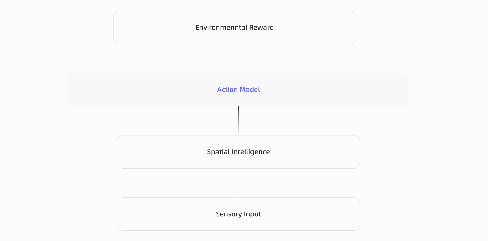

This diagram in the homepage of Robbyant reflects the **vision for embodied intelligence**: starting from **sensory input**, the system first builds **spatial intelligence** to understand the physical world, then relies on an **action model** to make decisions and interact with the environment, and finally improves through **environmental reward**. 

In this sense, embodied AI is not a single model, but a complete closed loop of **perception, understanding, action, and feedback**. 

Based on this vision, Robbyant’s current work can be organized into four representative model directions: **LingBot-Depth** for spatial perception, **LingBot-VLA** for vision-language-action, **LingBot-World** for world modeling, and **LingBot-VA** for video action modeling.

<aside>

- Spatial perception: [**LingBot-Depth**](https://technology.robbyant.com/lingbot-depth)
- Vision-language-action model: [**LingBot-VLA**](https://technology.robbyant.com/lingbot-vla)
- World model: [**LingBot-World**](https://technology.robbyant.com/lingbot-world)
- Video action model: [**LingBot-VA**](https://technology.robbyant.com/lingbot-va)
</aside>

## LingBot-Depth

### Problem

A core challenge in embodied intelligence is obtaining **accurate, dense, and metric 3D perception** in real time. For robots, autonomous vehicles, and other physical agents, depth is not just an auxiliary signal: it is the basis for localization, scene understanding, and reliable action. 

In practice, a useful depth system should satisfy three conditions at once: it should provide **absolute metric scale**, **pixel-aligned dense geometry**, and **real-time sensing** without heavy post-processing. Among existing approaches, **RGB-D** sensors are one of the few practical choices that can meet these requirements in real-world deployment.

However, RGB-D cameras are far from perfect. Even strong commercial sensors often fail in difficult scenes (as illustrated in the left of following figure), especially on **texture-less surfaces, reflective materials, and under complex lighting**. 

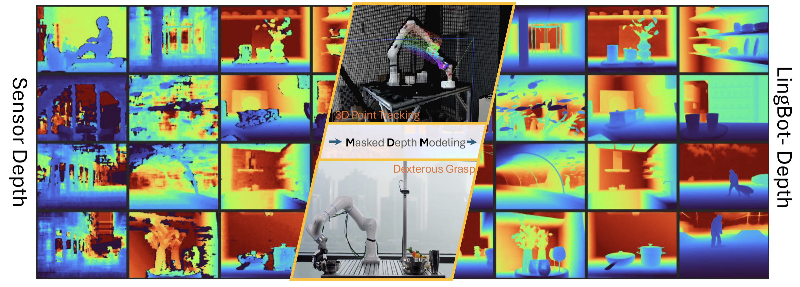

This creates a gap between the promise of sensor-based depth and the actual perception quality required by downstream tasks such as manipulation, tracking, and navigation.

**LingBot-Depth** is motivated by the idea that these failured sensor should not simply be treated as useless noise. Instead, the paper views missing or inaccurate depth as a meaningful signal that reveals where geometry is ambiguous and where perception is hardest. 

Based on this view, the problem becoms **recovering reliable dense depth from imperfect RGB-D observations**, while also extending naturally to the monocular setting, which doesn’t leverage depth sensor input, predicting depth using only RGB. 

In other words, the paper addresses a practical and fundamental perception problem: 

<aside>

How to turn unreliable real-world depth sensing into robust, dense, pixel-aligned geometric understanding?

</aside>

### **Model Details**

**Architecture.**

LingBot-Depth adopts a **Vision Transformer (Large)** as the encoder to jointly process **RGB and depth inputs**. RGB tokens provide full visual context, while depth tokens encode sparse or corrupted sensor depth. These two modalities are fused in the transformer latent space to learn geometry-aware representations. On top of the encoder, the model uses a **multi-scale decoder** to progressively recover dense depth structure, and the final prediction head performs **depth regression**.

- **Encoder**: Vision Transformer (Large) with RGB-D fusion
- **Decoder**: Multi-scale feature pyramid with specialized heads
- **Heads**: Depth regression

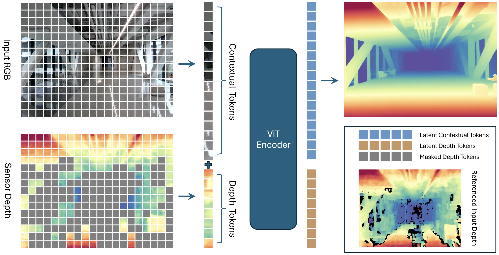

**Input Format.**

- **RGB image.** The RGB input is a tensor of shape **[B, 3, H, W]**, normalized to **[0, 1]** and stored in **float32** format. It provides the dense visual appearance cues that guide the recovery of missing or ambiguous depth regions.
- **Depth map.** The depth input has shape **[B, H, W]** and is represented in **meters**. Invalid or unreliable regions are marked as **0 or NaN**. In the depth completion setting, this input is partial and noisy; during training, masked regions indicate where the model must infer missing geometry.
- **Camera intrinsics.** The model can also take camera intrinsics of shape **[B, 3, 3]** in normalized form. These parameters preserve the metric relationship between image coordinates and 3D geometry, which is important for producing physically meaningful depth and point cloud outputs.

**Output Format.**

LingBot-Depth outputs a refined dense **depth map** of shape **[B, H, W]**. It can also produce a **3D point cloud** of shape **[B, H, W, 3]** in camera coordinates. 

```python
{
    'depth': torch.Tensor,   # Refined depth [B, H, W]
    'points': torch.Tensor,  # Point cloud [B, H, W, 3] in camera space
}
```

This makes the model useful not only for depth refinement itself, but also as a perception frontend for downstream 3D tasks.

### Training

**Pretraining objective.**

LingBot-Depth is pretrained with **Masked Depth Modeling (MDM)**: the model sees the full RGB image together and the **unmasked depth tokens**, and learns to reconstruct the full target depth map. This turns corrupted or missing sensor depth into a learning signal rather than discarding it.

**Masking strategy.**

The masking is applied only to the depth tokens, while the RGB image remains fully visible. Regions where depth is completely missing are always masked. Regions with partially valid depth are more likely to be masked as well. If the overall masked area is still too small, the model further masks some valid depth regions at random, so that the final masking ratio stays between **60%-90%**.

**Encoder-decoder setup.**

The model uses a **24-layer ViT-L/14 encoder** initialized from **DINOv2**, while the **convolutional** **decoder** is randomly initialized. After encoding, latent depth tokens are discarded, and the retained contextual tokens are decoded into dense depth with a ConvStack decoder.

**Optimization.**

Training uses **AdamW** with different learning rates for the pretrained encoder and the newly initialized decoder, plus warm-up for the encoder and step decay for both. They also use **gradient clipping**, **BF16 mixed precision**, and standard augmentations such as random resized crop, flip, color jitter, JPEG artifacts, motion blur, and shot noise.

**Data.**

Pretraining uses a total of about **10M RGB-D samples**: roughly **3.2M self-curated samples** (real + synthetic) plus several public RGB-D datasets. For public datasets without natural missing depth, the paper applies artificial masking to match the target mask ratio.

**Supervision.**

The prediction is supervised with an **L1 depth loss**, computed only on pixels with valid ground-truth depth. Full training runs for **250k iterations** with a **global batch size of 1024** on **128 GPUs**.

### Inference

**Depth completion mode.**

At inference, the standard setting is **RGB + incomplete / noisy depth** as input. The model uses RGB context together with the remaining valid depth observations to predict a **dense refined depth map**.

**What happens inside.**

The encoder processes **all RGB tokens** and only the **unmasked depth tokens**. After encoding, the latent depth tokens are discarded, the contextual RGB-side tokens are kept, and the ConvStack decoder reconstructs the final dense depth, which is then resized back to the original image resolution.

**Output.**

The main inference output is a **refined depth map**; the released implementation can also convert this into a **3D point cloud in camera space** for downstream use.

**Monocular inference.**

For pure monocular depth estimation, the paper does **not** keep the original two-input pipeline unchanged. Instead, it removes the **depth embedding branch** and the **ConvStack decoder**, and uses the pretrained LingBot-Depth encoder as an **RGB-only backbone** to initialize MoGe. This shows that the geometry learned during MDM pretraining transfers to RGB-only depth prediction.

**Practical takeaway.**

So in deployment there are really two inference usages:

1. RGB + partial depth → **depth completion**, and
2. RGB only, use encoder as feature extractor to incorporate into **monocular depth estimation** model.

### Experiments

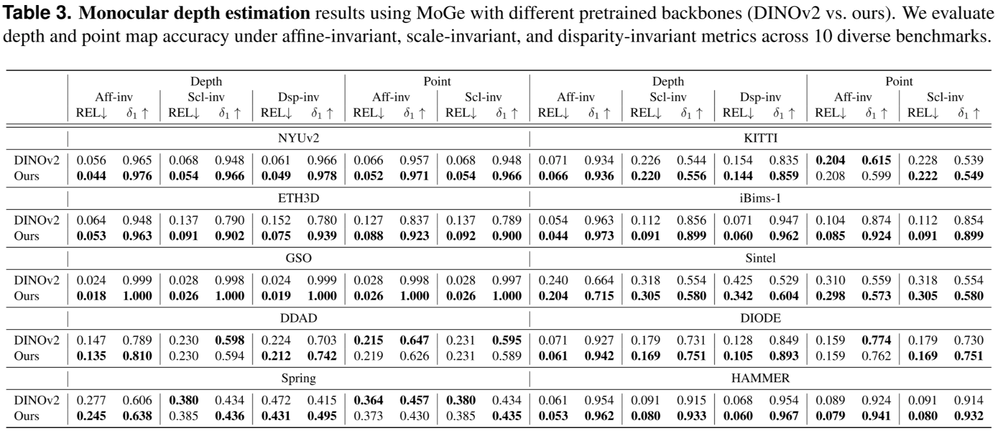

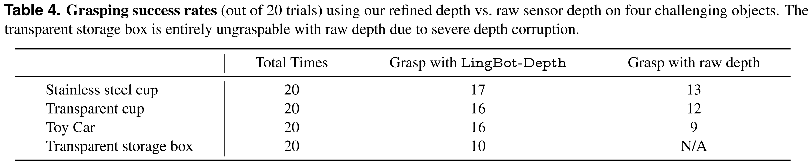

## LingBot-VLA

### Problem

LingBot-VLA targets a practical gap in robot learning: a VLA model should **generalize across tasks and robot platforms** while remaining **data- and compute-efficient** enough for real deployment. 

The paper argues that prior work lacked both a clear real-world scaling study and a highly optimized training stack for very large robot datasets, so it asks a central question: 

<aside>

How well do VLA models scale with massive real-world robot data?

</aside>

Compared with earlier VLA methods, **LingBot-VLA** stands out for three things:

- it is trained on **very large real-world teleoperation data** across multiple robot embodiments;
- it uses a **Mixture-of-Transformers design** that tightly couples a pretrained vision-language model with an action expert, instead of treating action prediction as a simpler add-on head like [pi0](https://arxiv.org/abs/2410.24164);
- it adds **depth-enhanced spatial supervision** and an optimized training system.

### Model Details

LingBot-VLA combines a pretrained **Qwen2.5-VL** vision-language model with an **action expert** inside a [**Mixture-of-Transformers (MoT)**](https://arxiv.org/abs/2505.14683) architecture. 

The VLM processes multi-view robot images and language instructions, while the action expert takes robot state and predicts action chunks. The two branches interact through shared self-attention, so semantic understanding and action generation are coupled layer by layer.

For action prediction, the model uses **Flow Matching** to generate smooth continuous robot actions. 

It also supports a **depth-enhanced version**, where visual queries output are aligned with **LingBot-Depth** encoded tokens through a distillation loss, injecting stronger spatial priors into the policy. 

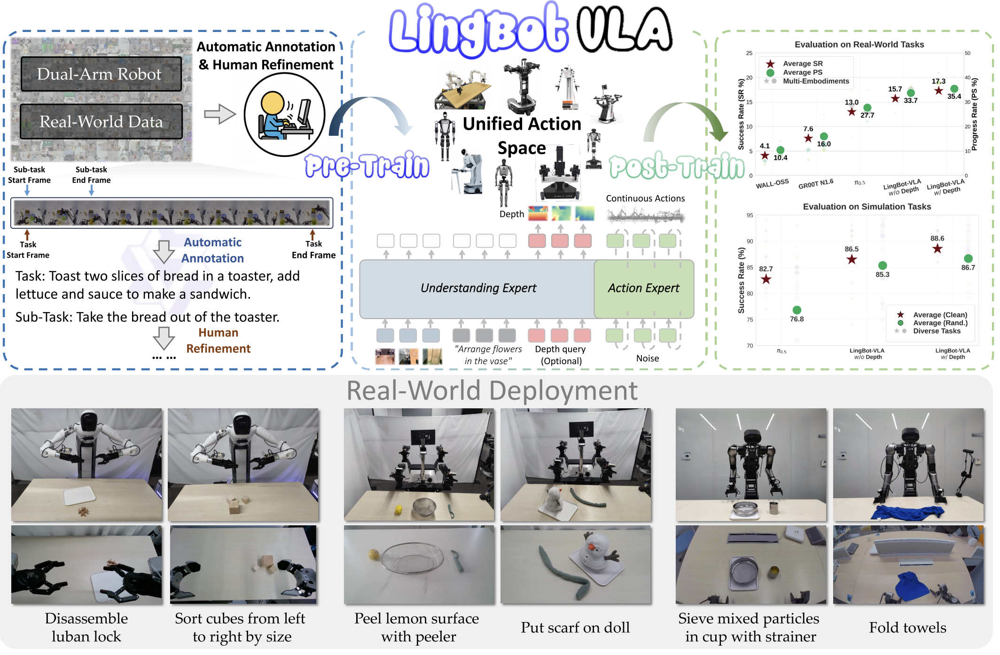

The [released repo](https://github.com/Robbyant/lingbot-vla) provides both **depth-free** and **depth-distilled** 4B checkpoints.

### Training

LingBot-VLA is pretrained on about **20,000 hours of real-world teleoperated data** collected from **9 dual-arm robot embodiments**. The data is segmented into motion clips, and task / subtask instructions are annotated with a large VLM to provide language supervision.

The training objective is **conditional flow matching** over action chunks, with a pretraining action horizon of **50 steps**. 

On the systems side, the codebase uses **FSDP/FSDP2-style sharding**, mixed precision, **FlexAttention**, and `torch.compile` style operator fusion to improve throughput and scalability.

<aside>

**FSDP / FSDP2-style sharding:** split a huge model across GPUs so each GPU stores only part of it, which saves memory and enables large-scale training.

**FlexAttention:** a flexible and optimized attention mechanism in PyTorch that lets you customize attention behavior without writing low-level kernels yourself. It is a more efficient way to compute the attention part of a Transformer.

**`torch.compile` operator fusion:** a compiler-based optimization that merges many small PyTorch operations into fewer, faster kernels to improves speed and hardware efficiency.

</aside>

### Inference

At inference time, LingBot-VLA takes **multi-view robot images**, a **language instruction**, and the robot’s **current state**, then predicts a chunk of continuous actions for control. The VLM provides the observation conditioning, and the action expert outputs the motion trajectory. 

In practice, there are two variants: 

- **LingBot-VLA w/o depth**
- **LingBot-VLA w/ depth**.

The depth version adds spatial information distilled from LingBot-Depth, which is meant to improve robustness on manipulation tasks that require stronger geometric reasoning.

### Experiments

The paper evaluates LingBot-VLA on a large real-world benchmark built from **25 robots**, **3 commercial platforms**, and **100 manipulation tasks**, using **130 post-training episodes per task** and reporting **Success Rate (SR)** and **Progress Score (PS)**. 

LingBot-VLA outperforms strong baselines on both real-world and simulation benchmarks, and the **depth version performs best overall**. 

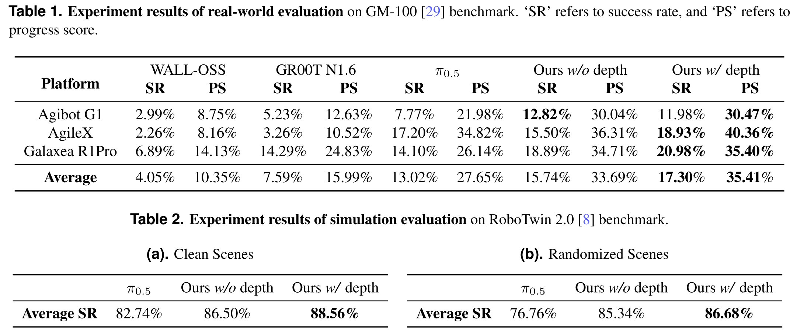

Two additional findings are emphasized. 

First, performance keeps improving as pretraining data scales from **3,000 to 20,000 hours**, with **no clear saturation** yet. 

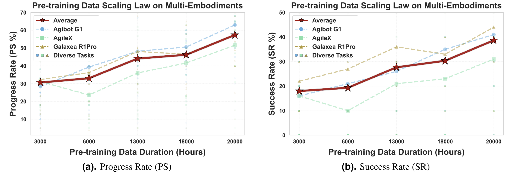

Second, their training framework reaches **261 samples/s/GPU on 8 GPUs**, reported as about **1.5×–2.8× faster** than existing VLA-oriented codebases depending on the base VLM. (depending on the relied VLM base model)

## LingBot-World

### Problem

LingBot-World starts from a simple observation: current video generators can produce short, impressive clips, but they are still poor **world simulators**. They often lack persistent state, causal consistency, long-horizon memory, and real-time controllability, which makes them weak for embodied AI, games, and simulation. 

<aside>

The paper targets three main gaps: 

- **scarce interactive data**,
- **drift over long rollouts**,
- **slow diffusion inference that prevents live control**
</aside>

Compared with earlier world models, LingBot-World is notable because:

- it is designed as an **interactive world simulator**, not just a short video generator, with action or camera control built into the generation process.
- it explicitly targets **long-horizon consistency and spatial memory**, so the scene can stay coherent over much longer rollouts.
- it uses a **three-stage pipeline** to move from a pretrained video generator to a controllable world model and then to a **real-time causal model**.
- it combines a **MoE Diffusion Transformer** with **few-step distillation**, which helps keep quality high while reducing latency for live interaction.

### Model Details

LingBot-World is an **open-source action-conditioned world model** built on top of a pretrained video generator. Its core model follows a **Diffusion Transformer with a Mixture-of-Experts design**: 

- one expert focuses on coarse global structure at high noise levels,
- another refines fine details at low noise levels.

Together they form a **28B-parameter model**, while only one expert is active at each denoising step, keeping inference cost closer to a dense 14B model.

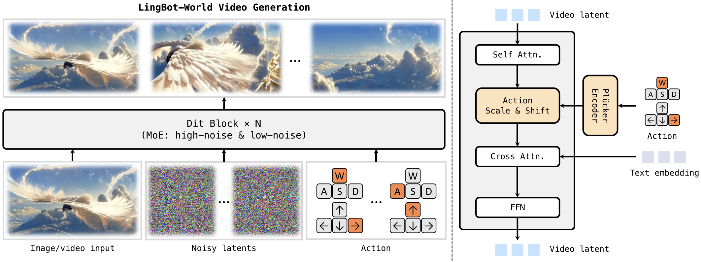

The model takes an **image or short video**, **noisy video latents**, and optional **action signals** as input. Inside each [DiT](https://arxiv.org/pdf/2212.09748) block, self-attention handles spatiotemporal coherence, action signals are injected through a **Plücker encoder + adaptive normalization**, and text is added through cross-attention. 

<aside>

**Plücker encoder**: the module that turns an input action or camera motion signal into a form the world model can use. Here, it maps the action into an embedding and uses that embedding to **modulate the video latent features**.

</aside>

The released variants in the [official repo](https://github.com/Robbyant/lingbot-world) include:

- **LingBot-World-Base (Cam)** for camera-pose control
- **LingBot-World-Base (Act)** for action control.

### Training

The training pipeline has **three stages**: pre-training, middle-training, and post-training.

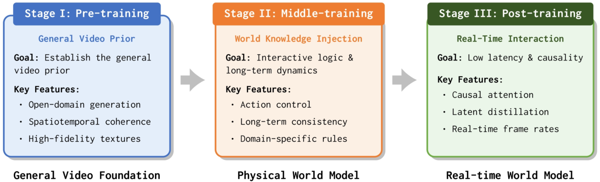

First, LingBot-World initializes from a strong open-domain [**video generator model**](https://arxiv.org/abs/2503.20314) to get a general video prior for high-fidelity synthesis. 

Second, it is middle-trained as a **bidirectional world model** on specialized data to learn **long-term consistency, spatial memory, and action controllability**. 

Third, it is post-trained into a **causal autoregressive model** for real-time interaction. The illustration is as follows:

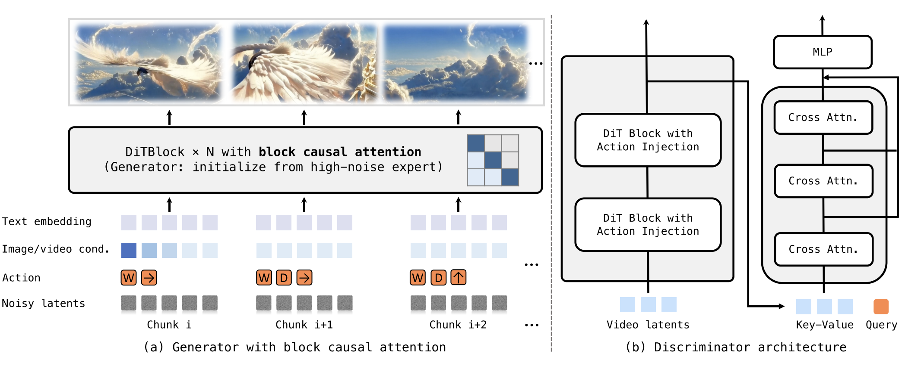

Its data engine combines **curated open-domain videos**, **game data with synchronized actions and camera trajectories**, and **Unreal Engine synthetic videos with precise poses**. The data is further enriched with **hierarchical captions** so the model learns both static scene semantics and dynamic evolution. 

During middle training, it uses **progressive curriculum learning** from about **5 seconds to 60 seconds**, plus both **image-to-video** and **video-to-video** objectives. For action control finetuning, the main DiT blocks are frozen and only the added action adapter layers are updated.

### Inference

At inference time, LingBot-World generates future video from an **initial image or video**, a **text prompt**, and optional **camera or action signals**. The base model can run with or without control signals; with control, it follows the provided trajectory or action sequence to produce a controllable visual world. The GitHub examples show 480P and 720P generation, and suggest increasing frame count to reach around **one minute at 16 FPS** if memory allows.

For real-time interaction, the post-trained version replaces full temporal attention with **block causal attention** and uses **few-step distillation**, so rollout becomes autoregressive and supports **sub-second latency**. The paper reports **under 1 second latency at 16 FPS**, which is the key step from offline video generation to interactive simulation.

### Experiments

The paper emphasizes both qualitative and quantitative results. 

Qualitatively, LingBot-World shows **diverse environments**, **emergent memory**, and very long coherent rollouts, with examples reported up to **10 minutes** while maintaining scene consistency. It also demonstrates applications such as **promptable world events**, **action-agent training**, and **3D reconstruction** from generated videos. 

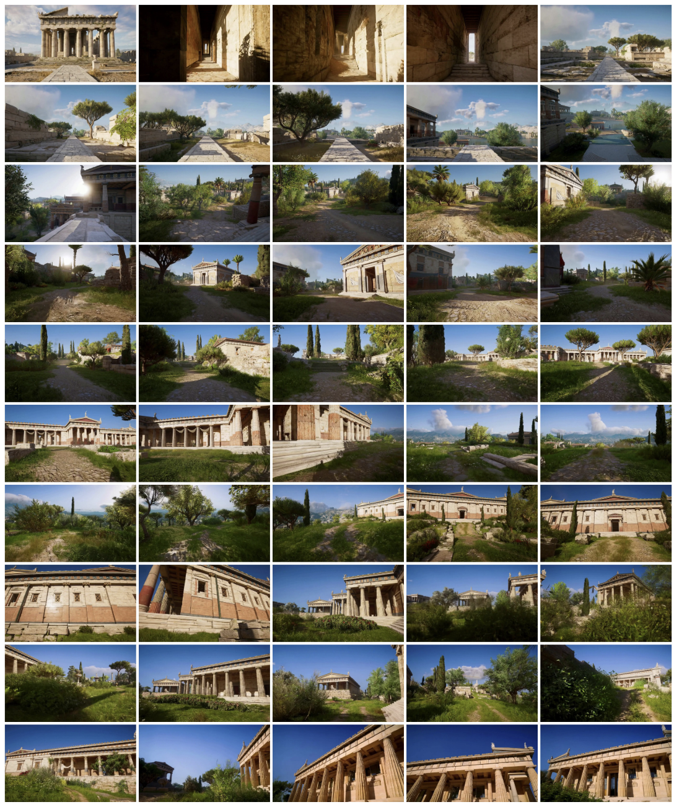

Quantitatively, the paper compares LingBot-World against **Yume-1.5** and **HY-World 1.5** on **VBench** using **100 generated videos longer than 30 seconds**. 

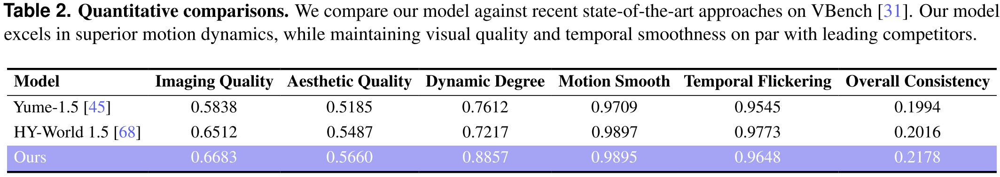

LingBot-World achieves the best reported scores in **imaging quality (0.6683)**, **aesthetic quality (0.5660)**, **dynamic degree (0.8857)**, and **overall consistency (0.2178)**, while remaining competitive on motion smoothness and temporal flickering. 

The strongest highlight is its much higher **dynamic degree**, which supports the claim that it is better suited for interactive world simulation rather than only passive video generation.

## LingBot-VA

### Problem

LingBot-VA studies how to use **world modeling directly for robot control**. Earlier video-action methods often generate action or video in **chunks or open loop**, which creates three problems: 

<aside>

They react **slowly** to new observations, **lose consistency** over long horizons, and may **violate causality** because future information can leak into current prediction. 

</aside>

LingBot-VA addresses this by building a **causal, autoregressive video-action world model** for closed-loop robot manipulation.

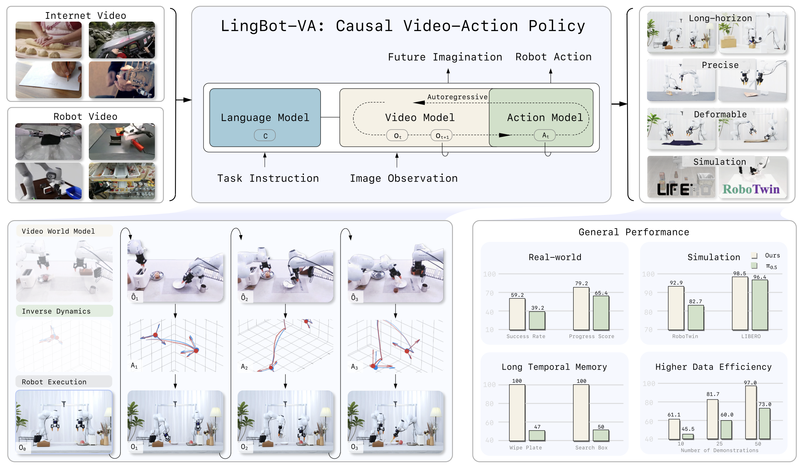

Compared with previous work, LingBot-VA is notable because:

- it is a **closed-loop causal model**, not just an open-loop chunk predictor, so it can keep reacting to new observations during execution
- it **jointly models video dynamics and robot actions** in **one shared autoregressive process**, instead of treating action prediction as a separate lightweight head
- it is designed for **long-horizon consistency**, using causal masking and KV cache to preserve history over time
- it supports an **asynchronous control pipeline**, where prediction and execution can overlap, making deployment more practical for real robot control

### Model Details

LingBot-VA is an **autoregressive diffusion model** that jointly models **future visual dynamics** and **robot actions**. Its key design is to **interleave video tokens and action tokens into one shared sequence**, so the model can imagine the future and decode actions at the same time. 

The backbone uses a **dual-stream Mixture-of-Transformers (MoT)** architecture with shared attention, built on a pretrained [**Wan2.2-5B**](https://github.com/Wan-Video/Wan2.2) video diffusion backbone. It also uses **KV cache** to preserve history and **causal attention masking** to ensure the prediction depends only on the past. 

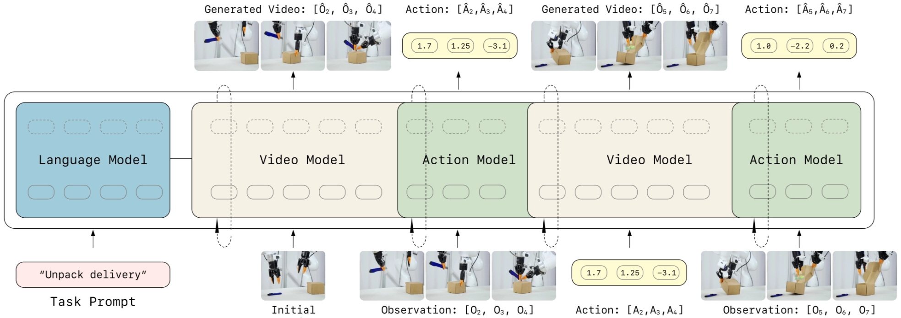

### Training

Training has two levels. 

First, LingBot-VA is **pretrained on diverse in-the-wild videos and robot action data**, so it learns broad visual dynamics and robot-relevant motion priors. 

Then it supports **post-training on robotic manipulation datasets**, and the repo releases a cleaned and augmented **RoboTwin** dataset for this stage. 

To reduce inference cost later, the paper introduces **Noisy History Augmentation**, which trains the action decoder to work even when the latent video history is only partially denoised. It also uses **variable chunk-size training** to support efficient closed-loop rollout.

### Inference

At inference time, LingBot-VA runs in an **autoregressive closed loop**. 

At each step, it takes the latest observation, updates the cached history, predicts future latent visual states through iterative denoising, and simultaneously decodes the corresponding robot actions. 

A practical feature is its **asynchronous execution pipeline**: while the robot is executing the current action, the model predicts the next future and plans the following action sequence in parallel, improving control efficiency. 

### Experiments

LingBot-VA is evaluated on both **simulation and real-world manipulation tasks**, with a focus on **long-horizon tasks, deformable objects, and precision manipulation**. The paper reports that it outperforms strong baselines, including **π₀.₅**, especially on long-horizon settings that require temporal consistency. 

In the repo examples, LingBot-VA achieves higher **Progress Score (PS)** and **Success Rate (SR)** than π₀.₅ on tasks such as **Make Breakfast, Pick Screws, Insert Tube, Unpack Delivery, Fold Clothes, and Fold Pants**.

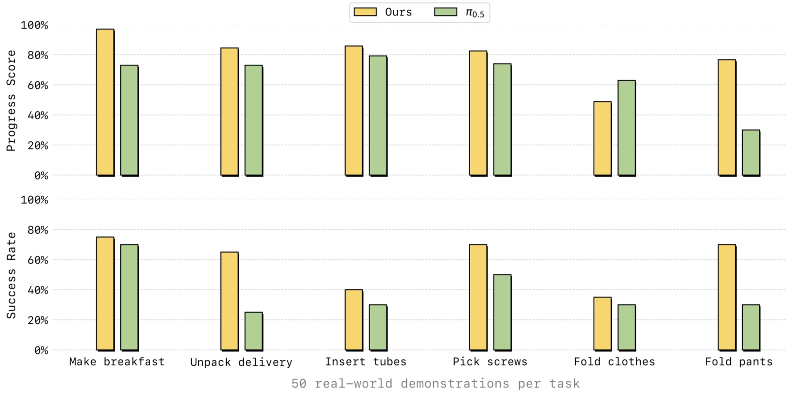

The paper emphasizes three practical strengths: **better long-horizon performance, stronger generalization to novel scenes, and higher sample efficiency in post-training**. 

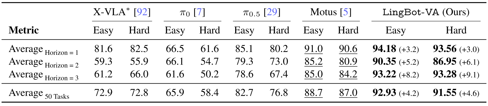

## Wrap Up

Robbyant’s recent work outlines a relatively complete picture of embodied intelligence, spanning from **spatial perception** to **action generation** and **world simulation**. Rather than focusing on only one layer of the stack, these four models together suggest a broader vision: an embodied system should be able to **perceive the 3D world, understand tasks, simulate future dynamics, and generate executable actions**.

At the perception level, **LingBot-Depth** targets a core robotics bottleneck: real-world depth sensing is often noisy, sparse, or unreliable. Its contribution is to treat corrupted depth not simply as sensor failure, but as a recoverable signal, using RGB context to refine and complete depth. This makes it a strong foundation for downstream spatial tasks that require dense and metric 3D understanding, especially the depth.

On top of perception, **LingBot-VLA** moves toward general-purpose robot decision making. Its main focus is scalable vision-language-action learning from large real-world robot data enhanced by LingBot-Depth. It also tightly couples a pretrained vision-language model with an action expert, instead of treating action prediction as a simpler add-on head like [pi](https://arxiv.org/abs/2410.24164) series.

If LingBot-VLA is about deciding **what to do**, then **LingBot-World** is about modeling **what could happen next**. It extends beyond standard video generation and aims at a controllable, interactive world simulator with long-horizon consistency. This direction is especially important for embodied AI, because agents need not only recognition and policy learning, but also a predictive model of how the environment evolves under actions, so we can form a closed loop, and do anything inside without read-world intervention.

Finally, **LingBot-VA** is a bit like the combination of LingBot-VLA and LingBot-World → Imagine the next observation, and use that imagination to decide next action. Its specialty lies in causal, closed-loop action generation, where future visual dynamics and actions are modeled together. Compared with open-loop chunk prediction, this makes it more suitable for long-horizon manipulation and practical deployment.

Taken together, these four models reflect a clear progression: 

- **Depth** provides reliable spatial grounding,
- **VLA** connects perception and language to action,
- **World** models the dynamics of the environment, and
- **VA** turns future prediction into executable control.

In this sense, Robbyant is not presenting four isolated projects, but a coherent roadmap toward a more complete embodied intelligence system.

## References

[1] Robbyant, “Robbyant,” *Robbyant Technology*. [Online]. Available: [https://technology.robbyant.com/](https://technology.robbyant.com/). [Accessed: Mar. 10, 2026].

[2] Ant Group, “Ant Group,” *Ant Group*. [Online]. Available: [https://www.antgroup.com/](https://www.antgroup.com/). [Accessed: Mar. 10, 2026].

[3] Robbyant, “LingBot-Depth,” *Robbyant Technology*. [Online]. Available: [https://technology.robbyant.com/lingbot-depth](https://technology.robbyant.com/lingbot-depth). [Accessed: Mar. 11, 2026].

[4] Robbyant, “LingBot-VLA,” *Robbyant Technology*. [Online]. Available: [https://technology.robbyant.com/lingbot-vla](https://technology.robbyant.com/lingbot-vla). [Accessed: Mar. 11, 2026].

[5] Robbyant, “LingBot-World,” *Robbyant Technology*. [Online]. Available: [https://technology.robbyant.com/lingbot-world](https://technology.robbyant.com/lingbot-world). [Accessed: Mar. 11, 2026].

[6] Robbyant, “LingBot-VA,” *Robbyant Technology*. [Online]. Available: [https://technology.robbyant.com/lingbot-va](https://technology.robbyant.com/lingbot-va). [Accessed: Mar. 11, 2026].

[7] K. Black *et al*., “π₀: A Vision-Language-Action Flow Model for General Robot Control,” *arXiv preprint* arXiv:2410.24164, 2025.

[8] C. Deng, D. Zhu, K. Li, C. Gou, F. Li, Z. Wang, S. Zhong, W. Yu, X. Nie, Z. Song, G. Shi, and H. Fan, “Emerging Properties in Unified Multimodal Pretraining,” *arXiv preprint* arXiv:2505.14683, 2025.

[9] W. Peebles and S. Xie, “Scalable Diffusion Models with Transformers,” *arXiv preprint* arXiv:2212.09748, 2023.

[10] Team Wan *et al*., “Wan: Open and Advanced Large-Scale Video Generative Models,” *arXiv preprint* arXiv:2503.20314, 2025.

[11] Robbyant, “lingbot-vla: A Pragmatic VLA Foundation Model,” *GitHub repository*. [Online]. Available: [https://github.com/Robbyant/lingbot-vla](https://github.com/Robbyant/lingbot-vla). [Accessed: Mar. 16, 2026]. 

[12] Robbyant, “lingbot-world: Advancing Open-source World Models,” *GitHub repository*. [Online]. Available: [https://github.com/Robbyant/lingbot-world](https://github.com/Robbyant/lingbot-world). [Accessed: Mar. 16, 2026].

[13] Wan-Video, “Wan2.2: Wan: Open and Advanced Large-Scale Video Generative Models,” *GitHub repository*. [Online]. Available: [https://github.com/Wan-Video/Wan2.2](https://github.com/Wan-Video/Wan2.2). [Accessed: Mar. 16, 2026].