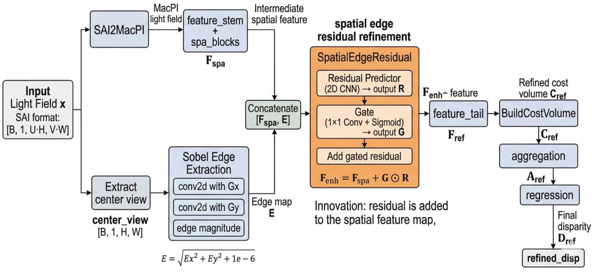

# Pipeline

## Input

Input light field `x` has shape **[B, 1, U·H, V·W]** in SAI arrangement.

## Step 1. Extract the center view from the original SAI input

Before any MacPI conversion, the code extracts the center sub-aperture image:

$$
\text{center\\_view} = x[:, :, cH:(c+1)H,; cW:(c+1)W]
$$

This center view is only used as the **guidance image** for the **edge-based spatial residual block**.

## Step 2. Convert SAI to MacPI

The full light field is rearranged by `SAI2MacPI(x, angRes)`.

This produces the MacPI representation used by the feature extractor.

## Step 3. Early spatial feature extraction

The MacPI input goes through:

- `feature_stem`
- `spa_blocks`

This gives an intermediate spatial feature map:

$$
F_{\text{spa}}
$$

This is the feature map that the new refinement block really modifies.

## Step 4. New block: spatial edge residual refinement

The innovation is here:

$$
F_{\text{enh}} = \text{SpatialEdgeResidual}(F_{\text{spa}}, \text{center\\_view})
$$

Inside `SpatialEdgeResidual`, the code does this:

### 4.1 Resize guidance if needed

If the center-view resolution does not match the feature-map resolution, it is bilinearly resized to the feature-map size.

### 4.2 Compute fixed Sobel edge magnitude from the center view

The block applies fixed Sobel filters in x and y directions:

$$
E_x = \text{conv2d}(\text{guidance}, G_x), \qquad
E_y = \text{conv2d}(\text{guidance}, G_y)
$$

and then computes edge magnitude:

$$
E = \sqrt{E_x^2 + E_y^2 + 10^{-6}}
$$

The edge map comes from the **center-view image**.

### 4.3 Concatenate feature map and edge map

The **feature map** and **edge map** are concatenated along the channel dimension:

$$
[F_{\text{spa}}, E]
$$

This concatenated tensor is the input to the residual predictor and gate.

### 4.4 Predict a residual feature map

A small 2D CNN predicts a residual:

$$
R = \text{ResidualPredictor}([F_{\text{spa}}, E])
$$

### 4.5 Predict a gate

A 1×1 conv + sigmoid predicts a gate:

$$
G = \sigma(\text{Gate}([F_{\text{spa}}, E]))
$$

### 4.6 Add gated residual back to the original spatial feature

The final enhanced feature is:

$$
F_{\text{enh}} = F_{\text{spa}} + G \odot R
$$

This is the most important equation in the implementation.

The residual is added back to the **spatial feature map**, not to the cost volume.

## Step 5. Refined branch: rebuild feature and cost volume from enhanced spatial feature

The enhanced feature goes through `feature_tail`:

$$
F_{\text{ref}} = \text{feature\\_tail}(F\_{\text{enh}})
$$

Then a **new cost volume** is built from this refined feature:

$$
C_{\text{ref}} = \text{BuildCostVolume}(F_{\text{ref}})
$$

So the new block affects the cost volume **indirectly**, by changing the feature map **before** cost-volume construction.

## Step 6. Aggregate and regress refined disparity

Then:

$$
A_{\text{ref}} = \text{aggregation}(C_{\text{ref}})
$$

$$
D_{\text{ref}} = \text{regression}(A_{\text{ref}})
$$

This gives the final refined disparity.

## Step 7. Training output

During training, the network returns: `refined_disp`