# World Models

<aside>

[Paper](https://arxiv.org/abs/1803.10122) | [Homepage](https://worldmodels.github.io/)

</aside>

There is an interactive loop between the agent and the environment. The agent observes the environment, takes an action in response, and then the environment changes accordingly. The agent model can be viewed as the brain of the agent: it is the overall decision-making system that enables the agent to perceive the environment, maintain temporal context, and choose actions.

An typical agent model has three components, three models:

- Vision model (**V**): observation → observation latent vector
- Memory RNN (**M**): observation latent vector → next memory vector, predict future states
- Controller (**C**): observation latent vector + memory vector → action

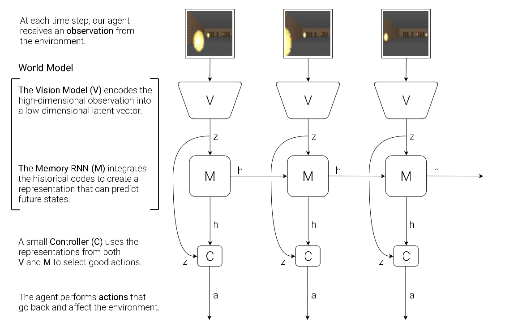

We introduce **world model**, or **dynamics model**, which is the combination of **V** and **M**, whose main function is to predict the next observation latent state $z_{t+1}$, based on the **action**, **observation** latent state and **memory** hidden state at this timestep. The formula is $P(z_{t+1} | a_t, z_t, h_t)$, you can find more details later.

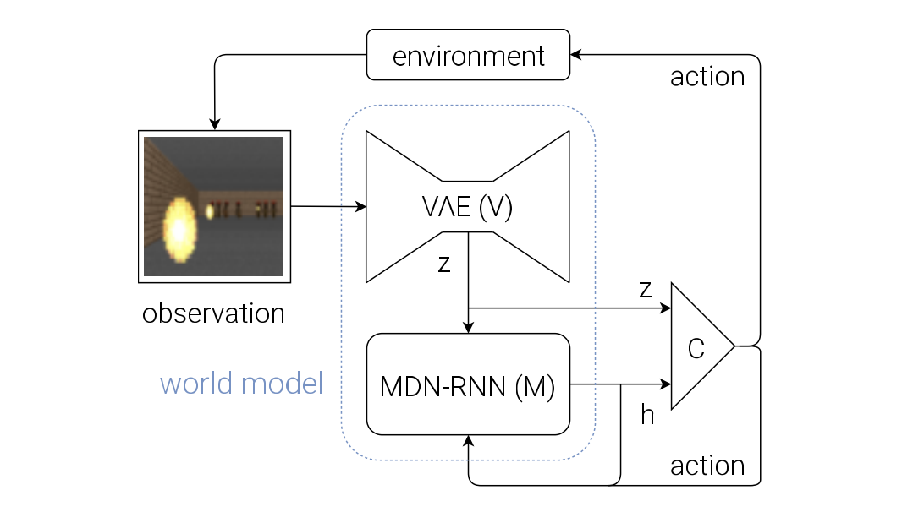

## VAE(V) Model

This input is usually a **2D image frame** that is part of a video sequence. And the role of the V model is to learn **an abstract, compressed representation of each observed input frame**.  

The transition is **from observation $o_t$ to latent vector $z_t$**.

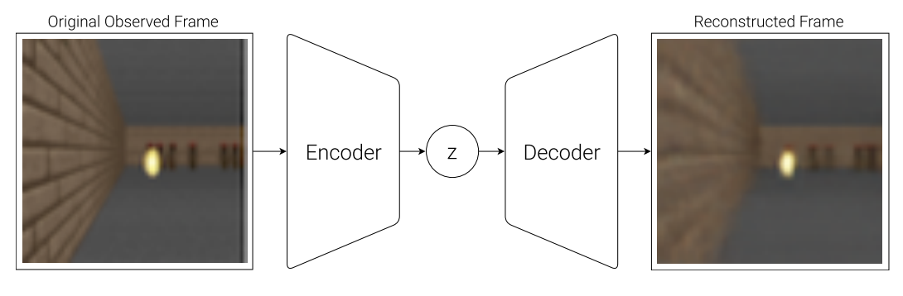

This is what the paper used, a simple **Variational Autoencoder (VAE)** ([Kingma et al. 2013](https://arxiv.org/pdf/1312.6114)). 

We can train the VAE to encode each frame into low dimensional latent vector z by **minimizing the difference between a given frame and the reconstructed version of the frame produced by the decoder from** $z$.

## MDN-RNN (M) Model

Except the spatial compression, we also need to compress temporal info. To put it another way, the role of the M model is to **predict the future**. 

As the following figure, **a Mixture Density Network with a RNN (MDN-RNN)** will model $P(z_{t+1} | a_t, z_t, h_t)$, which is used to predict the future observation latent vector.

The meaning of each parameter:

- $z_{t+1}$ is the observation latent vector at time $t + 1$
- $a_t$ is the action taken at time $t$
- $z_t$ is the observation latent vector at time $t$
- $h_t$ is the hidden state of the RNN at time $t$ (memory)

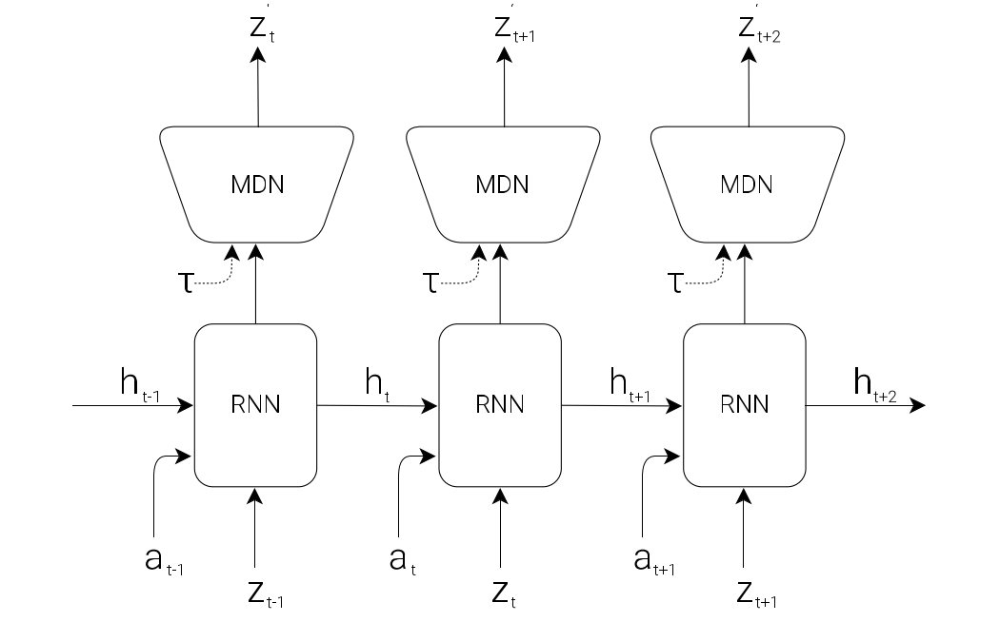

The MDN actually produces two closely related outputs: the next hidden state $h_{t+1}$(memory), and a prediction of the next latent vector $z_{t+1}$ (observation). 

This model is just a probabilistic output head on top of the RNN hidden state. It contains **a few fully connected layers**, usually three, one for the mixture weights $\pi$, one for means $u$, one for variance $σ$. Its main role is to model uncertainty over possible next latent states. 

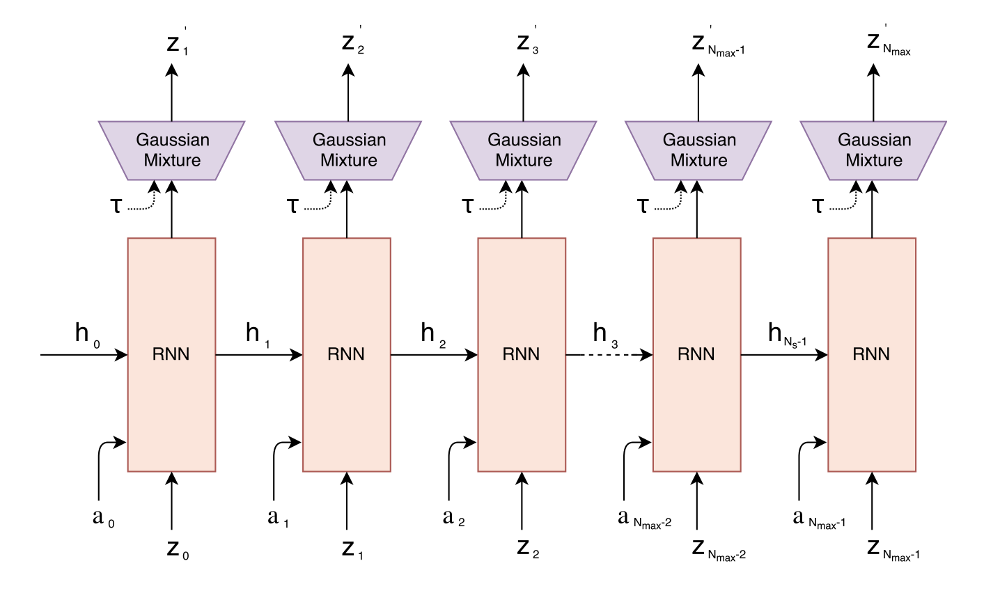

Concretely, it outputs a **mixture of $K$ Gaussian components** for the whole next latent vector.

- $\pi_k$ gives the probability of choosing component $k$,
- $\mu_k$ is the mean latent vector of that component,
- $\sigma_k$ gives the uncertainty of that component.

The MDN head is not very important if we only use the RNN as a memory module in the control loop, but it becomes important when we want to train or roll out the agent inside the dream environment.

During sampling, how do we actually get the next latent vector? 

Not by choosing highest $\pi$ and around mean in the strict sense. Instead, the standard sampling process has two steps:

- Step 1: choose a component → sample $k$ from the categorical distribution:

$$
k \sim \text{Categorical}(\pi_1,\dots,\pi_K)
$$

- Step 2: sample latent from that Gaussian:

$$
z_{t+1} \sim \mathcal{N}(\mu_k,\sigma_k)
$$

We can adjust a temperature parameter $τ$ to control model uncertainty by controling the randomness of the sampling process, which is useful for training the controller later on.

### An simple 1D example

- $\pi$ = [0.1, 0.7, 0.2])
- $\mu$ = [$\mu_1$, $\mu_2$, $\mu_3$])
- $\sigma$ = [$\sigma_1$, $\sigma_3$, $\sigma_2$])

This means:

- component 1: weight 0.1, mean 1, std 0.5
- component 2: weight $\mu_1$, mean $\mu_2$, std $\mu_3$
- component 3: weight $\sigma_1$, mean $\sigma_2$, std $\sigma_3$

Each one represents **one possible Gaussian distribution for the next observation latent**.

Finally we choose the component 1 by weighted sampling, then sample $\mu_1$ as next observation latent.

## Controller (C) Model

**The Controller (C) model** is responsible for determining the actions to maximize the expected cumulative reward of the agent during a rollout of the environment. This model is trained separately from V and M, so that most of our agent’s complexity resides in the **world model (V and M)**. C is a simple single layer linear model that maps concatenated input vector $[z_t\ h_t]$ directly to action at at each time step:

$$
a_t = W_c\ [z_t\ h_t] + b_c
$$

- $a_t$ is the predicted action taken at time $t$
- $W_c$ is the weight matrix
- $z_t$ is the observation latent vector at time $t$
- $h_t$ is the hidden state of the RNN at time $t$ (memory)
- $b_c$ is the bias vector

## Putting V, M and C Together

This is the flow diagram of our Agent model. 

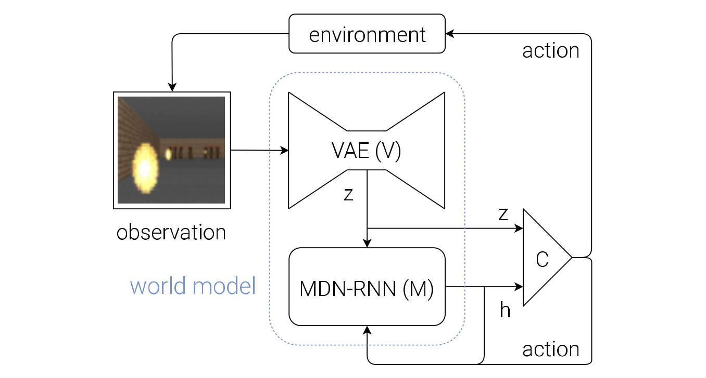

The raw observation $o_t$ is first processed by V at each time step t to produce $z_t$. $(o_t → z_t)$

The input into C is this latent vector $z_t$ and M’s hidden state $h_t$. $(z_t, h_t → [z_t\ h_t])$

C output an action vector $a_t$ for motor control, and will affect the environment. ($[z_t\ h_t] → a_t$)

M will then take the current $z_t$ and action $a_t$ as an input to update its own hidden
state to produce $h_{t+1}$ to be used at time t + 1. $([z_t\ h_t], a_t → h_{t+1})$ (No MDN head)

The following is the pseudocode for how the agent model is used in the OpenAI Gym ([Brockman et al., 2016](https://arxiv.org/abs/1606.01540)) environment:

```python
def rollout(controller):
	’’’ env, rnn, vae are global variables’’’
	obs = env.reset()
	h = rnn.initial_state()
	done = False
	cumulative_reward = 0
	while not done:
		z = vae.encode(obs)
		a = controller.action([z, h])
		obs, reward, done = **env.step(a)**
		cumulative_reward += reward
		h = rnn.forward([a, z, h])
	return cumulative_reward
```

We can see here, the $P(z_{t+1} | a_t, z_t, h_t)$ wasn’t involved in our discussion. Because in this rollout code, we are interacting with the **real environment** `env.step(a)`, not yet rolling out purely inside the dream model. But world model come into play when generating the memory.

In dream model, we’ll use this model to predict the environment directly so we don’t need to access real environment.

## Car Racing Experiment

Below are the steps taken by the Car Racing experiment:

1. Collect 10,000 rollouts from a random policy.
2. Train VAE (V) to encode frames into $z ∈ R^{32}$.
3. Train MDN-RNN (M) to model $P(z_{t+1} | a_t, z_t, h_t)$.
4. Define Controller (C) as $a_t = W_c\ [z_t\ h_t] + b_c$.
5. Use CMA-ES to solve for a $W_c$ and $b_c$ that maximizes the expected cumulative reward.

Until now, the world model is not being used, because we **roll out on the real environment**. The controller prodicts next action, and this action acts in the real environment and produce the new environment, which can be send to the world model as new input.

Since our world model is able to model the future, we are also able to use it to generate hypothetical car racing scenarios on its own. Then we can move the controller model to this dream environment to come into play.

## VizDoom Environment

We have just seen that a policy learned inside of the real environment appears to somewhat function inside of the dream environment. This introduces a question:

<aside>

**Can we train our agent to learn inside of its own dream, and transfer this policy back to the actual environment ?!**

If our world model is sufficiently accurate for its purpose, and complete enough for the problem at hand, we should be able to substitute the actual environment with this world model.

</aside>

After all, our agent does not directly observe the reality, but only sees what the world model lets it see.

This is the agent we trained to play the game: VizDoom, its task is to **take cover**.

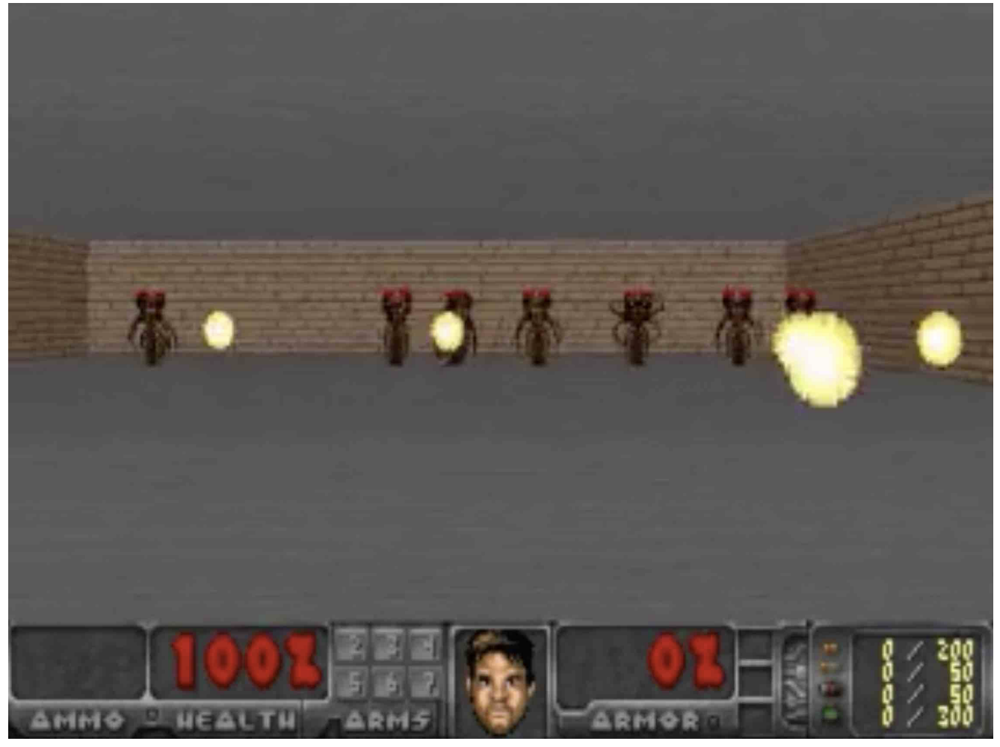

The agent must learn to avoid fireballs shot by monsters from the other side of the room with the sole intent of killing the agent.

The workflow of this experiment is:

1. Collect 10,000 rollouts (or we can say trajectories) from a random policy inside the **real Gym environment**.
2. Train world model
    1. **Train VAE (V)** to encode each frame into a latent vector $z ∈ R^{64}$, and use V to convert the images collected from the collections into the latent space representation.
    - **Train MDN-RNN (M)** to model $P(z_{t+1}, d_{t+1} | a_t, z_t, h_t)$. At timestep $t$, we can ask it to produce the probability distribution of $z_{t+1}$ given the current $z_t$ and $a_t$, sample a $z_{t+1}$ and use this sample (dream environment) as the real observation, and also generate a $h_{t+1}$.
- **Train Controller (C)** as $a_t = W_c\ [z_t\ h_t]$. Train it to maximize the expected survival time inside the virtual environment. In this case, map from $z_{t+1}$, $h_{t+1}$ to $a_{t+1}$ inside this learned environment instead of using the real one.

<aside>

The world model is trained to **mimic a complet game environment designed by human programmers**. 

By learning only from raw image data collected from random episodes, **it learns how to simulate the essential aspects of the game** – such as the game logic, enemy behaviour, physics, and also the 3D graphics rendering.

</aside>

This is the reconstruction result, which is super realistic, almost same with the screenshot image.

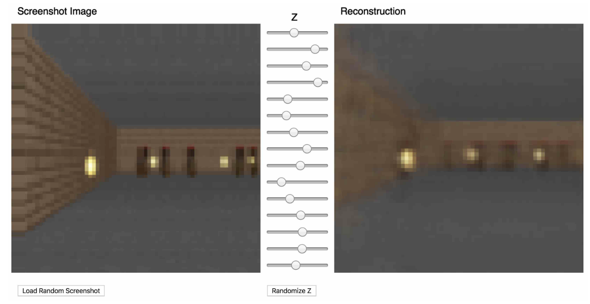

This approach of learning a policy inside a learned dynamics model has several obvious advantages, like making the game more challenging in the dream environment so the policy becomes stronger, like a player trained on levels beyond hell mode.

Its weakness is that our agent can easily find an adversarial policy that can **fool the dynamics model**, it’ll find a policy that looks good under our dynamics model, but will fail in the actual environment.

## Iterative Training Procedure

We want to extend this model to more complex situations with difficult environment, where parts of the world are available to the agent only after it learns how to strategically navigate through its world. It’s hard to collect effective data in this scenario.

For more complicated tasks, an **iterative training procedure** is requried, which is as follows:

1. Initialize M, C with random model parameters.
2. Rollout to actual environment $N$ times. Save all actions $a_t$ and observations $x_t$ during rollouts to storage.
3. Train M to model the **whole joint distribution** of what happens at the next step, including the observation, done, action and reward. (this model **predicts action** because the C model is small, we want it to rely on the knowledge already absorbed by the world model and focus on learning more higher level skills.)
    
    $$
    P(x_{t+1}, r_{t+1}, a_{t+1}, d_{t+1} \mid x_t, a_t, h_t)
    $$
    
    and train C to optimize expected rewards inside of M.
    
4. Go back to (2) if task has not been completed.

We can relate world models to the neuroscience idea of **hippocampal replay**. When an animal rests or sleeps, the brain may internally replay recent experiences.  After **sensory information** is stored in **short-term memory**, the brain may internally **rehearse** recent experiences during rest or sleep. This replay supports **memory consolidation**, the process by which initially hippocampus-dependent short-term memories gradually become more stable **long-term memories**. 

In this sense, replay is closer to **structured internal thought** than to random dreaming. In RL, this is analogous to **experience replay** and **imagined rollouts**, where simulated trajectories are revisited to improve learning.

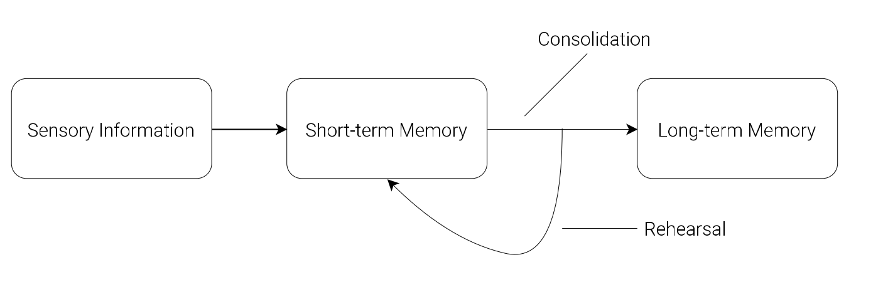

## Discussion

Training an agent to perform tasks entirely inside of its simulated latent space dream world. This approach offers many practical benefits. For instance, **running computationally intensive game engines require using heavy compute resources for rendering the game states into image frames, or calculating physics not immediately relevant to the game.**

<aside>

Future work may explore replacing the small MDN-RNN network with higher capacity models.

</aside>

In the current simple C–M setup, a driving agent predicts future frames step by step, such as what the road will look like at $t+1, t+2, t+3$ after steering left. This is different from human-like planning, which would reason more abstractly, e.g. “slow down for the curve, stay in lane, then accelerate.” 

In a more general C–M system, the controller could use parts of the model as reusable subroutines, such as estimating danger, checking whether a path is blocked, or judging distance to a goal. 

In an even more general One Big Net ([J Schmidhuber · 2018](https://arxiv.org/abs/1802.08864)) setup, prediction and control are merged into one recurrent network. Behavioural replay then helps preserve old skills, for example preventing a robot from forgetting how to open a drawer after learning a new bottle-picking task.

# Robotic World Model

<aside>

[Paper](https://arxiv.org/abs/2501.10100) | [Homepage](https://sites.google.com/view/roboticworldmodel)

</aside>

A world model seeks to accurately represent complex, partially observable, and stochastic dynamics, enabling it to function as a learned simulator conditioned on the system state. In this paper, the authors propose a new world model, the **R**obotic **W**orld **M**odel (**RWM**), designed to address major challenges in robotics such as long-horizon prediction (in other words, capable of long autoregressive rollouts), error accumulation, and sim-to-real transfer.

# DINO-WM

<aside>

[Paper](https://arxiv.org/abs/2411.04983) | [Homepage](https://dino-wm.github.io/) | [Github](https://github.com/gaoyuezhou/dino_wm)

</aside>

The authors present DINO World Model (**DINO-WM**), a new method to model visual dynamics leveraging spatial **patch features** pre-trained with **DINOv2**. 

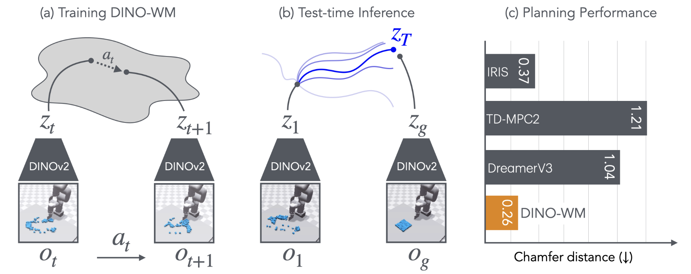

DINO-WM has three parts:

- **observation model**: pre-trained **DINOv2** model as encoder, converts image to patch embeddings. The observation model remains **frozen** during training and testing

$$
o_t \xrightarrow{\text{DINOv2}} z_t
$$

$$
z_t ∼ \text{enc}_θ(z_t | o_t)
$$

- **transition model**: a **ViT-based dynamics model** that takes past latent states with length H and actions, then predicts the next latent state

$$
(z_{t-k:t}, a_{t-k:t}) \xrightarrow{\text{ViT transition model}} \hat z_{t+1}
$$

$$
z_{t+1} ∼ p_θ(z_{t+1} | z_{t−H:t}, a_{t−H:t})
$$

- **decoder**: a transposed-convolution image decoder. Optional for visualization, not required for the main training objective

$$
\hat{o_t} ∼ q_θ(o_t | z_t)
$$

### Training Pipeline - paper rough version

- **Input:** a history window of observations and actions of length $H$
    
    $$
    o_{t-H:t-1}, a_{t-H:t-1}
    $$
    
- **Observation encoder**
    - resize each image to $\mathbb{R}^{3\times224\times224}$
    - pass it through a **frozen DINOv2**
    - get patch latents
        
        $$
        z \in \mathbb{R}^{N\times d}
        $$
        
        where
        
        - $N$: number of image patches
        - $d$: patch embedding dimension
    
    $$
    o_{t-H:t-1}\in\mathbb{R}^{H\times3\times224\times224}
    \rightarrow
    z_{t-H:t-1}\in\mathbb{R}^{H\times N\times d}
    $$
    
- **Action encoder**
    - each action is originally
    
    $$
    a_t \in \mathbb{R}^{\text{DoF}}
    $$
    
    - an MLP maps it to a 10-dim embedding
        
        $$
        e(a_t)\in\mathbb{R}^{10}
        $$
        
    
    $$
    a_{t-H:t-1}\in\mathbb{R}^{H\times \text{DoF}}
    \rightarrow
    e(a_{t-H:t-1})\in\mathbb{R}^{H\times10}
    $$
    
- **Transition model input construction**
    - two input:
    
    $$
    z_{t-H:t-1}\in\mathbb{R}^{H\times N\times d}
    $$
    
    $$
    e(a_{t-H:t-1})\in\mathbb{R}^{H\times10}
    \rightarrow
    \text{repeat over patches}
    \rightarrow
    \mathbb{R}^{H\times N\times10}
    $$
    
    - repeat the action embedding of each frame across all $N$ patch tokens,
    - concatenate it with each patch token of the same frame
    
    $$
    x = [z,e(a)] \in \mathbb{R}^{H\times N\times(d+10)}
    $$
    
    $$
    (z_{t-H}, a_{t-H}), \cdots,(z_{t-1}, a_{t-1}) \rightarrow \hat z_t
    $$
    
    - Flatten the first two dimensions into a token sequence:
    
    $$
    x \in \mathbb{R}^{(H N)\times(d+10)}
    $$
    
- **Dynamics model**
    - feed the $HN$ conditioned tokens into a **causal temporal transformer**
        
        $$
        x \in \mathbb{R}^{(H N)\times(d+10)} → \mathbb{R}^{(H N)\times (d+10)}
        $$
        
- **Training objective**
    - match predicted next-frame latent part of the output to ground-truth latent
    
    $$
    \mathbb{R}^{H\times N\times d}\ \text{from}\ \mathbb{R}^{(H N)\times (d+10)}
    $$
    
    $$
    L = |\hat z_t - z_t|_2^2
    $$
    
    - optional decoder is only for visualization

### Training Pipeline - Repo version

- **Input:** training uses trajectory windows of length $H+\text{num\\_pred}$
    - in the default setup, $\text{num\\_pred}=1$, so each sample contains:
    
    $$
    o_{t:t+H} ,\quad a_{t:t+H},\quad p_{t:t+H}
    $$
    
    where:
    
    - $o$: image observation
    - $a$: action
    - $p$: proprio state, which means the feature vector for the non-visual robotic state
    
    So the full training window is:
    
    $$
    (H+1)\ \text{timesteps}
    $$
    
    not just $H$ timesteps.
    
- **Form source and target sequences**
    - the model uses the first $H$ steps as source
    - and the shifted last $H$ steps as target
    
    $$
    \text{source: } (o_{t:t+H-1}, a_{t:t+H-1}, p_{t:t+H-1})
    $$
    
    $$
    \text{target: } (o_{t+1:t+H}, p_{t+1:t+H})
    $$
    
    - So training supervises $H$ **one-step-ahead predictions in parallel**, not only one $\hat z_t$.
- **Observation encoder**
    - each image is resized to **$196\times196$** in the default code path
    - then passed through **frozen DINOv2-ViT-S/14**
    - output:
    
    $$
    z^{\text{visual}} \in \mathbb{R}^{N\times d}
    $$
    
    with default values:
    
    $$
    N=196,\qquad d=384
    $$
    
    Thus:
    
    $$
    o_{t:t+H}\in\mathbb{R}^{(H+1)\times3\times196\times196}
    \rightarrow
    z^{\text{visual}}_{t:t+H}\in\mathbb{R}^{(H+1)\times196\times384}
    $$
    
- **Proprio encoder**
    - proprio state is projected to a **10-dimensional embedding**
    
    $$
    p_t \in \mathbb{R}^{\text{prop\\_dim}}
    \rightarrow
    e(p_t)\in\mathbb{R}^{10}
    $$
    
    - over the whole window:
    
    $$
    p_{t:t+H}\in\mathbb{R}^{(H+1)\times \text{prop\\_dim}}
    \rightarrow
    e(p\_{t:t+H})\in\mathbb{R}^{(H+1)\times10}
    $$
    
- **Action encoder**
    - each model-step action is **not** just $\mathbb{R}^{\text{DoF}}$
    - because actions are concatenated across frame skip, one model-step action is:
    
    $$
    a_t \in \mathbb{R}^{\text{DoF}\cdot\text{frameskip}}
    $$
    
    - action is projected to a **10-dimensional embedding**
    - in the default repo, this projection is a **Conv1d with kernel size 1**, which is effectively a per-timestep linear projection
    
    $$
    a_t \in \mathbb{R}^{\text{DoF}\cdot\text{frameskip}}
    \rightarrow
    e(a_t)\in\mathbb{R}^{10}
    $$
    
    - over the whole window:
    
    $$
    a_{t:t+H}\in\mathbb{R}^{(H+1)\times(\text{DoF}\cdot\text{frameskip})}
    \rightarrow
    e(a_{t:t+H})\in\mathbb{R}^{(H+1)\times10}
    $$
    
- **Token composition**
    - with the default `concat_dim = 1`, both proprio embedding and action embedding are repeated across all visual patches and concatenated onto every patch token
    - for one timestep:
    
    $$
    z_t^{\text{visual}}\in\mathbb{R}^{196\times384}
    $$
    
    $$
    e(p_t)\in\mathbb{R}^{10}
    \rightarrow
    \text{repeat across 196 patches}
    \rightarrow
    \mathbb{R}^{196\times10}
    $$
    
    $$
    e(a_t)\in\mathbb{R}^{10}
    \rightarrow
    \text{repeat across 196 patches}
    \rightarrow
    \mathbb{R}^{196\times10}
    $$
    
    - then concatenate:
    
    $$
    x_t = [z_t^{\text{visual}}, e(p_t), e(a_t)]
    \in
    \mathbb{R}^{196\times(384+10+10)}
    $$
    
    - so by default:
    
    $$
    x_t \in \mathbb{R}^{196\times404}
    $$
    
    - over the source history of length $H$:
    
    $$
    x_{t:t+H-1}\in\mathbb{R}^{H\times196\times404}
    $$
    
- **Transition / predictor model**
    - flatten the $H\times N$ source tokens into one token sequence
    
    $$
    x_{t:t+H-1}\in\mathbb{R}^{H\times196\times404}
    \rightarrow
    \mathbb{R}^{(H\cdot196)\times404}
    $$
    
    - pass through a **causal transformer**
    - then reshape back to timestep-patch structure
    
    $$
    \mathbb{R}^{(H\cdot196)\times404}
    \rightarrow
    \text{causal transformer}
    \rightarrow
    \mathbb{R}^{(H\cdot196)\times404}
    \rightarrow
    \hat x_{t+1:t+H}\in\mathbb{R}^{H\times196\times404}
    $$
    
    - Important:
        - it predicts a **shifted sequence of length** $H$ in parallel
        - each position corresponds to **one-step-ahead prediction** for that timestep
    - so training is:

$$
(x_t,x_{t+1},\dots,x_{t+H-1})
\rightarrow
(\hat x_{t+1},\hat x_{t+2},\dots,\hat x_{t+H})
$$

- **Training target**
    - the target sequence is the shifted latent sequence:
    
    $$
    x_{t+1:t+H}
    $$
    
    - latent prediction loss compares predicted latents and target latents, includes:
        - visual latent dimensions
        - proprio latent dimensions
    - and excludes the appended action part
- **Loss**
    1. **latent prediction loss**
        
        $$
        L_{\text{pred}}
        $$
        
        MSE between predicted and target latent, excluding action dimensions
        
    2. **decoder reconstruction loss**
        
        $$
        L_{\text{recon}}
        $$
        
        reconstruction loss from decoded encoded latents
        
    3. **VQ-style / decoder regularization term**
    
    $$
    L_{\text{vq}}
    $$
    
    So the default total loss is:
    

$$
L = L_{\text{pred}} + L_{\text{recon}} + L_{\text{vq}}
$$

A reconstruction loss on decoded **predicted** latents is also computed and logged, but is not added into the total loss in this implementation.

### Inference Pipeline (MPC)

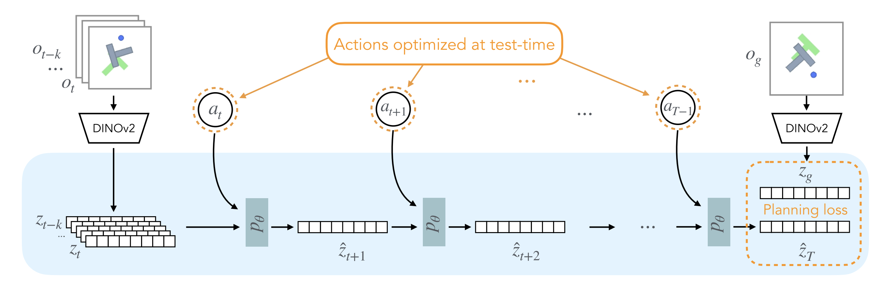

- **Input:** current observation history $o_{t-k:t}$ and a goal observation $o_g$
- **Observation encoding**
    - resize each image to $\mathbb{R}^{3\times224\times224}$
    - pass through **frozen DINOv2**
    - get current latent history and goal latent
    
    $$
    o_{t-k:t}\in\mathbb{R}^{H\times3\times224\times224}
    \rightarrow
    z_{t-k:t}\in\mathbb{R}^{H\times N\times d}
    $$
    
    $$
    o_g\in\mathbb{R}^{3\times224\times224}
    \rightarrow
    z_g\in\mathbb{R}^{N\times d}
    $$
    
- **Sample action sequences with CEM**
    - sample $M$ candidate future action sequences over planning horizon $T$
    
    $$
    a_{t:T-1}^{(m)} \in \mathbb{R}^{(T-t)\times \mathrm{DoF}}, \quad m=1,\dots,M
    $$
    
    - embed each action to dimension 10
    
    $$
    a_{t:T-1}^{(m)}
    \rightarrow
    e(a_{t:T-1}^{(m)}) \in \mathbb{R}^{(T-t)\times 10}
    $$
    
    - CEM pipeline, iteratively:
        - samples $M$ candidate action sequences
        - evaluates them with the world model
        - keeps the top-performing ones
        - updates the sampling distribution
        - resamples and repeats
- **Rollout each sequence in latent space**
    - for each sampled action sequence, roll the latent dynamics model autoregressively
    - for one candidate sequence $a_{t:T-1}^{(m)}$:
    
    $$
    z_{t-k:t}
    \xrightarrow[]{a_t^{(m)}}
    \hat z_{t+1}^{(m)}
    \xrightarrow[]{a_{t+1}^{(m)}}
    \hat z_{t+2}^{(m)}
    \rightarrow
    \cdots
    \xrightarrow[]{a_{T-1}^{(m)}}
    \hat z_T^{(m)}
    $$
    
    - each one-step rollout is:
    
    $$
    [\hat z_{\tau}^{(m)}, e(a_\tau^{(m)})]
    \rightarrow
    p_\theta
    \rightarrow
    \hat z_{\tau+1}^{(m)}
    $$
    
    where
    
    $$
    \hat z_{\tau}^{(m)} \in \mathbb{R}^{N\times d},\quad
    e(a_\tau^{(m)}) \in \mathbb{R}^{10}
    $$
    
- **Score by final-latent-to-goal-latent MSE**
    - compute the planning cost for each candidate sequence by comparing its final predicted latent with the goal latent
    
    $$
    L_{\text{plan}}^{(m)} = |\hat z_T^{(m)} - z_g|_2^2
    $$
    
    - choose the action sequence with the lowest cost
    
    $$
    m^* = \arg\min_m L_{\text{plan}}^{(m)}
    $$
    
- **Execute first action**
    - take only the first action from the best sequence
    
    $$
    a_t^{} = a_t^{(m^*)}
    $$
    
    - apply it in the real environment
- **Observe again and replan**
    - get the next real observation $o_{t+1}$
    - encode it with DINOv2
    - update the latent history window
    - run CEM again from the new state

$$
\text{plan} \rightarrow \text{execute } a_t^* \rightarrow \text{observe } o_{t+1} \rightarrow \text{replan}
$$

### Inference Pipeline (MPC) - Repo version

- **Encode current obs and goal obs**
    - the planner takes a **single current observation** $o_t$ and a **single goal observation** $o_g$, not an explicit observation history window
    - both are preprocessed and encoded by the observation model into latent representations
    - with the default DINO encoder, the visual latent is patch-token based:
    
    $$
    o_t \rightarrow z_t^{\text{visual}} \in \mathbb{R}^{N\times d},
    \qquad
    o_g \rightarrow z_g^{\text{visual}} \in \mathbb{R}^{N\times d}
    $$
    
    - if proprio is enabled, the observation is also encoded into a proprio latent:
    
    $$
    o_t \rightarrow z_t^{\text{prop}},
    \qquad
    o_g \rightarrow z_g^{\text{prop}}
    $$
    
- **Sample action sequences with CEM**
    - CEM samples candidate action sequences in **planner action space**
    - each planner-step action is not just $\mathrm{DoF}$, but $\text{frameskip}\times \mathrm{DoF}$, so we can execute $\text{frameskip}$ actions in the meantime, which makes planning cheaper:
    
    $$
    a_\tau \in \mathbb{R}^{\text{frameskip}\times \mathrm{DoF}}
    $$
    
    - over planning horizon $H_{\text{plan}}$, one candidate sequence is:
    
    $$
    a_{t:t+H_{\text{plan}}-1}^{(m)}
    \in
    \mathbb{R}^{H_{\text{plan}} \times (\text{frameskip}\cdot \mathrm{DoF})}
    $$
    
    - CEM iteratively:
        - samples $M$ candidate sequences
        - rolls them out through the world model
        - keeps the top-performing ones
        - updates the sampling distribution
        - resamples and repeats
- **Rollout each sequence in latent space**
    - for each sampled sequence, the latent world model predicts future latent states autoregressively
    - for one candidate sequence:
    
    $$
    (z_t, a_t^{(m)}) \rightarrow \hat z_{t+1}^{(m)}
    \rightarrow
    (\hat z_{t+1}^{(m)}, a_{t+1}^{(m)}) \rightarrow \hat z_{t+2}^{(m)}
    \rightarrow \cdots \rightarrow \hat z_{t+H_{\text{plan}}}^{(m)}
    $$
    
    - visual latents are predicted in patch-token space, and proprio latents are predicted in parallel if enabled
- **Score by final-latent-to-goal-latent objective**
    - each candidate sequence is scored using the **final predicted latent** against the **encoded goal latent**
    - the default last-step objective is:
    
    $$
    L^{(m)} = L_{\text{visual}}^{(m)} + \alpha L_{\text{proprio}}^{(m)}
    $$
    
    where
    
    $$
    L_{\text{visual}}^{(m)} = |\hat z_{T,\text{visual}}^{(m)} - z_{g,\text{visual}}|_2^2
    $$
    
    $$
    L_{\text{proprio}}^{(m)} = |\hat z_{T,\text{prop}}^{(m)} - z_{g,\text{prop}}|_2^2
    $$
    
    - if $\alpha=0$, this reduces to visual-latent MSE only
- **Execute planned action chunk**
    - select the best sequence:
    
    $$
    m^*=\arg\min_m L^{(m)}
    $$
    
    - unlike classical MPC that executes only the first action, this repo executes a **chunk** of planned actions before replanning
    - specifically, it executes $\text{goal\\_H} \times \text{frameskip}$ low-level environment steps forward
        - take the first **goal_H** planner steps from the best sequence
        - each planner-step action is then unpacked into **frameskip** low-level environment actions for actual execution
- **Observe again and replan**
    - after executing the full action chunk, get the **last real observation**
    - replace the current condition with that last observed frame
    - re-encode it
    - run CEM again from the new real state

$$
\text{plan} \rightarrow \text{execute goal\\_H planner steps, frameskip steps each} \rightarrow \text{observe last real frame} \rightarrow \text{replan}
$$

ssh ktan[@medphys423.medma.ad.uni-heidelberg.de](mailto:ACCOUNT@HOST.medma.ad.uni-heidelberg.de) -p 49200

## Experiments

### World Model for Control

- IRIS ([Micheli et al., 2023](https://arxiv.org/abs/2209.00588)): IRIS encodes visual inputs into tokens via a discrete autoencoder and predicts future tokens using a GPT Transformer, enabling policy and value learning through imagination.
- DreamerV3 ([Hafner et al., 2024](https://arxiv.org/abs/2301.04104)): DreamerV3 encodes visual inputs into categorical representations, predicts future states and rewards, and trains an actor-critic policy from imagined trajectories.
- TD-MPC2 ([Hansen et al., 2024](https://arxiv.org/abs/2310.16828)) : TD-MPC2 learns a decoder-free world model in latent space and uses reward signals to optimize the latents.
- AVDC ([Ko et al., 2023](https://flow-diffusion.github.io/AVDC.pdf)): AVDC uses a diffusion model to generate task execution videos from an initial observation and textual goal.

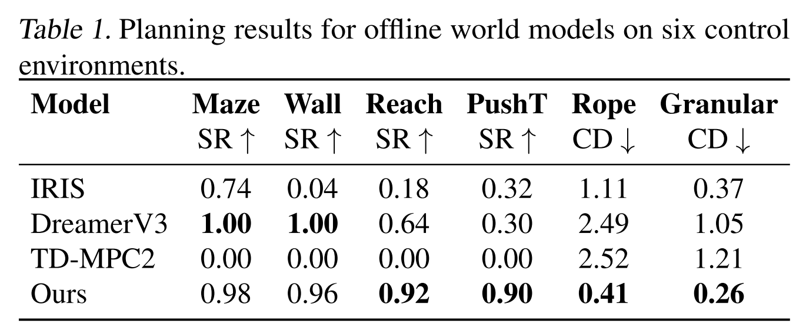

The following rows are different ways to choose actions using the learned world model:

- **CEM** = Cross-Entropy Method, a sampling-based optimizer. It samples many candidate action sequences, keeps the better ones, then updates the sampling distribution.
- **GD** = Gradient Descent, directly optimizes the action sequence by taking gradients through the world model.
- **MPC** = Model Predictive Control, at every step, re-plan using the world model, execute only the first action, then plan again from the new observation.

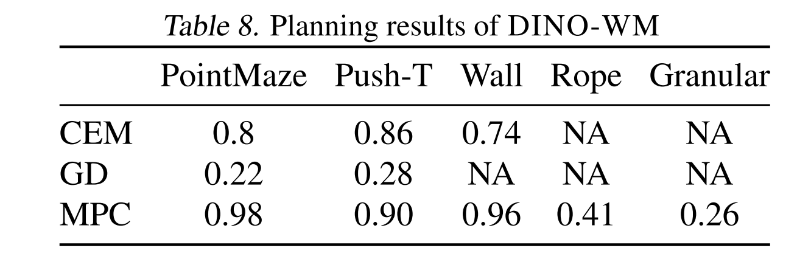

# V-JEPA 2

<aside>

[Paper](https://arxiv.org/abs/2506.09985) | [Blog](https://ai.meta.com/research/vjepa/) | [Github](https://github.com/facebookresearch/vjepa2)

</aside>

This paper explores a **self-supervised approach** that combines internet-scale video data with a small amount of interaction data (robot trajectories), to develop world model capable of understanding, predicting, and planning in the physical world.

Concretely, they first pre-train an action-free joint-embedding-predictive model, **V-JEPA 2**, on a video and image dataset comprising over 1M hours of internet video and 1M images, then align V-JEPA 2 with a large language model. Finally, post-training a latent action-conditioned world model **V-JEPA 2-AC** and apply it to robotic planning tasks.

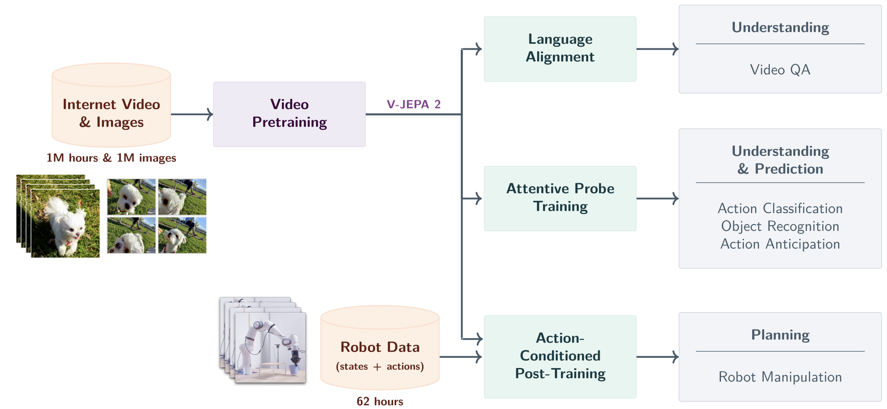

In other way, we first pretrain the V-JEPA 2 video encoder on internet-scale image and video data using **a visual mask denoising objective**. A video clip is patchified into a sequence of tokens and a mask is applied by dropping a subset of the tokens. 

Then, The encoder processes the masked video sequence and outputs an embedding vector for each input token. 

Next, the outputs of the encoder are concatenated with a set of learnable mask tokens that specify the position of the masked patches, and subsequently processed by the predictor. 

The outputs of the predictor are then regressed to the prediction targets using an L1 loss. The prediction targets are computed by an **ema-encoder**, the weights of which are defined as an exponential moving average of the encoder weights. 

After pretraining, we freeze the video encoder and learn a new action-conditioned predictor, **V-JEPA 2-AC**, on top of the learned representation. We leverage an autoregressive feature prediction objective that involves predicting the representations of future video frames conditioned on past video frames, actions, and end-effector states. 

Our action-conditioned predictor uses a block-causal attention pattern such that each patch feature at a given time step can attend to the patch features, actions, and end-effector states
from current and previous time steps.

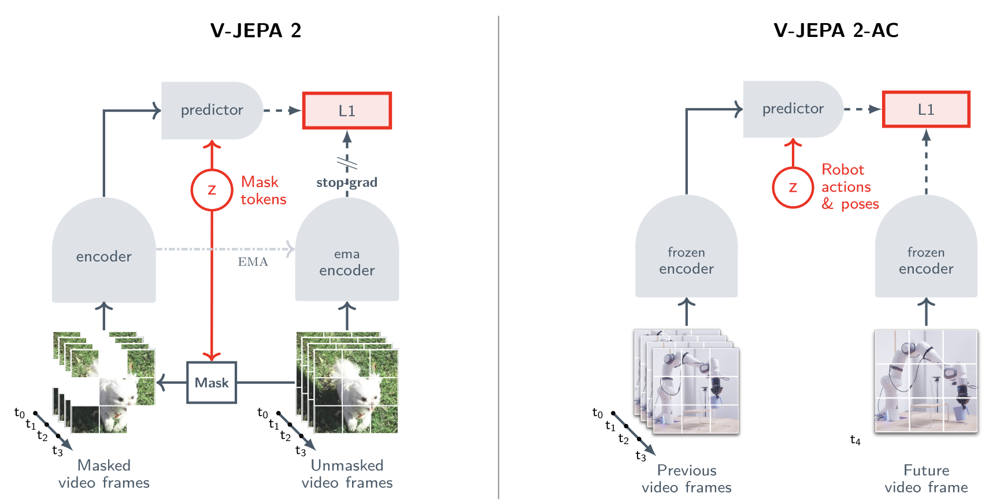

## Model Predictive Control (MPC)

<aside>

The key idea: at every time step, use a model of the system to predict the future, optimize the future control actions, apply only the first action, then repeat.

</aside>

So the loop is:

1. observe current system output
2. estimate current state
3. predict future behavior with a model
4. solve an optimization problem
5. send one control command to the real system
6. get new measurements
7. repeat

That is why MPC is a **receding horizon** controller.

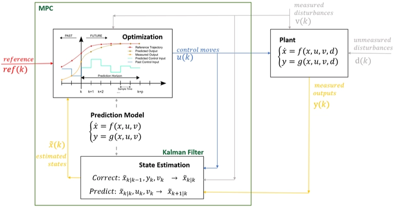

### Pipeline

The pipeline is basically:

1. **Image observation**
    
    $$
    o_t
    $$
    
2. **Encoder**
    
    $$
    z_t = E(o_t)
    $$
    
3. **Latent dynamics model**
    
    a model that predicts how a compressed hidden state of the world changes after an action.
    
    $$
    z_{t+1} \sim p(z_{t+1} \mid z_t, a_t)
    $$
    
4. **Model Predictive Control (MPC)** → decision-making algorithm
    - sample many **action sequences**
    - use the latent dynamics model to imagine futures
    - choose the best action sequence

# Project Idea

## The problem

<aside>

**Representation** in future-state generation.

Do one focused ablation paper project: 

1. DINO features vs learned features
</aside>

## Plan

Keep the **high-level pipeline** fixed: **image encoder → latent transition model → planning**

Then study one improvement:

1. **Representation study:** replace the image encoder / latent space

### Representation Study

The original DINO-WM paper already compares several observation encoders, including **R3M** ([Nair et al., 2022](https://arxiv.org/abs/2203.12601)), **ImageNet-pretrained ResNet-18** ([He et al., 2016](https://arxiv.org/abs/1512.03385)) , and **DINO CLS** ([Caron et al., 2021](https://arxiv.org/abs/2104.14294)), and shows that representation quality matters strongly for downstream planning.

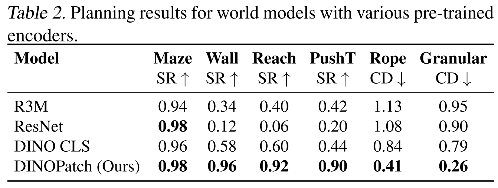

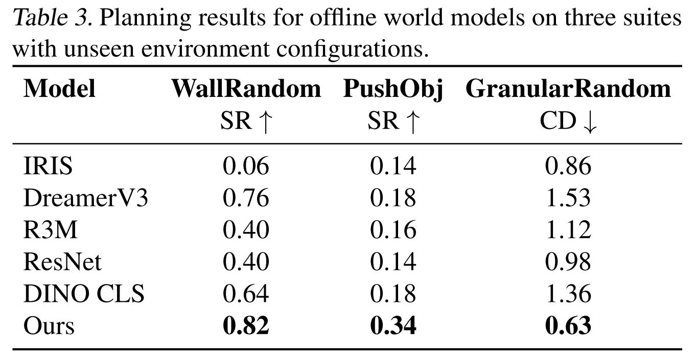

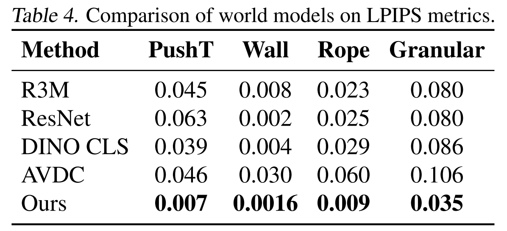

This project investigates **which visual representation makes an action-conditioned world model most effective**. Using **DINO-WM** as the backbone, I keep the **latent transition model** and **planning pipeline** as fixed as possible, and replace only the **visual encoder / latent space**. The original DINO-WM uses **pretrained DINOv2 patch features**, making it a clean and strong baseline.

The compared representations are:

- [**DINOv2**](https://arxiv.org/abs/2304.07193) patch tokens *(baseline).* The original DINO-WM representation; strong because it preserves both **semantic information** and **spatial patch structure**.
- [**V-JEPA 2**](https://arxiv.org/abs/2506.09985), a predictive self-supervised representation designed for **understanding, prediction, and planning in the physical world**.
- [**DINOv3**](https://arxiv.org/abs/2508.10104), a newer generation of DINO representation with improved **dense feature quality** and stronger scaling behavior, making it a promising replacement for DINOv2 in patch-based world modeling.
- [**DINO-Tok**](https://arxiv.org/abs/2511.20565), a DINO-based tokenizer that aims to preserve both **semantic abstraction** and **recoverable visual detail**.
- [**VFM-VAE**](https://arxiv.org/abs/2510.18457), an autoencoder-style latent built on frozen vision foundation model features, included to test whether a more **generative and reconstructive latent space** can compete with planning-oriented semantic features.

The goal is to understand whether DINO-WM’s performance comes mainly from:

1. **strong pretrained semantic representations**,
2. **spatially structured patch-level features**,
3. **predictive world-aware pretraining**,
4. **reconstructive / tokenizer-based latent design**,

or a combination of these factors.

My hypothesis is:

- **DINOv2 patch tokens** will remain a very strong baseline because they provide both semantics and spatial structure.
- **V-JEPA 2** may outperform DINOv2 if predictive pretraining yields a more planning-friendly latent.
- **DINOv3** may improve over DINOv2 because of stronger and more stable dense features.
- **DINO\-Tok** may offer a good tradeoff between semantic quality and latent structure.
- **VFM-VAE** may reconstruct observations better, but may be less directly aligned with long-horizon planning unless its latent space also preserves control-relevant structure.

A compact project version would be:

> Can newer predictive, dense-feature, or tokenizer-based visual representations, such as V-JEPA 2, DINOv3, DINO-Tok, or VFM-VAE, provide a better latent space for world modeling and planning than the pretrained DINOv2 patch features used in DINO-WM?
> 

## Experiments

For the [repo of DINO-WM](https://github.com/gaoyuezhou/dino_wm), I have placed downloaded pretrained checkpoints under `/checkpoints`, including `point_maze`, `pusht` and `wall_single`. But for this experiment, **we focus on task** `PointMaze`**, and skip other tasks like** `wall_single`**,** `pusht` **and** `defomable`**.** I have put downloaded `PointMaze` dataset zip file under `/data`. 

My expected workflow is:

1. **Complete the presettings**
    - Setup an environment
    - Install Mujoco
    - Configure data and checkpoints
2. **Run planning first with the pretrained checkpoint to reproduce paper result**
    
    This checks that:
    
    - MuJoCo works
    - dataset path is correct
    - checkpoint loading works
    - planner runs end to end
    
    The operations include:
    
    1. First, update `ckpt_base_path` to where the checkpoints are saved in the plan configs.
    2. Then launch planning runs with the following commands:
    
    ```bash
    python plan.py --config-name plan_point_maze.yaml model_name=point_maze
    ```
    
3. If the result is not as expected, then **retrain the DINO_WM**, the training setting should be same with repo required to match the original result in the paper.
    
    ```bash
    python train.py --config-name train.yaml env=point_maze frameskip=5 num_hist=3
    ```
    
4. If the result is as expected, then **modify the code** to switch the encoder (DINOv2) with these four encoders one by one:
    - [**V-JEPA 2**](https://arxiv.org/abs/2506.09985)
    - [**DINOv3**](https://arxiv.org/abs/2508.10104)
    - [**DINO-Tok**](https://arxiv.org/abs/2511.20565)
    - [**VFM-VAE**](https://arxiv.org/abs/2510.18457)
    
    The authors has done part of the representation study, to switch DINOv2 with ResNet and DINO CLS, so we can follow their comparison workflow to modify code.
    
5. **Train new models with settings:**
    
    ```bash
    python train.py --config-name train.yaml env=point_maze frameskip=5 num_hist=3
    ```
    
    Trained models are saved under `<ckpt_base_path>/outputs/<model_name>`
    
6. **Plan with our own trained checkpoint and the same PushT planning config**
    
    Once a world model has been trained, we use it for planning with a command like this:
    
    ```bash
    python plan.py --config-name plan_point_maze.yaml model_name=<your_model_name>
    ```
    
    Planning logs and visualizations can be found in `./plan_outputs`.
    

# References

[1] D. Ha et al., "Recurrent world models facilitate policy evolution," in *Proc. 32nd Int. Conf. Neural Inf. Process. Syst. (NIPS)*, 2018, pp. 2455–2467.

[2] D. P. Kingma et al., "Auto-encoding variational Bayes," in *Proc. 2nd Int. Conf. Learn. Represent. (ICLR)*, 2014. [Online]. Available: arXiv:1312.6114.

[3] G. Brockman et al., "OpenAI Gym," 2016. [Online]. Available: arXiv:1606.01540.

[4] J. Schmidhuber, "One big net for everything," 2018. [Online]. Available: arXiv:1802.08864.

[5] C. Li et al., "Robotic world model: A neural network simulator for robust policy optimization in robotics," 2025. [Online]. Available: arXiv:2501.10100.

[6] Y. Gao et al., "DINO-WM: World models on pre-trained visual patch features," 2024. [Online]. Available: arXiv:2411.04983.

[7] V. Micheli et al., "Transformers are sample-efficient world models," in *Proc. 11th Int. Conf. Learn. Represent. (ICLR)*, 2023. [Online]. Available: arXiv:2209.00588.

[8] D. Hafner et al., "Mastering diverse domains through world models," in *Proc. 12th Int. Conf. Learn. Represent. (ICLR)*, 2024. [Online]. Available: arXiv:2301.04104.

[9] N. Hansen et al., "TD-MPC2: Scalable, robust world models for continuous control," in *Proc. 12th Int. Conf. Learn. Represent. (ICLR)*, 2024. [Online]. Available: arXiv:2310.16828.

[10] J. Ko et al., "AVDC: Audio-visual diffusion connector for world models," 2023. [Online]. Available: [https://flow-diffusion.github.io/AVDC.pdf](https://flow-diffusion.github.io/AVDC.pdf).

[11] M. Bardes et al., "V-JEPA 2: World models for physical understanding, prediction, and planning," 2025. [Online]. Available: arXiv:2506.09985.

[12] S. Nair et al., "R3M: A universal visual representation for robot manipulation," in *Proc. 6th Conf. Robot Learn. (CoRL)*, 2022. [Online]. Available: arXiv:2203.12601.

[13] K. He et al., "Deep residual learning for image recognition," in *Proc. IEEE Conf. Comput. Vis. Pattern Recognit. (CVPR)*, 2016, pp. 770–778.

[14] M. Caron et al., "Emerging properties in self-supervised vision transformers," in *Proc. IEEE/CVF Int. Conf. Comput. Vis. (ICCV)*, 2021, pp. 9650–9660.

[15] M. Oquab et al., "DINOv2: Learning robust visual features without supervision," *Trans. Mach. Learn. Res. (TMLR)*, 2023. [Online]. Available: arXiv:2304.07193.

[16] Meta AI Research, "DINOv3: Scaling self-supervised pretraining for dense visual features," 2025. [Online]. Available: arXiv:2508.10104.

[17] M. Jia et al., "DINO-Tok: A DINO-based tokenizer for semantic visual abstraction," 2025. [Online]. Available: arXiv:2511.20565.

[18] T. Bi et al., "Vision foundation models can be good tokenizers for latent diffusion models (VFM-VAE)," 2025. [Online]. Available: arXiv:2510.18457.