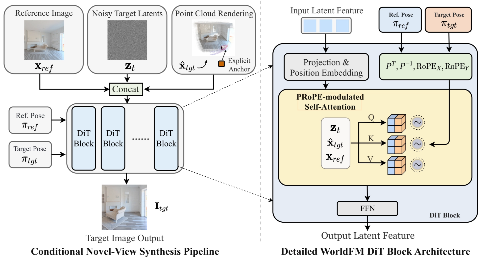
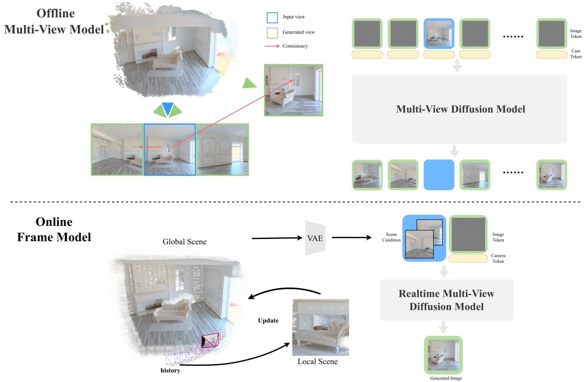
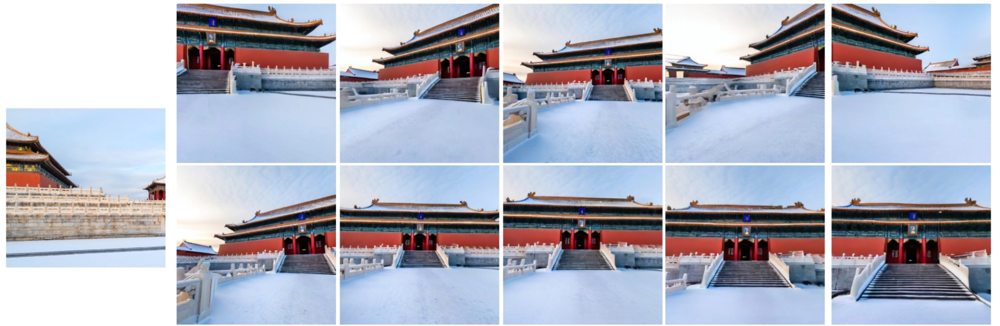

<aside>

[Paper](https://arxiv.org/abs/2603.11911) | [Homepage](https://inspatio.github.io/worldfm/) | [Github](https://github.com/inspatio/worldfm)

</aside>

## Problem

InSpatio-WorldFM addresses a core weakness of video world models: **They are often too slow for real-time interaction and too unstable across viewpoint changes.**

The paper proposes a **real-time** **generative frame model** that aims to support interactive spatial exploration while maintaining multi-view consistency.

## Model Details

InSpatio-WorldFM is a **conditional novel-view synthesis** model built around a Diffusion Transformer ([DiT](https://arxiv.org/abs/2212.09748)). Instead of autoregressively generating a video, it takes:

- a reference image $x_{ref}$ (implicit scene memory)
- noisy target latents $z_t$
- point cloud rendering $\hat{x}_{tgt}$ (explicit 3D anchor)

Reference pose $π_{ref}$ and target pose $π_{tgt}$ are also injected as control signals. then predicts the target-view image $I_{tgt}$. 

A key idea is to combine **explicit 3D structure** with **learned spatial memory**. 

The pipeline renders a **point cloud** from the reference view to the target view, producing a coarse spatial prior $\hat{x}_{tgt}$. This rendered result acts as an **explicit 3D anchor**, telling the model where scene content should roughly appear after the viewpoint changes. At the same time, the DiT processes the reference image and noisy target latents jointly, allowing the network to maintain an **implicit internal memory** of scene layout and appearance. Together, these two parts help preserve both **global geometry** and **fine details** across views.

Inside each DiT block, the model uses **pose-aware conditioning**. The paper highlights **Projection and Position Embedding** together with [**PRoPE-modulated self-attention**](https://arxiv.org/abs/2507.10496), where both the **reference pose** and **target pose** are injected into attention through transformation-related embeddings. Intuitively, this lets attention operate not only over visual tokens, but also under the constraint of **how the camera moved** from the reference view to the target view.

So, in short, the architecture can be understood as:

<aside>

**reference image, noisy target latent, 3D-rendered anchor + reference and target pose 
→ diffusion transformer 
→ target-view image**

</aside>

## Training

The model is trained in **three stages**. 

1. First, it starts from a pretrained [PixArt-α](https://arxiv.org/pdf/2310.00426) DiT image diffusion model. 
2. Then, it is adapted into a **camera-controlled frame model** by adding **reference-view conditioning**, **3D point-cloud anchors**, and **spatial memory**. 
3. Finally, the model is distilled with **DMD** into a **few-step generator** for real-time use.

For training data, the authors use **real videos, captured videos, and synthetic Unreal Engine scenes**. From multi-view frames, they estimate **camera poses and depth**, build a **global point cloud**, and render it into the target view as an **explicit 3D anchor**.

## Inference

Inference is divided into **offline** and **online** stages. 

- In the **offline stage**, a multi-view model builds a **global scene representation** from input views.
- In the **online stage**, the real-time frame model takes the **scene condition**, **reference image**, **target pose**, and **noisy latent**, then directly generates the target-view image.

Because the model generates **each frame independently** instead of sequentially producing a whole video, it achieves **low-latency interactive view synthesis**. The final distilled version supports **real-time multi-view generation** while preserving spatial consistency. 

## Experiments

The experiments show that **InSpatio-WorldFM** achieves two main goals at the same time: **strong multi-view consistency** and **real-time generation speed**. The paper positions this as an advantage over standard **video-based world models**, which are usually slower because they generate frames sequentially. WorldFM instead generates each target frame independently, making it more suitable for **interactive spatial exploration**.

Qualitatively, the model produces **stable viewpoint transitions** while preserving overall scene geometry and fine visual details. In the following figure, the generated views remain consistent as the camera moves around the scene, showing that the model is not just making plausible images, but maintaining a coherent underlying 3D structure across views.

On the efficiency side, the project reports **interactive frame rates on a single RTX 4090**, and the paper emphasizes support for **consumer-grade GPUs** rather than only high-end datacenter hardware. This is an important result because the method is designed not only for visual quality, but also for practical real-time deployment.

## Conclusions

InSpatio-WorldFM shows that a frame-based design can support real-time spatial inference with strong view consistency. However, **dynamic scene modeling**, **motion range**, and **temporal stability** are still limited. 

Future work will focus on faster inference, better 3D anchors, stronger dynamic-content generation, and larger-scale real-time world modeling.

## References

[1] X. Zhang et al., “InSpatio-WorldFM: An Open-Source Real-Time Generative Frame Model,” 2026, arXiv:2603.11911.

[2] InSpatio Team, “InSpatio-WorldFM: An Open-Source Real-Time Generative Frame Model for Spatial Intelligence,” [Online]. Available: [https://inspatio.github.io/worldfm](https://inspatio.github.io/worldfm/) (Accessed: Mar. 24, 2026).

[3] InSpatio Team, “inspatio/worldfm,” GitHub, 2026. [Online]. Available: [https://github.com/inspatio/worldfm](https://github.com/inspatio/worldfm) (Accessed: Mar. 24, 2026).

[4] W. Peebles and S. Xie, “Scalable Diffusion Models with Transformers,” 2022, arXiv:2212.09748.

[5] R. Li, B. Yi, J. Liu, H. Gao, Y. Ma, and A. Kanazawa, “Cameras as Relative Positional Encoding,” 2025, arXiv:2507.10496.

[6] J. Chen et al., “PixArt-α: Fast Training of Diffusion Transformer for Photorealistic Text-to-Image Synthesis,” 2023, arXiv:2310.00426.