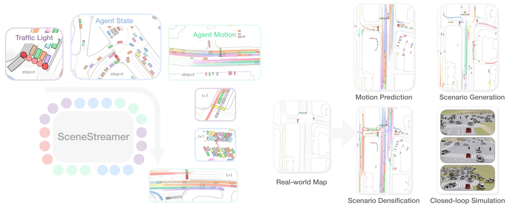
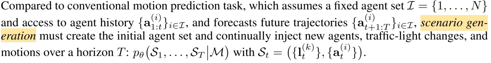
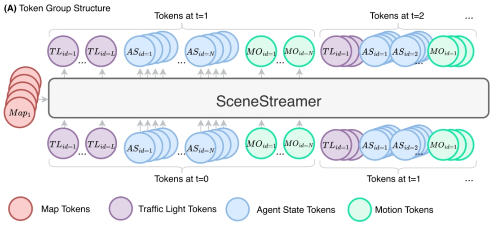
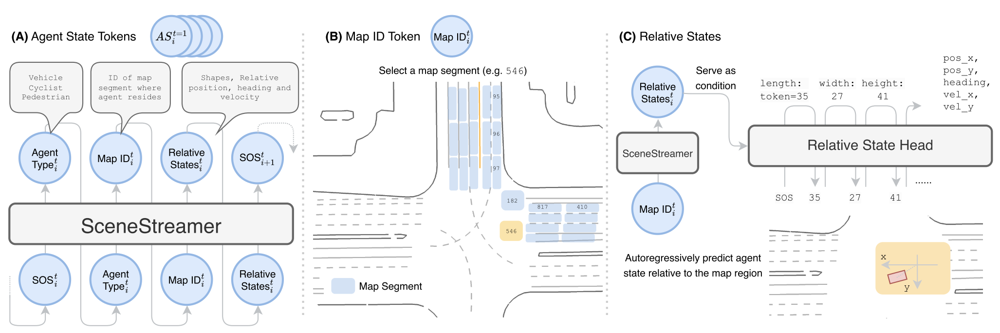
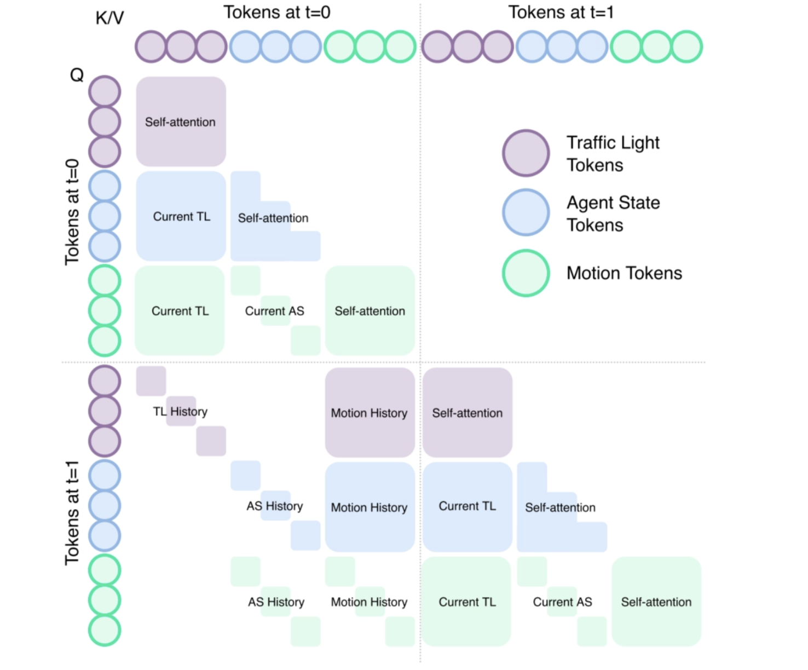
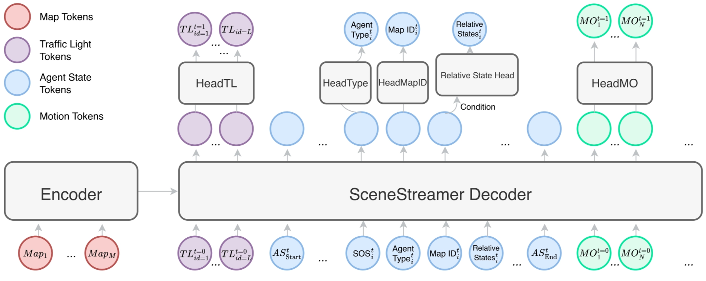
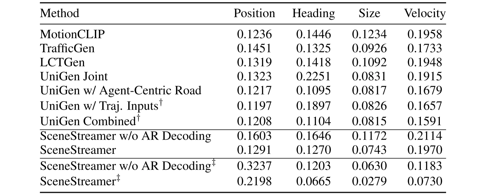
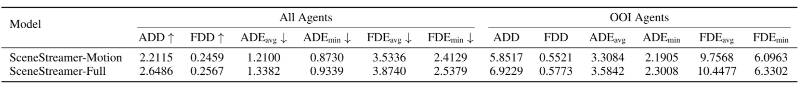
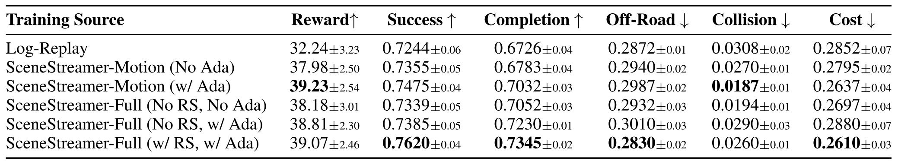

# Problem

Prior generative traffic simulation framework:

1. **Static log-replay methods**
    1. replay recorded trajectories from datasets.
    2. realistic but lack interactivity, no respond → no **closed-loop evaluation**
2. **One-shot motion prediction methods** (diffusion model)
    1. predict future trajectories for all agents in one pass from history.
    2. no model interaction step by step → **covariate shift** and **compount error**
3. **Autoregressive** simulation methods with fixed initialization
    1. generate scenes step by step → closed-loop simulation.
    2. provided initial states of agents → **miss the diversity**
4. **Two-stage initialization** motion generation methods (TrafficGen)
    1. generate initial conditions, then run motion prediction separately.
    2. **inefficient and inflexible** → no share context, fixed num agent

Given the **initial agent states**, both later method families roll the scene forward over time. They mainly predict future trajectories or motion-conditioned future states based on those initialized agents. 

This paper proposed a new method called **SceneStreamer**. It fixes the problems:

1. provided intial states of agents → miss the diversity
2. two separate models, two-stage pipelines → inefficent and inflexible

Starting from a **static map**, SceneStreamer uses an **unified autoregressive model** to generate the evolving scene as a **single token sequence**, jointly modeling **agent states** and **agent motions** at every step.

SceneStreamer is **flexible** and can adapt to different tasks, including **motion prediction**, state initialization, scenario generation, and scene editing, by choosing different tokens to be **state-forced** while others are sampled. 

- teacher forcing → feed the **GT previous tokens** into the model so it can generate the next token
- state-forced → **skip** generating certain tokens, directly provide them for the next generation

This follows a broader trend in generative modeling: **replacing hand-designed multi-stage pipelines with a single end-to-end autoregressive model.** It makes the simulation process more **unified, scalable, and flexible**, especially for long-horizon and open-world scenarios where agents can appear, disappear, and interact over time.

The paper demonstrates that using SceneStreamer to generate training scenarios leads to significant improvements in downstream planner performance. RL-based planners trained on SceneStreamer-generated scenarios exhibit greater robustness and better generalization to novel environments. 

There are three contributions of this paper:

1. A unified pipeline, same token language for state and motion
    1. **Tokenization**: convert **continuous scene** information into **discrete tokens**
2. Fine-grained tokenization of agent states
    1. Agent type, map segment id, relative states
3. Versatile Capabilities

# Method

A **driving scenario** comprises two parts:

1. **static map** context (vectorized lane segments, crosswalks, etc.) 
2. **dynamic** entities including **traffic-lights** and **traffic agents**
    1. traffic lights: $(x, y, s)$ → position $(x, y)$ and signal $s ∈ \{\text{green}, \text{yellow}, \text{red}, \text{unknown}\}$
    2. traffic agents: 9-D

## Scenario as a Token Sequence

We can cast scenario generation as a **next-token prediction** task, form a single autoregressive token sequence $x_{1:T} =$ $[<\text{MAP}>; (<\text{TL>},<\text{AS}>,<\text{MO}>)_1; (<\text{TL}>,<\text{AS}>,<\text{MO}>)_2; . . .]$

**SceneStreamer**, a **unified transformer** that sees the whole history and rolls out the scenario step-by-step, enabling **fine-grained**, **closed-loop generation** and **smoother downstream** simulation integration.

### Map Tokens <MAP>

One token for map segment $i$:

$$
\langle \mathrm{MAP} \rangle_i = \mathbf{m}'[i] + \mathrm{EmbMapID}(i) \otimes \mathbf{g}_i,\quad i = 1,\ldots,M.
$$

- $\mathbf{m}' = \text{SceneStreamer\ Encoder}(\mathbf{m})$
    - $\mathbf{m} =  \text{PointNet-like\ Encoder}(\text{S}_{map})$
- **EmbMapID** is a learned embedding table
- $g_i$ is geometric information

### Traffic Light Tokens <TL>

One token for light $k$ at step $t$:

$$
<\mathrm{TL}>_{k,t} = \mathrm{EmbState}(s\_{k,t}) + \mathrm{EmbTLID}(k) + \mathrm{EmbMapID}(\lambda_k) \otimes g_k
$$

$$
k = 1,\ldots,N_{\mathrm{TL}}
$$

- $s_{k,t} ∈ {G, Y, R, U}$: the signal state
- $λ_k$: the discrete map segment ID the light resides in
- $g_k$: temporal-geometric context (position, orientation and current timestep)

### Agent State Tokens <AS>

Four agent state tokens that collectively encode the agent’s **dynamic and semantic state**.

Each agent $i$ present at step $t$ is represented by **four ordered tokens**, they are all with the same embedding dimension:

$$
⟨<\text{SOA}>_i, <\text{TYPE}>_i, <\text{MS}>_i, <\text{RS}>_i⟩_t
$$

- <SOA> is the start-of-agent flag,
- <TYPE> is the categorical token in {vehicle, pedestrian, cyclist},
- <MS> is the index of the map segment,
- <RS> is the relative states of agent w.r.t. the selected map segment.

### Motion Tokens <MO>

SceneStreamer predicts a motion label for each agent, parameterized as a pair of **acceleration** and **yaw rate** $(a, ω)$.

For an agent $i$ at a timestep $t$, 

$$
<\mathrm{MO}>_{i,t}=\mathrm{EmbMotion}(\mu\_{i,t})+\mathrm{EmbType}(c_i)+\mathrm{EmbAID}(i)+\mathrm{EmbVel}(v_i)+\mathrm{EmbShape}(s_i)\otimes \mathbf{g}_i
$$

The embedding tables EmbType and EmbAID are shared with <AS>

## Autoregressive Scenario Generation

SceneStreamer is an **encoder-decoder model**. 

- The SceneStreamer **Encoder** processes the information of map segments and output {$<\text{MAP}>_i$}.
- The SceneStreamer **Decoder**, autoregressively generates tokens in a step-by-step manner.

In each step, SceneStreamer first generates a set of **traffic light tokens <TL>**, then it generates the **agent state tokens** <AS> one-by-one. Finally, it generates the motion tokens <MO> for all agents.

The detoken process of each tokens:

### Traffic Light Tokens <TL>

One-time batch generation.

$$
\{s_{k,t}\}_k \sim \mathrm{HeadTL} (\mathrm{SceneStreamerDec} ((<\mathrm{TL}>\_{k,t\_1})^{N\_{\mathrm{TL}}}\_{k=1})) \in \mathbb{R}^{N\_{\mathrm{TL}}\times 4}.
$$

### Agent State Tokens <AS>

Generate in agent order.

**Relative state** is a 8D vector, and can be autoregressively generated by the **relative state head**, a small Transformer decoder with AdaLN ([Perez et al., 2018](https://arxiv.org/abs/1709.07871)).

$$
(l,w,h,u,v,\delta\psi,v_x,v_y)\sim \mathrm{HeadRS}\left(<\mathrm{SOS}> \mid \mathrm{SceneStreamerDec}(<\mathrm{MS}>)\right)
$$

Here we use **state-forcing** to replace predicted tokens with reconstructed state tokens whenever the agent’s current state is already known. 

This allows SceneStreamer to seamlessly unify:

- **dynamic agent injection (via sampling)** and
- **agent motion continuation (via state-forcing)**,

ensuring closed-loop autoregressive simulation across variable-length agent sets.

### Motion Tokens <MO>

One-time batch generation.

$$
\{\mu_{i,t}\}_i \sim \mathrm{HeadMotion}(\mathrm{SceneStreamerDec} ({<\mathrm{MO}>\_{i,t-1}}_i))
$$

## Model Details

### Token Group Attention

The rules are:

1. **Same-group attention**: tokens within the same group can attend to each other freely (e.g., motion tokens attend to other motion tokens at the same step);
2. **Same-object temporal attention**: tokens belonging to the same object (agent or traffic light) in a later step can attend to the tokens of the same object earlier; 
3. **Context attention across groups**: every group of tokens can attend to the existing contexts at current or last step. For example, <MO> can attend to current <TL>. <TL> can attend to <MO> at last step, etc.

### Relative Attention

**Relative attention** means the model uses **relative spatial-temporal relations** such as **Δx, Δy, Δψ, and Δt** to adjust attention weights. 

This helps the model focus on **who is nearby, similarly oriented, and temporally relevant**, instead of relying on absolute global coordinates. 

A **KNN mask** further limits attention to **spatial neighbors**, improving scalability and efficiency.

### Model Architecture

SceneStreamer adopts an **encoder-decoder architecture**. 

The encoder embeds information of all map segments to static map tokens, which are cross-attended by the dynamic tokens in the decoder. 

The decoder generates heterogeneous output via different prediction heads. Each decoder layer combines 

1. **cross-attention** between dynamic tokens and static map tokens with 
2. **self-attention** over the dynamic tokens using a structured group-causal mask, 

enforcing semantic and temporal dependencies across token types. As all prediction heads output categorical distributions, SceneStreamer can be trained end-to-end using cross-entropy loss.

# Experiments

The authors tried to evaluate SceneStreamer on several tasks to assess the quality of its generated scenarios and its utility for downstream applications, particularly reinforcement learning (RL) planner training. 

The experiments aim to answer the following three questions:

- **Generation quality**: Does SceneStreamer generate realistic and diverse agent states comparable to real-world logged data?
- **Platform capability**: Can SceneStreamer serve as a versatile simulation platform for motion prediction and scene generation?
- **RL training benefit**: Does training an RL planner in SceneStreamer-generated scenarios lead to improved performance and robustness compared to log-replay traffic flows?

The dataset is the **Waymo Open Motion Dataset (WOMD)** ([LLC, 2019](https://waymo.com/open/)), a large-scale benchmark for motion forecasting and simulation. 

WOMD contains scenarios captured at 10Hz, providing 1 second of historical data and 8 seconds of future trajectories per scene. Each scenario includes up to **128 traffic participants (vehicles, cyclists, pedestrians)** along with high-definition maps. 

> **Hz** is the frequency, which represents how many frames/steps are sampled per second
> 

To reduce computational cost, we downsample each scenario to 2Hz, yielding 19 discrete steps per scene. 

SceneStreamer is trained to predict all three types of agents and all agents in the scenario. 

## Initial State Quality

To assess the realism of SceneStreamer-generated initial states, we use the **Maximum Mean Discrepancy (MMD)** metric, a standard **measure of distributional divergence** in generative modeling ([Mahjourian et al., 2024](https://arxiv.org/abs/2405.03807)). 

**Lower MMD indicates closer alignment between generated and real agents.** 

We evaluate under two settings: 

1. a strict protocol from TrafficGen ([Feng et al., 2023](https://arxiv.org/abs/2210.06609)), considering only vehicles within 50 m of the ego, 
2. a relaxed setting that includes all agents of any type (vehicle, cyclist, pedestrian), offering a more comprehensive view of realism across full-scene using ‡ to represent in the following table.

This table compares SceneStreamer with recent baselines across **position**, **heading**, **size**, and **velocity** **distributions**. 

SceneStreamer achieves competitive performance, especially when using autoregressive (AR) decoding, under the strict evaluation protocol (vehicles only and within 50m). 

## Motion Prediction Quality

Next is to evaluate SceneStreamer as a motion predictor. Given the initial traffic state and agent history, we autoregressively predict future trajectories of all agents over a 8-second horizon.

There are two versions of SceneStreamer: 

1. **SceneStreamer-Motion**: The base version of SceneStreamer that is only trained to predict motion tokens and traffic light tokens; 
2. **SceneStreamer-Full**: The finetuned version of SceneStreamer-Motion that is tasked to predict all dynamic tokens.

There are six standard **forecasting metrics**: Average Displacement Error (ADE), Final Displacement Error (FDE), Average Displacement Diversity (ADD), and Final Displacement Diversity (FDD).

SceneStreamer achieves reasonable motion prediction performance. SceneStreamer-Motion provides accurate predictions with lower ADE/FDE, while SceneStreamer-Full performs slightly worse in accuracy.

## Planner Learning with SceneStreamer

To evaluate SceneStreamer in downstream **autonomous driving (AD)**, we train **reinforcement learning (RL) agents** to control the **self-driving car (SDC)** in SceneStreamer-modified scenarios and test them on unaltered log-replay scenes. 

This setup examines whether SceneStreamer can serve as a generative simulator that improves planner robustness through diverse, reactive traffic.

Policies are trained with TD3 (Fujimoto et al., 2018) for 2M steps and evaluated on 100 held-out WOMD validation scenarios. 

We report standard RL metrics:

1. Average Episodic Reward,
2. Episode Success Rate: Fraction of episodes that terminate successfully (i.e., reaching goal without major violation), 
3. Route Completion Rate: Fraction of the predefined route (from GT SDC trajectory) completed per episode,
4. Off-Road Rate: Fraction of episodes in which the agent deviates off-road, 
5. Collision Rate: Fraction of the episodes that have collisions, 
6. Average Cost: The average number of collisions happen in one episode.

Table shows SceneStreamer-generated scenarios consistently improve planner performance across all metrics. The best-performing setup uses **full scenario generation** with **reject sampling**, demonstrating SceneStreamer’s utility as a high-fidelity simulation platform for RL policy training.

## WOSAC Results

This is the performance on the 2025 Waymo Sim Agents Challenge test set. 

 results on the 2025 test set leaderboard. For all metrics except minADE, higher is better")

SceneStreamer achieves competitive realism and behavioral likelihood metrics compared to strong baselines such as UniMM ([Lin et al., 2025](https://arxiv.org/abs/2501.17015)) and CAT-K ([Zhang et al., 2025b](https://research.nvidia.com/labs/avg/publication/zhang.karkus.etal.cvpr2025/)), which benefit from mixture-of-experts modeling and closed-loop fine-tuning, respectively. 

Although SceneStreamer does not outperform on minADE, it maintains strong performance across most realism metrics, validating its efficacy as a **general-purpose simulator**.

# Limitations

Its main limitations are the **long token sequences** required for dense traffic scenes, which increase **training memory cost**, and **error accumulation** during long test-time rollout. A possible improvement is to combine it with **closed-loop fine-tuning** of the behavior model.

**CAT-K** is a closed-loop supervised fine-tuning approach: at each step, it first takes the **top-K** most likely action tokens of the policy, then selects the action that makes the state closest to the ground truth for rollout. This achieves closed-loop training without deviating too far from the target.

# Conclusion

SceneStreamer is a **unified generative traffic simulator** that models **vehicles, cyclists, pedestrians, and traffic lights** as discrete tokens within one autoregressive framework. 

This lets it handle **motion prediction, scenario densification, and full scene generation** with the same model. 

Unlike prior methods based on **fixed initialization** or **log replay**, it supports **dynamic agent injection** and **closed-loop long-horizon rollout**, making the simulation more interactive and flexible.

Experiments show that SceneStreamer can generate **realistic initial states**, maintain **coherent and diverse multi-agent behaviors** over time, and improve the **robustness and generalization** of downstream **RL planners** trained in its generated scenarios.

# References

[1] Z. Peng, Y. Liu, and B. Zhou, “SceneStreamer: Continuous Scenario Generation as Next Token Group Prediction,” in Proc. Int. Conf. Learn. Represent. (ICLR), 2026.

[2] L. Feng, Q. Li, Z. Peng, S. Tan, and B. Zhou, “Learning to Generate Diverse and Realistic Traffic Scenarios,” arXiv preprint arXiv:2210.06609, 2022.

[3] S. Ettinger et al., “Large Scale Interactive Motion Forecasting for Autonomous Driving: The Waymo Open Motion Dataset,” in Proc. IEEE/CVF Int. Conf. Comput. Vis. (ICCV), 2021, pp. 9710–9719.

[4] R. Mahjourian, M. Li, A. Kuefler, E. Vinitsky, and A. Pandey, “UniGen: Unified Modeling of Initial Agent States and Trajectories in Driving Scenarios,” arXiv preprint arXiv:2405.03807, 2024.

[5] E. Perez, F. Strub, H. de Vries, V. Dumoulin, and A. Courville, “FiLM: Visual Reasoning with a General Conditioning Layer,” in Proc. AAAI Conf. Artif. Intell. (AAAI), vol. 32, no. 1, 2018.

[6] S. Fujimoto, H. van Hoof, and D. Meger, “Addressing Function Approximation Error in Actor-Critic Methods,” in Proc. 35th Int. Conf. Mach. Learn. (ICML), 2018, pp. 1587–1596.

[7] L. Lin et al., “Revisit Mixture Models for Multi-Agent Simulation: Experimental Study within a Unified Framework,” arXiv preprint arXiv:2501.17015, 2025.

[8] Z. Zhang, P. Karkus, M. Igl, W. Ding, Y. Chen, B. Ivanovic, and M. Pavone, “Closed-Loop Supervised Fine-Tuning of Tokenized Traffic Models,” in Proc. IEEE/CVF Conf. Comput. Vis. Pattern Recognit. (CVPR), 2025.