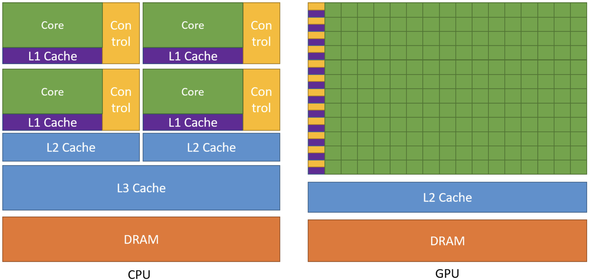
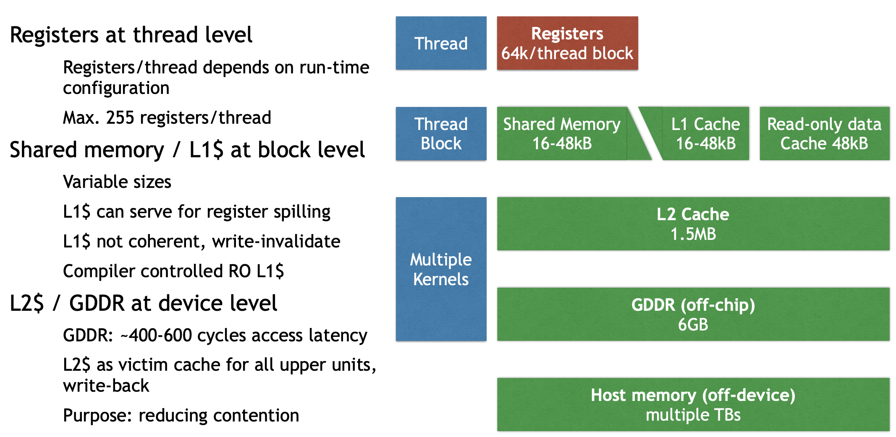
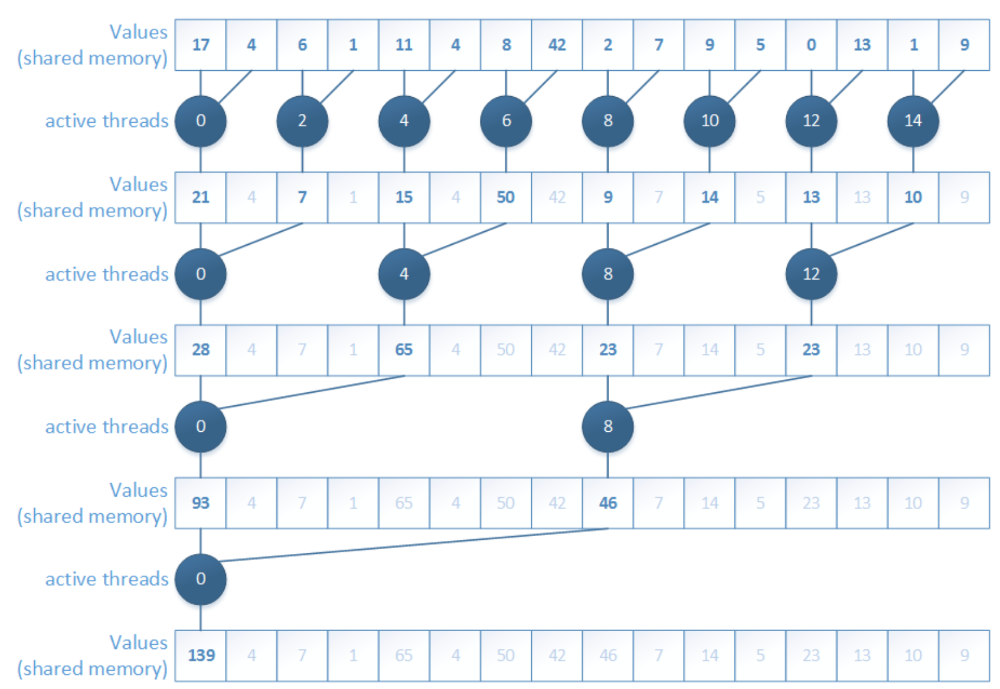
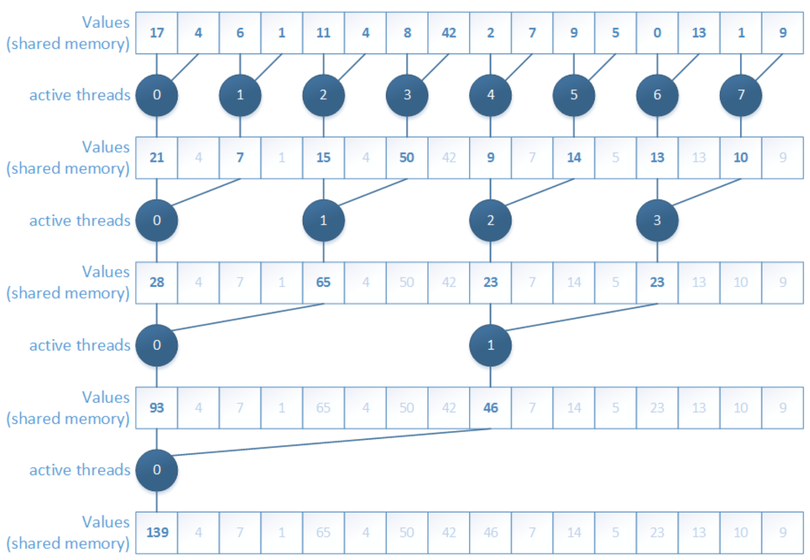
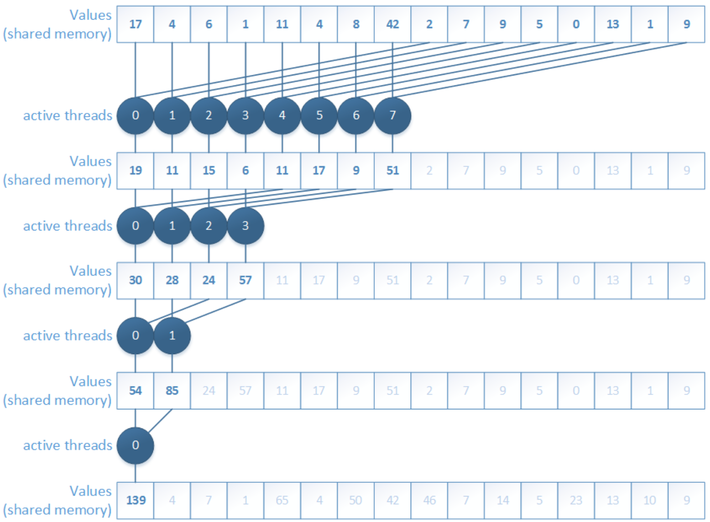
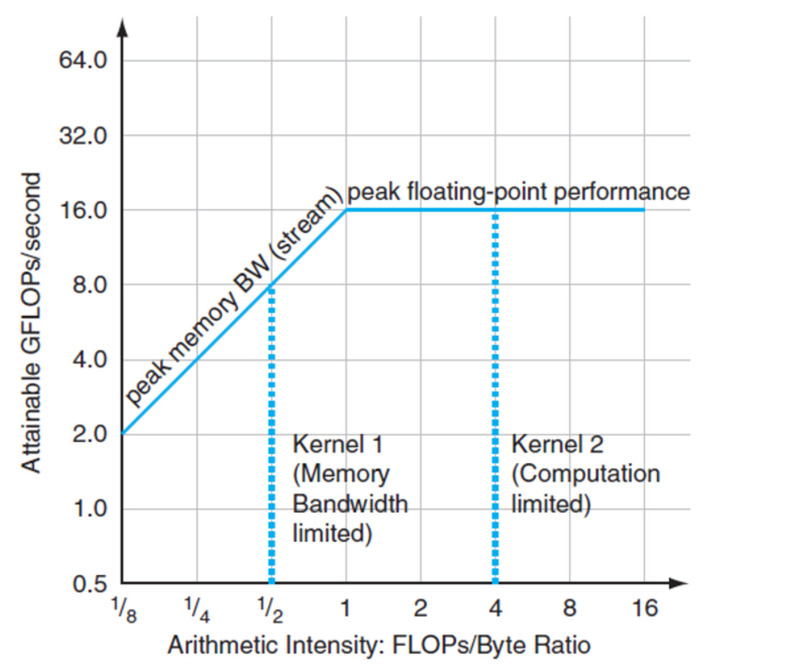

In this post, I’ll walk through GPUs and CUDA. Hope it helps with my final exam and AI learning… The full name of **GPU** is **Graphics Processing Unit**. 

Looking back at its history. GPU first appeared as fixed-function hardware to speed up parallel work in real-time 3D graphics. Over time, GPUs became more programmable. By 2003, parts of the graphics pipeline were fully programmable, running custom code in parallel for many elements of a 3D scene or an image.

In 2006, NVIDIA introduced **CUDA** (**Compute Unified Device Architecture**), which allows developers use GPUs for general computing, not just graphics. Since then, CUDA and GPU computing have accelerated many workloads. Recently, AI is the most common usage domain of GPU, and GPU is used to help drive major advances in AI, from image classification to generative models such as diffusion models and large language models.

We can’t avoid mentioning CPU when introducing GPU. I still remember how shock I was the first time I watched this video: [NVIDIA: Adam & Jamie draw a MONA LISA in 80 milliseconds!](https://www.youtube.com/watch?v=fKK933KK6Gg) The output of the GPU demo genuinely blew my mind. Compared to CPU, a GPU provides much higher **instruction throughtput** and **memory bandwidth** (if you don’t understand yet, that’s okk, we’ll explain it later). Other computing devices, like FPGAs, are also very energy efficient, but offer much less **programming flexibility** than GPUs. 

GPUs and CPUs are designed with different goals in mind. CPU is designed to excel at executing a serial sequence of operations as fast as possible, we call this execution **a thread**, and CPU can execute a few **tens of** these threads in parallel. In contrast, GPU is designed to excel at executing **thousands of** threads in parallel. Trading lower single-thread performance for much higher overall throughput.

<aside>

**What is a thread?**

A thread is a **single line of execution**, one ordered stream of instructions that a processor runs, step by step. For example, if we want to add two arrays `A` and `B` to produce `C`, one GPU thread responsible for index `i` might execute this instruction stream:

1. set `i = thread_id`
2. read `A[i]`
3. read `B[i]`
4. compute `c = A[i] + B[i]`
5. write `c` to `C[i]`

This is **serial** because, inside one thread, these steps happen in a fixed order.

</aside>

Arithmetic test is a good example to understand the difference between CPU and GPU. **A CPU** is like hiring a few tens of college students to take the test, each student is smart and can handle tricky instructions. They can switch between different question types quickly, but there aren’t many of them. **A GPU** is like asking thousands of primary school students to do it in parallel, which is exactly the right fit. Each of them can do simple operations, and if the test has lots of similar questions, they finish incredibly fast together. 

More concretely, GPUs are specialized for highly parallel computations and devote more chip space to data processing units so lots of simple workers doing math at the same time, while CPUs dedicate more chip space to **data caching** and **flow control**, so each worker individually fast. The following figure shows an example distribution of chip resources for a CPU versus a GPU.




# Programming Model

Now that we’ve basically seen what’s GPU and why GPUs achieve high throughput. The next step is understanding how we actually program this hardware. We can view **GPU** as a **piano**. It just has the capability to play complex music. And **CUDA is the Sheet Music**. If we have a piano but no sheet music, the piano just sits there. We can’t just yell "Play Mozart!" at a piano. We have to provide the specific notes in a language the piano understands. **CUDA is that language.**

Concretely, CUDA provides a programming model that maps directly onto the GPU’s execution structure: we write one sheet music (the kernel), then launch to play it across a grid of thread blocks so thousands of threads can work in parallel.

## Heterogeneous Systems

Refer to [NVIDIA Cuda Programming Guide](https://docs.nvidia.com/cuda/cuda-programming-guide/01-introduction/programming-model.html). There are lots of technical terms we need to master about CUDA. 

The CUDA programming model assumes a **heterogeneous computing system**, which means a system that includes both GPUs and CPUs. The CPU and the memory directly connected to it are called the **host** and **host memory**, respectively. A GPU and the memory directly connected to it are referred to as the **device** and **device memory**, respectively. 

CUDA applications execute some part of their code on the GPU, but applications always start execution on the CPU. The host code, which is the code that runs on the CPU, can use CUDA APIs to **copy data between the host memory and device memory**, start code executing on the GPU, and wait for data copies or GPU code to complete. 

The CPU and GPU can both be executing code simultaneously, and best performance is usually found by maximizing utilization of both CPUs and GPUs. The code an application executes on the GPU is referred to as **device code**, and a function that is invoked for execution on the GPU is called a **kernel**. The act of starting a kernel running is called **launching the kernel**. A kernel launch can be thought of as starting many threads executing the kernel code in parallel on the GPU. GPU threads operate similarly to threads on CPUs, though there are some differences.

<aside>

Technical terms: 

- **host** → CPU, **host memory** → CPU memory
- **device** → GPU, **device memory** → GPU memory
- **device code** → code executes on the GPU
- **kernel** → a function that is invoked on CPU for execution on the GPU
- **launch the kernel** →the act of starting a kernel running
</aside>

## GPU Hardware Model

Like any programming model, CUDA relies on a conceptual model of the underlying hardware. For the purposes of CUDA programming, the GPU can be considered to be a collection of **Streaming Multiprocessors (SMs)** which are organized into groups called **Graphics Processing Clusters (GPCs)**. Each SM contains a local **register file**, a unified data cache, and a number of functional units that perform computations. The unified data cache provides the physical resources for **shared memory** and **L1 cache**. The allocation of the unified data cache to L1 and shared memory can be configured at runtime. 

The sizes of different types of memory and the number of functional units within an SM can vary across GPU architectures. For example, the following figure is the GPU memory levels and sizes for the NVIDIA Tesla V100 from [Cornell Virtual Workshop](https://cvw.cac.cornell.edu/gpu-architecture/gpu-memory/memory_levels). 

At the bottom of this figure is **global memory for VRAM**, implemented as **HBM2 DRAM** on V100 with **32GB capacity** and about **900 GB/s bandwidth**, this is where large tensors (weights and activations) live if we use it in Machine Learning domain. Above VRAM is a GPU-wide **L2 cache** of 6MB, shared by all SMs and used to reduce expensive HBM accesses. Inside each **SM**, the fastest storage is the **register file**: V100 has **64K 4 Byte registers per SM** (i.e., 64k × 4B ≈ 256KB per SM) for per-thread variables and accumulators. Also per-SM is an on-chip SRAM pool where **shared memory and L1 cache share a combined 128KB unified data cache**. We can assign **96KB as shared memory** because it’s programmer controlled, so the left **32 KB** is **L1 cache**, and it’s hardware controlled. Finally, there are ~64KB **constant caches** for small read-only data accessed efficiently by many threads.

](GPU/image%201.png)

GPU memory hierarchy on the NVIDIA Tesla V100, showing per-SM storage (register file, shared memory, L1 cache, and constant caches) together with device-wide L2 cache and global memory. Source: Cornell Virtual Workshop, [“GPU Memory Levels.”](https://cvw.cac.cornell.edu/gpu-architecture/gpu-memory/memory_levels)

The actual hardware layout of a GPU may vary. These differences do not affect correctness of software written using the CUDA programming model. 

### Grid, Block, Thread

When an application launches a kernel, it does so with many threads, often millions of threads. These threads are organized into blocks. Thread blocks are organized into a **grid**. All the thread blocks in a grid have the same size and dimensions. The following figure from the definition of thread block from [HANDWIKI](https://handwiki.org/wiki/Thread_block) shows an illustration of a grid of thread blocks. Actually, thread blocks and grids may be 1, 2, or 3 dimensional.

In a 2D CUDA grid, the GPU organizes work like a massive spreadsheet of data. For **Block (1, 0)**, the `blockIdx.x = 1` and `blockIdx.y = 0` act as the coordinates for the entire grid, placing them in the second column of the first row of the global grid. Inside that group, **Thread (1, 0)** is identified by `threadIdx.x = 1` and `threadIdx.y = 0`, marking it as the second thread in the first row of that specific block.


When a kernel is launched, it is launched using a specific **execution configuration** which **specifies the grid and thread block dimensions**. The execution configuration may also include optional parameters such as cluster size, stream, and SM configuration settings, which will be introduced later. 

Using built-in variables like `threadIdx`, `blockDim`, and `blockIdx`, each thread executing the kernel can determine its location within its containing block and the location of its block within the containing grid. 

If the blocks and threads are 2-dimension, the thread coordinate `(x, y)` is easily computed based on the previous figure: 

```cpp
int x = blockIdx.x * blockDim.x + threadIdx.x;
int y = blockIdx.y * blockDim.y + threadIdx.y;
```

If they are 1-dimension, the thread id can be computed as:

```cpp
int i = blockIdx.x * blockDim.x + threadIdx.x;
```

This is the schematic illustration of the common indexing pattern for a 1-dimention array in CUDA kernels. 

.png "Computing the global thread index in a 1D CUDA grid using i = threadIdx.x + blockDim.x * blockIdx.x.")


This computed identity is frequently used to determine what data or operations a thread is responsible for. All threads of a block are executed in **a single SM**. This allows threads within a thread block to communicate and synchronize with each other through shared memory efficiently. Threads within a thread block all have access to the on-chip shared memory, which can be used for exchanging information between threads of a block.

A grid may consist of millions of thread blocks, while the GPU executing the grid may have only tens or hundreds of SMs. All threads of a block are executed by a single SM and, in most cases, run to completion on that SM.

The next figure shows an example of how thread blocks from a grid are assigned to an SM.
The CUDA programming model enables arbitrarily large grids to run on GPUs of any size, whether it has only one SM or thousands of SMs. To achieve this, the CUDA programming model, with some exceptions, requires that there be **no data dependencies** between threads in different thread blocks.
That is, **a thread should not depend on results from or synchronize with a thread in a different block of the same grid.** All the threads within a block run on the same SM at the same time. Different blocks within the grid are scheduled among the available SMs and may be executed in any order. In short, the CUDA programming model requires that it be possible to execute blocks in any order, in parallel or in series. Doesn’t matter.


Each SM has one or more active thread blocks. In this example, each SM has three thread blocks scheduled simultaneously. 

### Warps, SIMT

Within a thread block, threads are organized into groups of **32 threads** called **warps**. A warp executes the kernel code in a **Single-Instruction Multiple-Threads (SIMT)** paradigm. In SIMT, all threads in the warp are executing the same kernel code, but each thread may follow different branches through the code. That is, though all threads of the program execute the same code, threads do not need to follow the same execution path.

When threads are executed by a warp, they are assigned a **warp lane**. Warp lanes are numbered 0 to 31 and threads from a block are assigned to warps in a predictable way detailed in Hardware Multithreading.

```cpp
int warp_id = i / 32
int lane_id = i % 32
```

## GPU Memory

In modern computing systems, memory is just as important as compute efficiency. According to Moore’s Law, the number of transistors doubles every two years. But in recent years, compute capability has continued to increase while memory bandwidth has increasingly become a bottleneck. That is why understanding GPU memory is so important.

A heterogeneous system contains multiple memory spaces. This is especially true for GPUs, which include several types of on-chip memory. Understanding these memory types is a key step in learning GPU.




For the GK110 memory hierarchy, we can roughly divide it into four levels:

- **Thread level:** registers
- **Block level:** shared memory, L1 cache, constant cache (read-only data)
- **Device level:** L2 cache, global memory (GDDR)
- **CPU level:** host memory

For global memory, there is one crucial concept: **coalescing**. Coalescing means combining fine-grained memory accesses from multiple threads into a single global memory operation, as long as the access pattern matches the required granularity.

To make full use of memory bandwidth, coalesced thread accesses should match multiples of the L1 and L2 cache line sizes.

- **L1:** latency-optimized, warp-aligned, spatially coherent → larger cache line size
- **L2:** bandwidth-optimized, multi-client, fine-grained access, matched to GDDR transfer size → smaller cache line size

Misaligned accesses, such as **stride** and **offset** patterns, can hurt performance. In these cases, a warp is still scheduled together, but its threads access poorly aligned addresses. GPUs therefore use caches not only to reduce some memory traffic, but also to help with access coalescing.

# Programming GPUs in CUDA

Let’s start with a concrete example. Suppose we have a real task:

The input is two matrices, `Md` and `Nd`, each with size `Width × Width`, and we want to compute their matrix product and store the result in `Pd`.

## Simple GPU Version

We can first write an initial simple GPU version. Here, I only show the kernel code; data movement and control code are still missing.

```cpp
// Matrix multiplication kernel – thread code
__global__ void MatrixMulKernel ( float* Md,
																	float* Nd,
																	float* Pd,
																	int Width )
{
	float Pvalue = 0; // intermediate result
	float Melement, Nelement;
	
	// Calculate the row index of the Pd element
	int row = blockIdx.y * blockDim.y + threadIdx.y;
	
	// Calculate the column index of the Pd element
	int col = blockIdx.x * blockDim.x + threadIdx.x;

	for ( int k = 0; k < Width; ++k ) {
		Melement = Md[row * Width + k];
		Nelement = Nd[k * Width + col];
		Pvalue += Melement * Nelement;
	}
	Pd[row * Width + col] = Pvalue;
}
```

The kernel function is marked with `__global__`, which means it is launched by the CPU and executed on the GPU.

In this version, each thread computes one element of `Pd`. For each loop iteration, the thread performs 2 FLOPs, one multiply and one add, but it also involves repeated memory accesses. So this version is simple, but not very efficient.

The corresponding CPU-side code looks like this:

```cpp
void MatrixMulOnDevice ( float* M, float* N, float* P, int Width )
{
	int size = Width * Width * sizeof(float);
	float* Md, Nd, Pd;
	...
	
	// Allocate and Load M, N to device memory
	cudaMalloc ( &Md, size );
	cudaMemcpy ( Md, M, size, cudaMemcpyHostToDevice );
	cudaMalloc ( &Nd, size );
	cudaMemcpy ( Nd, N, size, cudaMemcpyHostToDevice );
	
	// Allocate P on the device
	cudaMalloc ( &Pd, size );
	
	// Setup the execution configuration
	dim3 dimGrid ( 1, 1 );
	dim3 dimBlock ( Width, Width );
	MatrixMulKernel <<< dimGrid, dimBlock >>> ( Md, Nd, Pd, Width );

	// Read P from the device
	cudaMemcpy ( P, Pd, size, cudaMemcpyDeviceToHost );

	// Free device matrices
	cudaFree ( Md ); cudaFree ( Nd ); cudaFree ( Pd );
}
```

Here, the previous kernel function is launched by the CPU. This part also handles data movement, including copying data from host memory to device memory and, after the computation finishes, copying the result back from device memory to host memory.

We could find that each thread works on global memory. And memory bandwidth limits performance, so we come with optimization method to increase data reuse and flop/memory ratio.

## Shared Memory Optimized Version

Shared memory supports an important optimization idea: **tiling** or **blocking**. The basic idea is to improve locality by reorganizing memory accesses. Instead of directly reading all needed data from global memory again and again, threads first load a tile of data into shared memory, then reuse it. This gives a much more local access pattern and is beneficial for both sequential and parallel algorithms.

The kernel can then be rewritten as:

```cpp
__global__ void MM_SM ( float* Md, float* Nd, float* Pd, int Width )
{
	__shared__ float Mds [TILEWIDTH] [TILEWIDTH];
	__shared__ float Nds [TILEWIDTH] [TILEWIDTH];
	int bx = blockIdx.x; int by = blockIdx.y;
	int tx = threadIdx.x; int ty = threadIdx.y;
	int row = by * TILEWIDTH + ty;
	int col = bx * TILEWIDTH + tx;
	float Pvalue = 0;

	if !(Row > Width || Col > Width) {
		for ( int m = 0; m < Width / TILEWIDTH; ++m ) { // loop over tiles
			// Collaborative loading of Md and Nd tiles into shared memory
			Mds [ty] [tx] = Md [ row * Width + ( m * TILEWIDTH + tx ) ];
			Nds [ty] [tx] = Nd [ col + ( m * TILEWIDTH + ty ) * Width ];
			__syncthreads();
		
			for ( int k = 0; k < TILEWIDTH; ++k )
				Pvalue += Mds[ty][k] * Nds[k][tx];
			
			__syncthreads ();
		}
		Pd[row * Width + col] = Pvalue;
	}
}
```

Performance improves because shared memory reduces repeated global memory accesses. In the simple version, many threads repeatedly read the same input elements from global memory. In the tiled version, each element is loaded into shared memory once and then reused by multiple threads in the block. This increases data reuse, improves locality, and raises the compute-to-memory ratio, so the kernel becomes much more efficient.

## Six Reduction Optimizations

Reduction is a very common GPU pattern. Typical examples include computing a global sum, or other associative operations. The basic idea is simple: many input elements are gradually combined into fewer partial results until only one result remains.

### 1. Interleaved addressing

The first version uses **interleaved addressing**. Conceptually, it is easy to understand: in each iteration, only some threads participate in the addition, and the stride between active elements keeps increasing.

```cpp
__global__ void Reduction0a_kernel( int *out, int *in, size_t N )
{
	extern __shared__ int sPartials[];
	const int tid = threadIdx.x;
	unsigned int i = blockIdx.x*blockDim.x + threadIdx.x;
	
	// each thread loads one element from global to shared mem
	sPartials[tid] = in[i];
	__syncthreads();
	
	// do reduction in shared mem
	for ( unsigned int s = 1; s < blockDim.x; s *= 2 ) {
		if ( tid % ( 2 * s ) == 0 ) {
			sPartials[tid] += sPartials[tid + s];
		}
		__syncthreads();
	}
	
	if ( tid == 0 ) {
		out[blockIdx.x] = sPartials[0];
	}
}
```

In this version, each thread loads data, but the active threads in the reduction step are not continuous. 




The main problem is **branch divergence**. Threads inside the same warp do not all follow the same path, so execution becomes inefficient. This is one of the first important lessons in CUDA optimization: even when the algorithm is correct, the access and execution pattern may still waste a lot of hardware efficiency.

### 2. Interleaved addressing, non-divergent

To solve the divergence problem, we can **reorder the add operations** so that active threads become consecutive.

```cpp
__global__ void Reduction0a_kernel( int *out, int *in, size_t N )
{
	extern __shared__ int sPartials[];
	const int tid = threadIdx.x;
	unsigned int i = blockIdx.x*blockDim.x + threadIdx.x;
	
	// each thread loads one element from global to shared mem
	sPartials[tid] = in[i];
	__syncthreads();
	
	**// do reduction in shared mem
	for ( unsigned int s = 1; s < blockDim.x; s *= 2 ) {
		int index = 2 * s * tid;
		if ( index < blockDim.x ) {
			sPartials[index] += sPartials[index + s];
		}
		__syncthreads();
	}**
	
	if ( tid == 0 ) {
		out[blockIdx.x] = sPartials[0];
	}
}
```

This version improves warp execution because the participating threads are now arranged in a more SIMT-friendly way. 




However, fixing one problem reveals another. The new problem is **shared memory bank conflicts**. The accesses are no longer nicely based on thread ID, so multiple threads may contend for the same shared-memory bank. As a result, accesses get serialized and performance drops again.

### 3. Sequential addressing, non-divergent

The next step is **sequential addressing**. Instead of using strided indexing, threads now access shared memory in a more regular block-wise pattern.

```cpp
__global__ void Reduction0a_kernel( int *out, int *in, size_t N )
{
	extern __shared__ int sPartials[];
	const int tid = threadIdx.x;
	unsigned int i = blockIdx.x*blockDim.x + threadIdx.x;
	
	// each thread loads one element from global to shared mem
	sPartials[tid] = in[i];
	__syncthreads();
	
	**// do reduction in shared mem
	for ( unsigned int o = blockDim.x / 2; o > 0; o >>= 1 ) {
		if ( tid < o ) {
			sPartials[tid] += sPartials[tid + o];
		}
		__syncthreads();
	}**
	
	if ( tid == 0 ) {
		out[blockIdx.x] = sPartials[0];
	}
}
```

This version removes the bank-conflict issue much better because shared memory is accessed in a tid-based, contiguous way. 




But another limitation appears: **idle threads**. In the early reduction stages, many threads stop contributing and simply wait while only part of the block is still doing useful work. So although memory access becomes better, thread utilization is still not ideal.

### 4. First add during load

A further improvement is to perform the **first add during load**. Instead of loading one element per thread, each thread loads two elements and immediately adds them before storing the partial result in shared memory.

```cpp
__global__ void Reduction0a_kernel( int *out, int *in, size_t N )
{
	extern __shared__ int sPartials[];
	const int tid = threadIdx.x;
	**unsigned int i = blockIdx.x*(blockDim.x*2) + threadIdx.x;
	
	// perform first level of reduction
	// read from global memory, write to local memory
	sPartials[tid] = in[i] + in[i+blockDim.x];**
	__syncthreads();
	
	// do reduction in shared mem
	for ( unsigned int o = blockDim.x / 2; o > 0; o >>= 1 ) {
		if ( tid < o ) {
			sPartials[tid] += sPartials[tid + o];
		}
		__syncthreads();
	}
	
	if ( tid == 0 ) {
		out[blockIdx.x] = sPartials[0];
	}
}
```

This reduces the number of active threads needed later and increases the amount of useful work done per memory access. In other words, we remove part of the reduction tree right at the loading stage. 

But the kernel is still not optimal, because there is still **instruction overhead** such as loop control, address arithmetic, and synchronization overhead. At this point, the bottleneck is no longer only memory behavior, but also unnecessary instructions around the actual arithmetic.

### 5. Unrolling the last warp

The next optimization is **unrolling the last warp**.

```cpp
__global__ void Reduction0e_kernel( int *out, int *in, bool echo )
{
	extern __shared__ int sPartials[];
	const int tid = threadIdx.x;
	unsigned int i = blockIdx.x*(blockDim.x*2) + threadIdx.x;
	
	// perform first level of reduction
	// read from global memory, write to local memory
	sPartials[tid] = in[i] + in[i+blockDim.x];
	__syncthreads();

	for ( unsigned int s = blockDim.x / 2; s > 32; s >>= 1 ) {
		if ( tid < s ) {
			sPartials[tid] += sPartials[tid + s];
		}
		__syncthreads();
	}
	
	if ( tid < 32 && blockDim.x >= 64) sPartials[tid] += sPartials[tid + 32];
	if ( tid < 16 && blockDim.x >= 32) sPartials[tid] += sPartials[tid + 16];
	if ( tid < 8 && blockDim.x >= 16) sPartials[tid] += sPartials[tid + 8];
	if ( tid < 4 && blockDim.x >= 8) sPartials[tid] += sPartials[tid + 4];
	if ( tid < 2 && blockDim.x >= 4) sPartials[tid] += sPartials[tid + 2];
	if ( tid < 1 && blockDim.x >= 2) sPartials[tid] += sPartials[tid + 1];
	
	if ( tid == 0 ) {
		out[blockIdx.x] = sPartials[0];
	}
}
```

The idea here is subtle but important. Once only one warp remains, all 32 threads in that warp execute in lockstep. That means we no longer need the full synchronization logic used for larger thread groups. 

### 6. Complete unrolling

The final step is **complete unrolling**.

```cpp
template <unsigned int blockSize> __global__ void Reduction0f_kernel( int *out,
int *in, bool echo )
{
	extern __shared__ int sPartials[];
	const int tid = threadIdx.x;
	unsigned int i = blockIdx.x*(blockSize*2) + threadIdx.x;
	
	// perform first level of reduction
	// read from global memory, write to local memory
	sPartials[tid] = in[i] + in[i+blockSize];
	__syncthreads();
	
	if (blockSize >= 1024) {
		if (tid < 512) { sPartials[tid] += sPartials[tid + 512]; } __syncthreads();
	}
	if (blockSize >= 512) {
		if (tid < 256) { sPartials[tid] += sPartials[tid + 256]; } __syncthreads();
	}
	if (blockSize >= 256) {
		if (tid < 128) { sPartials[tid] += sPartials[tid + 128]; } __syncthreads();
	}
	if (blockSize >= 128)
		if (tid < 64) { sPartials[tid] += sPartials[tid + 64]; } __syncthreads();
	}
	
	if ( tid < 32 && blockSize >= 64) sPartials[tid] += sPartials[tid + 32];
	if ( tid < 16 && blockSize >= 32) sPartials[tid] += sPartials[tid + 16];
	if ( tid < 8 && blockSize >= 16) sPartials[tid] += sPartials[tid + 8];
	if ( tid < 4 && blockSize >= 8) sPartials[tid] += sPartials[tid + 4];
	if ( tid < 2 && blockSize >= 4) sPartials[tid] += sPartials[tid + 2];
	if ( tid < 1 && blockSize >= 2) sPartials[tid] += sPartials[tid + 1];
	
	if ( tid == 0 ) {
		out[blockIdx.x] = sPartials[0];
	}
}
```

Here, the remaining loop structure is removed as much as possible, often with the help of templates so the compiler can resolve constants at compile time. 

```cpp
void Reduction0f_wrapper ( int dimGrid, int dimBlock, int smemSize, int *out, int *in, bool echo )
{
	switch ( dimBlock ) {
		case 1024:
			Reduction0f_kernel<1024><<< dimGrid, dimBlock, smemSize >>>(out, in, echo); break;
		case 512:
			Reduction0f_kernel< 512><<< dimGrid, dimBlock, smemSize >>>(out, in, echo); break;
		case 256:
			Reduction0f_kernel< 256><<< dimGrid, dimBlock, smemSize >>>(out, in, echo); break;
		
		... <snip> ...
		
		case 4:
			Reduction0f_kernel< 4><<< dimGrid, dimBlock, smemSize >>>(out, in, echo); break;
		case 2:
			Reduction0f_kernel< 2><<< dimGrid, dimBlock, smemSize >>>(out, in, echo); break;
		case 1:
			Reduction0f_kernel< 1><<< dimGrid, dimBlock, smemSize >>>(out, in, echo); break;
	}
}
```

This gives the compiler more freedom to optimize the kernel and removes even more control overhead. At this point, the reduction kernel becomes much closer to the hardware’s preferred execution style.

The next natural optimization direction is **Instruction-Level Parallelism**: not just reducing overhead, but also arranging instructions so the hardware can keep more execution units busy at the same time.

### Types of optimizations

At this point, it is useful to separate three kinds of optimizations:

- **Algorithmic optimizations**: change the parallel algorithm itself
- **Code optimizations**: keep the algorithm, but improve how the code is written
- **Scheduling optimizations**: keep both the algorithm and code, but optimize kernel launch parameters and concurrency behavior

This distinction is helpful because not all speedups come from the same source. Sometimes the algorithm is the problem; sometimes the code is inefficient; sometimes the hardware is simply not being scheduled well.

## Arithmetic Intensity

A key idea in GPU performance analysis is **arithmetic intensity**, which measures how much computation is done for each byte of memory accessed.

$$
r = \frac{\text{FLOPs}}{\text{Byte}}
$$

This quantity is important because GPU performance is often limited either by compute throughput or by memory bandwidth. Arithmetic intensity helps us understand which side is more likely to dominate. The lectures explicitly connect this idea to performance modeling and optimization decisions.

### Roofline Model

A simple and powerful model for this is the **Roofline Model**:

$$
p = \min(m_p \cdot r, f_p)
$$

where:

- $f_p$: peak compute performance [GFLOP/s]
- $m_p$: peak memory performance [GB/s]
- $r$: arithmetic intensity [FLOP/Byte]




The interpretation is intuitive. 

- If arithmetic intensity is low, performance is limited by memory bandwidth, so the left slanted part of the roofline dominates.
- If arithmetic intensity is high enough, the kernel becomes compute-bound and performance approaches the flat peak-compute ceiling.

Arithmetic intensity tells us whether we should mainly optimize **memory behavior** or **computation**.

### Three algorithm classes

Using this perspective, algorithms can often be grouped into three classes:

1. Memory-bound, which is limited mainly by memory access. It performs relatively few calculations for each byte moved, so execution time is dominated by memory traffic.
2. Compute-bound, which is limited mainly by arithmetic operations. It performs many floating-point or integer operations for each memory access, so execution time is dominated by computation.
3. IO-bound, which is limited by data movement outside the device, such as disk, network, or host-device transfers. In the GPU context, this often means the **PCIe bottleneck** between CPU and GPU memory.

# Wrap up

In this post, I walked through the basic ideas behind GPUs and CUDA, from the motivation of GPU computing to the CUDA programming model, thread hierarchy, memory hierarchy, and several classic optimization ideas. 

The key point is that GPU programming is not only about writing correct code, but also about organizing computation and memory access in a way that matches the hardware. Concepts such as grids, blocks, warps, shared memory, reduction optimization, and arithmetic intensity are very important and need to pay attention because GPU performance comes from collaboration among many threads and careful use of memory bandwidth.

For me, from wiring this post, I feel I have a much clearer mental map of how GPUs work and why CUDA programs need to be designed differently from CPU programs. That’s all.

# References

[1] NVIDIA, “CUDA C++ Programming Guide,” *NVIDIA Developer Documentation*. [Online]. Available: [https://docs.nvidia.com/cuda/cuda-programming-guide/01-introduction/programming-model.html](https://docs.nvidia.com/cuda/cuda-programming-guide/01-introduction/programming-model.html)

[2] Cornell Virtual Workshop, “GPU Memory Levels,” *Cornell University Center for Advanced Computing*. [Online]. Available: [https://cvw.cac.cornell.edu/gpu-architecture/gpu-memory/memory_levels](https://cvw.cac.cornell.edu/gpu-architecture/gpu-memory/memory_levels)

[3] HANDWIKI, “Thread block.” [Online]. Available: [https://handwiki.org/wiki/Thread_block](https://handwiki.org/wiki/Thread_block)

[4] NVIDIA, “Adam & Jamie draw a MONA LISA in 80 milliseconds!,” *YouTube*, Dec. 13, 2011. [Online]. Available: [https://www.youtube.com/watch?v=fKK933KK6Gg](https://www.youtube.com/watch?v=fKK933KK6Gg)

[5] H. Fröning, GPU Computing – Architecture + Programming, Heidelberg University, lecture materials, Lectures 01–08, 2025–2026.