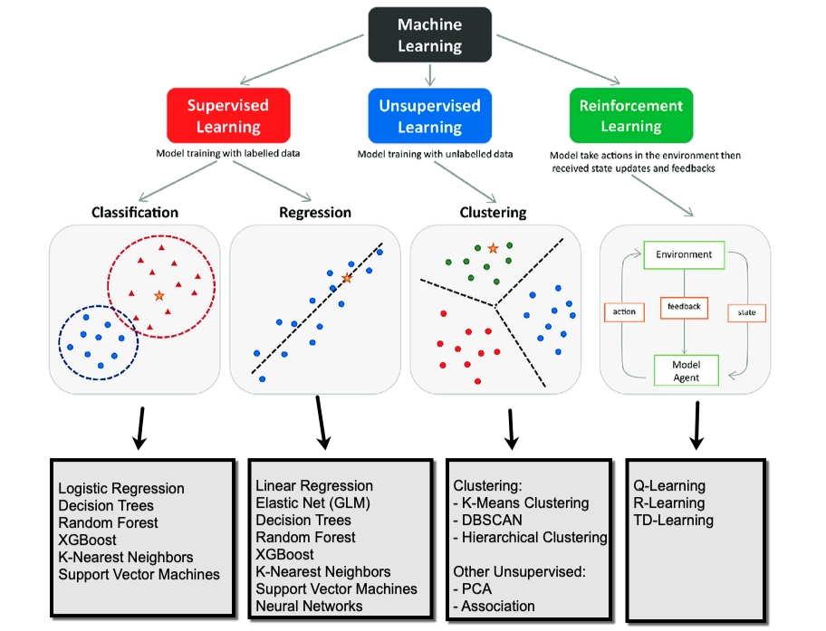
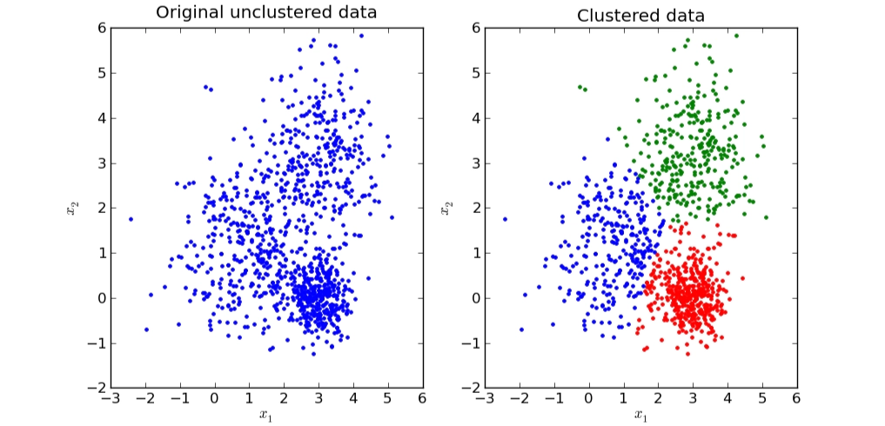
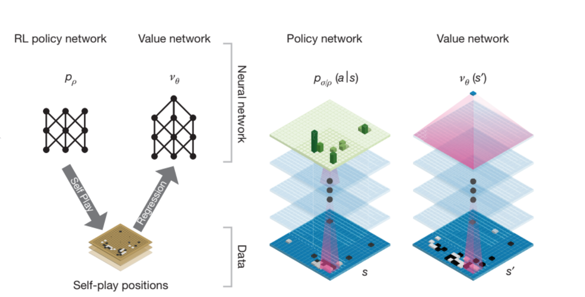

In [machine learning](https://en.wikipedia.org/wiki/Machine_learning), **reinforcement learning** (**RL**) is concerned with how an [intelligent agent](https://en.wikipedia.org/wiki/Intelligent_agent) should [take actions](https://en.wikipedia.org/wiki/Action_selection) in a dynamic environment in order to [maximize a reward](https://en.wikipedia.org/wiki/Reward-based_selection) signal. Reinforcement learning is one of the [three basic machine learning paradigms](https://en.wikipedia.org/wiki/Machine_learning#Approaches), alongside [supervised learning](https://en.wikipedia.org/wiki/Supervised_learning) and [unsupervised learning](https://en.wikipedia.org/wiki/Unsupervised_learning). ([Wikipedia](https://en.wikipedia.org/wiki/Reinforcement_learning))

# Notation

| **Symbol** | **Name** | **Description** |
| --- | --- | --- |
| $s_t$ | **State** | The observation/input from the environment at time $t$. |
| $a_t$ | **Action** | The decision made by the agent at time $t$. |
| $r_t$ | **Reward** | The feedback signal received after taking an action. |
| $\pi$ | **Policy** | The agent's action selection strategy (a mapping from states to actions). |
| $\gamma$ | **Discount Factor** | A value (0 to 1) that determines how much the agent cares about future rewards or immediate ones. |
| $T$ | **Numer of steps** | The length of one trajectory. |
| $G_t$ | **Return** | The total accumulated (and usually discounted) reward from time $t$ onwards. |
| $V(s)$ | **Value Function** | The expected return starting from state $s$. |
| $Q(s, a)$ | **Q-Value** | The expected return starting from state $s$ and taking action $a$. |
| $\theta$ | **Parameters** | The weights of the neural network representing the policy or value function. |
| $\alpha$ | **Learning Rate** | The step size used when updating the agent's knowledge (parameters). |
| $\tau$ | **Trajectory** | A sequence of states, actions, and rewards $(s_0, a_0, r_0, s_1, ...)$. |
| $J(\theta)$ | **Objective Function** | A measure of how good the current policy is (usually the expected total reward). |
| $\nabla_\theta$ | **Gradient** | The direction and magnitude of the change needed for $\theta$ to increase $J$. |
| $D$ | **Dataset** | Training dataset for supervised and unsupervised learning. |

# Basics

In supervised and unsupervised learning, the model is trained on a static dataset to identify underlying patterns. The update signal is derived entirely from the fixed provided data. And, there is no interaction with an external system…

Reinforcement Learning, however, learns through active **trial and error**. There is an agent interacting with an environment and receiveing rewards based on its selected actions immediately. It then uses the cumulative reward as a update signal to optimize its action selection scheme, finally learning a strategy (later, we call it policy) to maximize long-term return.

## Supervised Learning

In supervised learning, each sample has a corresponding label in the dataset, so we train a model to learn a mapping pattern from inputs to outputs provided by the static dataset:

$$
\hat y = f_\theta(x)
$$

where $x$ is the input, $\hat y$ is the predicted output, and $f_\theta$ is the model parameterized by $\theta$.

We optimize the model by minimizing the difference between the predicted output $\hat y$ and the grond-truth label $y$, typically through a loss function. For the ideal state, we are looking for the parameter $\theta^*$ that could lead to the lowest gap between the predicted and GT from all the possible parameters $\theta$:

$$
\theta^* = \arg\min_\theta \ \mathbb{E}_{(x,y)\sim \mathcal{D}} [ \mathcal{L}(\hat y, y)]
$$

where $\mathcal{L}(\cdot)$ measures how far the prediction is from the true label (e.g., mean squared error for regression or cross-entropy for classification), and $\mathcal{D}$ denotes the dataset.

In practice, this optimization is performed iteratively using gradient-based methods. This is the formula:

$$
\theta \leftarrow \theta - \alpha \nabla_\theta \mathcal{L}(\hat y, y)
$$

so that the model gradually improves its predictions over the training data, and finally have a competitive mapping performance which can be used in the later prediction.

## Unsupervised Learning

In unsupervised learning, the dataset does not contain explicit labels, so instead of learning a direct mapping from input to a given output, the model tries to discover hidden structure, or patterns within the data itself. 

There are several common scenarios, including grouping similar samples together, reducing the dimensionality of the data, or learning a compact representation of input like autoencoder… 

A classic example of unsupervised learning is **customer segmentation**. Suppose we only have customer features such as age, income, and spending behavior, but no labels like “budget shopper” or “premium customer.” We actually need more specific classification for all customers so later we can deliver personalized service. **K-means clustering** is introduced to partition the data into $K$ groups based on feature similarity.

Given a set of samples, customers $\{x_i\}_{i=1}^N$, where each $x_i \in \mathbb{R}^d$, and we initialize the number of cluster $K$, or we can say the number of centroid. What K-means do is to divide the data into $K$ clusters by minimizing the within-cluster variance:

$$
\min_{{\mu_k}, {c_i}} \sum_{i=1}^{N} | x_i - \mu_{c_i} |^2
$$

where $c_i \in {1, \dots, K}$ denotes the cluster assignment of sample $x_i$, and $\mu_k$ is the centroid of cluster $k$.

To be more specific, the algorithm alternates between two steps:

1. **Assignment step**: assign each sample to its nearest centroid,
    
    $$
    c_i = \arg\min_{k \in {1,\dots,K}} |x_i - \mu_k|^2
    $$
    
2. **Update step**: recompute each centroid as the mean of all samples assigned to that cluster,
    
    $$
    \mu_k = \frac{1}{|\mathcal{C}_k|} \sum{x_i \in \mathcal{C}_k} x_i
    $$
    

where $\mathcal{C}_k$ is the set of samples assigned to cluster $k$.

As shown in the figure, the data on the left is initially unlabeled and unstructured. After applying K-means, the same data is partitioned into several clusters on the right, with each color representing one discovered group. Points within the same cluster are close to one another in feature space, meaning they share similar characteristics. In practice, these clusters may correspond to meaningful customer segments, even though no labels were given in advance.

## Reinforcement Learning

Reinforcement Learning is different. Instead of training a model to mimic the mapping from inputs to labels, as in supervised learning, or discovering patterns in a static dataset, as in unsupervised learning, RL learns through **interaction**.

In RL, we place the model (often called an **agent**) in an environment, and let it interact with the environment over time. At each step, the agent observes the current state, then selects an action according to its policy, and then receives feedback from the environment in the form of a reward, along with the next state. 

 loop: the agent interacts with the environment by taking actions and receiving states and rewards.")

The agent is essentially still a model. Like any model, it has a structure, defined inputs and outputs, and a way to update its parameters. In RL, the input is the current state, and the output is an action. The policy can be perceived as a probability model, where each possible action is assigned a probability. Based on the cumulative rewards received from the environment, the agent updates its policy to increase the likelihood of actions that lead to higher rewards, while reducing the probability of less effective ones.

> The goal of RL is to choose actions that maximize the **long-term expected return**, that is, the accumulated reward over time.
> 

In the context of game playing, this often means choosing a sequence of moves that maximizes the probability of eventually winning the game.

A well-known example is [**AlphaGo**](https://www.nature.com/articles/nature16961), which combined a **policy network** and a **value network** with tree search. The policy network was used to suggest promising next moves, while the value network estimated the probability of winning from a given board position. During tree search, these two networks work together to guide move selection more efficiently, allowing the system to focus on the most promising branches instead of exploring every possibility equally.

Let’s see more details about how RL works during training and inference.

### Training

We want to maximize the **long-term expected return** (the cumulative rewards) using the RL agent, so intuitively, the agent should gradually increase the probability of actions that lead to the higher reward in the future, while decrease the probability of actions that lead to poorer outcome. 

There is a terminology called **trajectory**, the notation is $\tau,$ which means a full sequence of interaction steps from beginning to end, including states, actions, and rewards. 

At each timestep $t$, an action is sampled according to the policy,

$$
a_t \sim \pi_\theta(a \mid s_t)
$$

and the environment then returns a reward $r_t$ and the next state. Repeating this process over time produces a trajectory $\tau$.

$$
\tau = (s_0, a_0, r_0, s_1, a_1, r_1, \dots, s_T)
$$

> In RL, trajectories are important because they capture the complete consequence of a sequence of decisions. Evaluating each action in isolation fails to account for long-term dependencies and contextual information.
> 

Once a trajectory is generated, we can compute its **return**, the notation is $G$, namely the accumulated rewards. The return is usually discounted by $γ$ so that rewards received sooner are weighted more heavily than rewards received later.

$$
G = \sum_{t=0}^{T} \gamma^t r_t = r_0 + \gamma r_1 + \gamma^2 r_2 + \cdots + \gamma^{T\-t} r_T
$$

We now define the objective function $J(\theta)$, which represents the **expected cumulative reward under the policy** $\pi_\theta$. 

Ideally, to compute this expectation exactly, we would need to collect all possible trajectories generated by the policy, weighted by their corresponding probabilities. However, this is impossible, so we instead **sample trajectories** by running the policy in the environment and use these samples to estimate the objective. 

$J(\theta)$ is written as:

$$
J(\theta) = \mathbb{E}_{\tau \sim \pi\_\theta} [ \sum\_{t}^T \gamma^t r_t]
$$

As we said before, $\tau$ denotes a trajectory generated by the policy $\pi_\theta$, $\gamma$ is the discount factor, and $r_t$ is the reward received at timestep $t$.

To optimize the policy, we calculate the partial derivative of the objective function with respect to the policy parameters $\theta$:

$$
\nabla_\theta J(\theta)
$$

This gradient tells us which direction to change the policy parameters so that the policy selects better actions (can lead to higher cumulative rewards). Then we update the policy parameters in the direction that increases the expected return:

$$
\theta \leftarrow \theta + \alpha \nabla_\theta J(\theta)
$$

<aside>

TL;DR: 

aim: maximize the long-term expected return → formulate the loss function → calculate the partial derivative with respect to policy parameter → update policy parameter

</aside>

### Inference

During inference, however, no learning happens. The agent simply uses the learned policy to choose an action $a_t$ given the current state $s_t$:

$$
a_t \sim \pi_\theta(a|s_t)
$$

## Types

We have discussed the basic process of RL training and inference process, but it is just one type, called **policy-based RL**, which aims to directly learn the optimal policy $\pi_\theta(a|s_t)$, which maps states to probabilities of actions. 

Generally, there are three types of RL methods: value-based methods, policy-based methods and actor-critic methods.

### Value-based methods

Value-based RL focuses on learning a value function that estimates how good it is to take an action. The agent aims to maximize the long-term cumulative reward, so it chooses the action with the highest value.

The value function is like:

$$
Q(s,a)
$$

Then choose the action with the highest value:

$$
a = \arg\max_a Q(s,a)
$$

So they do not directly learn the policy. They learn values first, then derive the policy from them.

Methods example, more details later…:

- Q-learning
- DQN

### Policy-based methods

This kind of methods learn the policy directly, meaning they directly learn what action to take in a given state. Typical idea is like:

$$
\pi_\theta(a|s)
$$

So instead of scoring all actions first, they directly output an action distribution.

Mehods example:

- REINFORCE

### Actor-critic methods

This kind of method combines both ideas:

- **Actor**: learns the policy
- **Critic**: evaluates how good the action or state is

So, actor decides what to do, and critic tells it how good that decision is.

Methods example:

- PPO
- DDPG
- TD3
- SAC

# References

## References

[1] “Reinforcement learning,” Wikipedia. [Online]. Available: [https://en.wikipedia.org/wiki/Reinforcement_learning](https://en.wikipedia.org/wiki/Reinforcement_learning)

[2] R. S. Sutton and A. G. Barto, Reinforcement Learning: An Introduction, 2nd ed. Cambridge, MA, USA: MIT Press, 2018. [Online]. Available: [https://incompleteideas.net/book/the-book-2nd.html](https://incompleteideas.net/book/the-book-2nd.html)

[3] C. M. Bishop, Pattern Recognition and Machine Learning. New York, NY, USA: Springer, 2006.

[4] D. Arthur and S. Vassilvitskii, “k-means++: The advantages of careful seeding,” in Proc. 18th Annu. ACM-SIAM Symp. Discrete Algorithms (SODA), 2007, pp. 1027–1035. [Online]. Available: [https://theory.stanford.edu/~sergei/papers/kMeansPP-soda.pdf](https://theory.stanford.edu/~sergei/papers/kMeansPP-soda.pdf)

[5] D. Silver et al., “Mastering the game of Go with deep neural networks and tree search,” Nature, vol. 529, no. 7587, pp. 484–489, 2016. [Online]. Available: [https://www.nature.com/articles/nature16961](https://www.nature.com/articles/nature16961)

[6] “Machine learning,” Wikipedia. [Online]. Available: [https://en.wikipedia.org/wiki/Machine_learning](https://en.wikipedia.org/wiki/Machine_learning)

[7] “Supervised learning,” Wikipedia. [Online]. Available: [https://en.wikipedia.org/wiki/Supervised_learning](https://en.wikipedia.org/wiki/Supervised_learning)

[8] “Unsupervised learning,” Wikipedia. [Online]. Available: [https://en.wikipedia.org/wiki/Unsupervised_learning](https://en.wikipedia.org/wiki/Unsupervised_learning)