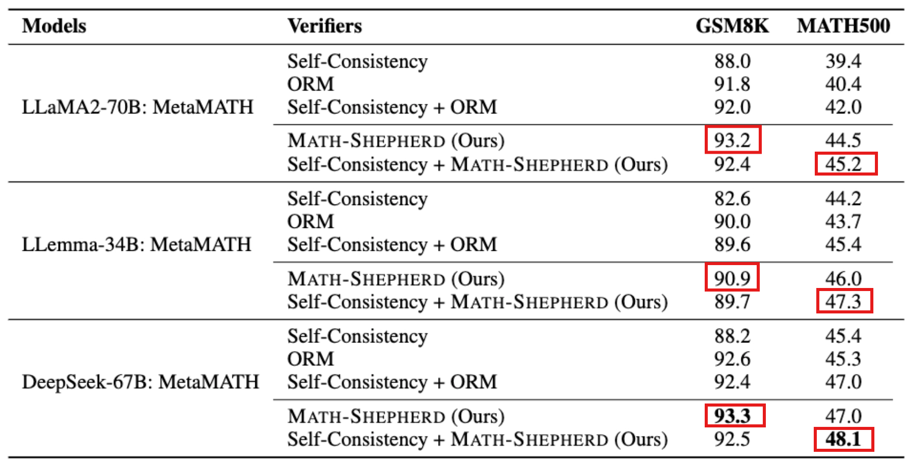
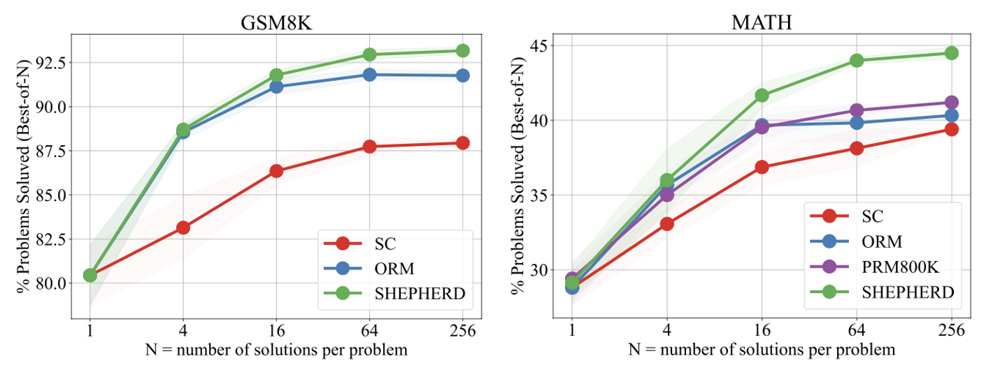
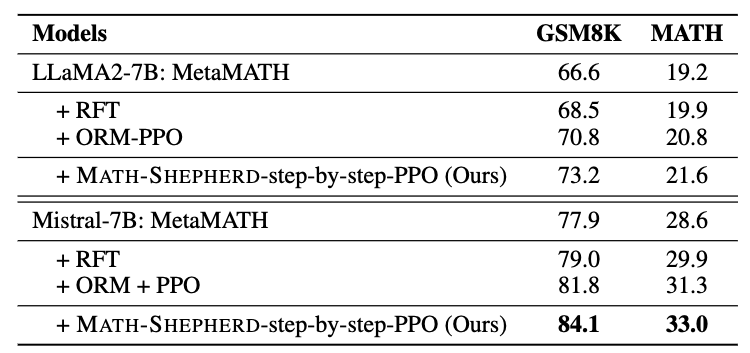
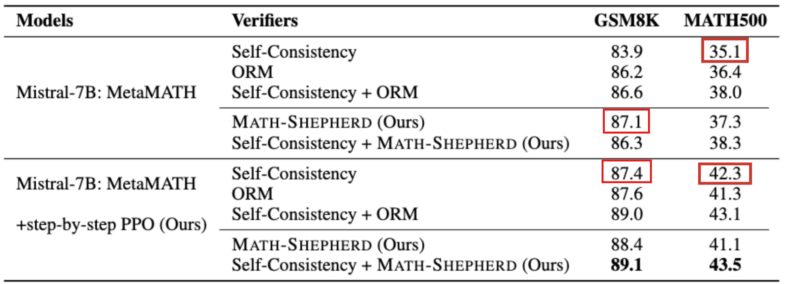
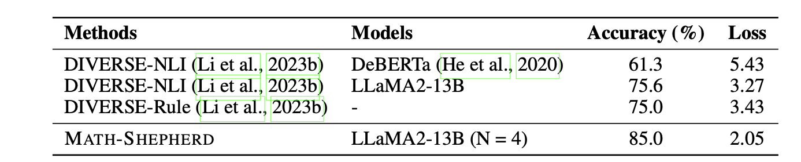
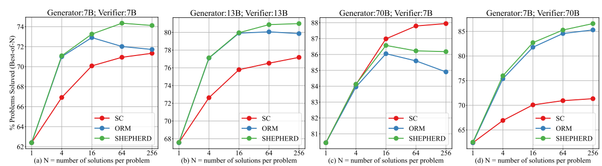
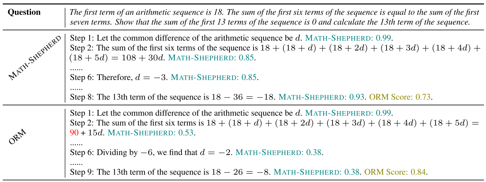
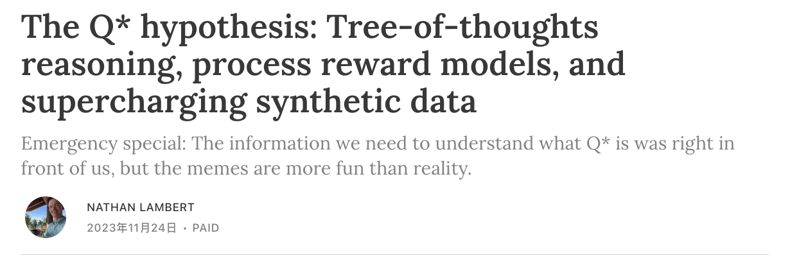

This is the talk and presentation I’ve given during seminar "Process Reward Modeling in LLMs" at the University of Heidelberg.

It involves a presentation and a short academic discussions, the content is about paper sharing, experiments, and reproduction results with classmates and professors.

The paper name is "Math-Shepherd: Verify and Reinforce LLMs Step-by-Step without Human Annotations" ([Wang et al., 2024](https://arxiv.org/abs/2312.08935)).

You could find the paper and slide here:

[Annotated Paper (PDF)](Math-Shepherd_paper.pdf) | 
[Preview Slides (PDF)](Math-Shepherd_ppt.pdf)

## 1. Introduction

**Math-Shepherd**: a process-oriented math **process reward model** (verifier), which assigns a reward score to each step of math problem solutions. So it provides an **automatic process supervision** method without human annotations.

- input: Question + each step of the LLM’s outputs (solution) on math problems
- output: a reward score.

**Training**: use automatically constructed process-wise supervision data

- Data collection
    - **Generator**: Question → Step 1 → Step 2 → Step 3 → final answer
    - **Completer**: Question + Step 1 → continue Step 2 → Step 3 → final answer
    - **Generator** generates many step-by-step solutions. For each intermediate step, we use the **completer** to generate several continuations to set label for each step.
        - If many continuations reach the gold final answer, this step receives a high score;
        - otherwise, it receives a low score.

**Inference**: 

- New question → fine-tuned LLM generates many solutions → MATH-SHEPHERD scores each solution step by step → select the best solution → final answer

**Experiments** (verify effectiveness): two scenarios

1. **Verification**: **rerank** outputs by LLMs
2. **Reinforcement** Learning: **reinforce** LLMs with step-by-step PPO.

**Result**: improve LLMs performance → Mistral-7B 

- 77.9% → 84.1% on **GSM8K**
    - with verification → 89.1%
- 28.6% → 33.0% on **MATH**
    - with verification → 43.5%

. The +SHEPHERD results are obtained by selecting the best one from 256 candidates using MATH-SHEPHERD. We can observe that MATH-SHEPHERD is compatible with different LLMs. The results of GPT-4 (early) are from [Bubeck et al. (2023)](https://arxiv.org/abs/2303.12712).")

### Notation

| **Symbol** | **Name** | Description |
| --- | --- | --- |
| $p$ | math problem | The input question to solve. |
| $s$ | problem solution | A complete candidate solution generated for problem $p$. Contains multiple reasoning steps and a final answer. |
| $R$ | real-valued reward score | The output space of the reward model. It means the model outputs a real number as a reward/score. |
| OPM | outcome reward model | A reward model $P×S→R$. It takes a problem $p$ and a complete solution $s$, then gives **one score** to the whole solution.  |
| PRM | process reward model | A reward model $P×S→R^K$. It takes a problem $p$ and a step-wise solution $s$, then gives **one score for each reasoning step**. |
| $y_s$ | golden answer of solution $s$ | $y_s$ = 1 if s is correct, otherwise $y_s$ = 0 |
| $r_s$ | sigmoid score of $s$ assigned by ORM | ORM’s predicted probability-like score that solution $s$ is correct. It is between 0 and 1. |
| $K$ | number of reasoning steps for s | If solution $s$ has $K$ steps, PRM can assign $K$ step-level scores, one for each step. |
| $N$ | number of possible candidates | PRM’s number of possible candidates for each step, used for calculating the quality |

## 2. Methodology

### Evaluation setting

The paper evaluates the reward model in two scenarios:

1. Verification

This follows the **best-of-N selection** paradigm.

Given a problem $p$ in the testing set, we sample $N$ candidate solutions from a generator. The reward model then scores each candidate solution, and the solution with the highest score is selected as the final answer.

2. Reinforcement learning

The automatically constructed PRM is used to supervise the LLM with **step-by-step PPO**.

The PRM provides reward signals for intermediate reasoning steps, and the LLM is further trained to generate better step-wise solutions. After training, the model is evaluated by the accuracy of its generated answers, usually using greedy decoding.

> Greedy decoding: At each generation step, the model always chooses the token with the highest probability.
> 

### Reward Model Categories

There are two types of reward model mentioned in the paper: outcome reward model (ORM) and process reward model (PRM).

ORM: given a mathematical problem $p$ and its solution $s$, ORM $(P \times S \to \mathbb{R})$ assigns a single real-value to $s$ to indicate whether $s$ is correct. ORM is usually trained with a **cross-entropy loss**:

$$
\mathcal{L}_{ORM} = y_s \log r_s + (1-y_s)\log(1-r_s)
$$

PRM: it takes a step further, PRM $(P \times S \to \mathbb{R}^+)$ assigns a score to each reasoning step of $s$, which is usually trained with:

$$
\mathcal{L}_{PRM} = \sum\_{i=1}^{K} y\_{s_i}\log r\_{s_i}+(1-y\_{s_i})\log(1-r\_{s_i})
$$

We regard PRM training as the binary classification, in which each step is classified as either ‘good’, or ‘bad’. 

Compared to ORM, PRM can provide more detailed and reliable feedback. However, there are currently no automated methods available for constructing high-quality PRM training datasets. Previous works typically rely on costly human annotations. So discovering the automatic process annatation framework to get high-quality PRM training datasets becomes the key thing.

### Automatic Process Annotation

The quality of a reasoning step is its potential to deduce the correct answer. How to determined the quality of each step? We first introduce a model called completer.

A completer is a model to finalize $N$ subsequent reasoning process from each step, and we can estimate the qulity of this step based on the correctness of all answers.

: automatic outcome annotation assigns a correctness label to the entire solution S; (b) automatic process annotation employs a ‘completer’ to finalize N reasoning processes (N=3 in this figure) for an intermediate step ($s_1$ in this figure), subsequently use hard estimation (HE) and soft estimation (SE) to annotate this step based on all decoded answers.")

There are two methods to estimate the quality $y_{s_i}$ for the step $s_i$, hard estimation $HE$ and soft estimation $SE$. 

$HE$ supposes that a reasoning step is good as long as it **can reach** the correct answer $a^*$:

$$
y_{s_i}^{HE} =
\begin{cases}
1 & \exists a_j \in A,\ a_j = a^* \\
0 & \text{Otherwise}
\end{cases}
$$

$SE$ assumes the quality of a step as **the frequency** with which it reaches the correct answer:

$$
y_{s_i}^{SE} =
\frac{\sum_{j=1}^{N} \mathbb{I}(a_j = a^*)}{N}
$$

Once we gather the label of each step, we can train PRM with the **cross-entropy loss**. 

In conclusion, we could say the **automatic process annotation framework** defines the quality of a step as its potential to deduce the correct answer and set the label of each step by completion and estimation.

### Ranking for Verification

$$
a_{sc+rm} = \arg\max_a \sum_{i=1}^{N} \mathbb{I}(a_i = a) \cdot RM(p, S_i)
$$

Meaning for each possible final answer $a$:

1. Look at all $N$ candidate solutions.
2. Keep only the solutions whose final answer equals $a$.
3. Add their reward model scores.
4. Choose the answer group with the highest total score.

### Reinforce Learning with Process Supervision

Upon achieving PRM, we employ RL to train LLMs. We implement PPO in a step-by-step manner. Different from the conventional strategy that utilizes PPO with ORM, which only offers a reward at the end of the response, the step-by-step PPO **offers rewards at the end of each reasoning step**.

## 3. Experiments

We evaluates the reward model in two scenarios:

- Verification
- Reinforcement Learning

The experiments are conducted on two mathematical reasoning benchmarks: **GSM8K** and **MATH**.

- **GSM8K** is used for both **verification** and **reinforcement learning** experiments.
- **MATH** is used for **reinforcement learning** experiments.
    - For the **verification** experiment on MATH, the authors use **MATH500**, a 500-problem subset of MATH.

For the verification setting, the generator samples **256 candidate solutions** for each test problem. The reward model then scores these candidates and selects the final answer. After that,  we compare the final answer with the benchmark’s gold answer to get the evaluated accuracy.

To reduce randomness from sampling, the reported verification accuracy is the **mean accuracy over 3 independent groups of sampled solutions**. For example,

- **Run 1:** sample 256 solutions for each problem → evaluate accuracy = 45.0%
- **Run 2:** sample another 256 solutions for each problem → evaluate accuracy = 45.8%
- **Run 3:** sample another 256 solutions for each problem → evaluate accuracy = 44.9%
- Then report the average: (45.0+45.8+44.9)/3=45.23

The base LLMs are trained on **MetaMATH** before being evaluated with MATH-SHEPHERD.

#### Baselines and Metrics

In the verification scenario, following ([Lightman et al., 2023](https://arxiv.org/abs/2305.20050)), we evaluate the performance of the reward model by comparing it against the **Self-consistency** and **ORM**. 

In the reinforcement scenario, we compare our step-by-step supervision with the outcome supervision provided by **ORM**, and **Rejective Sampling Fine-tuning (RFT)** ([Yuan et al., 2023](https://arxiv.org/abs/2308.01825)).

### Main Results

#### Math-Shepherd as Verifier

| Method | What it uses | How it selects the final answer |
| --- | --- | --- |
| **Self-Consistency** | Final answers only | Generate many solutions, then choose the answer that appears most often. |
| **ORM** | Whole-solution score | Score each complete solution once, then choose the solution with the highest ORM score. |
| **Self-Consistency + ORM** | Final-answer voting + ORM scores | Group solutions by final answer, sum ORM scores in each group, then choose the highest-scoring answer group. |
| **MATH-SHEPHERD** | Step-level/process scores | Score each reasoning step, use minimum score as solution score, then choose the highest-scoring solution. |
| **Self-Consistency + MATH-SHEPHERD** | Final-answer voting + step-level scores | Group solutions by final answer, sum MATH-SHEPHERD scores in each group, then choose the highest-scoring answer group. |

- As the verifier, the automatic PRM MATH-Shepherd **enhances the performance of various LLMs**, surpassing other verification methods like Self-consistency and ORM. (Math-Shepherd > self-consistency and ORM)
- In comparison to GSM8K dataset, PRM achieves a greater advantage over ORM on the more challenging MATH dataset. (PRM > ORM: MATH > GSM8K)
- In GSM8K, when combined with self-consistency, there’s a drop in performance, whereas in MATH, performance improves. (GSM8K: Math-Shepherd + self-consistency ⏬)

- The automatic PRM MATH-Shepherd enhances the performance of various LLMs, surpassing other verification methods like Self-consistency and Outcome Reward Model (ORM).
- The MATH-Shepherd also performs better than PRM trained with the human annotated dataset PRM800K. They attribute this superiority to the distribution gap and the data quantity.

#### Math-Shepherd as Reward Model on RL

It tests whether MATH-SHEPHERD can help **train a better 7B generator model**. And this table asks:
After PPO training, can the model itself generate better answers without best-of-256 selection with greedy decoding output?

- Step-by-step PPO significantly **improves the performance of two 7B supervised fine-tuned models**.
- RFT only slightly improves the model performance, the authors believe this is because MetaMATH already has conducted some data augmentation strategies like RFT;
- PPO with ORM can also enhance the model performance. However, it does not perform as well as the step-by-step PPO supervised by MATH-SHEPHERD, demonstrating the potential of step-by-step supervision.

#### Math-Shepherd as both Reward Model and Verifier

- RL and verification are complementary.
- After reinforcement learning, the vanilla verification methods with only reward models is inferior to self-consistency.

Verification with Math-Shepherd can further improve the performance of RL-enhanced models.

#### Quality of the Automatic Process Annotation

This part aims to explore the quality of the **automatic PRM dataset** by manually annotating 160 steps from GSM8K and use different completers to infer from each step to achieve their label.

: Accuracy of the process annotation using different completer; (b): Loss of the process annotation using different completer; (c): Loss of the process annotation using the same completer with different training data.")

- The automatic process annotation demonstrates satisfactory quality, achieving approximately 85% accuracy with LLama2-13B as the completer. These results outperform previous automatic process annotation methods, namely DIVERSE-NLI and DIVERSE-Rule.
- Empirically analyze the key factors for building high-quality automatic PRM dataset.
- (b) SE labels become closer to human labels when using more continuations, but HE is already good enough and much simpler. Therefore, the final verifier performs similarly whether trained with SE or HE.

#### Influence of the Pre-trained Base Models

- PRM exhibits superiority over self-consistency and ORM across all sizes of base models; bigger reward models prove to be more robust.
- we should utilize a more potent reward model for validating or supervising the generator.

#### Influence of the Number of Data

: Performance of different reward models using different numbers of training data; (b) performance of different verification strategies on the out-of-distribution Hungarian national exam.")

- PRM exhibits superior data efficiency
- PRM seems to have a higher potential ceiling than ORM

#### Out-of-distribution Performance

- both LLemma-34B-**ORM** and LLemma-34B-**PRM** outperform the **origin** LLemma-34B, showing the reward model can generalize to other domains;
- PRM outperforms ORM 9 scores, further demonstrating the superiority of PRM.

- MATH-SHEPHERD accurately selected the correct solution from a pool of 256 potential solutions, which ORM failed.
- MATH-SHEPHERD displayed superior discernment by precisely identifying incorrect steps within the solutions selected by ORM.

## 4. Limitations

- The computational cost of the completion process.
- The automatic process annotation consists of noise. The automatically generated step labels are not perfect. Some steps may be mislabeled because the completer’s continuations can be unreliable.

**Integrating human and automated process annotations** could play a vital role in constructing robust and efficient process supervision.

## 5. An Interesting Rumor about OpenAI's Q*

In the process of developing Math-Shepherd, a rumor regarding OpenAI's Q* began to circulate. According to this hearsay, the relevance of Q* extends to several key concepts, including [**Process-Supervised Reward Models**, **(Monte-Carlo) Tree Search**, and **Synthetic data**.](https://www.interconnects.ai/p/q-star)

> Sam Altman was suddenly fired as OpenAI CEO, then returned a few days later.

During that period, Reuters reported that before Altman’s temporary ouster, some OpenAI researchers had warned the board about a powerful AI discovery. The project was reportedly called **Q***, and it was rumored to involve improved mathematical reasoning or reasoning ability.
> 

**Regardless of the veracity of the rumor, it is said that automatic process supervision has immense potential for the future advancement of LLMs.** 

## References

[1] P. Wang, L. Li, Z. Shao, R. Xu, D. Dai, Y. Li, D. Chen, Y. Wu, and Z. Sui, “Math-Shepherd: Verify and reinforce LLMs step-by-step without human annotations,” in Proc. 62nd Annu. Meeting Assoc. Comput. Linguistics (ACL), Volume 1: Long Papers, Bangkok, Thailand, 2024, pp. 9426–9439, doi: 10.18653/v1/2024.acl-long.510.

[2] H. Lightman, V. Kosaraju, Y. Burda, H. Edwards, B. Baker, T. Lee, J. Leike, J. Schulman, I. Sutskever, and K. Cobbe, “Let’s verify step by step,” arXiv preprint arXiv:2305.20050, 2023.

[3] L. Yu, W. Jiang, H. Shi, J. Yu, Z. Liu, Y. Zhang, J. T. Kwok, Z. Li, A. Weller, and W. Liu, “MetaMath: Bootstrap your own mathematical questions for large language models,” arXiv preprint arXiv:2309.12284, 2023.

[4] K. Cobbe, V. Kosaraju, M. Bavarian, M. Chen, H. Jun, L. Kaiser, M. Plappert, J. Tworek, J. Hilton, R. Nakano, C. Hesse, and J. Schulman, “Training verifiers to solve math word problems,” arXiv preprint arXiv:2110.14168, 2021.

[5] D. Hendrycks, C. Burns, S. Kadavath, A. Arora, S. Basart, E. Tang, D. Song, and J. Steinhardt, “Measuring mathematical problem solving with the MATH dataset,” arXiv preprint arXiv:2103.03874, 2021.

[6] X. Wang, J. Wei, D. Schuurmans, Q. Le, E. Chi, S. Narang, A. Chowdhery, and D. Zhou, “Self-consistency improves chain of thought reasoning in language models,” arXiv preprint arXiv:2203.11171, 2022.

[7] J. Schulman, F. Wolski, P. Dhariwal, A. Radford, and O. Klimov, “Proximal policy optimization algorithms,” arXiv preprint arXiv:1707.06347, 2017.

[8] Z. Yuan, H. Yuan, C. Li, G. Dong, K. Lu, C. Tan, C. Zhou, and J. Zhou, “Scaling relationship on learning mathematical reasoning with large language models,” arXiv preprint arXiv:2308.01825, 2023.

[9] A. Q. Jiang et al., “Mistral 7B,” arXiv preprint arXiv:2310.06825, 2023.

[10] H. Touvron et al., “Llama 2: Open foundation and fine-tuned chat models,” arXiv preprint arXiv:2307.09288, 2023.

[11] Z. Azerbayev, H. Schoelkopf, K. Paster, M. D. Santos, S. McAleer, A. Q. Jiang, J. Deng, S. Biderman, and S. Welleck, “Llemma: An open language model for mathematics,” arXiv preprint arXiv:2310.10631, 2023.

[12] S. Bubeck et al., “Sparks of artificial general intelligence: Early experiments with GPT-4,” arXiv preprint arXiv:2303.12712, 2023.

[13] A. Tong, A. K. A. Nichol, and J. Schulman, “OpenAI researchers warned board of AI breakthrough ahead of CEO ouster, sources say,” Reuters, Nov. 23, 2023. Accessed: May 1, 2026. [Online]. Available: [https://www.reuters.com/technology/sam-altmans-ouster-openai-was-precipitated-by-letter-board-about-ai-breakthrough-2023-11-22/](https://www.reuters.com/technology/sam-altmans-ouster-openai-was-precipitated-by-letter-board-about-ai-breakthrough-2023-11-22/)

[14] N. Lambert, “The Q* hypothesis: Tree-of-thoughts reasoning, process reward models, and synthetic data,” Interconnects, Nov. 24, 2023. Accessed: May 1, 2026. [Online]. Available: [https://www.interconnects.ai/p/q-star](https://www.interconnects.ai/p/q-star)