During the summer semester of 2026, I took [**Introduction to Neural Networks and Sequence-to-Sequence Learning**](https://www.cl.uni-heidelberg.de/courses/ss26/cognitive_principles_in_ai_research/) course. As you see, the main content is from perceptrons to modern sequence models.

I started learning machine learning through Li Mu’s courses. I spent several weeks systemically studying his materials and organized the corresponding code in the [repo](https://github.com/mrtanke/dive-into-dl).

Also, I had already used neural networks in multiple projects before taking this course. I had trained language models, vision models, vision-language models, reinforcement-learning agents and even vision-language-action models...

So I would say that I already had some basic knowledge of machine learning, and this course helped me deepen my understanding of neural networks in the language model area.

In this post, I summarize the structure of the course, the key ideas I learned, the questions I found challenging, and how the course reshaped my understanding of modern neural networks.

# About the Course

A rough roadmap for this course is:

<aside>

Perceptron → MLP → backpropagation → embeddings → CNN → RNN → LSTM/GRU → encoder-decoder → attention → Transformer → BERT and GPT → efficient and alternative sequence models.

</aside>

The content can be divided into four main parts:

| Part | Main topics |
| --- | --- |
| Foundations | Perceptrons, MLPs, loss functions, backpropagation, optimization |
| Representations and sequence modeling | Word embeddings, CNNs, RNNs, LSTMs, GRUs, encoder-decoder models |
| Attention and Transformers | Attention, self-attention, Transformer, multitask and transfer learning, BERT |
| Modern language models | GPT-style models, scaling, RLHF, RAG, FlashAttention, LoRA, Mamba, xLSTM |

The sequence of the course was one of its strongest points. Each architecture was introduced as a response to a limitation of the previous one. Because of this, the history of neural networks did not feel like a list of disconnected models. It felt like a continuous engineering and scientific process.

# Part I: Neural-Network Foundations

## 1. From the Perceptron to Multi-Layer Networks

The course started with the perceptron, one of the earliest trainable models for binary classification.

A perceptron computes a linear score,

$$
z = \mathbf{w}^{\top}\mathbf{x} + b
$$

and makes a decision according to which side of the decision boundary the input lies on.

A single perceptro can model linear function and solve simple linear question, but it can’t be used in non-linear modeling. One important example mentioned in the lecture was **XOR**. A single perceptron cannot represent XOR because the positive and negative examples are not linearly separable. There is no single straight line that separates the two classes.

So it naturally comes to hidden layers, a multi-layer perceptron computes something like

$$
f_{\theta}(\mathbf{x}) = \sigma\left(W_2 \sigma(W_1\mathbf{x}+b_1)+b_2\right)
$$

The hidden layer alone is not the key, because if we add identity function in this hidden layer, it still sucks. The important part is the **non-linear activation function**. Without it, two linear layers collapse into one linear transformation, like this:

$$
W_2(W_1\mathbf{x}+b_1)+b_2 =(W_2W_1)\mathbf{x} + (W_2b_1+b_2)
$$

Therefore, stacking linear layers without activation functions does not increase the expressive power of the model. The key is activation function, which makes the hidden representation non-linear, which allows the network to model non-linear decision boundaries. Now we can model XOR!

## 2. Loss Functions, Backpropagation, and Computation Graphs

When we have MLP, we start to consider one question: how should we train and learn it?

For classification, the network first produces logits, but what we need is the probability distribution among all the possibilities. 

Softmax implement this idea, it converts them into a probability distribution:

$$
p(y=i \mid \mathbf{x}) = \frac{\exp(o_i)}{\sum_j \exp(o_j)}
$$

The output values are non-negative and sum to one.

For maximum likelihood, we multiply the probabilities of all training examples. To make the computation easier, we take the log, which converts the product into a sum. Since training usually minimizes a loss function, we use the **negative log-likelihood**.

For a single example whose correct class is $c$, the categorical cross-entropy loss becomes

$$
\mathcal{L} = - \log p(y=c\mid \mathbf{x}).
$$

The main technical topic was **backpropagation**. Instead of treating differentiation as a large symbolic calculation, we can represent the neural network as a computation graph.

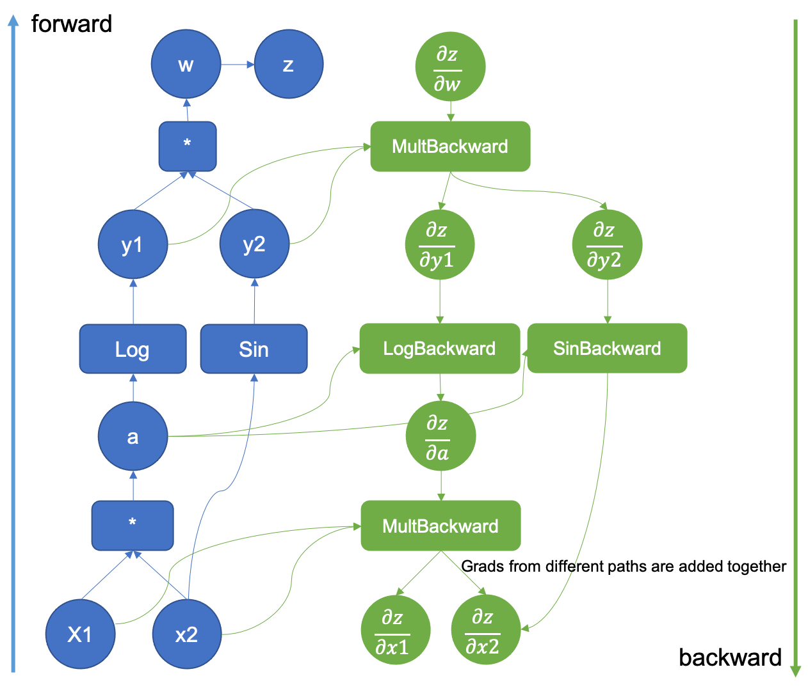

Each node stores an intermediate value, and the backward pass applies the chain rule in reverse topological order. Intermediate values from the forward pass are reused, which is essential for computational efficiency.

For a weight $w_{ij}$, a typical gradient has the form: 

$$
\frac{\partial \mathcal{L}}{\partial w} = \frac{\partial \mathcal{L}}{\partial z} \frac{\partial \mathcal{z}}{\partial w} = \delta_j \cdot  \text{out}_i 
$$

Here:

- $\delta_j$ represents backward error signal;
- $\text{out}_i$ is the input that was sent through the weight, forward input.

The gradient of a weight depends on both the error signal arriving from upper layers and the activation that originally flowed through that weight.

## 3. Pratical Experience

This session is especially practical. It focused on hyperparameters and common failure modes. A neural network can be mathematically correct and still fail completely because of poor training choices.

### Saturating and dying neurons

Sigmoid and tanh can saturate when their inputs become very large in magnitude. Their derivatives then become close to zero, so almost no gradient passes backward.

ReLU has a different problem. When its input remains negative, its output and derivative are both zero. The unit may stop updating and become a **dying ReLU**.

### Learning rate

The learning rate is not just a speed control.

- If it is too large, the loss may oscillate or diverge.
- If it is too small, training may be extremely slow or get stuck before reaching a useful solution.

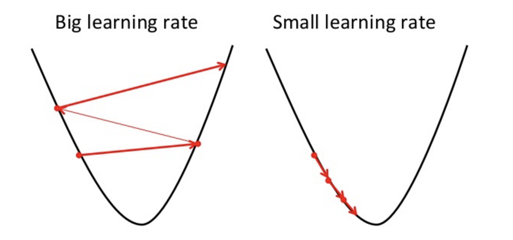

The course also covered learning-rate schedules, regularization, dropout, early stopping, and gradient clipping. All of them are practical and good for building AI engineer mind.

# Part II: Representations and Sequence Models

## 4. Learning Word Representations

The next part of the course moved into neural language processing (NLP).

Besically, the process of representing one word is:

1. one word is assigned with an index based on the vocabulary.
2. represent it with a one-hot vector (the size of the vector equals to the number of vocabulary, the index location is set to 1, the others are set to 0).

A one-hot vector treats every word as an unrelated symbol. It tells us which word is present, but it contains no notion of similarity. 

1. convert the one-hot vector to an embedding vector. Specifically, a weight matrix is used for mapping one-hot vector into a continuous vector space for easily comparison and less size.

Normally, words appearing in similar contexts should receive similar representations. There are two classicly central word2vec architectures were introduced.

### CBOW

Continuous Bag of Words predicts the center word from its surrounding context.

$$
p(w_t \mid w_{t-k}, \ldots, w_{t-1}, w_{t+1}, \ldots, w_{t+k})
$$

It combines the context words and ignores their exact ordering.

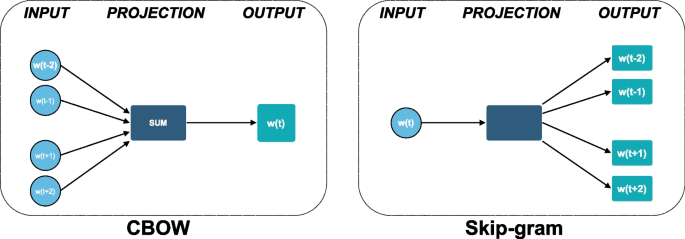

### Skip-Gram

Skip-Gram does the opposite: it predicts surrounding words from the center word.

$$
p(w_{t+j} \mid w_t)
$$

Skip-Gram can be expensive when the vocabulary is large because a full softmax must score every possible word. Negative sampling turns the problem into distinguishing observed word-context pairs from sampled negative pairs.

## 5. Convolutional Neural Networks

CNNs are normally associated with images, but they can also process text.

In an NLP CNN, a filter moves across neighboring word embeddings. It detects local patterns similar to n-grams. Pooling then combines these local activations into a fixed-size global representation.

The main idea was:

$$
\mathrm{local\ feature\ extraction} \quad+\quad \text{global pooling} \quad=\quad \text{sentence representation}.
$$

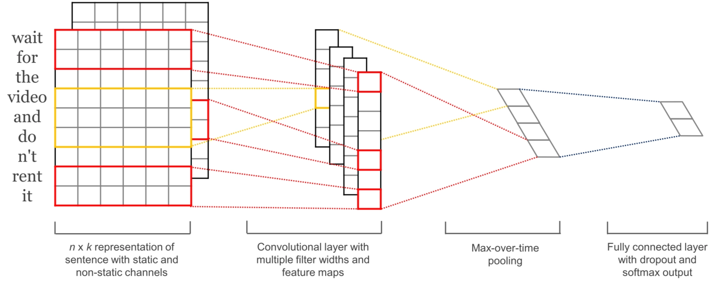

Compared with a fixed window MLP, a CNN can process a sentence of variable length. Compared with CBOW and Skip-Gram, it preserves at least local word order.

However, its understanding of order is still limited by the receptive field. This directly motivated the next architecture.

## 6. Recurrent Neural Networks

Language is sequential. The meaning of a token may depend on what appeared much earlier.

An RNN maintains a hidden state:

$$
\mathbf{h}_t = \sigma(\mathbf{x}_t W + \mathbf{h}\_{t-1} U + \mathbf{b})
$$

The current state depends on both the current input and the previous state. The same parameters are reused at every time step.

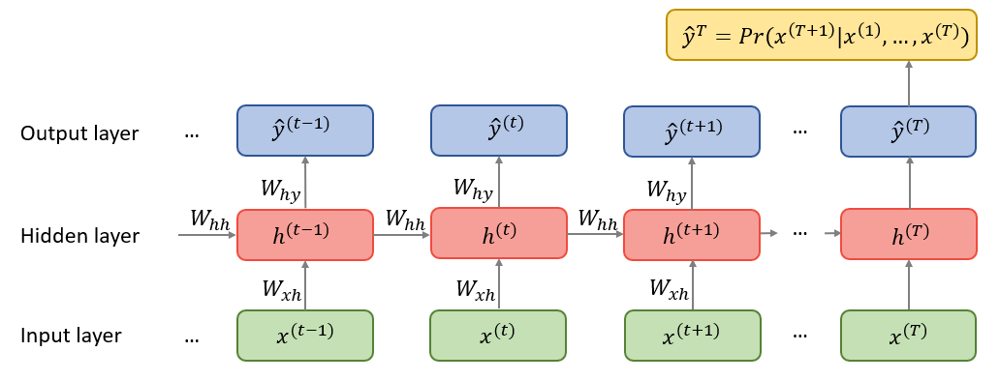

There are three common supervision patterns:

- **Acceptor:** one output for the whole sequence;
- **Encoder:** the sequence of hidden states is used as a representation;
- **Transducer:** one supervised output is produced at each time step.

For language modeling, the model estimates

$$
p(x_1,\ldots,x_T) = \prod_{t=1}^{T} p(x_t\mid x_{<t})
$$

This is a simple equation, but it is also the core objective behind modern autoregressive language models.

The session also introduced character-level language modeling. Character models avoid a fixed word vocabulary and can produce unseen words, but they must process longer sequences and learn word structure from characters.

## 7. LSTM and GRU

Training an RNN requires **backpropagation through time**. After unrolling the recurrence, the RNN behaves like a very deep network whose weights $W$, $b$ are shared across time. Depending on their magnitudes, the gradient can:

- grow exponentially and explode;
- shrink exponentially and vanish.

Gradient clipping can control exploding gradients by rescaling a gradient whose norm exceeds a threshold. However, clipping does not solve vanishing gradients, because it cannot restore information that has already become nearly zero.

### LSTM

The LSTM introduces a cell state and several gates. 

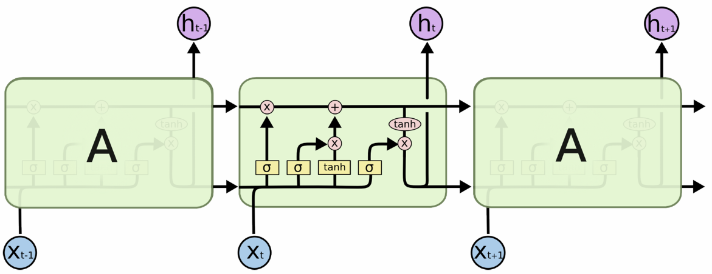

The forget gate controls what is retained from the old memory. The input gate controls what new information is written. The output gate controls what part of the memory becomes visible.

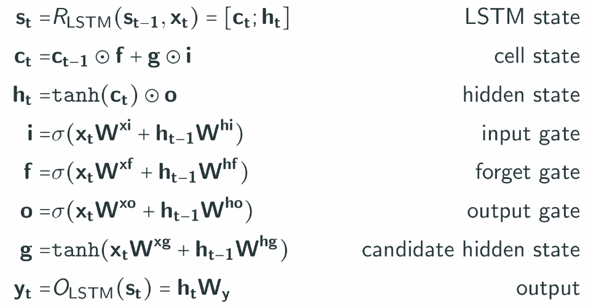

To be more specific, at time step $t$, the LSTM combines the current input $\mathbf{x}_t$ and previous hidden state $\mathbf{h}\_{t-1}$ to compute the input, forget, and output gates, together with the candidate state $\mathbf{g}$. These values update the cell state $\mathbf{c}_t$, produce the hidden state $\mathbf{h}_t$, and generate the output $\mathbf{y}_t$.

The most important design choice is the additive memory update. Instead of repeatedly transforming the entire state through a non-linearity, which probably breakdown the gradient, information can travel through the cell state along a more direct path.

### GRU

The GRU provides a simpler gated architecture with update and reset gates. It has fewer components than an LSTM but follows the same general idea: allow the network to control information flow dynamically.

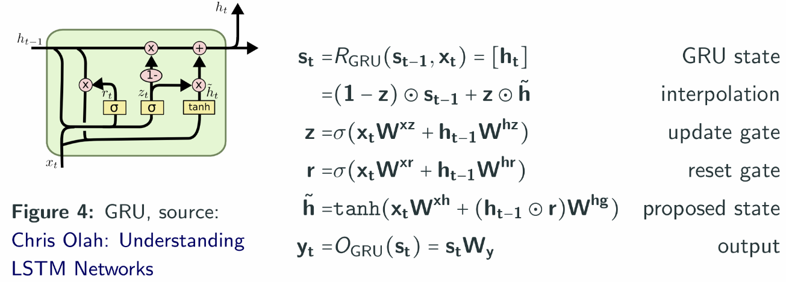

## 8. Encoder-Decoder Models

The encoder-decoder architecture maps one sequence to another.

The encoder reads the source sequence and produces a context representation. The decoder then generates the target sequence token by token.

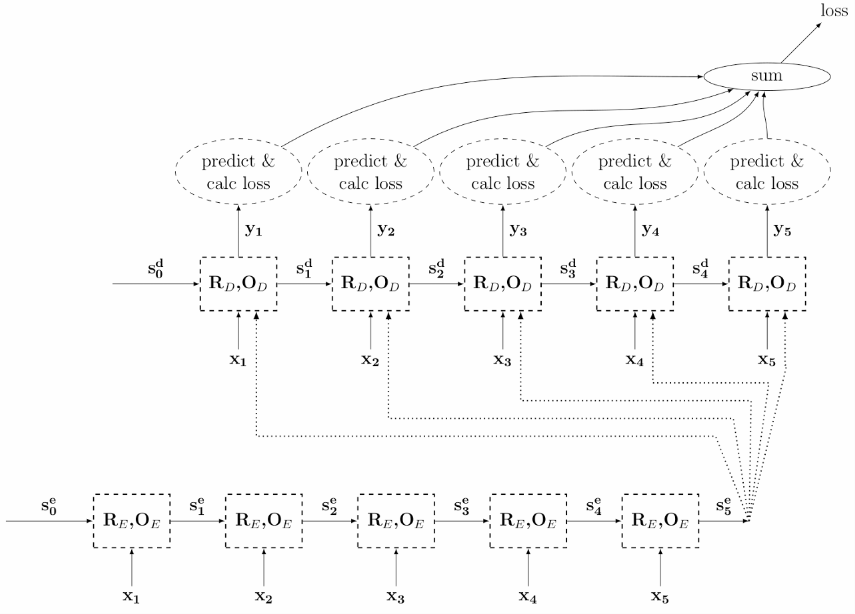

The output of the encoder is $\mathbf{c} = \mathbf{h}_{T_x}$, so the final encoder state must represent the entire input sentence. During training, the decoder may use the correct previous token as input. This is known as **teacher forcing**. During inference, it must use its own previous prediction, which creates a difference between training and generation.

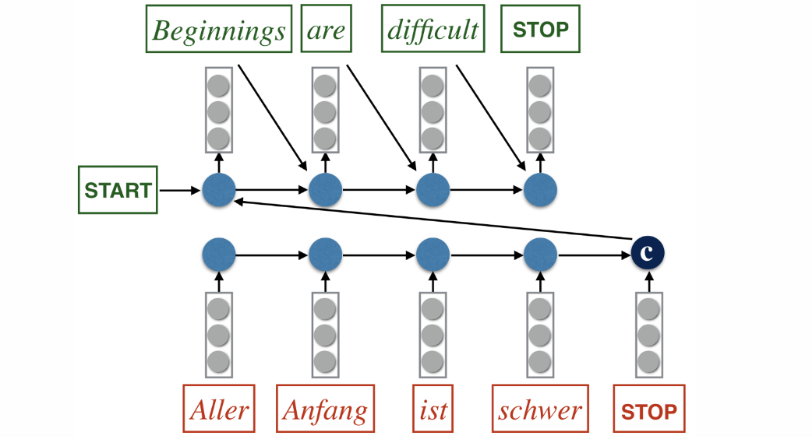

The model also needs a decoding strategy. Greedy decoding always chooses the locally most probable next token. Beam search keeps several candidate sequences and searches for a better global result.

The main weakness of the original architecture is the fixed context vector. Compressing a long input sentence into one vector creates an information bottleneck.

This limitation leads naturally to attention.

# Part III: Attention and Transformers

## 9. Attention

Attention allows the decoder to access all encoder states instead of depending only on one final vector. 

At each decoding step, the model computes a compatibility score between the current query and every key:

$$
e_{t,i} = \operatorname{score}(\mathbf{q}_t,\mathbf{k}_i).
$$

Softmax then converts these scores into attention weights:

$$
\alpha_{t,i} = \frac{\exp(e_{t,i})}{\sum_j \exp(e_{t,j})}.
$$

The context vector becomes a weighted sum:

$$
\mathbf{c}_t = \sum_i \alpha\_{t,i} \mathbf{v}_i.
$$

This query-key-value view is more general than machine translation. It says:

- the query describes what information is needed;
- the keys describe where that information may be found;
- the values contain the information to retrieve.

## 10. The Transformer

The Transformer removes recurrence and builds the model around self-attention.

Scaled dot-product attention is

$$
\operatorname{Attention}(Q,K,V) = \operatorname{softmax}\left(\frac{QK^\top}{\sqrt{d_k}}\right)V.
$$

Multi-head attention applies several attention operations in parallel, allowing different heads to learn different relations.

 Scaled Dot-Product Attention. (right) Multi-Head Attention consists of several attention layers running in parallel")

Because self-attention contains no built-in notion of sequence order, positional information must be added. The original Transformer used sinusoidal positional encodings.

The encoder contains repeated blocks of:

1. multi-head self-attention + residual connection and normalization;
2. feed-forward network + residual connection and normalization.

The decoder additionally uses:

- masked self-attention, so a position cannot see future target tokens;
- cross-attention over encoder outputs.

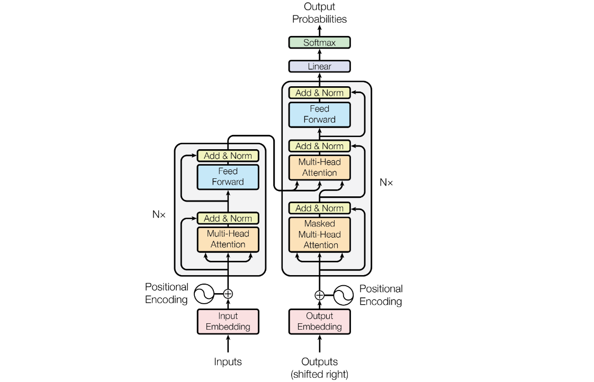

Compared with RNNs, Transformers allow parallel processing during training and provide shorter paths between distant tokens. However, standard self-attention constructs an $L \times L$ attention matrix, leading to quadratic cost in sequence length.

# Part IV: Modern Language Models

## 11. GPT and Expansion

Then we move from the original Transformer to modern large language models. It compared three Transformer families:

| Architecture | Context | Typical use | Example |
| --- | --- | --- | --- |
| Encoder-only | Bidirectional | Classification and understanding | BERT |
| Encoder-decoder | Source-to-target | Translation and conditional generation | T5 |
| Decoder-only | Causal left context | Autoregressive generation | GPT series |

Decoder-only models estimate the probability of a sequence using next-token prediction. Scaling this objective to larger models, more data, and more compute led to GPT-style models and in-context learning.

### Scaling laws

Language-model loss follows predictable power-law trends with model size, data, and compute. Later work showed that model size and training data need to be balanced rather than scaling parameters alone.

### In-context learning

A model can infer a task from instructions or examples inside the prompt without updating its parameters. This differs from fine-tuning, where the parameters themselves are changed.

### Instruction tuning and RLHF

Instruction tuning trains the model on instruction-response examples. Reinforcement learning from human feedback then uses preference data to align model outputs more closely with human expectations.

The simplified RLHF pipeline is:

1. supervised instruction tuning;
2. collection of preference comparisons;
3. reward-model training;
4. policy optimization using the learned reward.

### Retrieval-Augmented Generation

RAG retrieves external documents and provides them as additional context to the generator.[^rag] Instead of expecting the model to store every fact in its parameters, retrieval allows it to use a separate knowledge source.

## 12. Practical LLMs

We focus on the engineering side of large language models in this lecture.

### Subword tokenization

Word-level vocabularies suffer from unknown words and very large output spaces. Character-level models avoid unknown words but create much longer sequences.

Subword tokenization provides a compromise: frequent words can remain whole, while rare words are decomposed into reusable pieces. Byte Pair Encoding repeatedly merges frequent adjacent symbols until the target vocabulary size is reached.

### KV cache

During autoregressive generation, past keys and values do not need to be recomputed at every step. The KV cache stores them and reuses them.

This significantly speeds up generation, but the cache grows with sequence length and can consume a large amount of memory.

### Quantization

Quantization stores weights or activations with lower numerical precision. It reduces memory usage and may improve inference speed, but it can introduce approximation error.

### FlashAttention

FlashAttention computes exact attention while reducing expensive memory transfers between GPU memory levels. It improves practical speed and memory efficiency, although it does not change the quadratic asymptotic complexity of dense attention.

### LoRA

Low-Rank Adaptation freezes the original model and learns low-rank updates:

$$
W' = W + BA,
$$

where the rank of $BA$ is much smaller than the dimensions of $W$.

This makes fine-tuning much cheaper because only a small number of new parameters are trained.

## 13. Beyond Standard Attention

The final session asked a natural question:

> Do we really need the full $L \times L$ attention matrix?
> 

Standard self-attention has quadratic time and memory complexity in sequence length. This becomes expensive for long documents, codebases, and agent trajectories.

The course introduced three main families of alternatives.

1. Sparse attention
2. Linear attention
3. State-space models

### Sparse attention

Each token attends only to selected positions, such as a local sliding window or a small set of global tokens. This reduces computation, but the sparsity pattern may prevent some interactions.

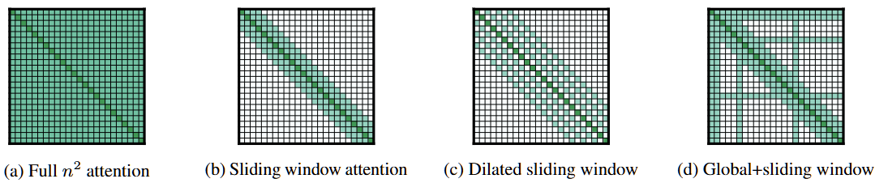

### Linear attention

Linear attention rearranges the computation by replacing softmax attention with a kernel feature map. Instead of explicitly constructing all query-key pairs, it summarizes past key-value information into a recurrent state.

This connects attention to fast-weight programmers and recurrent updates. Delta-rule variants improve the memory update by correcting the stored association rather than only adding new information.

### State-space models

State-space models represent a sequence through a latent state that evolves over time. Architectures such as S4 and Mamba aim to combine long-context modeling, efficient recurrence, and parallelizable training.

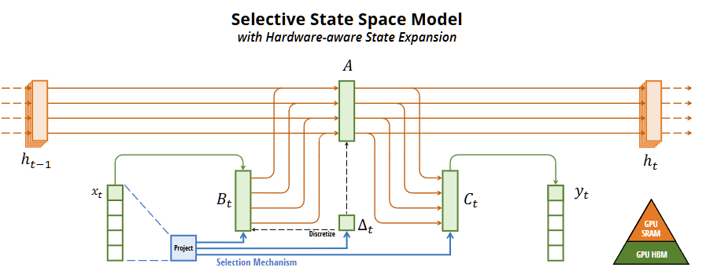

Mamba introduces input-dependent selective mechanisms so the model can decide which information should influence the state.

### xLSTM and hybrid models

xLSTM is a modern recurrent neural network based on the LSTM with modern design choices and scalable memory structures.

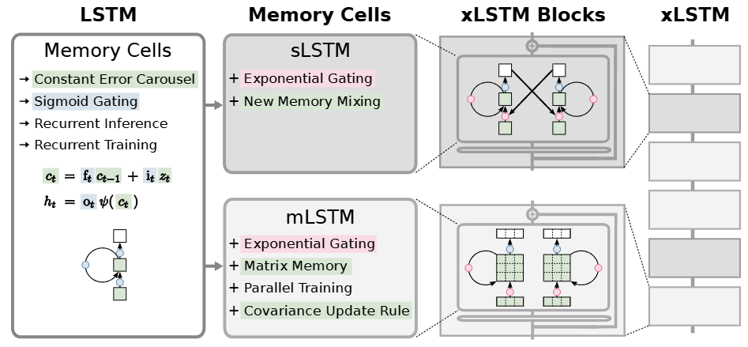

Hybrid architectures combine attention with recurrent, convolutional, or state-space layers, for example, Jamba…

The course did not end with “Transformers solved sequence modeling.” Instead, it ended with an open architectural landscape. Transformers are extremely successful, but efficiency, memory, and long-context processing remain active research problems.

# Final Reflection

Before taking this course, I saw neural-network architectures mainly as separate tools:

- MLP for basic prediction;
- CNN for local features;
- RNN or LSTM for sequences;
- Transformer for modern NLP;
- LoRA and quantization for large models.

After the course, I see them more as points on one continuous design path.

A new architecture usually appears because an earlier one has a clear limitation. But the new model also introduces another cost. RNNs improve sequence modeling but are difficult to parallelize. Transformers improve parallelism and long-range interaction but use quadratic attention. Efficient attention and state-space models reduce sequence cost but introduce new assumptions about memory and information flow.

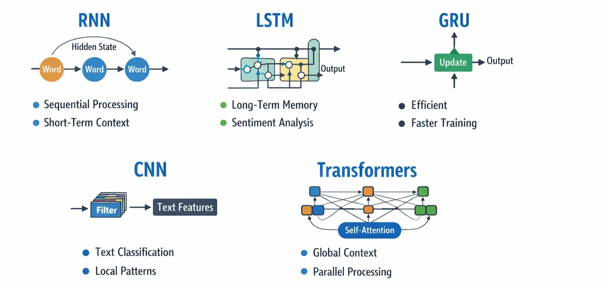

The course therefore gave me more than a list of architectures. It gave me a way to reason about models:

1. What information must the model represent?
2. How does information flow through the architecture?
3. How does the gradient flow during training?
4. What are the computational and memory costs?
5. What assumptions or bottlenecks are introduced?
6. How is training different from inference?
7. Which architecture is suitable for the actual task?

These questions are now useful far beyond NLP. I can apply the same reasoning to vision models, reinforcement learning, world models, vision-language-action models, and my own research projects.

The final session ended with efficient sequence models rather than a fixed conclusion. I think that was appropriate. Neural networks are still evolving, and the best architecture depends on the data, task, hardware, and scale.

# References

Rosenblatt, F. (1958). The Perceptron: A Probabilistic Model for Information Storage and Organization in the Brain. Psychological Review, 65(6), 386–408.

Rumelhart, D. E., Hinton, G. E., & Williams, R. J. (1986). Learning Representations by Back-Propagating Errors. Nature, 323, 533–536.

Mikolov, T., Chen, K., Corrado, G., & Dean, J. (2013). Efficient Estimation of Word Representations in Vector Space. arXiv:1301.3781.

Kim, Y. (2014). Convolutional Neural Networks for Sentence Classification. EMNLP 2014.

Hochreiter, S., & Schmidhuber, J. (1997). Long Short-Term Memory. Neural Computation, 9(8), 1735–1780.

Cho, K., van Merriënboer, B., Gulcehre, C., et al. (2014). Learning Phrase Representations using RNN Encoder–Decoder for Statistical Machine Translation. EMNLP 2014.

Sutskever, I., Vinyals, O., & Le, Q. V. (2014). Sequence to Sequence Learning with Neural Networks. NeurIPS 2014.

Bahdanau, D., Cho, K., & Bengio, Y. (2015). Neural Machine Translation by Jointly Learning to Align and Translate. ICLR 2015.

Vaswani, A., Shazeer, N., Parmar, N., et al. (2017). Attention Is All You Need. NeurIPS 2017.

Devlin, J., Chang, M.-W., Lee, K., & Toutanova, K. (2019). BERT: Pre-training of Deep Bidirectional Transformers for Language Understanding. NAACL-HLT 2019.

Brown, T. B., Mann, B., Ryder, N., et al. (2020). Language Models are Few-Shot Learners. NeurIPS 2020.

Hoffmann, J., Borgeaud, S., Mensch, A., et al. (2022). Training Compute-Optimal Large Language Models. NeurIPS 2022.

Lewis, P., Perez, E., Piktus, A., et al. (2020). Retrieval-Augmented Generation for Knowledge-Intensive NLP Tasks. NeurIPS 2020.

Sennrich, R., Haddow, B., & Birch, A. (2016). Neural Machine Translation of Rare Words with Subword Units. ACL 2016.

Dao, T., Fu, D. Y., Ermon, S., Rudra, A., & Ré, C. (2022). FlashAttention: Fast and Memory-Efficient Exact Attention with IO-Awareness. NeurIPS 2022.

Hu, E. J., Shen, Y., Wallis, P., et al. (2022). LoRA: Low-Rank Adaptation of Large Language Models. ICLR 2022.

Gu, A., Goel, K., & Ré, C. (2022). Efficiently Modeling Long Sequences with Structured State Spaces. ICLR 2022.

Gu, A., & Dao, T. (2024). Mamba: Linear-Time Sequence Modeling with Selective State Spaces. COLM 2024.

Beck, M., Pöppel, K., Spanring, M., et al. (2024). xLSTM: Extended Long Short-Term Memory. arXiv:2405.04517.