SAM stands for segmentation everything. Up to now, there are three models in this big family: SAM1, SAM2 and SAM3. I’ll give a short review about each of them. Also, I’ll introduce some variants and extensions of SAM, for example, applying stronger memory module for better tracking. Finally, I simply go through the metrics used in VOT (video object tracking) and VOS (video object segementation), then simply talk about how we apply them into our task and data.

# SAM Family

## SAM1

 overview.")

For this figure, from left to right:

A heavyweight image encoder outputs an image embedding that can then be efficiently queried by a variety of input prompts to produce object masks at amortized real-time speed. 

For ambiguous prompts corresponding to more than one object, SAM can output multiple valid masks and associated confidence scores.

### About the lightweight mask decoder

The decoder lets the image features, prompt tokens and output tokens (mask tokens and IoU token) communicate with each other.

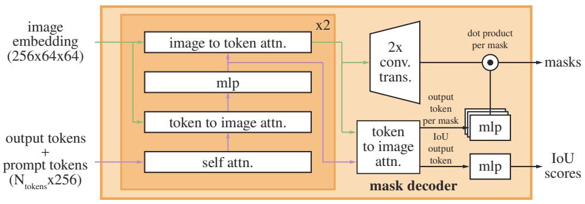

A two-layer decoder updates both the image embedding and prompt tokens via cross-attention. Then the image embedding is upscaled, from which the updated output tokens are used to dynamically predict masks. 

## SAM2

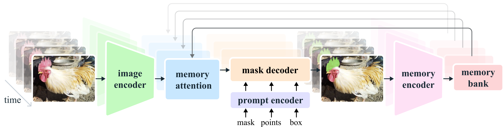

For this frame, from left to right, the segmentation prediction is conditioned on the current prompt and/or on previously observed memories. Videos are processed in a streaming style with frames being processed one at a time by the image encoder, and cross-attended to memories of the target object from previous frames. 

The mask decoder, which optionally also takes input prompts, predicts the segmentation mask for that frame.
Finally, a memory encoder transforms the prediction and image encoder embeddings for use in future frames.

### Mask decoder architecture

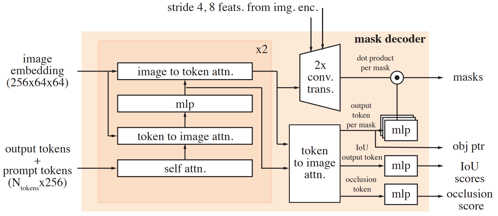

The design largely follows SAM, and the addition includes:

1.  the stride 4 and 8 features from the image encoder during upsampling. 
2. use the mask token corresponding to the output mask as an object pointer 
3. generate an occlusion score which indicates if the object of interest is visible in the current frame.

## SAM3

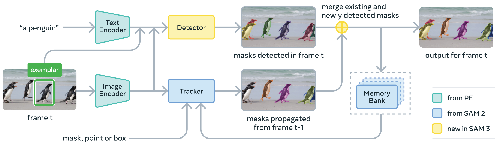

SAM3 is a generalization of SAM2, it takes concept prompts (simple noun phrases, image exemplars) or visual prompts (points, boxes, masks) to define the object to be (individually) segmented spatio-temporally.

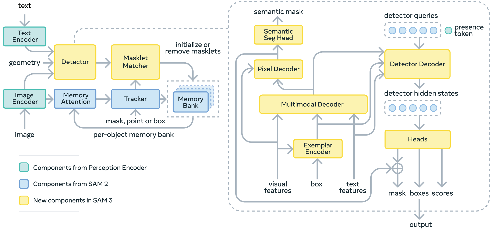

The architecture is broadly based on the SAM series and DETR (Carion et al., 2020) and uses a (dual) encoder-decoder transformer architecture.

SAM 3 supports the new Promptable Concept Segmentation (PCS) task and the Promptable Visual Segmentation (PVS) task (Ravi et al., 2024). The design supports multimodal prompts (e.g., text, boxes, points) and interactivity, in images and videos.

## Takeaways

- SAM1 works on images with visual prompts.
- SAM2 works on videos with visual prompts and adds tracking memory.
- SAM3 works on videos/images with text prompts (and visual prompts), adding open-vocabulary object discovery.

We can simply understand like this:

- SAM1 → Where is the object?
- SAM2 → Where is the object, and keep tracking it.
- SAM3 → What is the object, find it, then track it.

---

## ReSurgSAM2

The model begins with the text-referred target detection using **CSTMamba** to provide credible frames for selection using **CIFS**.

Upon detecting the initial frame, **CIFS** activates the tracking stage, in which **DLM** offers diverse and reliable memory for consistent long-term tracking.

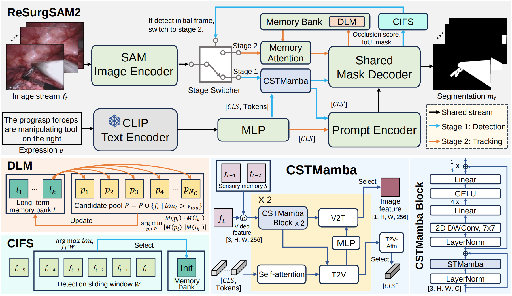

So it’s a two-stage framework:

1. **Text-Referred Target Detection**
    1. use **CSTMamba** (Cross-Modal Spatial-Temporal Mamba) and a mask decoder to generate mask, at the same time, use **CIFS** (Credible Initial Frame Selection) to compute the score.
        1. **The Predicted IoU Score:** Measures spatial/structural mask confidence.
        2. **The Occlusion Score:** Determines if the target object is present.
    2. If the scores of one frame meets the standard, it continues to collect the next few frames (a local sliding window). And select the highest one `argmax`
2. **Long-Term Tracking Activation**
    1. activate the **DLM (Diversity-driven Long-term Memory)** mechanism.
    2. combines short-term memory with a highly selective long-term memory bank. (keep tracking stable even through intense occlusions or surgical blur)

# Tracking-by-detection Methods

## OC-SORT

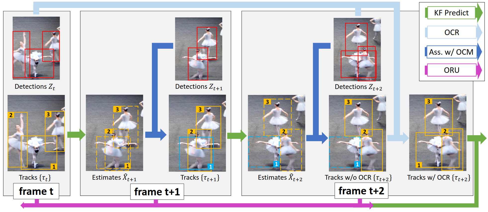

## Grounding DINO

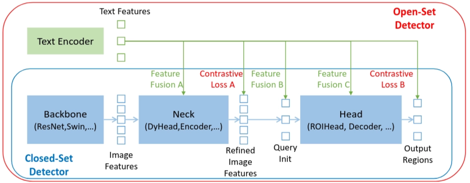

### Framework of Grounding DINO

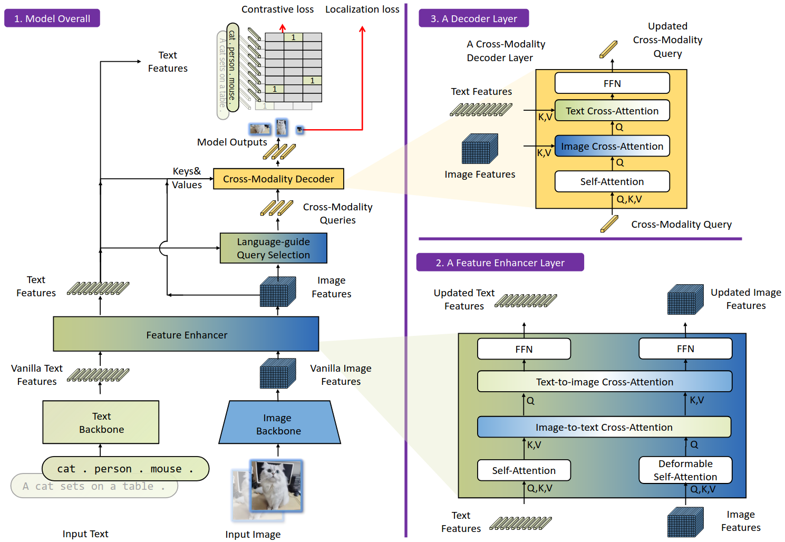

## Track-On-R

Long-term point-tracking models are usually trained on large **synthetic datasets** because synthetic data can automatically provide dense and accurate GT trajectories. In contrast, annotating point trajectories in real-world videos is expensive. However, models trained mainly on synthetic data suffer from a domain gap and may not perform well on real-world videos.

To adapt the tracker to real videos without manually creating GT annotations, self-training can be used. A teacher model generates **pseudo-labels** for unlabeled real videos, and these pseudo-labels are then used to fine-tune a student model. The main problem of this method is that the pseudo-labels may be unreliable. Therefore, Track-on-R introduces a verifier that evaluates candidate trajectories from multiple pretrained trackers and selects the most reliable prediction for each frame, **producing higher-quality pseudo-labels**.

# VOS Metric Exploration

## Metrics from the [DAVIS paper](https://www.cv-foundation.org/openaccess/content_cvpr_2016/papers/Perazzi_A_Benchmark_Dataset_CVPR_2016_paper.pdf)

The paper uses **three main metrics**.

### 1. Region accuracy: $\mathcal{J}$

This is mask IoU (intersection over union):

$$
\mathcal{J}(P,G)=\frac{|P\cap G|}{|P\cup G|}
$$

- $P$: predicted mask
- $G$: ground-truth mask
- Measures overall segmentation overlap.

### 2. Contour/Boundary accuracy: $\mathcal{F}$

This compares the predicted and GT mask boundaries:

$$
\mathcal{F}=\frac{2PR}{P+R}
$$

where $P$ and $R$ are boundary precision and recall.

- Measures boundary quality.
    - Among the boundary drawn by the model, how much is correct?
    - Among the true boundary, how much did the model find?
- Useful for thin objects such as needles, clips and loops.

### 3. Temporal instability: $\mathcal{T}$

Measures how much the predicted mask shape changes between frames.

$$\mathcal{T}=\text{temporal variation of the mask contours}$$

- Lower $\mathcal{T}$ is better.

Process:

1. Extract the mask contours, turn each mask into an outline
2. Describe each contour point
3. Match the two contours
4. Average the matching cost

---

For each metric, the paper reports:

- **Mean** performance over frames
- **Recall**: proportion of objects with score above a threshold
- **Decay**: performance drop from the beginning to the end of a video

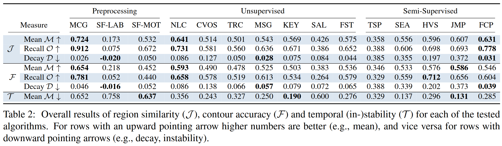

---

## Metrics from the ReSurgSAm2 paper

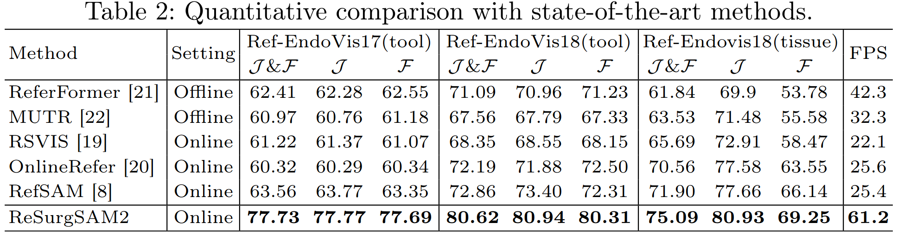

Three metrics:

- $\mathcal J$: region accuracy.
- $\mathcal F$: boundary accuracy.
- $\mathcal{J} \\& \mathcal{F}$: average of the two:

$$
\mathcal{J}\\&\mathcal{F} = \frac{\mathcal{J}+\mathcal{F}}{2}
$$

- **FPS**: inference speed in frames per second. Higher is faster.

---

## Adapt

Our data contains:

- predicted mask $P_t$
- pseudo mask $M_t$
- GT bounding box $B_t$

We do not have true GT masks, so properly revise the metrics as follows.

### Adapted $\mathcal{J}$

Replace the GT mask with the pseudo mask:

$$\mathcal{J}_{pseudo}=\frac{|P_t\cap M_t|}{|P_t\cup M_t|}$$

**→ pseudo-mask IoU**, not GT IoU.

### Adapted $\mathcal{F}$

Compare predicted and pseudo-mask boundaries:

$$\mathcal{F}_{pseudo}=F\bigl(\partial P_t,\partial M_t\bigr)$$

→ **pseudo-mask boundary F-score**.

### Temporal instability $\mathcal{T}$

$\mathcal{T}$ can be calculated from predicted masks alone:

$$\mathcal{T}_{pred}=TemporalInstability(P_1,\ldots,P_T)$$

### Add GT-box localization

Convert the predicted mask into a tight bounding box:

$$\mathcal{J}_{box}=IoU\bigl(bbox(P_t),B_t\bigr)$$

---

## Evaluation Plan

Evaluate the fine-tuned model using generated checkpoints on the **validation set**. Place all evaluation results under the same checkpoint root, but in a separate `evaluation/` folder.

The evaluation focuses mainly on **IoU-based tracking/localization quality**, following a two-level averaging strategy: first average over frames within each validation clip, then average over clips.

### Adapted metric set

Four core metrics:

$$\mathcal{J}\_{pseudo},\quad\mathcal{F}\_{pseudo},\quad\mathcal{T}\_{pred},\quad\mathcal{J}\_{box}$$

- $\mathcal{J}_{pseudo}$: mask IoU between the predicted mask and the pseudo mask. This measures pseudo-mask segmentation consistency.
- $\mathcal{F}_{pseudo}$: boundary F-measure between the predicted mask and the pseudo mask. This evaluates boundary quality.
- $\mathcal{T}_{pred}$: temporal instability computed from predicted masks only. This measures temporal smoothness and flickering of the predicted masks across frames.
- $\mathcal{J}_{box}$: box-level IoU between the bounding box of the predicted mask and the GT bounding box.

For $\mathcal{J}\_{pseudo}$ and $\mathcal{J}\_{box}$, report:

- **Mean**: average performance across validation clips.
- **Recall @ 0.5**: percentage of frames/clips where IoU is above 0.5.
- **Temporal decay**: performance drop from the beginning to the end of each clip.

### IoU Computation

#### IoU of pseudo masks

$$IoU_i = \frac{1}{T_i}\sum_{t=1}^{T_i} IoU(P_{i,t}, G_{i,t})$$

$$mIoU_{video} = \frac{1}{N}\sum_{i=1}^{N} IoU_i$$

#### IoU of GT bbox

$$IoU_i^{box} = \frac{1}{T_i}\sum_{t=1}^{T_i} IoU(bbox(P_{i,t}), B_{i,t})$$

$$mIoU_{box} = \frac{1}{N}\sum_{i=1}^{N} IoU_i^{box}$$

For each validation clip, 

1. compute the mean IoU over frames,
2. average these video-level IoUs across all validation videos.

### Tracking-related supporting metrics

In addition to the four core metrics, keep several tracking-focused supporting metrics:

- **Failure rate**: percentage of visible frames where IoU drops below 0.5.
- **Lost rate**: percentage of visible frames where IoU drops below 0.1 or the prediction is empty.
- **Decay**: drop in IoU from the early part of a clip to the later part.

These metrics help evaluate whether the model can maintain the target over time, rather than only producing good masks on individual frames.

## References

[1] A. Kirillov, E. Mintun, N. Ravi, H. Mao, C. Rolland, L. Gustafson, T. Xiao, S. Whitehead, A. C. Berg, W.-Y. Lo, P. Dollár, and R. Girshick, “Segment Anything,” in Proceedings of the IEEE/CVF International Conference on Computer Vision (ICCV), 2023, pp. 4015–4026.

[2] N. Ravi, V. Gabeur, Y.-T. Hu, R. Hu, C. Ryali, T. Ma, H. Khedr, R. Rädle, C. Rolland, L. Gustafson, E. Mintun, J. Pan, K. V. Alwala, N. Carion, C.-Y. Wu, R. Girshick, P. Dollár, and C. Feichtenhofer, “SAM 2: Segment Anything in Images and Videos,” arXiv preprint arXiv:2408.00714, 2024.

[3] N. Carion, L. Gustafson, Y.-T. Hu, S. Debnath, R. Hu, D. Suris, C. Ryali, K. V. Alwala, H. Khedr, A. Huang, J. Lei, T. Ma, B. Guo, A. Kalla, M. Marks, J. Greer, M. Wang, P. Sun, R. Rädle, T. Afouras, E. Mavroudi, K. Xu, T.-H. Wu, Y. Zhou, L. Momeni, R. Hazra, S. Ding, S. Vaze, F. Porcher, F. Li, S. Li, A. Kamath, H. K. Cheng, P. Dollár, N. Ravi, K. Saenko, P. Zhang, and C. Feichtenhofer, “SAM 3: Segment Anything with Concepts,” arXiv preprint arXiv:2511.16719, 2025.

[4] H. Liu, M. Gao, X. Luo, Z. Wang, G. Qin, J. Wu, and Y. Jin, “ReSurgSAM2: Referring Segment Anything in Surgical Video via Credible Long-Term Tracking,” in Medical Image Computing and Computer Assisted Intervention—MICCAI 2025. Cham, Switzerland: Springer Nature Switzerland, 2025, doi: 10.1007/978-3-032-05127-1_42.

[5] J. Cao, J. Pang, X. Weng, R. Khirodkar, and K. Kitani, “Observation-Centric SORT: Rethinking SORT for Robust Multi-Object Tracking,” in Proceedings of the IEEE/CVF Conference on Computer Vision and Pattern Recognition (CVPR), 2023, pp. 9686–9696.

[6] S. Liu, Z. Zeng, T. Ren, F. Li, H. Zhang, J. Yang, C. Li, J. Yang, H. Su, J. Zhu, and L. Zhang, “Grounding DINO: Marrying DINO with Grounded Pre-Training for Open-Set Object Detection,” arXiv preprint arXiv:2303.05499, 2023.

[7] G. Aydemir, F. Güney, and W. Xie, “Real-World Point Tracking with Verifier-Guided Pseudo-Labeling,” in Proceedings of the IEEE/CVF Conference on Computer Vision and Pattern Recognition (CVPR), 2026.

[8] F. Perazzi, J. Pont-Tuset, B. McWilliams, L. Van Gool, M. Gross, and A. Sorkine-Hornung, “A Benchmark Dataset and Evaluation Methodology for Video Object Segmentation,” in Proceedings of the IEEE Conference on Computer Vision and Pattern Recognition (CVPR), 2016, pp. 724–732.

[9] N. Carion, F. Massa, G. Synnaeve, N. Usunier, A. Kirillov, and S. Zagoruyko, “End-to-End Object Detection with Transformers,” in Computer Vision—ECCV 2020, A. Vedaldi, H. Bischof, T. Brox, and J.-M. Frahm, Eds. Cham, Switzerland: Springer, 2020, pp. 213–229, doi: 10.1007/978-3-030-58452-8_13.