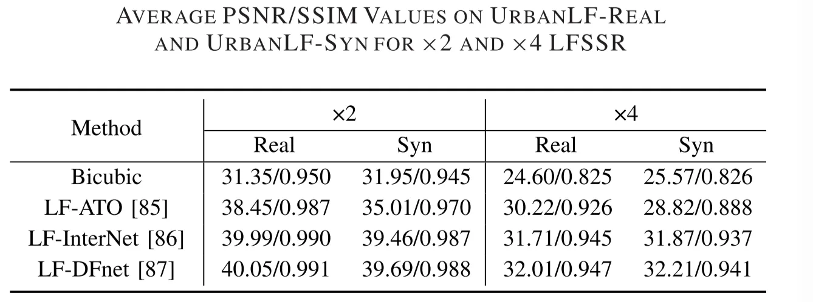
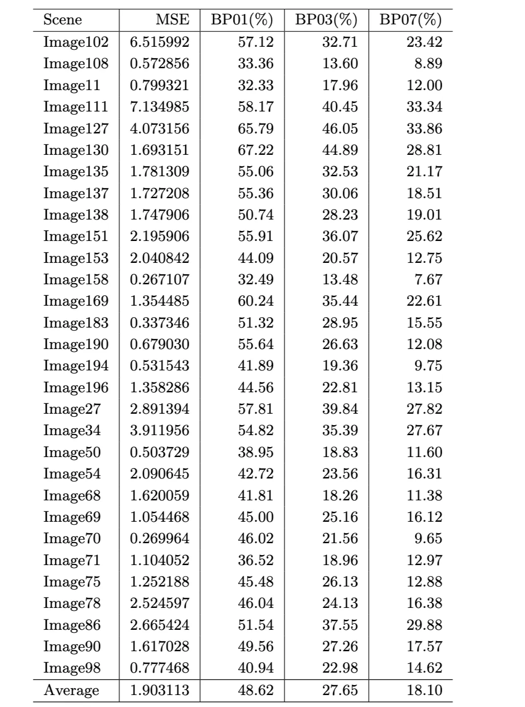

I have finished reproducing the [Distg series](https://yingqianwang.github.io/DistgLF/) (DistgSSR / DistgASR / DistgDisp). The next task was to apply these methods or we can say models to a new dataset: [UrbanLF](https://github.com/HAWKEYE-Group/UrbanLF), and evaluate how well they can perform in this dataset. The task can be summarized as:

<aside>

Apply the Distg series (DistgSSR / DistgASR / DistgDisp) to a new light-field dataset (UrbanLF), obtain results, and compare them with the results from a colleague’s method.

</aside>

I have carefully went through UrbanLF paper, my notes is here: [https://mrtanke.github.io/posts/2026-01-17-urbanlf-a-comprehensive-light-field-dataset-for-se/](https://mrtanke.github.io/posts/2026-01-17-urbanlf-a-comprehensive-light-field-dataset-for-se/). Then I moved forward to the specific tasks.

## Super Resolution

The first task is to apply **DistgSSR** to the UrbanLF dataset. With this scope clarified, the next step was to carefully read the UrbanLF documentation and understand how its super-resolution datasets are organized. The corresponding dataset descriptions are as follows:

> **Data generation**
> 
> 
> Our benchmark provides ×2 and ×4 light field spatial super resolution (LFSSR). The bicubic interpolation with a factor of 2 and 4 is applied to generate low resolution images of different scales. Due to the limitation of resolution, the real images are preprocessed before generating the test data. For ×2 task, we crop 1 pixel width on the right. For ×4 task, we crop 2 pixel width on the right and 1 pixel width on the left.
> 
> **Dataset Splitting**
> 
> Considering that sharing the same test data with other benchmarks will expose the ground truth, we extra collect 80 real and 30 synthetic samples as two new test sets.
> 
> | **Dataset** | **Train** | **Val** | **Test** |
> | --- | --- | --- | --- |
> | UrbanLF-Real | 744 | 80 | 80 |
> | UrbanLF-Syn | 222 | 28 | 30 |
> 
> **Note**
> 
> **The metrics (PSNR, SSIM) are calculated by averaging over all sub-aperture images.**
> 
> **The spatial resolution of the prediction for real images should be 622×432 for ×2 task and 620×432 for ×4 task.**
> 

When I started adapting DistgSSR to UrbanLF, the main motivation was practicality: the original training pipeline assumes pre-packed H5 files, but UrbanLF is naturally stored as per-view PNGs organized by scene. Converting everything into the legacy H5 format would work, but it adds an extra preprocessing step that is easy to get wrong and hard to iterate on. So the goal became: make DistgSSR speak UrbanLF directly, while keeping the original H5 path intact for older experiments.

The key design decision was to keep the model-side interface unchanged and adapt only the data layer. UrbanLF provides a full 9×9 set of sub-aperture images per scene, so the loader reads the PNG views, converts RGB to the Y (luma) channel, stacks them into a light field tensor, and then rearranges it into the same mosaic layout that the existing network expects. This way, the model and loss code doesn’t need to know which dataset it’s training on; only the loader changes.

Another practical consideration is that UrbanLF does not always behave like the synthetic H5 data in terms of image sizes and boundary consistency. To avoid subtle shape mismatches during training/validation, I added small, dataset-aware cropping rules: for UrbanLF-Real, I apply a tiny width adjustment so the HR dimensions align cleanly with the chosen scale factor; for other variants, I enforce a generic “divisible by scale” crop. Once HR is consistent, LR is generated on-the-fly using bicubic downsampling, which keeps the dataset storage simple and makes scale-factor experiments cheaper.

To be more specific, there are two super-resolution scales: **×2** and **×4**, each SAI has original HR resolution **623×432** (width×height). LR is generated by **bicubic downsampling** from HR:

- ×2: LR size becomes 311×216 (after cropping)
- ×4: LR size becomes 155×108 (after cropping)

For UrbanLF-Real only, we need to **crop before downsampling**, because 623 is not divisible by 2 or 4, we apply deterministic cropping on the **HR** images before generating LR:

- **×2 task**: crop **1 pixel on the right** → width 622
- **×4 task**: crop **1 pixel on the left and 2 pixels on the right** → width 620

Then apply bicubic downsampling to produce LR.

UrbanLF also changes the memory story. A 9×9 mosaic is much larger than the previous defaults, so the same batch size can suddenly become an Out Of Memory problem. Rather than forcing a one-off manual tweak every time, the training entry now has an UrbanLF-aware guardrail. I also added a couple of small quality-of-life switches to control validation frequency, because validating full 9×9 scenes can dominate runtime when you’re iterating quickly.

Implementation-wise, the work lands in two places: the new UrbanLF dataset logic is added to the file `utils.py`, and training now supports switching between UrbanLF and the legacy H5 pipeline via flags in train.py. The story is basically: keep the old path working, add a new path that loads UrbanLF directly, and make the runtime behavior (memory + validation) friendlier for real-world 9×9 scenes.

### Takeaways

Overall, this change is less about rewriting DistgSSR and more about smoothing the research workflow: UrbanLF can now plug into the same training loop and fine-tuning based on the pre-defined model, the model interface stays stable, and the few dataset-specific quirks (shapes, scaling divisibility, memory pressure) are handled at the dataset and training-entry level.

The result for UrbanLF-Real for x2 DistgSSR is PSNR---**41.674779**, SSIM---**0.982061**, which is comparable to the method mentioned in the UrbanLF.

## Disparity Estimation

The second task is to apply **DistgDisp** to the UrbanLF-Syn dataset. We dismissed UrbanLF-Real because there is no ground truth disparity for this part of dataset, and the dataset descriptions for UrbanLF-Syn are as follows:

> Only UrbanLF-Syn has ground truth disparity with range [−0.47,1.55] pixels between adjacent views.
> 
> 
> **Dataset Splitting**
> 
> We create a new test set to avoid the disparity data leakage owing to data sharing among benchmarks and provide maximum and minimum disparity value.
> 
> | **Dataset** | **Train** | **Val** | **Test** |
> | --- | --- | --- | --- |
> | UrbanLF-Syn | 170 | 30 | 30 |
> 
> **Note**
> 
> **The metrics (MSE, BP) are calculated only on central view image with cropping 15 pixels at each border.**
> 

There are two tasks to complete. **Task 1** is about fine-tuning DistgDisp on UrbanLF-Syn, we load the pretrained DistgDisp checkpoint (HCI-trained) first, then we **fine-tune** the model on UrbanLF-Syn train split (labeled). Finally we use UrbanLF-Syn val split to monitor training and store the checkpoint after training for next step use. **Task 2** is about producing per-scene quantitative results for 30 scenes, we first run inference on the **30 labeled UrbanLF-Syn validation scenes** to get the predicted disparity for each scene; Then for each scene, we compute metrics comparing `pred: Results/Image.pfm` and `gt: demo_input/val/Image/5_5_disparity.npy`. Apply **crop=15 pixels** on all borders before metrics. The metrics table has 30 lines (30 scenes), plus an average row, and the **metrics to output per scene:** `MSE`, `BP01(%)`, `BP03(%)`, `BP07(%)`.

### Result Table

Test result after fine-tuning are as following (per-scene disparity metrics. Lower is better for MSE; higher is better for BP metrics):

Per-scene disparity metrics. Lower is better for MSE; higher is better for BP metrics.

The final output is a complete per-scene table, ready for comparison and error analysis in the next step. Overall, this work is about making the Distg pipeline **dataset-agnostic in practice**: keep the original H5 path intact for legacy experiments, add a clean UrbanLF-native loader, handle dataset quirks including cropping, divisibility and memory, and produce benchmark-aligned results for both SR and disparity, which set up the next phase: locating failure regions and improving edge and sharp structure behavior.