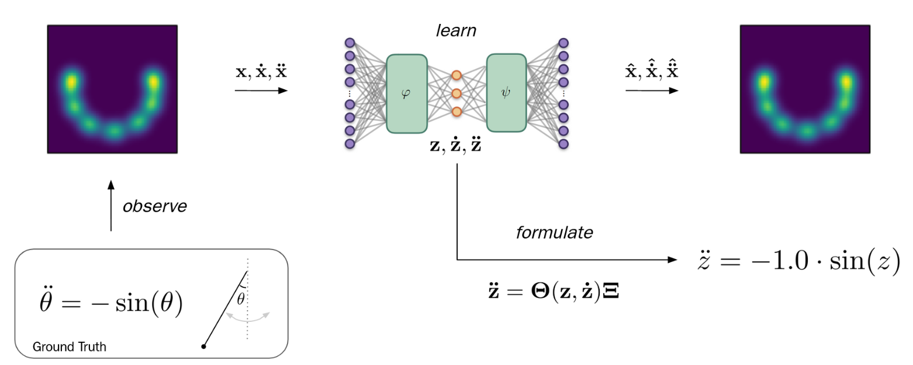

<aside>

Github repo: [https://github.com/mrtanke/SINDy](https://github.com/mrtanke/SINDy)

</aside>

This blog is basically my hands-on notes while implementing **SINDy (Sparse Identification of Nonlinear Dynamics)** as a small, understandable pipeline: generate data → build a candidate library → solve a sparse regression problem → sanity-check the discovered equation → then push it into harder settings like autoencoder and video-like data. The whole notebook is organized into three parts: (1) SINDy on ground-truth coordinates, (2) SINDy-Autoencoder, and (3) a bonus on high-dimensional “video” inputs.

## The core idea: “write the physics as a sparse linear model”

The cleanest way to understand SINDy is this one line:

$$
\ddot{z}_t = \Theta(z_t, \dot{z}_t)\cdot \Xi
$$

Here, $\Theta(\cdot)$ is a **library of candidate functions**, and $\Xi$ is a sparse vector of coefficients. If the true system is simple (like a pendulum), only a few library terms should survive.

## 1 SINDy in Ground Truth Coordinates z

I began with the classic pendulum equation:

$$
\ddot{z}_t = -\sin(z_t)
$$

This is perfect for a first SINDy implementation because we know what the answer should look like, and we can see if the algorithm is doing something reasonable.

I used a fixed list of 10 candidate terms. The notebook explicitly writes something like:

$$
\Theta(z, \dot{z}) = [1, z, \dot{z}, \sin(z), z^2, z\dot{z}, \dot{z}\sin(z), \dot{z}^2, \dot{z}\sin(z), \sin(z)^2]
$$

At this point, the problem becomes: “find $\Xi$ so that $\Theta\Xi \approx \ddot{z}$”. That’s why SINDy is so nice: it turns nonlinear dynamics into a *linear regression* problem in feature space.

### 1.1 Regression choices: LASSO vs a learnable PyTorch module

I implemented LASSO (via sklearn) and also wrote a **PyTorch SINDy module** with learnable coefficients and a boolean mask for active terms.

Why do both? Because **sklearn LASSO** is fast and gives a baseline quickly. **PyTorch module** is crucial later, because once we attach SINDy to an autoencoder, we want end-to-end training and easy control over masks/thresholding.

### 1.2 Sparsity is not “free”: thresholding is the real game

In practice, coefficients don’t magically become exactly zero. So I added explicit pruning strategies: **Sequential Thresholding (ST)**: train → zero out small coefficients → repeat. **Patient Trend-Aware Thresholding (PTAT)**: a more careful version that watches coefficient trends and only prunes terms that stay small *and* stable over time

The notebook message is basically: ST can work on simpler setups, but PTAT becomes more reliable as the problem gets harder (especially high-dimensional data).

## 2 SINDy-Autoencoder

Now comes the fun part: I embedded the pendulum into **2D Cartesian coordinates**, where the true angle $z$ is hidden. Then I built a model that learns an **encoder** that maps $x \rightarrow z$, a **SINDy block** that learns $\ddot{z}=\Theta(z,\dot{z})\Xi$, and a **decoder** that reconstructs $x$ from $z$.

### 2.1 Derivative propagation through layers

To make the dynamics loss meaningful, I implemented layers that propagate not just activations, but also **first and second derivatives** through the network (e.g., `SigmoidDerivatives`, `LinearDerivatives`). And the forward logic is exactly what you’d expect: encode → SINDy predicts $\ddot{z}$ → decode both reconstruction and predicted acceleration in x-space.

### 2.2 Compare propagated derivatives vs finite differences

Derivative propagation is easy to implement wrong without noticing. So I added an explicit verification step: compare the propagated derivatives with finite difference approximations:

$$
\dot{z}t \approx \frac{z{t+1}-z_{t-1}}{2\Delta t},\quad
\ddot{z}t \approx \frac{z{t-1}-2z_t+z_{t+1}}{\Delta t^2}
$$

This is not about getting perfect equality—small differences are expected—but it quickly catches bugs in chain-rule propagation.

### 2.3 Training loss: reconstruction + dynamics + sparsity

The training objective combines multiple terms:

$$
\mathcal{L}=||x-\hat{x}||^2
+\lambda_{\ddot{z}}||\ddot{z}-\hat{\ddot{z}}||^2
+\lambda_{\ddot{x}}||\ddot{x}-\hat{\ddot{x}}||^2
+\lambda_1||\Xi||_1
$$

So the autoencoder can’t just memorize inputs: it also has to create a latent coordinate where the dynamics are simple and sparse. One small but important trick in the notebook is the **refinement phase**: start with L1 regularization (to push sparsity), then reduce it to fine-tune the remaining active terms.

## 3 SINDy-Autoencoder on Videos

For the last part, I created an artificial video embedding using Gaussian peaks and computed derivatives with finite differences.

This is where ST can become unstable: in high-dimensional settings, you can prune too aggressively or keep noisy terms because the optimization is messy. The notebook conclusion is basically: **PTAT is more robust than ST** here, because it prunes only when the coefficient is consistently small *and* not trending back up.

## References

1. **Tan, K. (2026).** SINDy implementation and experiments. GitHub repository: https://github.com/mrtanke/SINDy.
2. **Brunton, S. L., Proctor, J. L., & Kutz, J. N. (2016).** Discovering governing equations from data by sparse identification of nonlinear dynamical systems. *Proceedings of the National Academy of Sciences*, 113(15), 3932–3937. https://doi.org/10.1073/pnas.1517384113
3. **de Silva, B. M., Champion, K., Quade, M., Loiseau, J.-C., Kutz, J. N., & Brunton, S. L. (2020).** PySINDy: A Python package for the sparse identification of nonlinear dynamical systems from data. *Journal of Open Source Software*, 5(49), 2104. https://doi.org/10.21105/joss.02104
4. **Tibshirani, R. (1996).** Regression shrinkage and selection via the lasso. *Journal of the Royal Statistical Society: Series B (Methodological)*, 58(1), 267–288. https://doi.org/10.1111/j.2517-6161.1996.tb02080.x
5. **Hastie, T., Tibshirani, R., & Friedman, J. (2009).** *The Elements of Statistical Learning: Data Mining, Inference, and Prediction* (2nd ed.). Springer. https://doi.org/10.1007/978-0-387-84858-7
6. **Pedregosa, F., Varoquaux, G., Gramfort, A., et al. (2011).** Scikit-learn: Machine learning in Python. *Journal of Machine Learning Research*, 12, 2825–2830.
7. **Paszke, A., Gross, S., Massa, F., et al. (2019).** PyTorch: An imperative style, high-performance deep learning library. In *Advances in Neural Information Processing Systems (NeurIPS)*, 32.
8. **Fornberg, B. (1988).** Generation of finite difference formulas on arbitrarily spaced grids. *Mathematics of Computation*, 51(184), 699–706. https://doi.org/10.1090/S0025-5718-1988-0935077-0